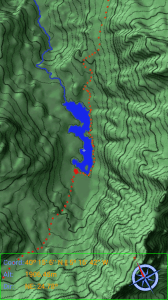
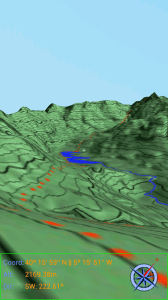
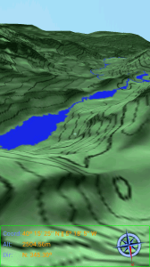
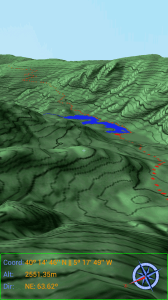
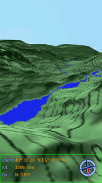
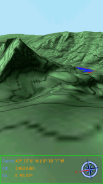
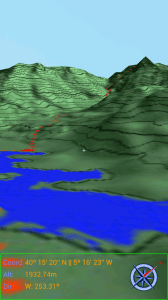
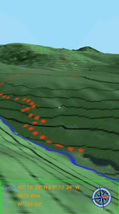

Para los que han seguido los desarrollos para Android que he estado haciendo estos meses y a los que ya les gustaban las aplicaciones de mapas en 3D que estaban en marcha tengo una buena noticia: 

  

Hoy he subido la actualización a la versión 2.0 Gredos Virtual 3D. 

  

Sólo voy a dejar unas capturas de pantalla y un enlace a la descarga aunque los que tengáis un móvil con Android podéis descargarla directamente desde Google Play en vuestros dispositivos. 

  

Gredos Virtual 3D 2.0 incluye muchas mejoras:

- Se ha mejorado la interfaz de usuario
- Se ha mejorado el modo paseo incluyendo una brújula y permitiendo andar de forma continua con una pulsación larga
- Se ha añadido el modo niebla, el cual te posiciona en el mapa y gracias a los sensores de inclinación y a la brújula permiten ver lo que hay a nuestro alrededor aunque la niebla o las condiciones meteorológicas nos lo impidan. Lo he probado In-Situ y me ha sido enormemente útil.

  

Aquí las capturas de pantalla:

  

  
  

  

Y el enlace es:

[https://play.google.com/store/apps/details?id=com.jgc.gredos\_virtual\_3d](https://play.google.com/store/apps/details?id=com.jgc.gredos_virtual_3d)

  

Y creo que éste puede ser un buen momento para anunciar mi intención de crear una plataforma para la creación de mapas en 3D. No puedo dar más que los siguientes detalles:

- Será una aplicación gratuíta, de momento para Android, pero quizá porte sólo o con ayuda ésta app a Windows Mobile y iPhone. Desde ésta aplicación se podrán descargar y utilizar los mapas en 3D que ya tengo hechos y los que poco a poco vaya haciendo y publicando.
- Liberaré el código en GitHub para que cualquiera con conocimientos de programación e interés pueda aportar su granito de arena y mejorar la aplicación, de forma altruista y para todos.
- Crearé una wiki explicando paso a paso cómo se puede crear un mapa y como están hechos "por dentro" y facilitaré al máximo el proceso para que cualquiera pueda hacerlo.

  

Ésta plataforma a la que ahora hago referencia requiere mucho trabajo y también mucho esfuerzo por mi parte. No sé hasta donde llegará ni cuando estará lista para dar los "primeros pasos" pero según acabe esta entrada comenzaré a dar forma a todo éste proyecto. Cualquiera interesado en participar activamente puede ponerse en contacto conmigo y le atenderé encantado.

  

Un saludo.

  

Juan García Carmona

[d.jgc.it@gmail.com](mailto:d.jgc.it@gmail.com)
