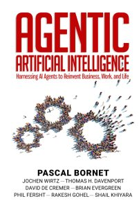
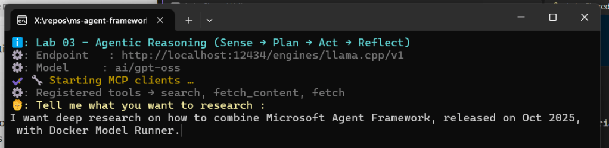
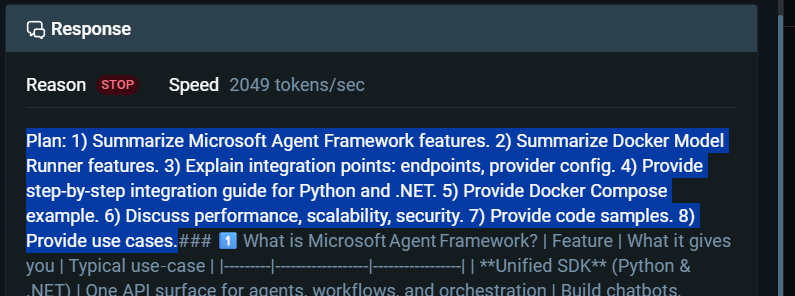
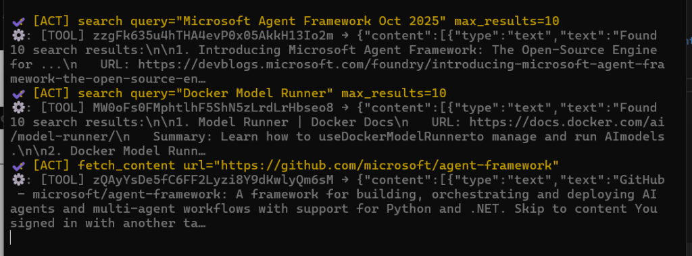
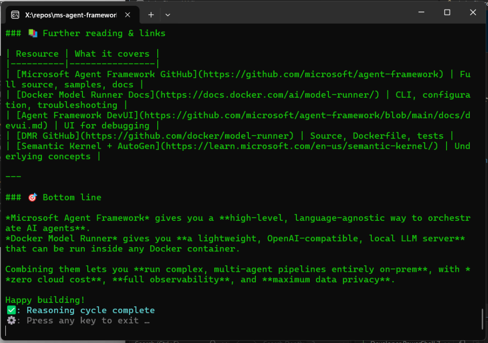
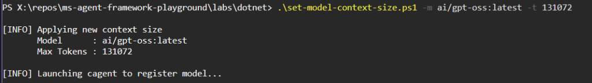
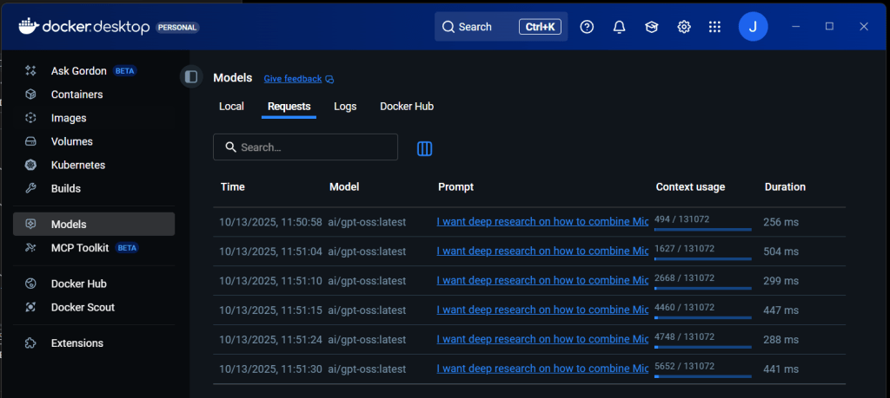

In the [**first article**](https://jgcarmona.com/run-agent-framework-locally/) I showed you how to run MAF fully offline, using **[Docker Model Runner (DMR)](https://jgcarmona.com/enable-gpu-docker-model-runner-windows/)** as the intelligence engine.  
In the [**second article**](https://jgcarmona.com/building-local-chat-agent-microsoft-agent-framework-dotnet/), we added **memory, persistence**, so the agent could recall previous turns.

In this **third step** of the series, the agent finally **reasons**.  
This is where MAF starts feeling alive.

## From Conversations to Reasoning Loops

[](https://www.linkedin.com/in/pascalbornet/)

The goal of this lab is simple: implement the **Sense → Plan → Act → Reflect** (SPAR) cycle, the fundamental reasoning loop behind every agentic system, as I explained in recent article **[AI Agents in a Nutshell](https://jgcarmona.com/ai-agents-nutshell/)**.

(Side note: I recently finished reading "[Agentic Artificial Intelligence: Harnessing AI Agents to Reinvent Business, Work and Life](https://www.amazon.com/Agentic-Artificial-Intelligence-Harnessing-Reinvent/dp/B0F1KFKNBB)", and I strongly recommend it to anyone exploring agentic AI engineering.)

Using **Docker Model Runner** as the LLM backend and **Model Context Protocol (MCP)** with tools like DuckDuckGo and Fetch Reference, we can build an autonomous agent capable of researching topics, deciding which tools to call, acting, and summarizing what it found. **All local. No API keys. No clouds. No OpenAI.** As [**Mitko Vasilev**](https://www.linkedin.com/in/ownyourai/)'s mantra sais:

> Make sure you own your AI. AI in the cloud is not aligned with you; it’s aligned with the company that owns it.

## Running the Lab

This demo is built in **.NET**, though the Python version follows (will follow) the same structure. The full source lives in the [Microsoft Agent Framework Playground](https://github.com/juangcarmona/ms-agent-framework-playground).

When executed, the agent connects to two MCP tools (`duckduckgo`, `fetch`), merges them into a single toolset, and runs a reasoning loop:

1. **Sense** – interpret the user query and detect intent.

3. **Plan** – decide which tools to call.

5. **Act** – execute those tools via MCP.

7. **Reflect** – summarize findings and verify completeness.

The `Echo` helper narrates the process in real time, showing reasoning, tool calls, and results as color-coded console output.

<figure>



<figcaption>

Sense

</figcaption>

</figure>

<figure>



<figcaption>

Plan

</figcaption>

</figure>

<figure>



<figcaption>

Act

</figcaption>

</figure>

<figure>



<figcaption>

Reflect

</figcaption>

</figure>

## The Code

The heart of the demo is **a ~100 line console application**, much simpler than Lab 02, but conceptually deeper... It configures the local LLM, connects to MCP tools, and executes the full reasoning loop.

```csharp
Echo.Info("Lab 03 – Agentic Reasoning (Sense → Plan → Act → Reflect)");

// Local LLM via Docker Model Runner
var baseUrl = "http://localhost:12434/engines/llama.cpp/v1";
var modelId = "ai/gpt-oss";
var client = new OpenAIClient(
    new ApiKeyCredential("none"),
    new OpenAIClientOptions { Endpoint = new Uri(baseUrl) });
var chatClient = client.GetChatClient(modelId);

// Connect MCP tools (DuckDuckGo + Fetch)
await using var duck = await McpClient.CreateAsync(new StdioClientTransport(...));
await using var fetch = await McpClient.CreateAsync(new StdioClientTransport(...));
var tools = (await duck.EnumerateToolsAsync().ToListAsync())
    .Concat(await fetch.EnumerateToolsAsync().ToListAsync())
    .Cast<AITool>().ToArray();

// Build the reasoning agent
var instructions = """
You are a self-sufficient research agent.
Sense → Plan → Act → Reflect.
Always show progress before your final answer.
""";

var agent = chatClient.CreateAIAgent(instructions, "ResearchAgent", tools);
await Echo.StreamAgentAsync(agent.RunStreamingAsync("Is it possible to combine MAF with DMR in .NET?"));
```

The agent analyzes the query, selects the right tools, gathers information, and produces a concise, validated summary, all offline.

### About the Context Window

If you followed the previous articles, you might have noticed that long reasoning runs tend to stall or truncate early. That’s because Docker Model Runner enforces a **default context window of 4096 tokens**, which is often too small for multi-tool workflows. There’s no configuration flag or CLI parameter to change it, which caused many failed runs during testing.

To solve this, I wrote a small PowerShell utility that expands the DMR context size by re-initializing the model with a larger `max_tokens` setting. It’s explained step-by-step in this [**other article**](https://jgcarmona.com/change-dmr-context-size/)[_._](https://jgcarmona.com/change-docker-model-runner-context-size/)

<figure>



<figcaption>

In this case I've set this model, ai/gpt-oss:latest, to use 128k tokens (128\*1024=131072 tokens)

</figcaption>

</figure>



## Results

Once the model’s context window was expanded, the reasoning loop ran flawlessly. MAF handled multi-step tool invocation, parallel streaming, and reflection without a single token overflow. and DMR gave us huge Intelligence power at an awesome speed

This confirms that **MAF + DMR** can serve as a fully local, reproducible agentic environment, ideal for private R&D or offline deployments like **Sentra Brain**, my side proyect, which has been paused due to my recent agentic frameworks research.

### References

- [Microsoft Agent Framework Playground (GitHub)](https://github.com/juangcarmona/ms-agent-framework-playground)

- [How to Change Docker Model Runner Context Size](https://jgcarmona.com/change-docker-model-runner-context-size/)

- [What is Docker cagent? A First Look at Declarative AI Agents](https://jgcarmona.com/what-is-docker-cagent-a-first-look-at-declarative-ai-agents/)

- [Memory in Docker cagent](https://jgcarmona.com/memory-in-docker-cagent/)

- [Sentra Brain](https://wentrabrain.com)
