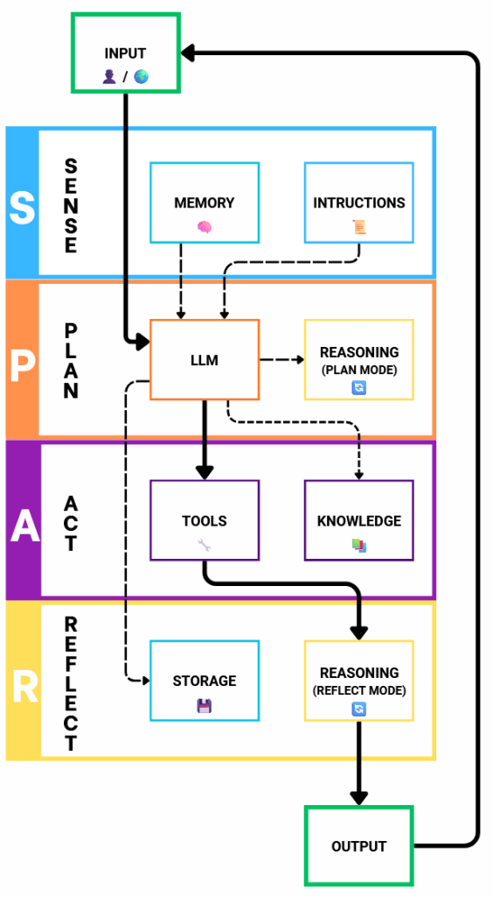

AI agents are one of the most exciting evolutions in artificial intelligence. Instead of just responding to prompts, agents **loop between reasoning, using tools, and reflecting** until they achieve their goal.

## What is an AI Agent?

A simple definition:

> **An AI agent is a program that combines reasoning with a language model (LLM or LRM — large or small) and external tools, repeating this cycle until it reaches its objective.**

This makes agents active problem-solvers, not just passive chatbots. Unlike conversational AI systems (e.g. ChatGPT), which mainly rely on session context or vendor-managed memory, agents can be designed with their own memory, tools, and persistence.

## The Core Loop of an AI Agent

At the heart of every agent is a decision loop:

1. **Input** – capture a user query or event.

3. **Instructions** – apply rules, policies, or constraints.

5. **Memory** – recall preferences or prior knowledge.

7. **Language Model** – decide whether to reason, act, or respond.

9. **Tools & Knowledge** – access APIs, databases, or retrieval systems (RAG).

11. **Reasoning** – analyze results, refine plans, reflect on progress.

13. **Output** – produce a response or trigger an effect.

15. **Storage** – save the session for continuity.

This cycle continues until the agent achieves its goal.

## The SPAR Framework: Sense, Plan, Act, Reflect

A useful way to understand agents is through **SPAR**:

- **Sense** → gather input from users, environments, and memory.

- **Plan** → reason with the LLM and decide next steps.

- **Act** → execute actions via tools or knowledge sources.

- **Reflect** → evaluate outcomes, adjust, and store results.

SPAR provides a **human-friendly mental model** for designing, explaining, and improving AI agents.

## Why AI Agents Matter

- **From static to dynamic** – They don’t just answer, they act and adapt.

- **Goal-oriented** – They keep working until a result is achieved.

- **Closer to human workflows** – The loop of sensing, planning, acting, and reflecting mirrors how people tackle problems.

## What’s Next

Building real-world AI agents requires more than just loops and reasoning. Future articles will cover essential topics such as:

- **Guardrails** – ensuring safe, predictable behavior.

- **Security and authorization** – controlling access to data stores and APIs.

- **Conflict resolution** – handling competing or conflicting goals.

## **In a Nutshell**

AI agents **sense, plan, act, and reflect**. They move beyond text generation into autonomous collaboration, bridging models, whether **language models (LLMs), reasoning models (LRMs), large or small**, with tools, memory, and knowledge.

The journey is just beginning. The next steps are about making agents not only more powerful, but also **safe, secure, and reliable**.
