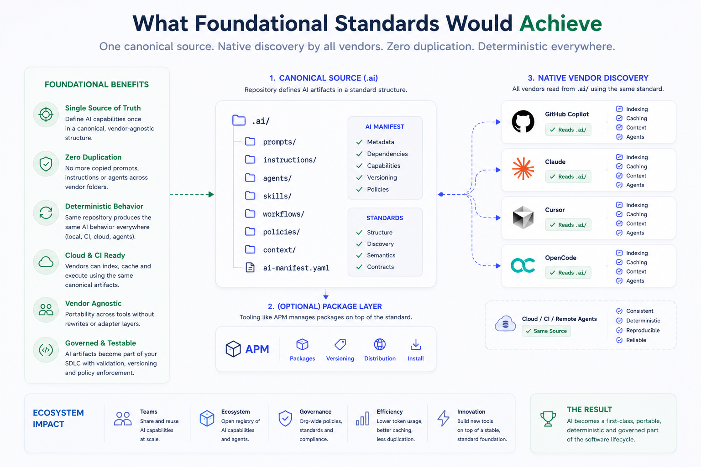
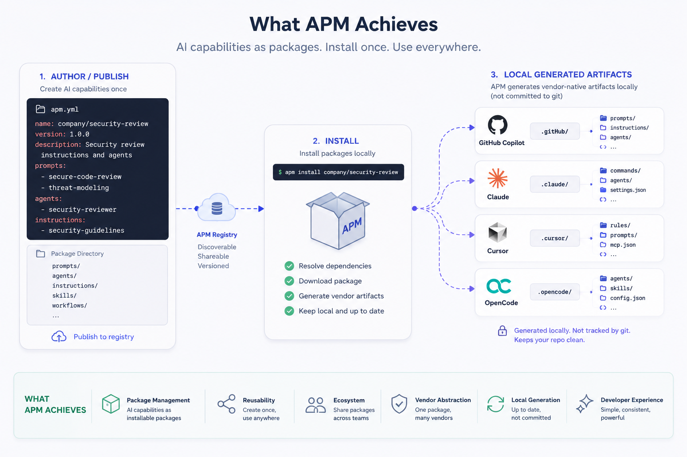
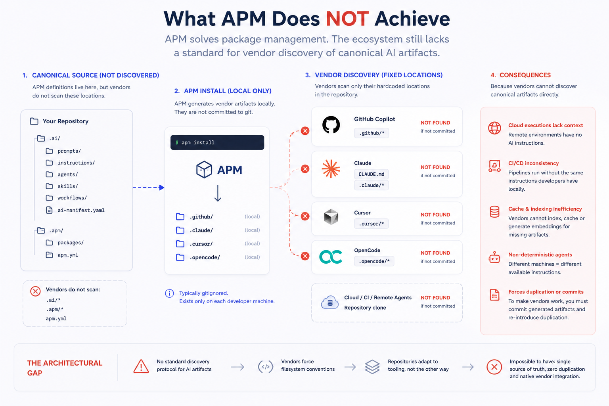

## The Problem

It is mid 2026 and every development team is moving their entire SDLC towards AI-powered SDLC. Great time to be alive but one foundational layer remains completely fragmented because **AI tooling has no shared architectural standard.**



## We've seen this many times

The software industry has seen this before. Some simple examples: before OpenAPI, every API had its own documentation forma; before Docker, every deployment had its own packaging model; before Protobuf, every service had its own contract definition.

Nowadays, every vendor defines its own repository conventions:

```
CLAUDE.md
AGENTS.md
.github/prompts/*
.github/instructions/*
.github/agents/*
.claude/*
.cursor/rules/*
.opencode/*
```

We are being forced to deal with different folder structures, different discovery mechanisms, different formats and bear in mind different assumptions.


Consequences sound familiar to many of us, right?

- **Duplication**: The same instructions repeated across multiple vendor-specific files
- **Vendor lock-in**: Repository structure coupled to specific tooling choice or choices
- **Synchronization drift**: Updates to one convention miss others
- **Maintenance overhead**: Scales linearly with every new tool a team adopts

The natural engineering response is to create a vendor-agnostic canonical structure:

```
.ai/
  prompts/
  instructions/
  agents/
  skills/
  workflows/
```

This idea came directly from an architecture I described yesterday in my previous article, **[Multi-Agent AI Repository Architecture](/multi-agent-ai-repository-architecture)**, where I proposed a vendor-agnostic semantic layer for repository-level AI governance.

On paper, centralizing semantics feels like the correct architectural move... But I was wrong... (Nothing new)

## A Single Source Of Truth Is Not Enough

The implementation looked straightforward. The canonical `.ai/` layer contained the semantic definition and vendor-specific wrappers referenced that canonical layer.

At first it looked elegant but trying an implementation I realized on that the duplication was simply moved elsewhere. The architecture had added an indirection layer without solving the underlying discovery problem.

A colleague at Plain Concepts told me that the idea of a canonical layer was spot on, and pointed out that, in real teams, agents are still inconsistent at following references across files, so wrappers that point to .ai/ end up working in theory but flaky in practice. 

> 100% true!

He recommended a compile step, something that I initially discarded.  It is the same idea of one canonical source, but adding a small build step that generates each vendor files with the actual content inlined, not just a pointer to the canonical layer. So all become generated artifacts, each one fully self contained. The compiler handles scope (which rules go to which file via globs) and conflict resolution, and CI fails the build if a generated file is stale or hand edited. He also reminded me that I had APM on my research TODO... 

> Public thanks to Felipe Martin Ferrari 

Then I re-discovered [Microsoft APM](https://github.com/microsoft/apm). I knew it existed but the deep dive was pending...

---

## What is Microsoft APM?

APM introduces something important to the ecosystem: a package management model for AI capabilities. Reusable prompts, reusable instructions, reusable agents, vendor abstraction, installable packages.

APM forced me to partially reconsider the architecture I had been building.

For the first time, I saw an attempt to treat AI capabilities as software artifacts. Great!

```
apm.yml
      ↓
apm install
      ↓
.github/*
.claude/*
.cursor/*
```

Looks great but it does not fully solves duplication or maintainability, and it still lacks the canonical layer I was seeking. It is an elegant first approach but it is not perfect yet.

## APM Solves Distribution, Not Discovery



APM enables reusable AI capabilities distributed as packages:

```bash
apm install company/security-review
apm install my-org/coding-conventions
```
That's an amazing contribution to the industry. It brings package distribution, ecosystem packages, installable capabilities. This is real progress for teams that want to share AI artifacts across repositories.

But as I said it does not solve artifact discovery because we are force to generate and maintain all the vendor artifacts in order it to work similar and everywhere, and I'd say this is a massive tradeoff.

## Local Generation Creates Another Problem

If artifacts are generated locally only, the repository itself no longer contains what vendors expect to discover.

Developer A has GitHub artifacts. Developer B has Claude artifacts. The CI runner has nothing. Remote environments have nothing.

The consequences are concrete:

- CI pipelines cannot reproduce the same agent behavior
- Remote executions lose repository-level context
- Autonomous agents behave differently depending on the local environment
- Repository behavior becomes non-deterministic

---

## Cloud Agents Change The Equation



The problem deepens when you consider how modern vendors actually operate.

Vendors increasingly rely on remote execution, server-side indexing, repository embeddings, prompt caches, and background context scanning. GitHub indexes your repository. Claude builds token caches. Cursor pre-scans your codebase. You can do that by yourself at home with Open code...

If these artifacts exist only locally, cloud systems never see them.

The result is cache inefficiency, inconsistent cloud behavior, and remote agents that operate without the context that exists on your machine. The same repository produces different AI behavior depending on whether it runs locally or in the cloud.

The industry already solved this kind of problems, this is an infrastructure problem, isn't it?

## Committing Generated Artifacts Brings Back The Original Problem

The alternative is to commit the generated artifacts:

```
.ai/*
.github/*
.claude/*
.cursor/*
.opencode/*
```

And the original problem returns. Duplicated semantics. Synchronization drift. Merge conflicts. Repeated instructions. Are we moving in circles?

There is another issue. Some vendors recursively scan markdown files. If the same instruction exists in `.ai/security.md`, `.github/prompts/security.md`, and `CLAUDE.md`, it may be loaded multiple times into the same context window.

That means token waste... And token prices are growing and growing... 

I just see tradeoffs.. Repeated context. Prompt pollution. Unpredictable agent behavior.

## AI Tooling Trifecta

We don't need a diagram for this because the pattern is clear, we cannot simultaneously achieve:

1. Single source of truth
2. Zero semantic duplication
3. Native vendor integration

Every current architecture eventually sacrifices one of these properties.

Single source of truth plus native vendor integration requires duplication. 

Single source of truth plus zero duplication implies vendor-locking 

Zero duplication plus native integration loses the single source of truth.

## This is a lack standards problem

The ecosystem lacks a standardized AI artifact discovery protocol. Every vendor forces repositories to adapt to vendor-specific filesystem conventions. There is no shared mechanism. No common protocol. No vendor-agnostic architecture.

The current ecosystem forces developers to adapt repositories to vendors and it should be exactly the opposite.

**Vendors should adapt to standardized repository semantics.**


## AI Artifacts Are Becoming Supply Chain Artifacts


We are rapidly introducing AI artifacts into the software development lifecycle.

Prompts, agents, repository instructions, semantic context, capability definitions, autonomous workflows, hooks...

These are no longer experimental assets, they have already become first-class software artifacts inside the software supply chain.

I work with engineering organizations adopting AI-SDLC and DevEx practices. This pattern is already emerging in real teams. Mature teams increasingly want centralized AI governance, repository-level AI standards, deterministic agent behavior, and portable vendor-agnostic capabilities. They are hitting the same architectural walls documented here. This is not just my invention.

## The Industry Is Missing Its Next Standardization Movement 

We standardized APIs through OpenAPI. We standardized dependencies through package managers. We standardized containers through Docker. We standardized contracts through Protobuf.

AI tooling is evolving without a shared protocol for how repositories declare, expose, and distribute AI capabilities.

We have no equivalent of `package.json` for AI artifacts.

The industry is currently solving AI tooling as an interaction problem. The deeper challenge is infrastructure.

As AI agents become part of software delivery pipelines, repository architectures themselves must evolve. The next challenge is no longer prompt engineering. It is AI-SDLC architecture.

Until the ecosystem converges around a common standard, engineering teams will continue duplicating artifacts, fighting vendor conventions, and introducing architectural inconsistencies directly into their codebases.

The entire ecosystem is currently building AI-native development workflows on top of filesystem conventions that were never designed to become infrastructure standards.

Eventually, that architectural debt will surface.
