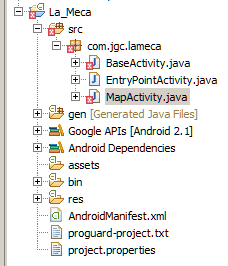
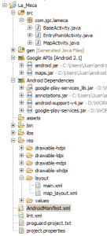

Hola a tod@s. En ésta entrada quiero compartir con los lectores el proceso de creación de una aplicación desde cero. Tengo como objetivo aprender a utilizar los mapas de [+Google Maps](http://plus.google.com/111401917971052287374) en [+Android](http://plus.google.com/104629412415657030658) y se me ha ocurrido que un buen comienzo puede ser la creación de una aplicación que nos diga en qué dirección se encuentra un punto concreto. Para éste ejemplo voy a hacer algo que espero sea útil a la comunidad muslumana hispano hablante puesto el punto concreto que he decidido utilizar en éste ejemplo es La Meca.  
  

Según Wikipedia La Meca (en árabe مكة المكرمة Makkah al-Mukarrama o simplemente Makkah) es la principal ciudad de la región del Hiyaz, en la actual Arabia Saudita, y una de las más importantes de la península de Arabia. Está situada al oeste de la península y cuenta con 1.294.167 habitantes (censo de 2004), localizada en un estrecho valle, a 277 m sobre el nivel del mar; se ubica a 80 km del mar Rojo.

  

Como todos sabéis cada musulmán debe rezar cinco veces al día en dirección a La Meca y como supongo que no siempre será fácil saber en qué dirección mirar y menos si se viaja constantemente alrededor del mundo. 

  

Vamos a hacer una pequeña planificación inicial, a ver cuánto me acabo desviando, pero la planificación inicial podría ser la siguiente:

  

1º Requisitos

2º Análisis 

3º Creación del proyecto y repositorio

4º Inserción de mapa

5º Localizar y apuntar a La Meca

6º Detalles de usabilidad

7º Crear y firmar la applicación y subirla a [+Google Play](http://plus.google.com/106886664866983861036) 

  

Siete pasos, podría valer, siete es un número que me gusta...

  

**Requisitos**

  

Queremos una aplicación mínima que nos diga, desde donde nos encontramos, hacia dónde o en qué dirección se encuentra La Meca.

  

Queremos además dejar la aplicación abierta a futuras mejoras o ampliaciones de funcionalidad

  

**Análisis**

El primer requisito, ya que es el objetivo, lo voy a atacar utilizando [+Google Maps](http://plus.google.com/111401917971052287374) para Android, del que aún no sé nada y cuya investigación incluiré en éste artículo. También se podría utilizar una brújula hecha con Canvas pero lo que me importa o me gustaría conseguir es dar al usuario la dirección a la que debe mirar, bien pintando una linea recta sobre el mapa, bien ofreciéndole una brújula que apunte a La Meca.

  

Con respecto al segundo requisito seguiré las pautas del anterior artículo, [Arquitectura de aplicaciones Android](http://juan-garcia-carmona.blogspot.com.es/2012/11/arquitectura-de-aplicaciones-android.html), ya que creo que siguiendo esas pautas me aseguro robustez, versatilidad y facilidad de mantenimiento. 

  

**Creación del proyecto y repositorio**

  

**Repositorio**  
  
Tengo cuenta en GitHub y tengo pendiente mostrar cómo se gestiona un respositorio con GitHub pero para mi proyecto, por comodidad, voy a utilizar un repositorio local svn utilizando [Tortoise SVN](https://www.google.es/url?sa=t&rct=j&q=&esrc=s&source=web&cd=1&cad=rja&ved=0CDgQFjAA&url=http%3A%2F%2Ftortoisesvn.net%2F&ei=NbTSUNnuHueX1AXKwYGgDg&usg=AFQjCNGaStqaXxOotZTM7ZrW9qB35G3Bcw&sig2=DitSGcTC4ox-JKoeYfflDg&bvm=bv.1355534169,d.d2k) (como ésto carece de interés hoy aquí podemos decir que he seguido [estos mismos pasos](http://www.opentia.es/docus/guiauso_TortoiseSVN-OPENTIA-20091118.pdf) o muy parecidos para crear el respositorio, creo el repositorio, creo una carpeta para el proyecto, hago checkout sobre el repositorio  y ya tengo lista esa carpeta para trabajar sobre ella).  
  
Ahora voy a crear un nuevo proyecto desde Eclipse que trabaje sobre la carpeta anterior, también lo podía haber hecho al revés y haber creado primero el proyecto y luego haber hecho checkout sobre el respositorio,, es lo mismo, mientras sepas lo que estás haciendo...  
  
 **Proyecto**  
  
Crear un proyecto de aplicación de Android no tiene ningún misterio si tienes el eclipse bien configurado. Abres eclipse, File -> New -> Android Project, elegimos un nombre para el proyecto, por ejemplo La\_Meca, y seleccionamos una ubicación, nuestra carpeta de SVN, en mi caso D:WORKLa Meca y pulsamos Next, después elegimos un SDK, en mi máquina tengo el 2.1, el 4.0 y el 4.3 y creo que voy a optar por el 2.1 ya que hay muchos dispositivos antiguos que aún utilizan esa versión de Android y como no voy a hacer grandes virguerías no creo que me haga falta nada de lo nuevo que hay en el 4.x... Selecciono entonces Google API 2.1 y pulso Next. La aplicación ya hemos dicho que se llama La Meca, al paquete le he puesto por nombre com.jgc.lameca he cambiado el nombre a la actividad que quería crear y la he llamado EntryPointActivity y he marcado como Mínimum SDK el 7 (que coincide con el API level seleccionado en la pantalla anterior). Podría crear un proyecto de tests pero en esta ocasión no lo voy a hacer porque no estoy demasiado puesto en tests con java y para Android (es una de mis tareas pendientes que también intentaré compartir con los lectores por aquí). Y ya podemos pulsar Finish, eclipse nos avisa de que vamos a crear un proyecto en un directorio no vacío, ningún problema, es lo que queremos, dentro de D:WorkLa Meca se crearán una serie de carpetas y ficheros que son nuestro proyecto, era justo lo que queríamos y es momento de ponernos manos a la obra.  
  
**Inserción del mapa**  
  
Antes de ponernos expresamente con el mapa voy a aplicar una serie de cambios al proyecto, para empezar voy a crear una clase BaseActivity de la que heredarán muchas o todas mis activities como ya expliqué en [el anterior artículo](http://juan-garcia-carmona.blogspot.com.es/2012/11/arquitectura-de-aplicaciones-android.html) para abrir mi aplicación a la extensión, y una clase MapActivity que será la que contenga el mapa.  
  
**BaseActivity:**  

```
package com.jgc.lameca;import android.app.Activity;import android.content.Context;import android.content.Intent;import android.os.Bundle;import android.util.Log;import android.view.View;import android.widget.TextView;import android.widget.Toast;public abstract class BaseActivity extends Activity { protected void onCreate(Bundle savedInstanceState)  {  super.onCreate(savedInstanceState);  // Esto lo hará cada Activity con su vista:  // setContentView(R.layout.activity_default); }  protected void onDestroy () {  super.onDestroy (); }  protected void onPause () {  super.onPause (); } protected void onRestart () {  super.onRestart (); } protected void onResume () {  super.onResume (); } protected void onStart () {  super.onStart (); } protected void onStop () {  super.onStop (); }  // Click Methods HERE:  public void onClickFeature (View v) {  int id = v.getId ();  switch (id) {  case R.id.ep_map_button:   lanzarMapa();      break;  case R.id.ep_gps_button :      lanzarLocationSettings();    default:    break;  } } private void lanzarMapa() {  Intent i = new Intent(this, MapActivity.class);  i.setFlags(Intent.FLAG_ACTIVITY_NEW_TASK | Intent.FLAG_ACTIVITY_SINGLE_TOP);  startActivity(i); }   private void lanzarLocationSettings() {  Intent i = new Intent(android.provider.Settings.ACTION_LOCATION_SOURCE_SETTINGS);   startActivity(i); }  public void lanzarEntryPoint(Context context)  {  final Intent intent = new Intent(context, EntryPointActivity.class);  intent.setFlags (Intent.FLAG_ACTIVITY_CLEAR_TOP);  context.startActivity (intent); } public void setTitleFromActivityLabel (int textViewId) {  TextView tv = (TextView) findViewById (textViewId);  if (tv != null) tv.setText (getTitle ()); }  public void toast (String msg) {  Toast.makeText (getApplicationContext(), msg, Toast.LENGTH_SHORT).show (); } public void trace (String msg)  {  Log.d("La Meca :: ", msg);  toast (msg); }} 
```

  
El código de BaseActivity es mas o menos auto-explicativo, se trata de una clase abstracta que extiende Activity y que además tiene una serie de métodos para lanzar distintos Intents, quizá tenga que refactorizarla dentro de un rato para añadir o quitar alguno pero he puesto métodos para lanzar el mapa, para lanzar las settings de ubicación (habilitar/deshabilitar GPS desde ajustes del sistema) e ir a EntryPointActivity.  
  
Si ahora vamos al código de EntryPointActivity y hacemos que en vez de extender de Activity extienda BaseActivity entonces EntryPointActivity podrá hacer todo lo que acabamos de ver que puede hacer BaseActivity (simple, ¿no?) y así sucesivamente...  
  
**EntryPoitnActivity:**  

```
package com.jgc.lameca;import android.os.Bundle;public class EntryPointActivity extends BaseActivity {    /** Called when the activity is first created. */    @Override    public void onCreate(Bundle savedInstanceState) {        super.onCreate(savedInstanceState);        setContentView(R.layout.main);    }}
```

  
Al crear la EntryPointActivity se llama al create de BaseActivity y después se establece la vista (layout) main, que es la que se ha creado por defecto al crear el proyecto. Vamos a crear también MapActivity, que será muy similar a EntryPointActivity, antes de ponernos a darle un toque a las vistas...  
  
**MapActivity:**  

```
package com.jgc.lameca;import android.os.Bundle;public class MapActivity extends BaseActivity {    /** Called when the activity is first created. */    @Override    public void onCreate(Bundle savedInstanceState) {        super.onCreate(savedInstanceState);        setContentView(R.layout.map_layout);    }}
```

  
Tan simple como eso, dos actividades, una que será el punto de entrada y otra que será el mapa. Si has seguido estos pasos hasta aquí tu proyecto tendrá errores igual que los tiene el mío ya que en BaseActivity estamos referenciando a botones que todavía no existen y en MapActivity a un layout que ni siquiera hemos creado:  
  

[](https://jgcarmona.com/wp-content/uploads/2012/12/7e93b-1.png)

  
Pues vamos a crear esos botones y ese layout para quitarnos esos errores. Sin preocuparnos de momento por el aspecto visual a main.xml (en res/layout/) le añadimos dos botones los cuales se llamarán ep\_map\_button y \_ep\_gps\_button respectivamente. Voy a dejar el texto que había por defecto, hello y mi main.xml quedaría así.  
  
**main.xml:**  

```
<?xml version="1.0" encoding="utf-8"?><LinearLayout xmlns:android="http://schemas.android.com/apk/res/android"    android:layout_width="fill_parent"    android:layout_height="fill_parent"    android:orientation="vertical" >    <TextView        android:layout_width="fill_parent"        android:layout_height="wrap_content"        android:text="@string/hello" />    <Button        android:id="@+id/ep_map_button"        android:layout_width="wrap_content"        android:layout_height="wrap_content"        android:text="Lanzar Mapa" />    <Button        android:id="@+id/ep_gps_button"        android:layout_width="wrap_content"        android:layout_height="wrap_content"        android:text="Lanzar Configuración GPS" /></LinearLayout>
```

  
Bien, ya han desaparecido los errores de BaseActivity, vamos a crear map\_layout.xml para que no haya errores en MapActivity y que compile el proyecto, una vez creado ese fichero en res/layout la estructura del proyecto queda así:  
  

[](https://jgcarmona.com/wp-content/uploads/2012/12/fccc7-2.png)

  
Aún no podemos probarlo porque hay que modificar AndroidManifest.xml para que incluya las actividades y los permisos necesarios. Muchas veces me ha sucedido que he creado una actividad, un activity, y que luego no la he incluído en en fichero Manifest y, durante un largo rato, me he vuelto loco porque no sabía por qué la aplicación "petaba" al abrir dicha actividad... Recuerda que AndroidManifest.xml es una parte fundamental de tu aplicación. Voy a dejarlo "decente" antes de empezar con los mapas propiamente hablando... (mientras escribo y leo alguna noticia estoy ojeando [éste tutorial](https://developers.google.com/maps/documentation/android/v1/hello-mapview)). Una primera versión de AndroidManifest.xml puede ser como ésta:  
  

```
<?xml version="1.0" encoding="utf-8"?><manifest xmlns:android="http://schemas.android.com/apk/res/android"    package="com.jgc.lameca"    android:versionCode="1"    android:versionName="1.0" >    <uses-sdk        android:minSdkVersion="7"        android:targetSdkVersion="7" />    <application        android:icon="@drawable/ic_launcher"        android:label="@string/app_name" >        <activity            android:name=".EntryPointActivity"            android:label="@string/app_name" >            <intent-filter>                <action android:name="android.intent.action.MAIN" />                <category android:name="android.intent.category.LAUNCHER" />            </intent-filter>        </activity>        <activity android:name=".MapActivity" />    </application></manifest>
```

  
Bueno, pues vamos a probarlo, enchufo mi móvil, y en eclipse pulso Debug... Se abre, es feo y al pulsar en los botones no funciona, ¿por qué no funciona? pues porque no le he dicho al botón qué es lo que tiene que hacer. Hay varias maneras de hacerlo y como en BaseActivity ya tenía un método OnClickFeature lo que tengo que haacer es añadir la siguiente línea a cada botón:  

```
android:onClick="onClickFeature"
```

  
Así cuando se pulse el botón se ejecutará el método onClickFeature, en el cual dependeindo de qué botón lo haya llamado, se ejecutará una acción u otra... Guardo y vuelvo a probar a ver qué pasa... Y como era de esperar ( o\_0 ) todo funciona como esperaba, aparece EntryPoint y si pulso en configuración GPS se me abren las settings de localización, desde ahí si pulso atrás vuelvo a entryPoint y si pulso en Mapa se me abre una ventana vacía. No tiene más, es el momento de empezar a "crecer".  
  
**Mapas propiamente hablando**  
  
Hasta ahora he creado una estructura para la app pero no he tocada nada de mapas. Sinceramente, llevo bloqueado una hora o así leyendo documentación, empecé con el tutorial de mapview que puse antes pero ya hay una versión dos y una versión tres del api de google maps y estoy peleándome con la versión dos... No voy a liaros con pasos infructuosos pues de lo que se trata es de facilitar el aprendizaje a los posibles lectores y no liarlos ni cansarlos con mis cábalas y pruebas-errores...  
  
Una de las cosas que he tenido que hacer ha sido [actualizar el plugin de eclipse](http://developer.android.com/sdk/installing/installing-adt.html), y mientras se descarga e instala todo estoy leyendo las noticias y tomándome un pequeño descanso... y como se hace eterno me he puesto a leer un poco [éste artículo sobre mapas en Android con Google Maps  Android API v2](http://www.sgoliver.net/blog/?p=3244) (gran entrada en [+sgoliver.net blog](http://plus.google.com/111700400977680994301), gracias [+Salvador Gómez](http://plus.google.com/112281323887730559535) )  
  
Y bueno, **después de muchas vueltas mi error (tengo que leer con más detenimiento a veces) era que para utilizar fragments en una actividad ésta debe extender FragmentActivity en vez de Activity** a secas... Una vez modificado BaseActivity para que extienda FragmentActivity y habiendo añadido a nuestro proyecto las librerías y dependencias necesarias como tan bien se explica en el artículo de [sgoliver.net](http://sgoliver.net/) ya se carga un mapa al lanzar MapActivity, ahora sólo nos queda que ese mapa nos localice y mostrar la dirección a La Meca, cosa con la que me pondré ésta tarde o ya el domingo... Así ha quedado AndroidManifest.xml, con todo lo necesario para utilizar Google Maps Android API v2. 
  
**AndroidManifest.xml:**  

```
<?xml version="1.0" encoding="utf-8"?><manifest xmlns:android="http://schemas.android.com/apk/res/android"    package="com.jgc.lameca"    android:versionCode="1"    android:versionName="1.0" >    <uses-sdk        android:minSdkVersion="7"        android:targetSdkVersion="7" />    <permission        android:name="com.jgc.lameca.permission.MAPS_RECEIVE"        android:protectionLevel="signature" />    <uses-permission android:name="com.jgc.lameca.permission.MAPS_RECEIVE" />    <uses-permission android:name="android.permission.INTERNET" />    <uses-permission android:name="android.permission.WRITE_EXTERNAL_STORAGE" />    <uses-permission android:name="com.google.android.providers.gsf.permission.READ_GSERVICES" />    <uses-permission android:name="android.permission.ACCESS_COARSE_LOCATION" />    <uses-permission android:name="android.permission.ACCESS_FINE_LOCATION" />   <uses-feature        android:glEsVersion="0x00020000"        android:required="true" />    <application        android:icon="@drawable/ic_launcher"        android:label="@string/app_name"        android:allowBackup="true" >        <activity            android:name=".EntryPointActivity"            android:label="@string/app_name" >            <intent-filter>                <action android:name="android.intent.action.MAIN" />                <category android:name="android.intent.category.LAUNCHER" />            </intent-filter>        </activity>        <activity android:name=".MapActivity" />        <meta-data            android:name="com.google.android.maps.v2.API_KEY"            android:value="AQUÍ VA TU CLAVE" />    </application></manifest>
```

  
Se me ha hecho un poco tarde, para terminar por hoy voy a dejar una última captura de pantalla de cómo ha quedado el proyecto y seguiré con él la próxima vez que tenga algo de tiempo libre.  
  

[](https://jgcarmona.com/wp-content/uploads/2012/12/9a3e8-3.png)

  

\[To be continued...\]
