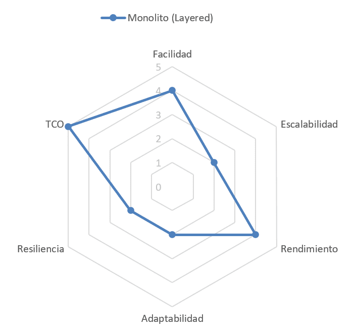
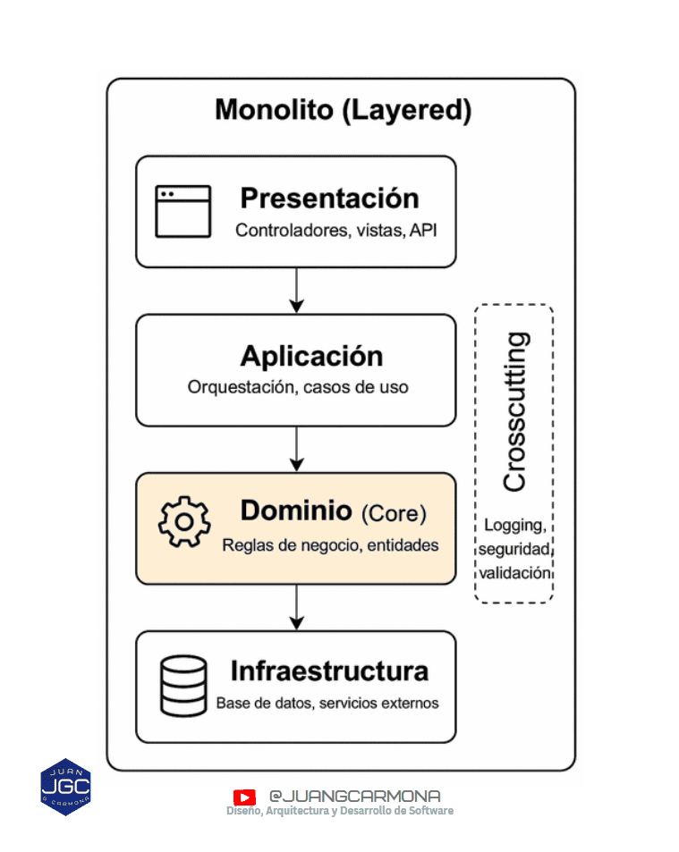

El patrón **monolítico por capas (N-Tier o Layered)** organiza la lógica de una aplicación en capas claramente definidas y despliega todo el sistema como una unidad indivisible.

## Origen

El patrón monolítico por capas (Layered o N-Tier) surgió en los años 70 como evolución de la programación estructurada y del principio de separación de responsabilidades. En los 90 se consolidó como estándar con la llegada de las aplicaciones cliente-servidor, especialmente en entornos J2EE y .NET.

Aunque hoy se habla de "monolito" como lo opuesto a los microservicios, la arquitectura por capas ha sido durante décadas el enfoque más usado en desarrollo empresarial.

Autores como Martin Fowler lo han clasificado dentro de los **"[patterns of enterprise application architecture](https://martinfowler.com/books/eaa.html)"**, donde el objetivo es mantener la complejidad contenida a través de capas bien definidas.

## Descripción técnica

El patrón N-Tier o Layered estructura el sistema en **capas horizontales**, cada una con una función específica:

- **Presentación**: interfaz de usuario, controladores, API.

- **Aplicación** (opcional): orquesta la lógica entre capas.

- **Dominio / Negocio**: contiene las reglas del negocio.

- **Persistencia / Infraestructura**: acceso a datos, integraciones externas.

Las capas se comunican **de forma descendente**, es decir, cada una solo depende de la inmediatamente inferior. Esto refuerza la separación de responsabilidades y facilita la mantenibilidad, las pruebas y la comprensión del sistema.

Todo el sistema se empaqueta y despliega como **una única unidad** (por eso es monolítico): un solo ejecutable, contenedor, WAR, etc.

## Cuándo usarlo / Cuándo evitarlo

### ✅ Cuándo usarlo

- Tienes **un solo equipo** o un equipo pequeño.

- El producto está en **fase inicial o MVP**.

- Las dependencias entre funcionalidades son **fuertes y frecuentes**.

- Necesitas **simplicidad operacional**: un único punto de despliegue.

- El ritmo de cambio no exige despliegues independientes por módulo.

### ❌ Cuándo evitarlo

- Varios equipos necesitan trabajar con **autonomía real**.

- Existen **requisitos de escalado diferencial** entre dominios.

- El dominio de negocio es amplio, con **fronteras mal definidas**.

- Los tiempos de build, test o despliegue se vuelven **inviables**.

- Hay alta probabilidad de necesitar integraciones heterogéneas o reglas de negocio volátiles por módulo.

## Ejemplos reales

- **Aplicaciones corporativas en .NET o Java** de los 2000, con arquitecturas en 3 capas clásicas.

- Herramientas internas, backoffices, CRMs, ERPs… aún hoy muchas siguen siendo monolitos.

- Startups en sus primeras fases que usan Rails, Django, Laravel o Spring Boot sin separar servicios.

**Empresas** como GitLab o Basecamp han defendido públicamente sus monolitos bien estructurados durante años antes de plantearse una migración a microservicios.

## Ventajas y desventajas

| ✅ Ventajas | ❌ Desventajas |
| --- | --- |
| Simplicidad de despliegue y operación | Riesgo de "big ball of mud" si no se estructura bien |
| Desarrollo más ágil al inicio | Un cambio puede romper todo si no hay tests |
| Ideal para MVPs o equipos pequeños | Escalado global: se escalan partes que no lo necesitan |
| Buena integración en pipelines CI/CD simples | Build y test más lentos con el crecimiento |
| Mayor cohesión interna si se respetan las capas | Difícil modularización real en grandes equipos |

## Patrones compatibles / combinaciones frecuentes

- **Arquitectura hexagonal (ports & adapters)**: puede aplicarse _dentro_ de un monolito.

- **CQRS + monolito**: útil para separar comandos y queries sin romper la unidad de despliegue.

- **Onion architecture**: reorganiza las capas internas con foco en el dominio.

## Comparativa con patrones similares

| Patrón comparado | ¿En qué se diferencia? | ¿Cuándo elegirlo? |
| --- | --- | --- |
| **Microservicios** | Separación por dominio + despliegue independiente | Si hay equipos autónomos, escalado desigual o dominios bien definidos |
| **Modular monolith** | Aún es un solo despliegue, pero con límites internos más estrictos | Si buscas transición hacia arquitectura distribuida sin romper todo |
| **Arquitectura Hexagonal** | No define despliegue, sino estructura interna de dependencias | Si quieres claridad técnica sin cambiar el tipo de despliegue |

## Evaluación del patrón

La siguiente valoración usa una escala de **1 a 5**, donde **5 representa el mejor desempeño** en cada criterio.

- **Facilidad (4):** sencillo de entender y desplegar.

- **Escalabilidad (2):** difícil escalar solo partes.

- **Rendimiento (4):** evita sobrecarga distribuida.

- **Adaptabilidad (2):** poco flexible a cambiar piezas.

- **Resiliencia (2):** un fallo crítico tumba todo.

- **Coste (TCO) (5):** bajo coste operativo total.

> Este gráfico representa una puntuación subjetiva orientativa, pensando en un sistema bien diseñado dentro de un monolito tradicional.

## Diagrama

## Para reflexionar

El monolito sigue siendo una **decisión válida y estratégica** si se aplica con cabeza. No es una reliquia, ni una etapa a superar: es una opción arquitectónica que **optimiza el coste y la velocidad** en muchas situaciones reales.

El problema no es el monolito, sino **el desorden dentro de él**. La mayoría de los "monolitos inservibles" no fallaron por ser monolitos, sino por ser **mal diseñados, mal testeados y sin límites internos claros**.

Muchos equipos se lanzan a desarollar microservicios buscando una “solución mágica” sin haber dominado antes la complejidad interna de su propio sistema. Se nos olvida que no hay balas de plata, ni los microservicios ni los monolitos lo son. Si no sabes organizar las capas de un monolito, difícilmente podrás hacerlo evolucionar hacia un monolito mondular y tampoco sabrás diseñar una arquitectura distribuida.

> Diseña primero un buen monolito. Si en algún momento necesitas romperlo, al menos tendrás una base sólida desde la que partir.

### ¿Tienes un monolito que crece sin control?

  
[**Escríbeme**](/contact) y lo revisamos juntos. A veces no necesitas romperlo, solo diseñarlo bien.
