## ****Elegir la arquitectura adecuada puede marcar la diferencia entre una solución elegante y una pesadilla técnica.****

Esta guía no es un glosario ni una colección superficial. Es una herramienta para tomar decisiones bien fundamentadas. Aquí encontrarás más de 30 patrones y estilos arquitectónicos explicados con rigor: cuándo usarlos o evitarlos, qué ventajas aportan, cómo combinarlos, y en qué contexto brillan o pueden suponer un gran fracaso.

> ⚠️ **Este artículo está en progreso** ⚠️
> 
> Lo que estás a punto de leer forma parte de un trabajo minucioso y profundo… pero aún en evolución. He decidido publicarlo ya porque creo que su contenido puede aportar valor incluso en esta fase. Sigo trabajando en él, y está abierto a revisiones, ampliaciones y mejoras.
> 
> De hecho, tras cada uno de los patrones mencionados aquí vendrá un artículo aún más exhaustivo, dedicado exclusivamente a analizarlo en detalle.
> 
> Si ves errores, tienes ideas o quieres contribuir, **[estaré encantado de recibir tus comentarios](/contact)**. Gracias por leer con espíritu constructivo.

Si lideras decisiones técnicas, este artículo no es solo para leerlo en diagonal y olvidarlo. Voy a mantenerlo vivo y a mejorarlo con sugerencias de otros lectores que, como tu, quieren hacer brillar contenido técnico de calidad y en español. Guárdalo en favoritos, compartelo para atraer feedback y para consultarlo cada vez que tengas que diseñar, escalar o migrar un sistema.

### Cómo están organizados

Para evitar el caos, he agrupado los 30 ejemplos según su estilo arquitectónico. No es una invención mía: esta forma de clasificar aparece en muchas fuentes técnicas y académicas, y ayuda a ver patrones comunes entre arquitecturas que, a primera vista, parecen muy distintas.

**[Data-Centered → Centrado en datos](#data-centered):** todo gira en torno a una base de datos o espacio compartido.  
_**[Primary–Replica](#primary-replica), [Space-Based](#space‑based), [Sharding](#sharding), [Blockchain](#blockchain).**_

**[Data-Flow → Flujo de datos](#data-flow):** los datos se procesan en etapas o eventos.  
_**[Pipe-and-Filter](#pipe-and-filter), [Event-Driven (EDA)](#eda), [Saga (orquestada)](#saga), [CQRS](#cqrs), [Reactor Pattern.](#reactor)**_

**[Call-and-Return → Llamada y respuesta](#call-and-return):** los componentes se llaman entre sí, de forma directa.  
_**[Monolito (N-Layered)](#monolith), [Monolito Modular](#modular-monolith), [SOA](#soa), [Microservicios](#microservices), [Broker](#broker), [BFF](#bff), [MVC](#mvc).**_

**[Component-Based → Basado en componentes](#component-based):** enfoque modular, con patrones para aislar y componer.  
_**Microkernel, Hexagonal, Facade, Proxy, E‑C‑B, Sidecar, Circuit Breaker, [Bulkhead](#bulkhead).**_

**[Distributed / Coordination → Distribuidos / Coordinación](#distributed-coordination):** pensadas para escalar, migrar o adaptarse.**  
_[Peer-to-Peer](#p2p), [Leader Election](#leader-election), [Strangler Fig](#strangler-fig), [Anti-Corruption Layer](#anti-corruption-layer)._**

**[Operational Infrastructure → Infraestructura Operativa](#operational-infrastructure):** Aquí he incluido patrones transversales, es decir, no definen la arquitectura global, sino que permiten dotar al sistema de capacidades técnicas clave como resiliencia, extensibilidad o aislamiento.  
_**[Circuit Breaker](#circuit-breaker), [Bulkhead](#bulkhead), [Sidecar](#sidecar), [Ambassador](#ambassador), [Proxy](#proxy), [Facade](#facade), [Service Mesh](#service-mesh).**_

## \[A\] Data-Centered → Centrado en datos

En este estilo, la base del sistema es un repositorio de datos central: puede ser una base de datos, un bus, un espacio compartido o incluso un ledger distribuido. Toda la lógica gira en torno a ese núcleo común. Los demás componentes acceden, procesan o sincronizan la información a través de ese centro, que puede convertirse en un cuello de botella o en el gran punto de coordinación del sistema.

### \[A/1\] **Primary–Replica (Master–Slave)**

**Año**: 2000s (popularización con replicación en bases de datos)  
**Creador / Primera mención**: patrón clásico de sistemas distribuidos, aplicado por MySQL, PostgreSQL, en los 2000s  
**Descripción**  
El patrón tiene un nodo primario que gestiona las escrituras y varios nodos réplicas que manejan lecturas. Las réplicas se sincronizan mediante logs de transacciones, típicamente con [**consistencia eventual**](https://jgcarmona.com/dads-02-sistemas-distribuidos-de-cap-a-pacelc/).  
Estamos ante a**rquitectura fundamental para escalar la lectura en entornos con alta demanda**, redistribuyendo carga sin cambiar la lógica de escritura.

**Cuándo usar / cuándo no**  
Úsalo si tu aplicación tiene muchas consultas de lectura y puedes tolerar latencia en replicación. No lo uses si necesitas consistencia inmediata tras un write o si todas las operaciones deben reflejarse instantáneamente.

**Casos de uso**: Aplicaciones web con alta relación lectura/escritura, sistemas OLAP, e-commerce, dashboards en tiempo real.  
**Pros**: Escalada sencilla de lecturas, alta disponibilidad, respaldo automático.  
**Contras**: consistencia eventual, failover no trivial, y riesgo de SPOF si el primario no se gestiona adecuadamente.  
**Referencias**: [Read replica pattern](https://blog.bytebytego.com/p/read-replica-pattern?utm_source=jgcarmona.com), [System design paradigm: Primary-replica pattern](https://luanjunyi.medium.com/system-design-paradigm-primary-replica-pattern-dc621bf195f1?utm_source=jgcarmona.com)  
**Combinable con**: Cache, EDA, CQRS, microservicios.  
– Se implementa fácilmente con muchos RDBMS.

### \[A/2\] **Sharding (Partitioning)**

**Año**: 2000s  
**Creador**: Base de datos distribuidas, Google, Amazon  
**Descripción**  
Divide datos o carga de trabajo en segmentos (shards), almacenadas y procesadas por nodos diferentes, mejorando paralelización y escalado horizontal.

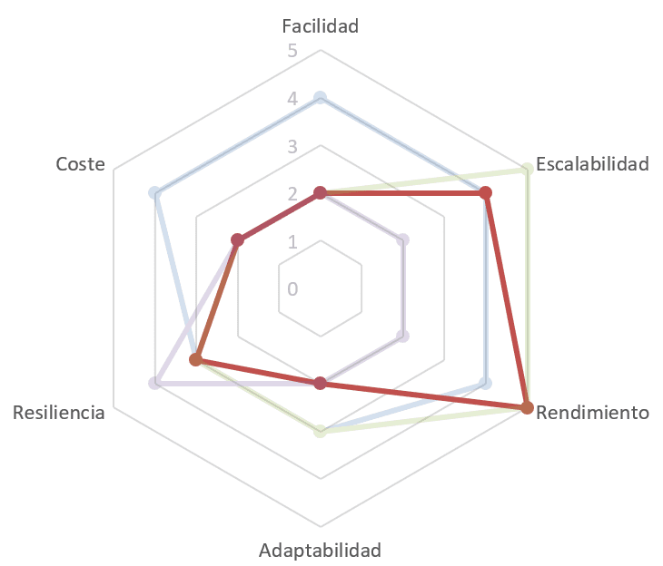

****Cuándo usar / cuándo no****  
– Úsalo en grandes volúmenes de datos o alto tráfico.  
– No si los datos son pequeños o con relación compleja entre ellos.

**Casos**: bases NoSQL, caching, logs, sistemas de usuarios.  
**Pros**: escalabilidad horizontal, baja latencia, participantes autónomos.  
**Contras**: complejidad en partición, cross-shard transactions, reparticionar (re‑sharding) puede ser complejo y costoso.

**Combina con**: CQRS, Event Sourcing, [Space‑Based](#space‑based).

### \[A/3\] **Space‑Based Architecture**

**Año**: 2000s  
**Creador**: Expresado por GigaSpaces  
**Descripción**:  
La Space-Based Architecture sustituye la base de datos central por un espacio de datos compartido en memoria distribuida (data grid). Toda la lógica de negocio accede a este espacio mediante componentes replicados que mantienen estado en memoria, evitando cuellos de botella en la persistencia. Es un patrón orientado a eliminar los límites de escalado en sistemas de alto rendimiento transaccional.

**Cuándo usar / cuándo no**  
– Úsalo cuando la base de datos se convierte en el cuello de botella principal y necesitas escalar horizontalmente.  
– Evítalo en sistemas con baja concurrencia o donde la consistencia fuerte es prioritaria.  
**Casos**: trading en tiempo real, gaming, caching distribuido.  
**Pros**: alta escalabilidad y baja latencia.  
**Contras**: complejidad en coherencia y consistencia.  
**Referencias**: Wikipedia “Space-based architecture”, [GeeksForGeeks](https://www.geeksforgeeks.org/software-engineering/types-of-software-architecture-patterns/?utm_source=jgcarmona.com)  
**Combinaciones**: microservicios, EDA, CQRS.

### \[A/4\] **Blockchain (Distributed Ledger)**

**Año**: 2008 (Bitcoin)  
**Creador**: Satoshi Nakamoto  
**Descripción**:  
Registro distribuido inmutable, consenso entre nodos, transacciones agrupadas en bloques enlazados criptográficamente.

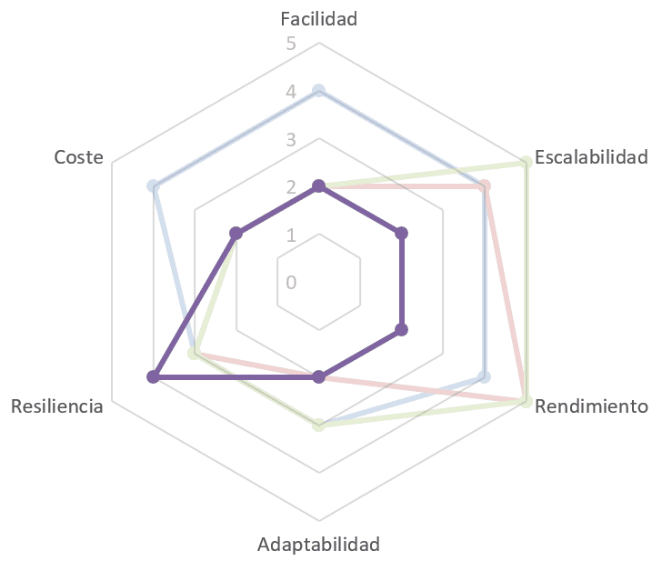

**Cuándo usar / no usar**:  
– Ideal para casos donde se necesita inmutabilidad, transparencia, confianza sin intermediario, y trazabilidad total.  
– No si no se requieren garantías de inmutabilidad; overhead computacional y latencia altos.  
**Casos**: criptomonedas, trazabilidad, smart contracts.  
**Pros**: transparencia, resistencia a censura, auditabilidad fuerte.  
**Contras**: baja performance, consumo energético, complejidad regulatoria y jurídica según el sector.  
**Referencias**: [Whitepaper Bitcoin 2008](https://www.bitcoin.com/satoshi-archive/whitepaper/)  
**Combinaciones**: P2P, EDA, broker.

#### Tabla Comparativa

| Arquitectura | Facilidad | Escalabilidad | Rendimiento | Adaptabilidad | Resiliencia | Coste |
| --- | --- | --- | --- | --- | --- | --- |
| Primary–Replica | ★★★★☆ | ★★★★☆ | ★★★★☆ | ★★★☆☆ | ★★★☆☆ | ★★★★☆ |
| Sharding (Partitioning) | ★★☆☆☆ | ★★★★★ | ★★★★★ | ★★☆☆☆ | ★★★☆☆ | ★★☆☆☆ |
| Space‑Based Architecture | ★★☆☆☆ | ★★★★★ | ★★★☆☆ | ★★★☆☆ | ★★★☆☆ | ★★☆☆☆ |
| Blockchain | ★★☆☆☆ | ★★☆☆☆ | ★★☆☆☆ | ★★☆☆☆ | ★★★★☆ | ★★☆☆☆ |

* * *

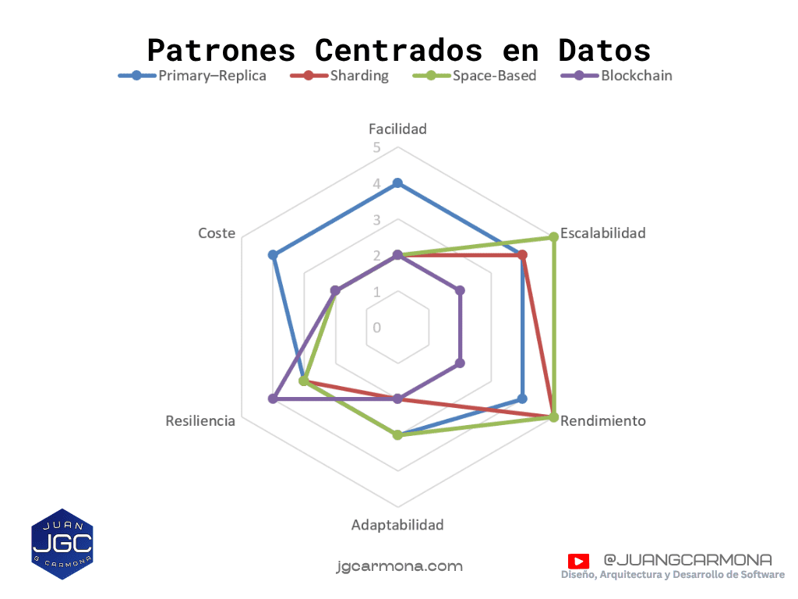

* * *

## \[B\] Data-Flow → Flujo de datos

Aquí lo importante no es dónde están los datos, sino cómo fluyen. El sistema se estructura como una cadena de transformaciones, eventos o etapas de procesamiento: cada etapa recibe algo, lo procesa y lo envía al siguiente paso. Es un enfoque ideal para sistemas que necesitan procesamiento continuo, streaming o una lógica reactiva y desacoplada.

### \[B/1\] **Pipe‑and‑Filter**

**Año**: 1970s (computación por flujo de datos)  
**Creador**: Primeras ideas en sistemas OS/360, refinado por Douglas McIlroy  
**Descripción**:  
Los datos se transforman a través de una secuencia de filtros conectados por canales (“pipes”). Cada filtro realiza una transformación concreta y transmite su salida al siguiente, formando una cadena funcional desacoplada. Es muy usado cuando el procesamiento se puede descomponer en etapas independientes.

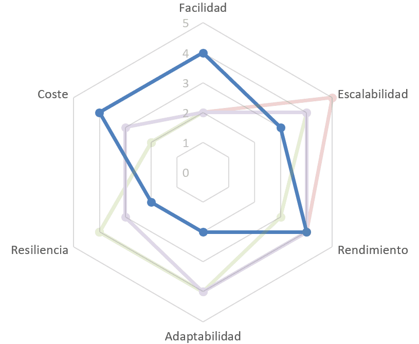

**Cuándo usar / no usar**:  
– Úsalo si tu flujo de datos es lineal o en etapas claras (e.g., ETL, procesamiento de texto).  
– No si necesitas lógica compleja con saltos condicionados.  
**Casos de uso**: líneas de comandos UNIX, ETL, compiladores.  
**Pros**: modularidad, paralelismo natural entre etapas.  
**Contras**: manejo de errores complejo entre etapas, especialmente si el sistema no soporta control de flujo granular.  
**Referencias**: Wikipedia “Pipes and Filters”  
**Combinaciones**: con EDA, broker para desacoplar con colas.

### \[B/2\] **Event-Driven Architecture (EDA)**

**Año**: 2005+  
**Creador**: surgido de integración de eventos (Fowler, Mani Chandy)  
**Descripción**:  
Componentes se comunican mediante eventos asíncronos, desacoplados. Puede implementarse mediante topologías como broker (cola central) o con mediator (procesador de eventos con lógica de orquestación).

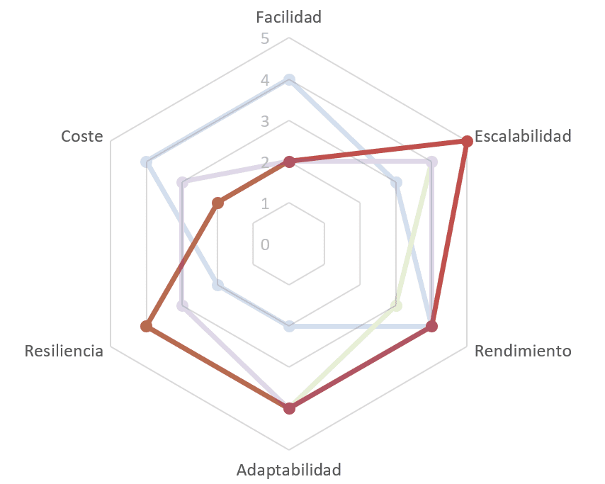

**Cuándo usar / no usar**:  
– Perfecto para sistemas reactivos, en tiempo real.  
– No indicado cuando el dominio requiere transacciones síncronas fuertes.

**Casos**: pagos, IoT, analytics, sistemas distribuidos.  
**Pros**:  
– Alta escalabilidad, resiliencia ante fallos, y fuerte desacoplamiento entre componentes.  
**Contras**:  
– Difícil de testear, trazar flujo, manejar consistencia [en.wikipedia.org](https://en.wikipedia.org/wiki/Event-driven_architecture?utm_source=chatgpt.com).

Ideal con **microservicios**, **CQRS**, **SOA**.

### \[B/3\] **Saga Pattern**

**Año**: 2016+ moderno  
**Creador**: Patrones de transacción distribuida emergentes  
**Descripción**  
Gestiona transacciones largas y distribuidas mediante una secuencia de sub‑transacciones locales en distintos servicios, cada una con su correspondiente operación de compensación en caso de fallo. Las sagas pueden implementarse de dos formas:  
– **Orquestadas**, con un servicio central que coordina los pasos.  
– **Coreografiadas**, donde cada servicio reacciona a eventos y dispara el siguiente paso.  
Este patrón permite mantener consistencia eventual sin bloquear recursos como en las transacciones ACID clásicas.

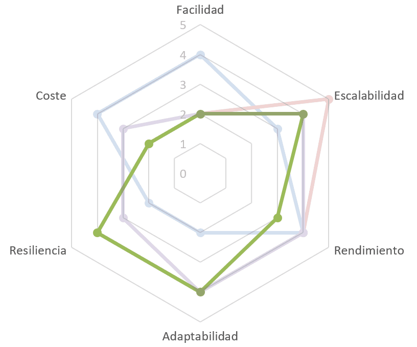

****Cuándo usar / cuándo no****  
– Ideal cuando no es viable una [transacción ACID](https://keepcoding.io/blog/que-es-acid-bases-datos/) entre servicios.  
– No si se puede usar una única base transaccional.

**Casos**: reservas, e‑commerce, procesos financieros.  
**Pros**: consistencia eventual, desacoplo, tolerancia a fallos.  
**Contras**: lógica compleja de compensación, complejidad elevada en pruebas e integración.

**Combina con**: CQRS, EDA, Saga orchestration frameworks.

### \[B/4\] **CQRS (Command Query Responsibility Segregation)**

**Año**: 2010+  
**Creador**: Greg Young  
**Descripción**:  
Separación de modelos de lectura (query) y escritura (command). A menudo combinado con event sourcing.

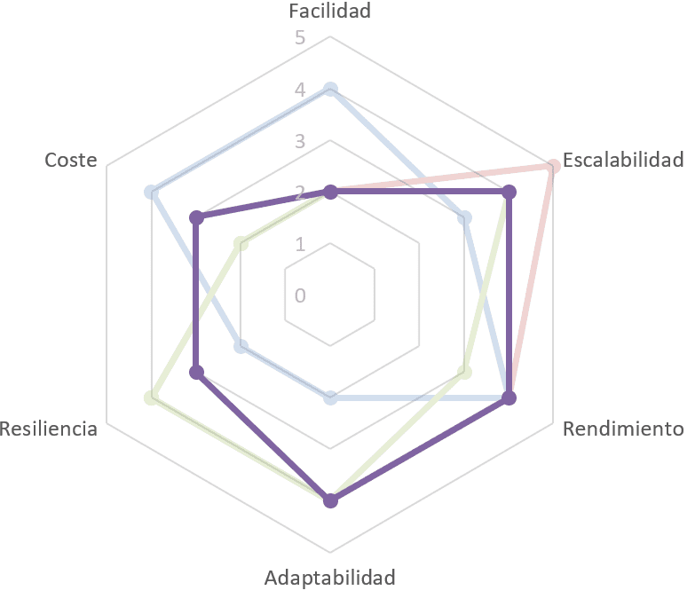

**Cuándo usar / no usar**:  
– Ideal cuando se requiere escalado y optimización distinta para lectura/escritura.  
– No para sistemas simples o donde la simplicidad prima.

**Casos**: trading, sistemas complejos de consulta.  
**Pros**:  
– Optimización por modelo, además, facilita la auditoría y el registro histórico de operaciones.  
**Contras**:  
– Añade complejidad, requiere asumir [consistencia eventual](https://jgcarmona.com/dads-02-sistemas-distribuidos-de-cap-a-pacelc/) y una infraestructura más compleja.

Funciona bien en combinación con **EDA**, **microservicios**, **event streaming**.

###   
\[B/5\] **Reactor Pattern**

**Año**: 1995 (primeras referencias en _[Pattern Languages of Program Design](https://www.amazon.com/Pattern-Languages-Program-Software-Patterns/dp/0201433044)_)  
**Creador / Primera mención**: Douglas C. Schmidt y colaboradores en ACE framework  
**Descripción**  
El Reactor Pattern gestiona múltiples solicitudes de E/S simultáneas usando un bucle de eventos que despacha las solicitudes a manejadores registrados (handlers). Funciona con E/S no bloqueante, permitiendo escalabilidad sin crear un hilo por conexión.  
Es ideal para servidores de alto rendimiento donde miles de clientes conectados generan peticiones heterogéneas (I/O, sockets, etc.).

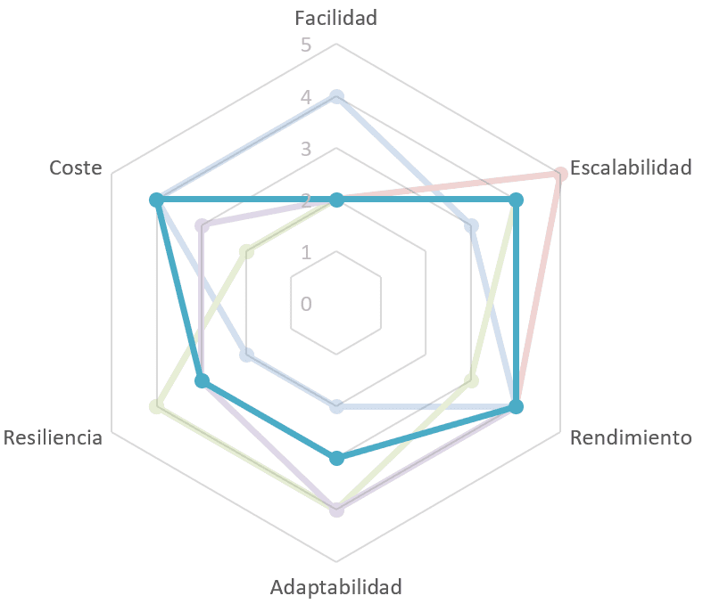

**Cuándo usar / cuándo no**  
– **Úsalo** para servidores de red, aplicaciones I/O intensivo o arquitecturas orientadas a eventos (Node.js, [Nginx](https://nginx.org), Netty).  
– **Evita** en escenarios muy sencillos donde un hilo por conexión es suficiente o cuando la complejidad de callbacks no compensa.

**Casos de uso**: Nginx, Node.js, Netty, servidores HTTP, frameworks de red.  
**Pros**:  
– Alto rendimiento en I/O simultáneo  
– Gestión eficiente de recursos (sin hilos extras)  
– Muy utilizado en infraestructuras web de escala.  
**Contras**:  
– La inversión de control mediante callbacks puede (suele) dificultar el seguimiento del flujo de ejecución.  
– No es adecuado para operaciones largas en CPU dentro del bucle de eventos  
– Requiere soporte de E/S no bloqueante

**Referencias:** [Wikipedia](https://en.wikipedia.org/wiki/Reactor_pattern?utm_source=jgcarmona.com)  
**Combinable con**: Reactor se integra naturalmente en arquitecturas event-driven y es un pilar para servidores distribuidos; complementa patrones como EDA, Broker, Event Streaming.

### Tabla Comparativa

| Arquitectura | Facilidad | Escala | Rendim. | Adaptab. | Resil. | Coste |
| --- | --- | --- | --- | --- | --- | --- |
| [Pipe‑and‑Filter](#pipe-and-filter) | ★★★★☆ | ★★★☆☆ | ★★★★☆ | ★★☆☆☆ | ★★☆☆☆ | ★★★★☆ |
| Event‑Driven Architecture | ★★☆☆☆ | ★★★★★ | ★★★★☆ | ★★★★☆ | ★★★★☆ | ★★☆☆☆ |
| Saga Pattern | ★★☆☆☆ | ★★★★☆ | ★★★☆☆ | ★★★★☆ | ★★★★☆ | ★★☆☆☆ |
| CQRS | ★★☆☆☆ | ★★★★☆ | ★★★★☆ | ★★★★☆ | ★★★☆☆ | ★★★☆☆ |
| Reactor Pattern | ★★☆☆☆ | ★★★★☆ | ★★★★☆ | ★★★☆☆ | ★★★☆☆ | ★★★★☆ |

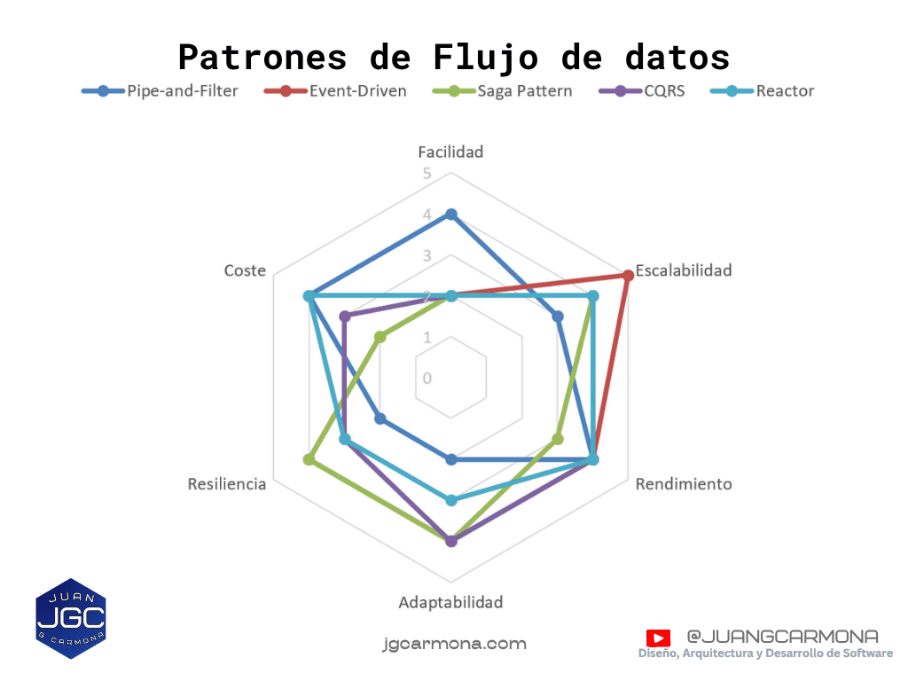

* * *

## \[C\] Call-and-Return → Llamada y respuesta

Este estilo es probablemente el más común: una pieza del sistema llama directamente a otra y espera una respuesta. Ya sea un monolito clásico, un backend modular o un sistema distribuido con APIs, todo se basa en la idea de que un componente “manda” y otro “responde”. Sencillo de entender, pero puede volverse frágil si no se controla bien el acoplamiento.

## \[C/1\] **Monolito (N‑Tier / Layered)**

### [Ver artículo completo →](/arquitectura-monolito)

**Año**: 1970s (popularizado como Three‑Tier en 1995 por John J. Donovan)  
**Descripción:** Arquitectura en capas (presentación, lógica, datos), desplegada como un único bloque.  
**Uso típico:** MVPs, apps internas, productos con evolución controlada.

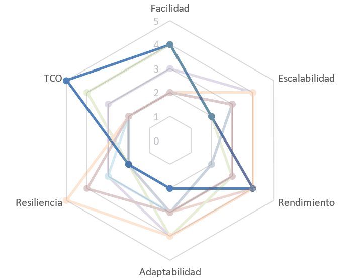

**Cuándo usar / no usar**:  
– _Usa_ cuando el dominio es sencillo y los equipos pequeños. Hay poco riesgo de escalado brusco.  
– _Evita_ con crecimiento rápido, múltiples dominios o requisitos de escalabilidad individual.

**Casos de uso**: MVPs, apps internas, sistemas con bajo crecimiento.

**Pros**:  
– Sencilla de implementar, menos infraestructuras, fácil de probar.  
– Menor coste inicial de infraestructura.

**Contras**:  
– Poca escalabilidad granular, riesgo de convertirse en “big ball of mud”.  
– Dificultad para aplicar cambios en zonas específicas.

Puede combinarse con **el monolito** modular, arquitectura **hexagonal** y **EDA** con eventos disparando ciertas tareas.

**Referencias**:  
– Three‑Tier origin: John J. Donovan, 1995

### \[C/2\] **Monolito Modular (Modular Monolith)**

**Año**: evolución reciente (2010+)  
**Creador**: concepto gradual, influido por modularidad en SOA/layered.  
**Descripción**:  
Monolito dividido en módulos internos con fronteras claras, pero desplegado como uno solo. Permite organización de código y despliegue simple.

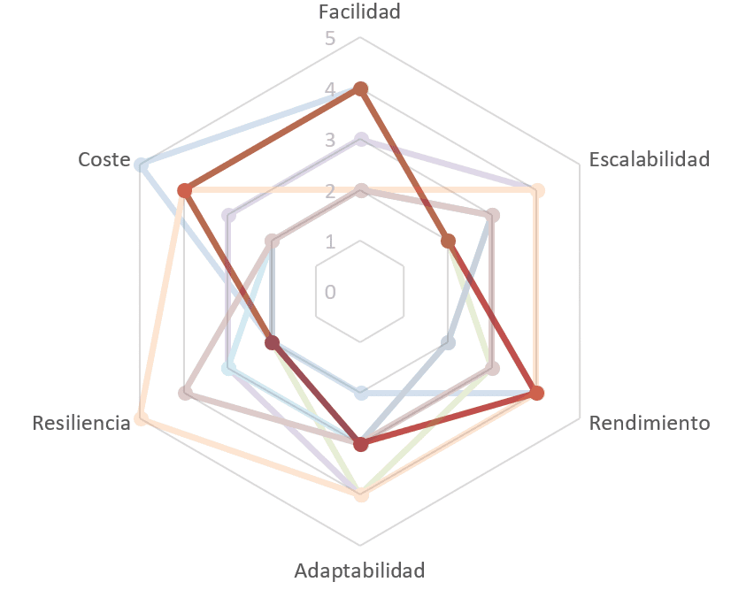

**Cuándo usar / no usar**:  
– Útil para mantener estructura modular sin complejidad de microservicios.  
– No adecuado cuando se requiere despliegue independiente o escalado por módulo.

**Casos**: apps medianas donde se quiera repartir trabajo internamente.  
**Pros**:  
– Modularidad sin overhead distribuido, testing más fácil que microservicios.  
**Contras**:  
– No aisla fallos ni permite escalado módulo‑a‑módulo.

Combinable con **hexagonal**, **CQRS**, **EDA**.

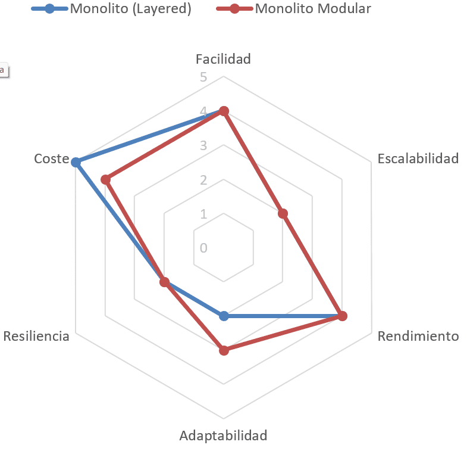

**NOTA:**  
Aunque se ha escrito mucho sobre los monolitos modulares, y, por extensión, sobre arquitecturas como _Vertical Slice Architecture_s, sus diferencias con el monolito clásico (layered) siguen siendo más sutiles de lo que parecen… pero también más importantes. Con un esfuerzo estructural relativamente bajo, se gana una mejor adaptabilidad y una mayor resiliencia interna sin comprometer el rendimiento ni disparar los costes.

¿Cuánto se gana exactamente? Depende del contexto, pero la mejora en adaptabilidad suele ser significativa. Esta comparativa lo ilustra con claridad, menor coste y más versatil.

### \[C/3\] **Model–View–Controller (MVC)**

**Año**: 1978 / 1980s (SmallTalk); web popular 2000s  
**Creador**: Trygve Reenskaug (SmallTalk, 1978); luego adoptado en web  
**Descripción**  
Separa lógica de datos (Modelo), lógica de presentación (Vista) y control de flujo (Controlador). Facilita desarrollo modular, testable y escalable en UI.

**Cuándo usar / cuándo no**  
Perfecto para aplicaciones web tradicionales con carga de servidor. Menos adecuado en SPAs modernas sin lógica server-heavy.  
**Casos de uso**: Frameworks web como Rails, Django, Spring [MVC](#mvc).  
**Pros**: Modularidad, paralelismo en desarrollo, buenas pruebas.  
**Contras**: Overhead si es trivial; lógica distribuida puede generar complejidad.  
**Referencias**:  
**Combinable con**: Hexagonal, BFF, EDA.

### \[C/4\] **Backend‑For‑Frontend (BFF)**

**Año**: 2015 (por Sam Newman)  
**Creador / Primera mención**: Sam Newman, formalizado en Azure/AWS Architecture Center  
**Descripción**  
Crea un microservicio dedicado para cada tipo de cliente (web, móvil, IoT). Actúa como capa intermedia que adapta datos, simplifica payloads y reduce over-fetching.  
Ofrece experiencia optimizada para cada interfaz, además de aislamiento en desarrollo y despliegue.

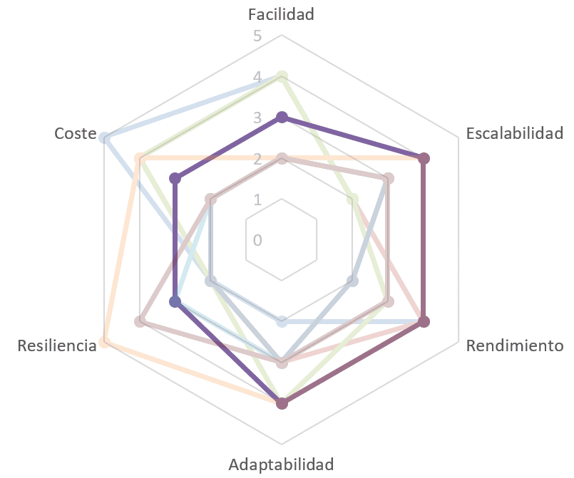

**Cuándo usar / cuándo no**  
Úsalo cuando múltiples UIs tienen requerimientos distintos y necesitan agilidad individual. Evita si solo existe un tipo de cliente o si la complejidad no justifica más despliegues.

**Casos de uso**: empresas con apps web + móvil; proyectos donde UI y backend evolucionan a ritmos distintos.  
**Pros**: UX optimizado, separación de responsabilidades, seguridad, autonomía por plataforma.  
**Contras**: Más servicios, sobrecarga en mantenimiento, duplicación parcial de lógica.  
**Referencias**:  
**Combinable con**: microservicios, EDA, API Gateway.

### \[C/5\] **SOA (Service‑Oriented Architecture)**

**Año**: ~2003  
**Creador**: conceptos difundidos por Thomas Erl, Michael Bell  
**Descripción**:  
Servicios autónomos, con contratos estandarizados (SOAP/WSDL), suelen orquestados. Más grandes y pesados que microservicios.

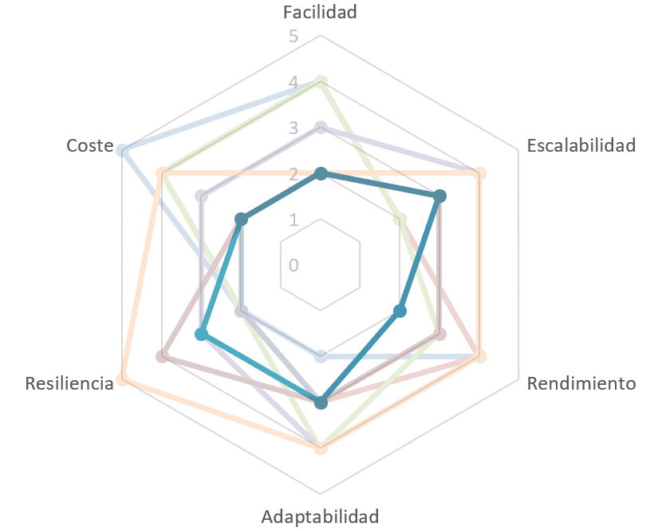

**Cuándo usar / no usar**:  
– Ideal para integración de sistemas o servicios compartidos.  
– Evitar si se busca agilidad ligera; overhead por XML y gestión compleja.

**Casos**: banca, entornos empresariales con heterogeneidad de plataformas.  
**Pros**:  
– Reusabilidad, integración independiente de tecnología.  
**Contras**:  
– Alto coste de ejecución, complejidad en testing

Integrable con **EDA**, migrable hacia microservicios.

### \[C/6\] **Microservicios**

**Año**: formalizado en 2012  
**Creador**: James Lewis, Martin Fowler, Adrian Cockcroft; Netflix pionero  
**Descripción**:  
Colección de servicios pequeños, desplegables independientemente, cada uno con su DB y despliegue.

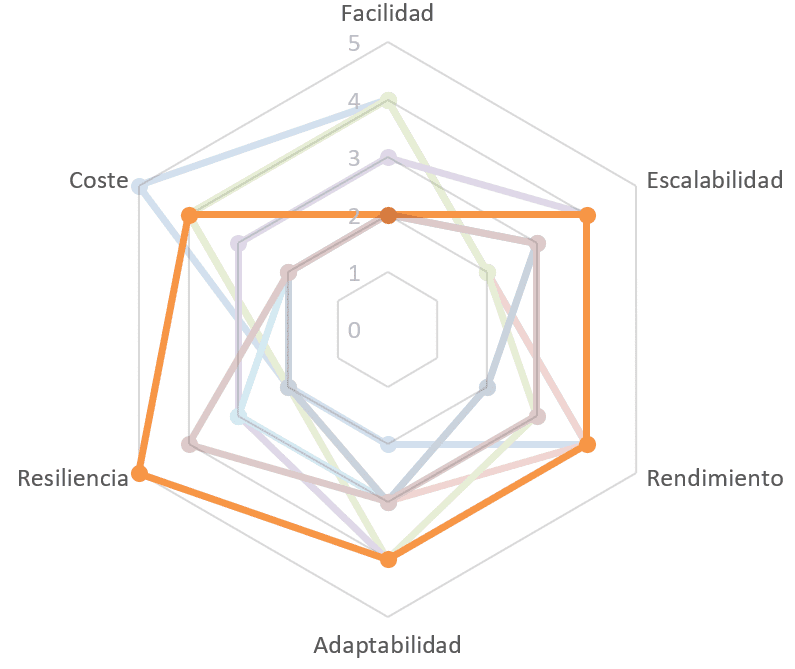

**Cuándo usar / no usar**:  
– Ideal para sistemas grandes, alta necesidad de escalabilidad y despliegue independiente.  
– No recomendable para apps pequeñas o sin equipo devops maduro.

**Casos**: Netflix, Amazon, Uber  
**Pros**:  
– Escalado granular, equipos autónomos, resiliencia por aislamiento.  
**Contras**:  
– Complejidad de red, despliegue, consistencia, testing

Combina con **DDD**, **EDA**, **CQRS**, **hexagonal**.

### \[C/7\] **Broker**

**Año**: 1990s  
**Creador**: Ralph Johnson y colaboradores (architecture description)  
**Descripción**:  
Servicios y clientes se comunican a través de un intermediario (broker) que enruta solicitudes, permite descubrimiento y empaqueta lógica común.

**Cuándo usar / no usar**:  
– Útil en entornos con heterogeneidad y descubrimiento dinámico.  
– No si la comunicación puede ser más directa (microservicios con API gateway).  
**Casos**: CORBA, Java RMI, middleware empresarial.  
**Pros**: desacoplo, reusable routing.  
**Contras**: único punto de fallo, overhead por intermediario.  
**Referencias**: [Broker architecture](https://architectural-patterns.net/broker)  
**Combinaciones**: SOA, EDA, microservicios.

### \[C/8\] **Ambassador Pattern**

**Año**: 2015+ (patrones modernos en microservicios)  
**Creador**: Adaptado de patrones de sidecar, formalizado en microservicios modernos  
**Descripción**  
Un servicio “embajador” que actúa como intermediario entre tu aplicación y servicios remotos, gestionando comunicaciones, caché, retries o TLS. Funciona como proxy ligero desplegado junto a cada servicio.

****Cuándo usar / cuándo no****  
– Úsalo cuando hay lógica cross‑cutting en la comunicación (retries, mTLS).  
– Evita si no necesitas intermediarios o el overhead es excesivo.

**Casos reales**: microservicios que requieren observabilidad, encriptación punto a punto (TLS) o lógica común de comunicación como retries o logging.  
**Pros**: simplifica lógica repetitiva, aislamiento por servicio, facilita observabilidad.  
**Contras**: añade latencia, despliegues extras y debugging más complejo.

**Combina con**: Sidecar, Circuit Breaker, Service Mesh.

### Tabla Comparativa

| Arquitectura | Facilidad | Escalabilidad | Rendimiento | Adaptabilidad | Resiliencia | Coste |
| --- | --- | --- | --- | --- | --- | --- |
| Monolito (Layered) | ★★★★☆ | ★★☆☆☆ | ★★★★☆ | ★★☆☆☆ | ★★☆☆☆ | ★★★★★ |
| Monolito Modular | ★★★★☆ | ★★☆☆☆ | ★★★★☆ | ★★★☆☆ | ★★☆☆☆ | ★★★★☆ |
| MVC | ★★★★☆ | ★★☆☆☆ | ★★★☆☆ | ★★★★☆ | ★★☆☆☆ | ★★★★☆ |
| BFF | ★★★☆☆ | ★★★★☆ | ★★★★☆ | ★★★★☆ | ★★★☆☆ | ★★★☆☆ |
| SOA | ★★☆☆☆ | ★★★☆☆ | ★★☆☆☆ | ★★★☆☆ | ★★★☆☆ | ★★☆☆☆ |
| Microservicios | ★★☆☆☆ | ★★★★★ | ★★★☆☆ | ★★★★★ | ★★★★☆ | ★★★★☆ |
| Broker | ★★☆☆☆ | ★★★☆☆ | ★★☆☆☆ | ★★★☆☆ | ★★☆☆☆ | ★★☆☆☆ |
| Ambassador Pattern | ★★☆☆☆ | ★★★☆☆ | ★★★☆☆ | ★★★☆☆ | ★★★★☆ | ★★☆☆☆ |

* * *

## \[D\] Component-Based → Basado en componentes

Aquí la clave es la modularidad. El sistema se divide en componentes desacoplados, con responsabilidades bien delimitadas y mecanismos de comunicación definidos. Este enfoque resulta especialmente útil cuando necesitas mantener orden, permitir extensibilidad, incluso por terceros, y facilitar la evolución a largo plazo.

### \[D/1\] **Microkernel (Plug‑in / Plugin)**

**Año**: 1981 (sistemas operativos); 1990s (en aplicaciones)  
**Creador**: Concepto introducido en sistemas operativos como _Mach_; popularizado en aplicaciones extensibles como Eclipse RCP.  
**Descripción**:  
El patrón Microkernel propone una arquitectura con un núcleo mínimo que expone servicios esenciales comunes (como carga de plugins, logging, o enrutamiento interno), mientras que el resto de funcionalidades se implementan como módulos o extensiones desacopladas. Esta separación permite una evolución modular y extensible sin comprometer la estabilidad del núcleo.  

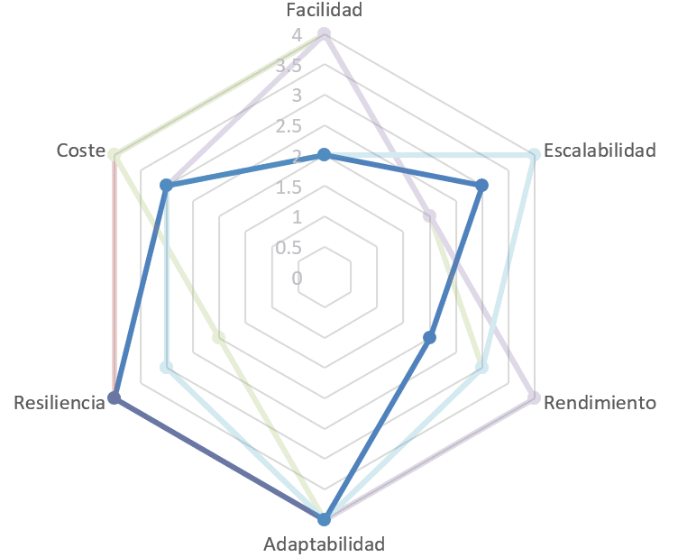

**Cuándo usar / cuándo no**  
– Útil para aplicaciones que evolucionan mediante añadidos (CAD, IDEs).  
– Evitar si la app es monolítica o no requiere extensibilidad.  
**Casos**: Eclipse, Jenkins, plataformas de CMS.  
**Pros**: escalable funcionalmente, soporte de terceros.  
**Contras**: arquitectura compleja, versiones de plug‑ins conflictuantes.  
**Referencias**: Wikipedia “Microkernel architecture” [en.wikipedia.org](https://en.wikipedia.org/wiki/Dependency_inversion_principle?utm_source=chatgpt.com)  
**Combinaciones**: hexagonal, modular monolito.

### \[D/2\] **Hexagonal (Ports & Adapters)**

**Año**: 2005  
**Creador**: Alistair Cockburn  
**Descripción**:  
Separa explícitamente la lógica de negocio de las dependencias externas (como bases de datos, interfaces de usuario o servicios). A través de puertos y adaptadores, permite sustituir tecnologías sin afectar al núcleo funcional. Su valor no está en escalar el sistema, sino en su claridad estructural y facilidad para testear o integrar.

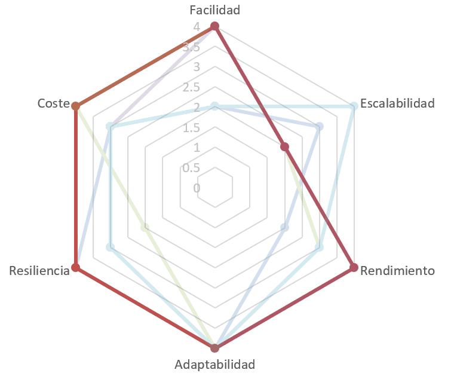

**Cuándo usar / no usar**:  
– Muy útil para aislar lógica del framework o persistencia.  
– No aporta escalado por sí mismo, es decir, su fuerza es estructural, no operacional; complementa otras arquitecturas.

**Casos**: apps mantenibles, robustas en pruebas unitarias.  
**Pros**:  
– Alta testabilidad, flexibilidad de dependencia.  
**Contras**:  
– Ligera sobre‑ingeniería si la app es trivial.

Ideal con **monolito modular**, **microservicios**, **CQRS**.

###   
\[D/3\] **Entity–Control–Boundary (ECB)**

**Año**: 1992 (introducido en OOSE por Ivar Jacobson)  
**Creador**: Ivar Jacobson, como parte del método [_Object-Oriented Software Engineering_](https://www.amazon.com/Object-Oriented-Software-Engineering-Approach/dp/0201544350?crid=2A97C2F64686N&dib=eyJ2IjoiMSJ9.6BX78w_vFDSuYCDnlKENwKBrbYkCfQ90RRtYXoLj3X0-SEEzfsXejdv2lrWZCLr0f3KKZgrPHXS80rBarX9efCW6SSO3nTa68BrhRf61So16gImQ5rOe21Fl990MSojiYBskdERfadYqFlqazzm3fqjBMuKmpLLGC6fYTmM9zArlxZ3tc5s9gPn79I8GptG6oQweLrG6LFI-oIYrncmBFdFZ0509RufGPJ9dhgWsVcw.ACaFaMMJ2asJ2nn6BYbBbARrIGPg1bJjkadm4V4WN_Y) _(OOSE)_, base fundacional de **[UML](https://jgcarmona.com/uml-de-batalla/)** y del Unified Process.  
**Descripción**:  
Divide el sistema en tres componentes:  
– **Entity**: representa reglas y datos del dominio persistente.  
– **Control**: orquesta la ejecución de los casos de uso, coordinando entidades y límites.  
– **Boundary**: gestiona la interacción con el exterior (como UI o servicios externos).

ECB estructura el sistema alrededor de los casos de uso, facilitando su mantenimiento, modularidad y testabilidad.

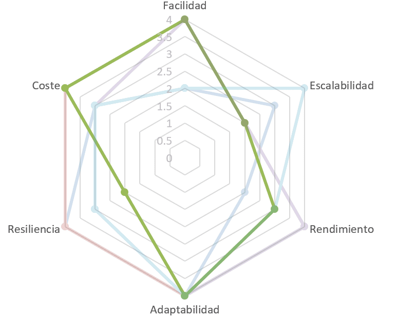

**Cuándo usar / cuándo no**  
Ideal para diseño orientado a casos de uso mantenible. No necesario en apps CRUD simples.  
**Casos de uso**: sistemas enterprise, ordenadores de inventario, procesos bien definidos.  
**Pros**: Claridad en diseño, separación de responsabilidades, facilidad para tests.  
**Contras**: Over-engineering en dominios simples.  
**Referencias**: [Entity–control–boundary](https://en.wikipedia.org/wiki/Entity%E2%80%93control%E2%80%93boundary?utm_source=jgcarmona.com)  
**Combinable con**: Clean Architecture, Hexagonal, CQRS.

### \[D/4\] **Anti‑Corruption Layer**

**Año**: 2015+ (DDD pattern)  
**Creador**: Martin Fowler / Eric Evans (DDD)  
**Descripción**  
Define una capa intermedia que aísla tu modelo de dominio de modelos externos o inconsistentes. Traduce datos, comportamientos y semántica para evitar que dependencias externas contaminen tus decisiones de diseño internas. Es especialmente útil para integraciones con sistemas legacy o heredados, APIs inestables o partners externos.

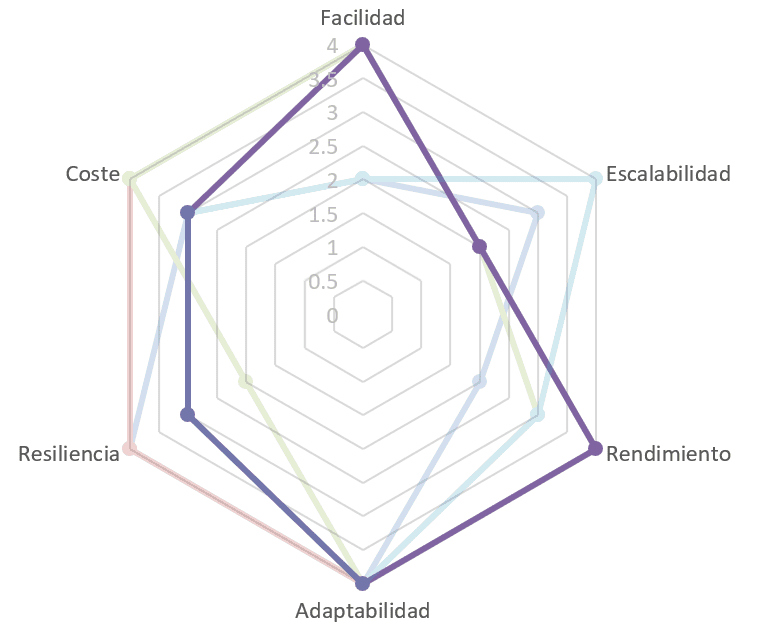

**Cuándo sí / no**  
– Úsalo cuando consumes sistemas legados o no confiables.  
– No si controlas ambos extremos o hay pocas interacciones.

**Casos**: integración con sistemas externos, migraciones limitadas.  
**Pros**: protege tu modelo, aislamiento semántico.  
**Contras**: requiere mantenimiento adicional, puede introducir duplicación de modelos y lógica de mapeo.  
**Recursos:** [Anti-corruption Layer pattern](https://learn.microsoft.com/en-us/azure/architecture/patterns/anti-corruption-layer)  
**Combina con**: Strangler, SOA, Event‑Driven Integration.  

### \[D/5\] **Strangler Fig Pattern**

**Año**: 2016+ (Fowler)  
**Creador**: Martin Fowler  
**Descripción**  
Facilita la migración progresiva de un sistema monolítico a una arquitectura moderna. Intercepta las llamadas entrantes y las redirige a versiones nuevas del sistema a medida que se reescriben. La coexistencia controlada permite migrar por secciones, validando cada paso sin asumir riesgos globales.

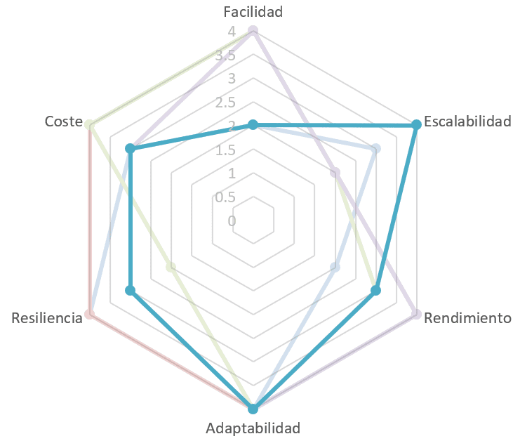

****Cuándo usar / cuándo no****  
– Perfecto para modernizar monolitos sin reescritura total.  
– No necesario si el monolito puede quedar sin cambios.

**Casos**: modernización, adopción microservicios progresiva.  
**Pros**: bajo riesgo, reutilización, iterativo.  
**Contras**: añade complejidad en el enrutamiento y exige testear en escenarios híbridos con lógica antigua y nueva conviviendo.

**Combina con**: BFF, API Gateway, Ambassador.  

### Tabla Comparativa

| Arquitectura | Facilidad | Escala | Rendim. | Adaptab. | Resil. | Coste |
| --- | --- | --- | --- | --- | --- | --- |
| Microkernel | ★★☆☆☆ | ★★★☆☆ | ★★☆☆☆ | ★★★★★ | ★★★☆☆ | ★★★☆☆ |
| Hexagonal (Ports & Adapters) | ★★★★☆ | ★★☆☆☆ | ★★★★☆ | ★★★★★ | ★★★☆☆ | ★★★★☆ |
| Entity–Control–Boundary | ★★★★☆ | ★★☆☆☆ | ★★★☆☆ | ★★★★☆ | ★★☆☆☆ | ★★★★☆ |
| Anti‑Corruption Layer | ★★★★☆ | ★★☆☆☆ | ★★★★☆ | ★★★★☆ | ★★★☆☆ | ★★★☆☆ |
| Strangler Fig Pattern | ★★☆☆☆ | ★★★★☆ | ★★★☆☆ | ★★★★☆ | ★★★☆☆ | ★★★☆☆ |

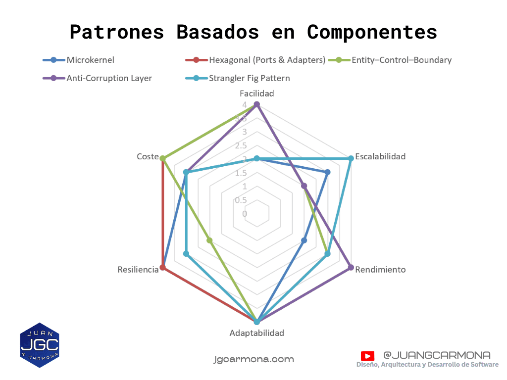

* * *

## \[E\] Distributed / Coordination → Distribuidos / Coordenados

Este conjunto de patrones surge cuando el sistema se distribuye en múltiples nodos, instancias o regiones. Requieren mecanismos de coordinación, consenso o aislamiento para evitar inconsistencias y fallos sistémicos. Aquí aparecen estilos que resuelven problemas de gobernanza distribuida, resiliencia, migración progresiva o evolución/actualizaciones sin downtime. Suelen ser más complejos, pero esenciales en arquitecturas escalables y tolerantes a fallos.

### \[E/1\] **Peer-to-Peer (P2P)**

**Año**: popular desde Napster 1999, refinado 2000s  
**Creador**: conceptos de red descentralizada  
**Descripción**:  
En una red P2P, cada nodo actúa simultáneamente como cliente y servidor, sin necesidad de un punto central de control. La lógica y los datos se distribuyen entre los nodos, lo que permite escalabilidad horizontal, descentralización y tolerancia a fallos.

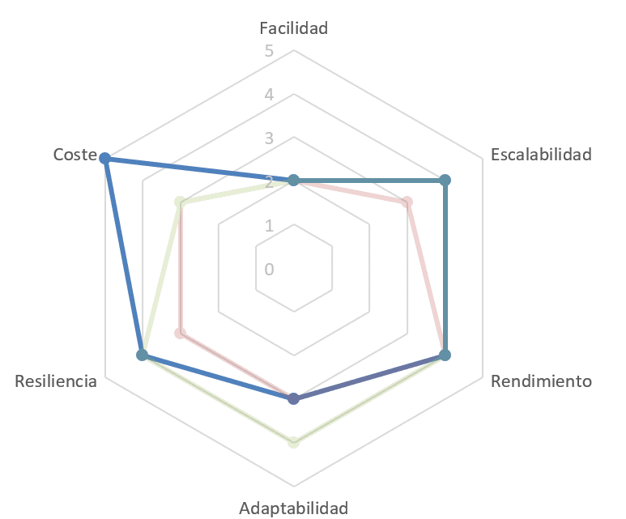

**Cuándo usar / no usar**:  
– Perfecto para sistemas donde se busca descentralización, alta disponibilidad y balanceo autónomo.  
– Evitar si el control centralizado, la trazabilidad o la consistencia fuerte son imprescindibles.

**Casos**: torrent, [blockchain](#blockchain), chat descentralizado.  
**Pros**:  
– Muy tolerante a fallos, escalado natural.  
**Contras**:  
– Complejo de asegurar, difícil coordinar transacciones.

Puede combinarse con **[blockchain](#blockchain)**, **event streaming**, **EDA**.  

### \[E/2\] **Leader Election**

**Año**: clásico en sistemas distribuidos  
**Creador**: Algoritmos de consenso como Raft, Paxos  
**Descripción**  
Mecanismo para asegurar que, en un sistema distribuido, un único nodo sea designado como líder en un momento dado. Este nodo puede encargarse de tareas críticas como orquestación, escritura sincronizada o control de acceso. Se basa en algoritmos como Raft o Paxos, que garantizan consenso entre nodos.

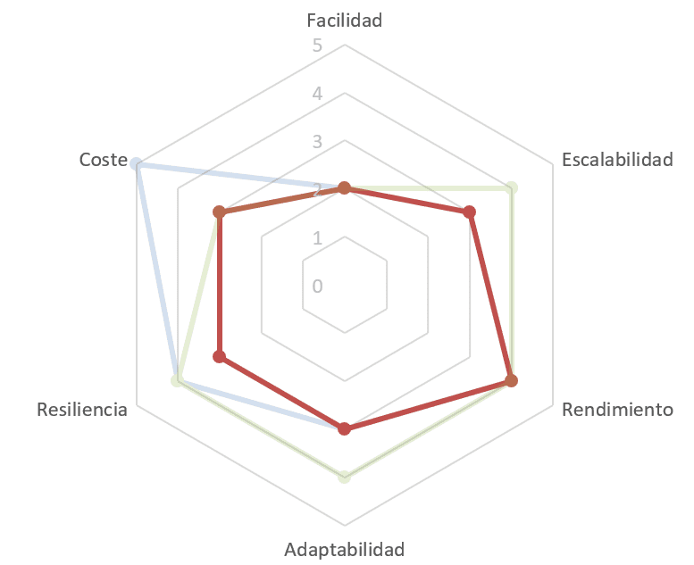

****Cuándo usar / cuándo no****  
– Ideal cuando necesitas coordinación centralizada temporal (locks distribuidos, planificación de tareas, writes sincronizadas).  
– No necesario si todos los nodos son completamente autónomos o se tolera inconsistencia eventual.

**Casos**: bases distribuidas, coord de cron, Kafka zookeeper.  
**Pros**: un solo responsable, evita conflictos, coherencia.  
**Contras**: fllos en el líder pueden generar latencia o split-brain si no se gestiona bien la reelección.

**Combina con**: [Sharding](#sharding), Coordinator services, EDA.  

### \[E/3\] **Micro Frontend**

**Año**: 2019+  
**Creador / Primera mención**: formalizado por [**ThoughtWorks**](https://www.thoughtworks.com/); estándar en comunidades JavaScript  
**Descripción**  
Divide la interfaz de usuario en micro-aplicaciones independientes, desarrolladas, versionadas y desplegadas por equipos distintos. Cada fragmento puede usar su propia tecnología y lógica, ensamblándose en tiempo de ejecución como una única SPA (Single Page Application). Este patrón permite escalar equipos frontend como ya se hace con los microservicios en backend.

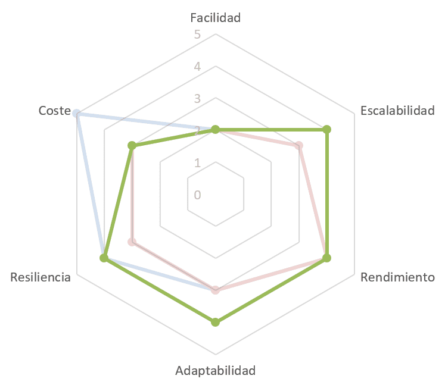

**Cuándo usar / cuándo no**  
– Ideal para plataformas frontend complejas con múltiples módulos, dominios y equipos.  
– Evítalo en proyectos simples donde introduce más complejidad de la que resuelve.

**Casos de uso**: portales corporativos, SPAs grandes, plataformas SaaS con distintos módulos.  
**Pros**: Independencia de equipos, despliegue autónomo, versatilidad tecnológica.  
**Contras**: Coordinación, carga inicial, UX inconsistente si no se cuida.  
**Referencias**:  
**Combinable con**: BFF, Microservicios, Proxy.  

### Tabla Comparativa

| Arquitectura | Facilidad | Escala | Rendimiento | Adaptabilidad | Resiliencia | Coste |
| --- | --- | --- | --- | --- | --- | --- |
| Peer‑to‑Peer | ★★☆☆☆ | ★★★★★ | ★★★☆☆ | ★★★☆☆ | ★★★★★ | ★★★★☆ |
| Leader Election | ★★☆☆☆ | ★★★☆☆ | ★★★★☆ | ★★★☆☆ | ★★★☆☆ | ★★★☆☆ |
| Micro Frontend | ★★☆☆☆ | ★★★★★ | ★★★☆☆ | ★★★★★ | ★★★☆☆ | ★★★☆☆ |

* * *

## \[F\] Infraestructura Operativa → Patrones transversales de soporte

No todos los patrones arquitectónicos definen la estructura global de un sistema. Algunos, como los que se incluyen en esta sección, operan a nivel de infraestructura técnica o comportamiento operativo. Son patrones transversales que aportan control, resiliencia, aislamiento o extensibilidad.

Aunque no constituyen arquitecturas completas, su correcta aplicación puede marcar la diferencia entre una plataforma estable en producción y una que colapsa ante fallos o picos de carga.

Son habituales en entornos distribuidos, cloud-native y escenarios con service mesh, y se combinan con múltiples estilos arquitectónicos.

### \[F/1\] **Circuit Breaker**

**Año**: ~2012 (Hystrix)  
**Creador**: Netflix Hystrix/Resilience4j emerged  
**Descripción**  
Patrón que interrumpe llamadas a servicios que están fallando repetidamente. Después de un número determinado de errores, el circuito “se abre” y retorna fallos inmediatos sin ejecutar la llamada real, protegiendo al sistema de sobrecargas o colapsos. Posteriormente, realiza pruebas controladas para reanudar el tráfico si detecta recuperación.

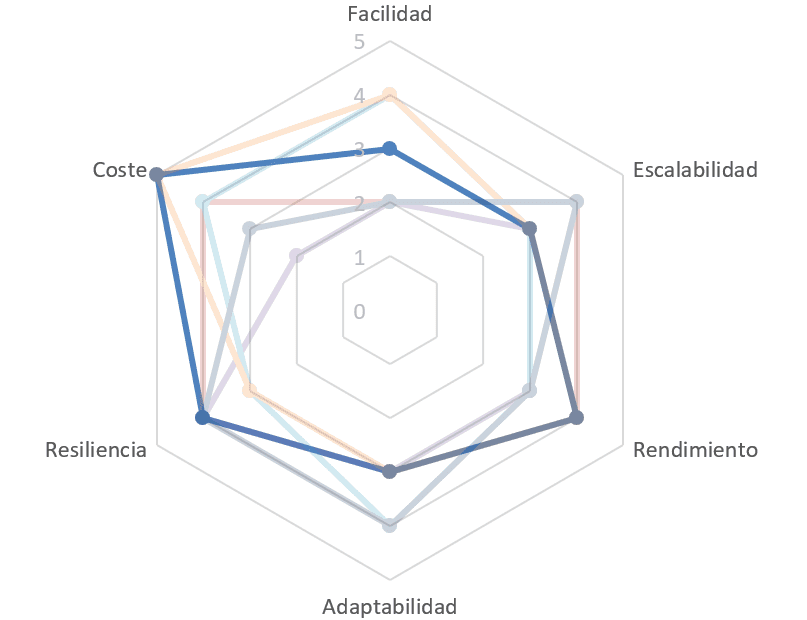

**Cuándo sí / no**  
– Úsalo para evitar cascadas de fallos en sistemas distribuidos.  
– No si todos tus servicios son siempre confiables o es una app monolítica.

**Casos**: microservicios críticos como pagos, backend integrados.  
**Pros**: resiliencia, responde de forma inmediata ante fallos consecutivos, protege recursos.  
**Contras**: necesita tuning, puede degradar UX si abre injustamente.

**Combina con**: [Bulkhead](#bulkhead), Retry, Service Mesh.

### \[F/2\] **Bulkhead Pattern**

**Año**: ~2015  
**Creador**: Inspirado en compartimentación naval  
**Descripción**  
Inspirado en la compartimentación de barcos, este patrón divide los recursos del sistema (hilos, conexiones, memoria) en secciones aisladas. Si una parte del sistema sufre una sobrecarga o fallo, el resto sigue operando normalmente. Aumenta la resiliencia limitando el alcance de fallos.

**Cuándo sí / no**  
– Útil si ciertos módulos pueden sobrecargarse sin arruinar todo.  
– No si todo el sistema es simple o centralizado.

**Casos**: sistemas con colas, carga variable, funciones críticas.  
**Pros**: contención de fallos, mejora la resiliencia.  
**Contras**: puede desaprovechar recursos si la partición es excesiva, configuración compleja.

**Combina con**: Circuit Breaker, Sidecar, Ambassador.

### \[F/3\] **Sidecar Pattern**

**Año**: 2015+ (influencia Cloud-Native)  
**Creador**: Kubernetes ecosystem  
**Descripción**  
Consiste en desplegar un componente auxiliar junto a cada servicio principal, en el mismo entorno (por ejemplo, un pod en Kubernetes). Este sidecar ofrece funcionalidades técnicas como logging, configuración, métricas o proxies, sin modificar el código de la aplicación. Facilita la estandarización y desacopla preocupaciones transversales.

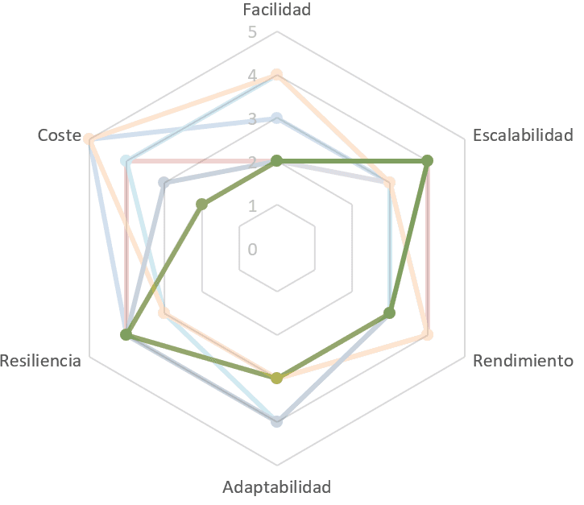

****Cuándo usar / cuándo no****  
– Ideal para funcionalidad infra no embebida (telemetría, config).  
– No si suma complejidad innecesaria o overhead.

**Casos**: service mesh (Istio), proxies, gestor de certificados.  
**Pros**: separación clara, reutilización, governance.  
**Contras**: coordinación de múltiples contenedores, troubleshooting adicional.

**Combina con**: Ambassador, Circuit Breaker, [Bulkhead](#bulkhead).

### \[F/4\] **Ambassador Pattern**

**Año**: 2015+ (patrones modernos en microservicios)  
**Creador**: Adaptado de patrones de sidecar, formalizado en microservicios modernos  
**Descripción**  
Un componente intermedio que actúa como proxy entre un servicio y el exterior. Gestiona tareas comunes como autenticación, retries, logging o TLS sin afectar el núcleo del servicio. Permite desacoplar la lógica de comunicación y mejorar la observabilidad en entornos distribuidos.

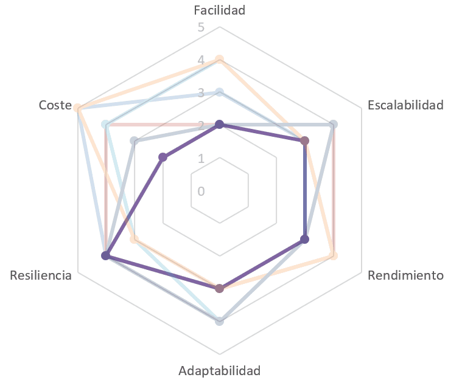

****Cuándo usar / cuándo no****  
– Úsalo cuando hay lógica cross‑cutting en la comunicación (retries, mTLS).  
– Evita si no necesitas intermediarios o el overhead es excesivo.

**Casos reales**: microservicios que necesitan balanceo inteligente o métricas centralizadas.  
**Pros**: simplifica lógica repetitiva, aislamiento por servicio, facilita observabilidad.  
**Contras**: añade latencia, despliegues extras y debugging más complejo.

**Combina con**: Sidecar, Circuit Breaker, Service Mesh.

### \[F/5\] **Proxy** (Patrón de Diseño)

**Año**: 1994 ([GoF](https://www.geeksforgeeks.org/system-design/gang-of-four-gof-design-patterns/))  
**Creador**: Gamma, Helm, Johnson, Vlissides ([GoF](https://www.geeksforgeeks.org/system-design/gang-of-four-gof-design-patterns/))  
**Descripción**  
Patrón clásico de diseño que encapsula otro objeto para controlar su acceso. Se usa para aplicar lógica adicional como validación, caché, control de concurrencia o lazy loading, sin modificar el objeto original. Es útil tanto en capas técnicas como en modelos de dominio.

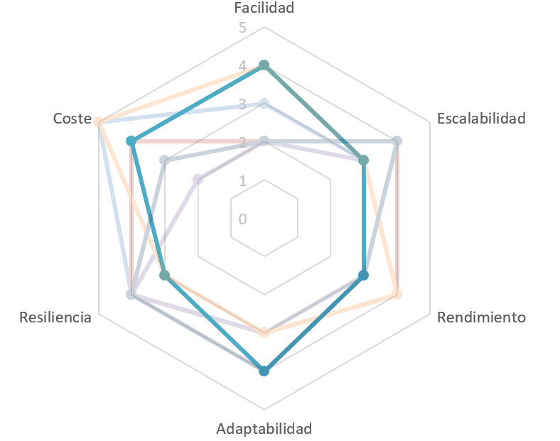

**Cuándo usar / cuándo no**  
Úsalo para añadir lógica cross-cutting sin modificar el objeto real. No necesario si no existen preocupaciones extra.  
**Casos de uso**: caching, validación, objetos remotos, seguridad.  
**Pros**: Centraliza control, mejora modularidad, fácil extensión.  
**Contras**: Añade complejidad y capas adicionales de llamada.  
**Referencias**:  
**Combinable con**: Facade, Microservicios, EDA.

> NOTA: Aunque ambos patrones (Proxy y Facade) fueron definidos por el [GoF](https://www.geeksforgeeks.org/system-design/gang-of-four-gof-design-patterns/), sus objetivos son distintos: uno controla acceso, el otro simplifica interfaz.

## \[F/6\] **Facade (Patrón de Diseño)**

**Año**: 1994 ([GoF](https://www.geeksforgeeks.org/system-design/gang-of-four-gof-design-patterns/))  
**Creador**: Gamma, Helm, Johnson, Vlissides ([GoF](https://www.geeksforgeeks.org/system-design/gang-of-four-gof-design-patterns/))  
**Descripción**  
Ofrece una interfaz simplificada que encapsula la complejidad de varios subsistemas o APIs. Reduce el acoplamiento y mejora la usabilidad desde el punto de vista del consumidor. Es ideal cuando necesitas exponer funcionalidades de forma coherente y controlada.

**Cuándo usar / cuándo no**  
Úsalo para simplificar acceso a APIs complejas. Evita si no existe complejidad que abstraer.  
**Casos de uso**: librerías, frameworks, módulos internos complejos.  
**Pros**: Reduce acoplamiento, mejora claridad, facilita testing.  
**Contras**: Puede convertirse en un god object si se abusa.  
**Referencias**:  
**Combinable con**: Microservicios, Hexagonal, Broker.

### **\[F/7\] Service Mesh**

**Año**: 2017+ (popularización con Istio, Linkerd)  
**Creador**: Google, Buoyant, Lyft (Envoy)  
**Descripción**  
Infraestructura dedicada que gestiona la comunicación entre servicios en entornos distribuidos sin tocar su código. Utiliza proxies sidecar para interceptar tráfico y aplicar políticas como mTLS, retries, trazabilidad o balanceo. Es clave en arquitecturas cloud-native que requieren observabilidad y control fino.  

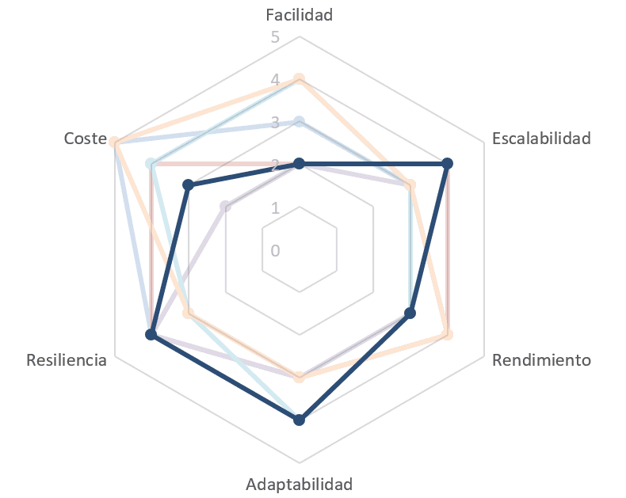

**Cuándo usar / cuándo no**  
\- Úsalo cuando trabajas con microservicios distribuidos y necesitas control fino del tráfico o visibilidad entre servicios.  
\- Evitalo si tu sistema es simple o no puedes asumir la complejidad operativa.

**Casos de uso**: entornos Kubernetes, gestión de tráfico entre microservicios, despliegues canary, seguridad con mTLS, y observabilidad distribuida con trazas (tracing) y métricas.

**Pros**: Seguridad reforzada, control de tráfico, trazabilidad completa, separación de concerns.  
**Contras**: Overhead de recursos, complejidad operativa, curva de aprendizaje alta.  
**Referencias**:  
**Combinable con**: Sidecar, Ambassador, Circuit Breaker, BFF, Microservicios.

### Tabla Comparativa

| Arquitectura | Facilidad | Escala | Rendim. | Adaptab. | Resil. | Coste |
| --- | --- | --- | --- | --- | --- | --- |
| Circuit Breaker | ★★★☆☆ | ★★★☆☆ | ★★★★☆ | ★★★☆☆ | ★★★★★ | ★★★★☆ |
| Bulkhead Pattern | ★★☆☆☆ | ★★★★☆ | ★★★★☆ | ★★★☆☆ | ★★★★★ | ★★★☆☆ |
| Sidecar Pattern | ★★☆☆☆ | ★★★★☆ | ★★★☆☆ | ★★★☆☆ | ★★★★☆ | ★★☆☆☆ |
| Ambassador Pattern | ★★☆☆☆ | ★★★☆☆ | ★★★☆☆ | ★★★☆☆ | ★★★★☆ | ★★☆☆☆ |
| Proxy | ★★★★☆ | ★★★☆☆ | ★★★☆☆ | ★★★★☆ | ★★★☆☆ | ★★★★☆ |
| Facade | ★★★★★ | ★★☆☆☆ | ★★★★☆ | ★★★★☆ | ★★★☆☆ | ★★★★★ |
| Service Mesh | ★★☆☆☆ | ★★★★☆ | ★★★☆☆ | ★★★★☆ | ★★★★★ | ★★☆☆☆ |

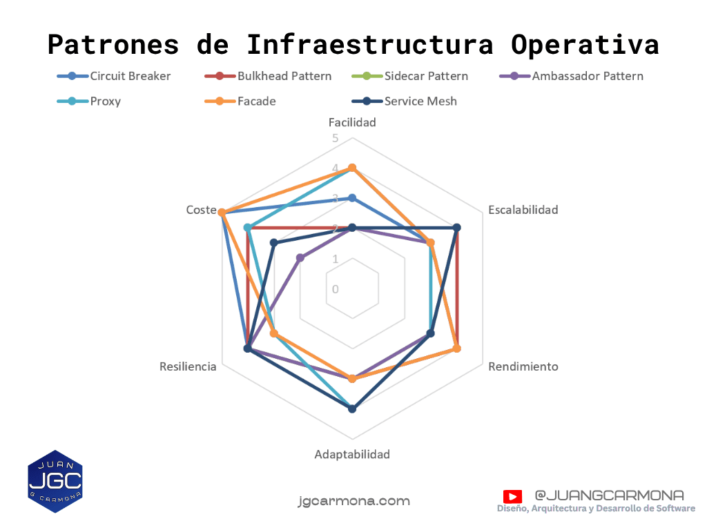

## Patrones que todo arquitecto debería dominar en 2025

No todos los patrones pesan lo mismo. Algunos son clásicos que siguen vigentes. Otros se han vuelto esenciales con la nube, la escalabilidad o el trabajo distribuido.

Si tuviera que elegir solo unos pocos para dominar en 2025, serían estos:

- **[CQRS](#cqrs) \+ [Event Sourcing](#event-sourcing)** → Separar lectura/escritura y modelar eventos es clave en sistemas modernos.

- **[Saga Pattern](#saga)** → Para gestionar transacciones distribuidas sin sacrificar resiliencia.

- **[Hexagonal Architecture](#hexagonal-architecture)** → Aísla dependencias y mejora la mantenibilidad a largo plazo.

- **[Circuit Breaker](#circuit-breaker) +** [**Bulkhead**](#bulkhead) → Dos pilares para la resiliencia real en producción.

- **[Strangler Fig](#strangler-fig)** → Si estás migrando un monolito, este patrón te puede salvar.

- [**BFF (Backend For Frontend)**](#bff) → Imprescindible si tienes múltiples interfaces de usuario.

- **[Microkernel](#microkernel)** → Ideal para plataformas que crecen por extensiones o plug-ins.

- **[Leader Election](#leader-election) y [patrones de coordinación distribuida](#distributed-coordination) (como [Saga](#saga) o [Event-Driven](#eda))** → Si trabajas con sistemas distribuidos, son básicos.

No necesitas implementarlos todos. Pero entender cómo funcionan, y cuándo usarlos, te hace mejor arquitecto.

Y si algo enseña la historia de estos patrones, es esto:

>   
> Cada uno nació para resolver un problema concreto. Copiar patrones sin entenderlos es tan peligroso como ignorarlos.

* * *

## Un vistazo histórico: patrones por año de aparición

Entender la evolución tecnológica también es entender cómo cambian las arquitecturas. Aquí tienes los 30 patrones ordenados (aproximadamente) por año de aparición, primera publicación o adopción significativa:

1970s → [Pipe-and-Filter](#pipe-and-filter)  
1978 → [MVC (SmallTalk)](#mvc)  
1980s → [Layered Architecture (Monolito)](#monolith), [Microkernel (Sistemas Operativos)](#microkernel)  
1990s → [Microkernel (Apps)](#microkernel), [Broker](#broker), [Peer-to-Peer](#p2p)  
1994 → [Proxy](#proxy), [Facade](#facade) ([GoF](https://www.geeksforgeeks.org/system-design/gang-of-four-gof-design-patterns/))  
1995 → [Reactor Pattern](#reactor), [N-Tier](#monolith)  
2000s → [Primary–Replica](#primary-replica), [Sharding](#sharding), [SOA](#soa), [Space-Based](#space‑based)  
2005 → [EDA](#eda), [Hexagonal Architecture](#hexagonal-architecture)  
2008 → [Blockchain](#blockchain)  
2010 → [CQRS](#cqrs)  
2012 → [Microservicios](#microservices)  
2015 → [BFF](#bff), [Circuit Breaker](#circuit-breaker), [Sidecar](#sidecar), [Ambassador](#ambassador), [Bulkhead](#bulkhead)  
2016 → [Saga Pattern](#saga), [Strangler Fig](#strangler-fig)  
2019 → [Micro Frontend](#micro-frontend)  
2020s → [Anti-Corruption Layer](#anti-corruption-layer) (repopularizado), [Leader Election](#leader-election) (en cloud-native), [ECB](#ecb) (renovado en DDD)
