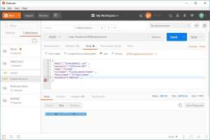
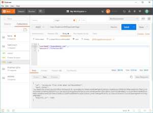
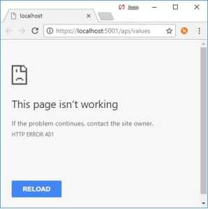
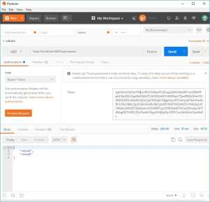
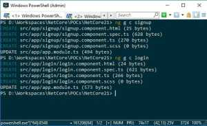
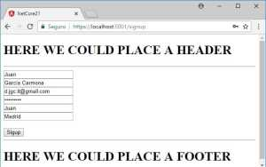
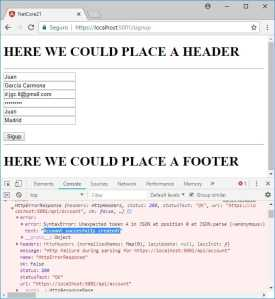
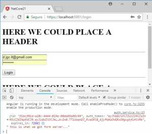
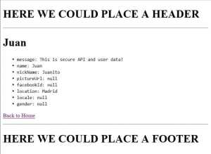
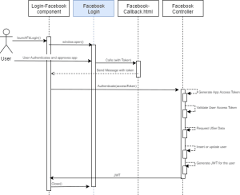

Siguiendo con el ejemplo del artículo anterior éste artículo pretende dar solución a un requisito habitual en cualquier aplicación web, la autenticación y autorización de usuarios. El desarrollo y aplicación de esta característica en nuestras aplicaciones web se puede enfocar de dos maneras:  

1. Delegar: es decir, usar un servicio externo que nos provea de todas las funcionalidades que necesitamos para gestionar tanto en el backend como en el frontend los procesos de registro, login y permisos, para lo cuál hay muchos proveedores entre los que cabe destacar [Auth0](https://auth0.com/).  
      
    He probado y usado Auth0 en varias aplicaciones con Angular y tengo que decir que es fácil de integrar ya que su documentación no sólo es extensa, cubre casi todas las casuísticas con multitud de lenguajes y frameworks, sino que es concisa y plagada de ejemplos basados en [repositorios de GitHub](https://github.com/auth0).
2. Desarrollar: ponernos manos a la obra e implementar en nuestro propio backend un servicio de autenticación/autorización. Para esto, nosotros que trabajamos con .NET, tenemos un framwork y ejemplos para implementar este servicio pero tengo que decir que, muy a mi pesar, la documentación es enrevesada y la traducción al castellano es pésima. Ya he desarrollado e implementado este tipo de servicios en el pasado pero quiero hacerlo desde cero, como si no supiera nada sobre el tema, y utilizar la página web del anterior artículo, basada en Angular 6 y ASP NET Core 2.1, para otorgarle esas típicas funcionalidades, registro, login y permisos... Pero, ¿por dónde empezar?

A la hora de desarrollar la seguridad de nuestras páginas web con ASP NET ( Core 2.1) el mejor punto de partida es, dentro de la [documentación oficial](https://docs.microsoft.com/en-us/aspnet/core/?view=aspnetcore-2.1), la [sección Security](https://docs.microsoft.com/en-us/aspnet/core/security/?view=aspnetcore-2.1), pero como decía la documentación es, quizá, demasiado extensa. El primer párrafo nos dice:

> ASP.NET Core enables developers to easily configure and manage security for their apps. ASP.NET Core contains features for managing authentication, authorization, data protection, SSL enforcement, app secrets, anti-request forgery protection, and CORS management. These security features allow you to build robust yet secure ASP.NET Core apps.

Veamos si es verdad. ¿Por donde empezamos? Bueno, pues lo primero que nos interesa es [ASP.NET Core Identity](https://docs.microsoft.com/en-us/aspnet/core/security/authentication/identity?view=aspnetcore-2.1) "a membership system which allows you to add login functionality to your application.".

  

Analicemos la situación, ¿qué necesitamos y cómo vamos a ir evolucionando? Tras analizar la documentación voy a dividir este proceso en 10 pasos:

1. Crearemos un **modelo**, es decir, definir qué atributos vamos a guardar para los usuarios de nuestra aplicación, incluso si vamos a tener varios tipos de usuarios. empecemos con algo tan básico como AppUser, es decir, usuarios de nuestra aplicación, Customer, es decir, esos usuarios como clientes, y Partner, esos usuarios como socios.

1. AppUser

1. Customer
2. Partner

3. Crearemos y configuraremos una **base de datos** donde almacenar toda esta información, ASP NET Core Identity usa Entity Framework y con EF podemos configurar diferentes tipos de almacenamiento, tanto SQL como No SQL (hay muchos ejemplos por ahí mostrando esto mismo con PostgreSQL o MongoDB). En éste ejemplo usaré EF con SQL Server (en un contenedor) y la creación inicial y las sucesivas modificaciones las gestionaré con Migrations.
4. Gestionar el registro desde el API (con el típico **AcountsController**), para empezar sólo con email, registro y ya.
5. Añadir **JWT, JSON Web Tokens**, para generarlos y autenticar a nuestros usuarios con ellos una vez hagan Login
6. Crearemos un **controlador protegido**, con [autenticación basada en claims](https://docs.microsoft.com/en-us/aspnet/core/security/authorization/claims)
7. Crearemos un **formulario de registro** **y** uno **de acceso** junto con las correspondientes llamadas al API
8. Crearemos un módulo de administración y un componente **profile** en el que aparecerán nuestros datos de usuario.
9. Protegeremos nuestras rutas con **AuthGuard** para que sólo los usuarios con ciertos permisos puedan acceder a ciertas 'zonas' de nuestro cliente.
10. Haremos llamadas autenticadas a nuestro API, verificando así que nuestra infraestructura de seguridad está lista para ser utilizada
11. Implementaremos la autenticación con **Facebook** aplicando todo lo anterior

Pues, tras terminar nuestra fase de análisis (que aquí parece que ha sido hecha al vuelo pero que en realidad me ha tenido leyendo documentación y artículos durante días, y no es la primera vez que abordo este tema) es momento de ponerse manos a la obra. Tengo que decir que este artículo me hubiera costado muchísimo más tiempo escribirlo si no hubiera sido por Mark Mcneil,(FullStack Mark), desde aquí gracias y un saludo.

  

### 0\. PAQUETERÍA

Para facilitar el trabajo a quien siga esta guía dejaré aquí la lista de PAquetes que han sido necesarios incluir en el proyecto.

#### 1 EL MODELO

Nuestras clases han de heredar de IdentityUser, que pertence a Microsoft.AspNetCore.Identity:

  

  
  

### 2.- LA BASE DE DATOS

Bueno, éste no es un artículo sobre EF, que podría escribir uno, y tengo que dar por hecho que si estás leyendo esto conoces EF, sabes lo que es un DbContext y conoces también los diferentes enfoques en cuanto a modelo, DB First, Model First o Code First. Lo que queremos hacer es, en base a modelo que hemos creado para nuestros usuarios, crear una base de datos que lo almacene (esto es Code First, pues hemos definido primero el modelo con código). PAra hacer esto vamos a crear un NetCore21DbContext que herede de IdentityDbContext<T> donde T será nuestro AppUser, además nuestro contexto tendrá dos DbSet, uno para customers y otro para partners.  
  
Nota: le he llamado NetCore21DbContext a propósito porque me gustaría crear una plantilla de solución que incluya todo esto dado un nombre, que reemplazará a NetCore21 en toda la solución.  
  
Además debemos registrar y configurar éste DbContext en nuestro Startup, en ConfigureServices como de costumbre:  
  
  
Ahora tenemos que crear nuestra base de datos y configurar nuestra cadena de conexión en appsettings.json. Para esto voy a usar un contenedor Docker, en el fondo es igual que tener SQL Server instalado solo que el contenedor apenas gasta recursos y lo para cuando ya no lo necesito.  
  
El siguiente paso es crear la migración de datos inicial y actualizar la base de datos, para lo cual hacen falta dos comandos:  
  

> **dotnet ef migrations add initial**

y  

> **dotnet ef database update**

Y ya está, ya podemos empezar a trabajar contra nuestra base de datos.

  

### 3.- ACCOUNTS CONTROLLER

Ahora llega la hora de la verdad, vamos a crear un controlador para gestionar las cuentas. Para ello éste controlador necesita varias cosas:  
  

- Un UserManager<T>, donde T serán nuestros AppUser, éste UseManager nos lo da AspNetCoreIdentity
- Nuestro DbContext
- Un mapeador, para lo que vamos a usar AutoMapper, hay otras librerías que también funcionan muy bien pero AutoMapper es la más extendida y sobre la que es más fácil encontrar soluciones.
- Un ViewModel para el registro, RegistrationViewModel suena bien, ¿verdad?

  

  

Además debemos añadir AutoMapper e IdentityCore a nuestros servicios en Startup.ConfigureServices y configurar el mapeo. Dejo el estado actual de Startup.cs un poco más abajo.  
  
Para probar todo esto tenemos dos opciones, usar Swagger, con lo que tendríamos que instalarlo y configurarlo en nuestra aplicación, creo que lo vamos a dejar para el final, o usar Postman... Como somos Full Stack developers entonces usaremos Postman, Postman es nuestro amigo, ¿verdad? Pues si está todo en orde y creamos un POST a localhost:5000/api/account con los datos que hayamos puesto en nuestro RegistrationViewModel entonces deberíamos tener una respuesta similar a esta:  

  

Ok, un logro más, vamos a ver qué aspecto tiene ahora Startup.cs:  
  
¿Notáis algún cambio? Pues es simple, he quitado toda referencia a la SPA, como decía en el anterior artículo, al generar toda la SPA en wwwroot nos podemos olvidar de que existe. Tiene ventajas e inconvenientes y ya os enseñaré como ha impactado en mis desarrollos... Nada crítico ni feo pero podría mejorar.  

###   

### 4.- JSON WEB TOKENS

La implementación de autenticación básica con JWT sobre una API web ASP.NET Core es bastante sencilla. La mayor parte de lo que necesitamos se encuentra en el middleware provisto por el paquete Microsoft.AspNetCore.Authentication.JwtBearer.  
  
Para comenzar, añadimos una clase JwtIssuerOptions y definimos las propiedades de las claims que contendrán nuestros tokens.  
  
También hay que añadir una sección en appsettings.json para poder configurar JwtOptions desde el método ConfigureServices de nuestro Startup.  
  
  
Después debemos configurar la validación de esos tokens, la autenticación y una política de autorización, es decir, crearemos nuestro propio middleware dentro de ConfigureServices así:

Esto es bastante común y haré el ejercicio de sacarlo a métodos de extensión, no sólo ésta parte sino los diferentes bloques que hemos ido añadiendo a nuestro ConfigureServices, por legibilidad y por potencial reutilización.  
  
¿Qué nos falta? Bueno, nos falta tener una manera de generar estos tokens para poder intercambiarlos entre backend y frontend, algo que deberá ocurrir durante el login, es decir, el último paso durante la autenticación es devolverle al cliente un token con sus permisos, su autorización, para que éste pueda usar dicho token en sucesivas llamadas y poder así en el backend autorizarlas (o no). PAra esto vamos a crear una clase, TokenGenerator, que tendrá ésta misión. para esto además nos hace falta una JwtFactory y su correspondiente interfaz. (No nos olvidemos de inyectarla, por cierto)  
  
Este es un buen momento para volver a agradecer públicamente a **[Mark Macneil (FullStack Mark)](https://fullstackmark.com/)** por su artículo y por código al respecto de éste tema, no sé cuanto hubiera tardado sin su ayuda. Como punto de partida la verdad es que ha sido una ayuda inmejorable.  

###   

### 5.- LOGIN CON CLAIMS

Bueno, parece que ésto se mueve, hemos registrado un usuario con nuestro account controller y ahora tenemos una manera de autorizar a nuestros usuario, es momento de crearnos nuestro AuthController junto con su correspondiente CredentialsViewModel.  
  
  
¿Lo probamos? Vamos a probarlo con Postman:  
  

Pues ahí tenemos nuestro token, token con el que teóricamente podremos autorizar llamadas a nuestra API, vamos con ello.  

###   

### 6.- PROTEGER EL API 

Como hemos visto antes en nuestro Startup hemos establecido una política de autorización pero para que ésta se aplique hay que indicarlo explícitamente en nuestros controladores mediante el uso del atributo \[Autorize(Policy=...)\]. Vamos a modificar el tan famoso ValuesController para que sólo puedan acceder a él usuarios autorizados, para lo cuál añadiremos   \[Authorize(Policy = "ApiUser")\]. ¿Qué pasa si lo llamamos ahora?  

  
Pues que como esperábamos hemos obtenido un error 401, que no es otra cosa que un "Unauthorised". Perfecto. ¿Y si nos autenticamos primero y usamos un token? (Es decir, llamamos a login y metemos el token en el header de la siguiente llamada en Postman)  
  

  

Genial! Ya podemos ponernos a jugar con el frontend, que ya apetecía cambiar de ámbito un rato. Vamos al lío.

  

### 7.- SIGNUP Y LOGIN

Bueno, si y no, quiero decir, hasta este momento nuestra aplicación es muy sencilla, de hecho no hay nada modularizado, está todo en nuestro app.component.ts, pero bueno, es un buen punto de partida pues si recordáis para lo único que habíamos usado Angular CLI fue para crear la aplicación, con routing y con scss  (ng new NetCore21 --routing --style=scss.  
  
Vamos a empezar generando dos componentes, uno para el registro, sigup, otro para el login y otro para el home de nuestra app.  
  

- ng g c signup
- ng g c login
- ng g c home

  

  

Podemos modificar app.component.html para incluir nuestro router-outlet, es decir, donde se irán cargando los diferentes componentes de acuerdo a la ruta, y dejar algo parecido a esto:  
  
Tenemos que añadir las rtutas a nuestros componentes, en app.routing.component.ts, que quedará de esta forma:  
  
Ahora podemos lanzar la aplicación y ver que podemos ir navegando a home a login y a signup y el contenido de dichos componentes se carga correctamente. Y como creo que lo mejor es seguir el orden lógico de este proceso, vamos a desarrollar el proceso de reguistro.  
  

- signup.component.html tendrá el formulario html
- signup.component.ts recogerá los datos del formulario, creará un objeto Signup y se lo pasará a auth.service 
- Signup.model.ts contendrá la clase con los datos que pasaremos al servicio de auth, el análogo a ResgistrationViewModel pero del lado del cliente.
- auth.service.ts será el encargado de, teniendo un objeto con los datos necesarios, llamar al API

  

Veamos como se comporta:

  

  

  

Bueno, necesita mejorar pero como primer paso nos vale, ahora vamos a por el formulario de login. igual que antes tendremos:  

- login.component.html con el formulario html
- login.component.ts para gestionar el submit del formulario y llamar a auth.service
- una clase que contendrá los datos de login, user y password, 
- auth.service.ts con un método de login para llamar al API

  

Y al probarlo el resultado es el siguiente:  

Como vemos ya podríamos gestionar nuestro token del lado del cliente para autenticar sus llamadas a nuestro API...  
  

### 8.- PROFILE & ADMIN AREA

Hasta aquí todo ha sido muy básico y en éste paso haremos unas cuantas modificaciones sobre lo que ya teníamos, a saber:  

- DashboardController pasará a convertirse en ProfileController porque lo que queremos de él es que nos dé información de los perfiles de nuestros usuarios, y como antes lo seguimos protegiendo con el atributo \[Authorize(Policy = "ApiUser")\]
- Crearemos un componente Profile que, dado un UserProfile, nos muestre sus propiedades
- Crearemos un módulo Admin con un componente dashboard, de momento vacío 
- Añadiremos las rutas de profile y de admin en app-routing.module.ts
- Modificaremos el servicio de auth para que:

- Al reguistrarnos nos envíe a login
- Al hacer login guarde los datos de sesióin en LocalStorage y nos envíe a profile
- Al coger el perfil lo devuelva si ya lo tenía o lo pida a nuestro ProfileController protegido

Así ha quedado nuestro código:

  
Y esto es lo que obtenemos tras hacer login:  

Llegados hasta aquí, guardaremos todos estos cambios y seguiremos...  

###   

### 9.- PROTEGER LAS RUTAS

En este paso:

- Crearemos nuestro AuthGuard, auth.guard.ts
- Expondremos isLoggedIn desde nuestro AuthService
- Utilizaremos AuthGuard para establecer si se pueden activar ciertas rutas en nuestra aplicación, admin y profile
- Mostraremos los enlaces de Login y Signup o un botón de logout de acuerdo al estado del usuario en nuestro Home...

Y lo haremos con éstos cambios:

  

### 10.- LOGIN CON REDES SOCIALES (Facebook)

Ésta último paso supone una vuelta de tuerca a todo lo que hemos hecho hasta ahora y revisar y pasar sobre casi todos los pasos, vamos a desarrollar el lgin con Faceboo:

- Necesitamos unas settings con nuestras credenciales de Facebook como aplicación, settings que estarán en appsettings.json y que inyectaremos desde Startup
- Necesitamos también ciertas clases de modelo de Facebook para contener el App Access Token, y los datos de usuario
- Necesitamos crear nuestra app en Facebook (este paso no lo voy a explicar, hay muchos tutoriales de cómo hacerlo y es realmente fácil)
- Crearemos un nuevo controlador, FacebookController, para gestionar en él la autenticación con Facebook
- Crearemos también un componente para el login con Facebook, muy simple, un botón que abre la ventana de Login con Facebook y un manejador de respuesta para gestionar el mensaje producido por el callback
- Una página estática con el javascript que generará el mensaje que necesitamos gestionar una vez nos llegue el callback de Facebook, página que debemos incluir como asset en nuestro angular.json
- Modificaremos AuthService para que también incluya el Login Con Facebook

El proceso de autentoicación con Facebook (y es similar con otras redes sociales) consiste en:

1. El usuario decide que quiere hacer Login con Facebook (hace click en el correspodiente botón)
2. Se abre una nueva ventana que lleva al usuario a logarse en Facebook
3. Si el login es correcto facebook llama a una url establecida por nosotros, una página dedicada para el callback, con el access token cmo parámetro en la URL
4. Esa página recoige el access token y lo publica como mensaje para que el componente lo reciba
5. Una vez recibido el mensaje se puede enviar ese access token al servidor, a FacebookController (a través de AuthService)
6. Facebook Controller:

1. genera las credenciales de nuestra aplicación gracias a ñlas settings, con el ClientId y el Secret
2. Verifica el Access Token del usuario
3. Recupera el perfil del usuario
4. Verifica si ya existía en nuestra DB y si no existía lo crea (nos vale como registro)
5. Genera un JWT para que la app web siga el flujo normal de autenticación autorización
6. Devuelve dicho token

8. La app, igual que antes, se guarda en el local storage dicho token para poder hacer llamadas autenticadas a nuestro API, llamadas como GetProfile, además, si todo ha ido bien cierra la ventana de Facebook

Puede parecer enrevesado, la verdad es que creo que en este punto merece la pena tener un pequeño diagrama de secuencia que explique un poco los pasos, a veces una imagen vale más que mil palabras.

  

Hay mucho código en este paso, sólo voy a dejar aquí lo más relevante, FacebookController.cs, auth.service.ts y facebook-auth.html:

  

  

  

  

### FINAL WORDS

Y de momento para éste artículo eso es todo, a ésta aplicación le queda muchísimo por hacer, por ejemplo:

- La estructura del proyecto necesita mejorar, habría que empezar a extraer librerías uqe pueden ser reutilizables por otros proyectos
- Hacen falta Tests Unitartios, los que me conocéis ya sabéis que soy muy maniático con éste tema y durante el tiempo que me ha llevado escribir este artículo me he centrado en la funcionalidad dejando a un lado la calidad, es momento de centrarse en la calidad.
- Hablando de calidad hay que trabajarla también en el cliente, por ejemplo, las llamadas al API desde el cliente sólo contemplan los casos buenos y no se están manejando las excepciones o los errores adecuadamente.
- Me gustaría también pasar todo este código por SonarQube para medir la deuda técnica y los code smells, quizá debería ser el primer paso y, según escribo creo que podría ser otro artículo muy iunteresante.
- Por otro lado la gestión de roles y permisos está ahí, preparada, pero hasta el momento no lo hemos utilizado para nada.
- La cantidad de datos que se obtienen del perfil de Facebook podría crecer
- La apariencia del cliente es demasiado básica, por decirlo de alguna manera
- El auterefresco no funciona, todos los cambios que se hacen en el cliente necesitan que se ejecute manualmente ng build para ser vistos al refrescar, esto hay que resolverlo.
- Habría que incluir login con otras redes sociales como Google o Microsoft
- Además, toda esta prueba de concepto puede acabar convirtiéndose en una plantilla de proyecto de Net Core y de Visual Studio y permitir que cualquiera pueda generar toda estructura para sus proyectos y dedicarle tiempo a la parte de configuración para vincularlo con sus cuentas en Facebook o Google...

Veremos como evoluciona todo esto y qué sale en el siguiente artículo, aunque ya adelanto que me voy a enfocar en calidad, Docker y arquitectura más que en nueva funcionalidad. Espero que os haya gustado. Acabo de mergear todo el trabajo implementado durante este artículo a Master y le voy a cambiar el nombre al proyecto, va a pasar a llamarse NetCore21.... Podéis seguir su evolución aquí: [https://github.com/JuanGarciaCarmona/NetCore21](https://github.com/JuanGarciaCarmona/NetCore21) 

  

Por supuesto, si os ha gustado y lo compartís os lo agradezco y si tenéis dudas, sugerencias, comentarios, quejas... Ya sabéis dónde estoy.

  

Un saludo,

  

  

Juan
