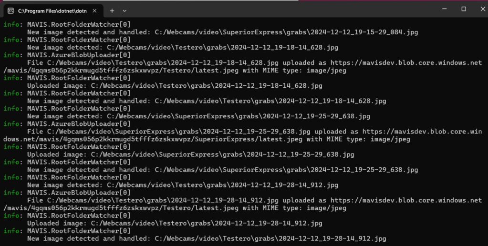
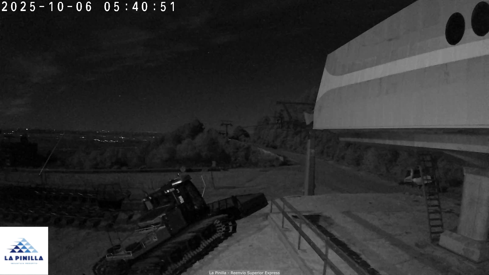

En la estación de esquí ****[La Pinilla](https://lapinilla.es/)****, situada en Segovia, están trabajando para mejorar su sistema de cámaras web. El año pasado intentaron implementar un sistema de streaming, pero las dificultades con la conectividad hicieron que no funcionara como esperaban. Por eso, ahora estamos desarrollando una solución más sencilla y robusta para que puedan mostrar imágenes actualizadas en su página web de manera eficiente.

El plan consiste en que las cámaras suban fotos a un servidor local, y desde ahí, utilizando **[MAVIS](https://github.com/juangcarmona/mavis)**, automatizamos la subida de estas imágenes a **Azure Blob Storage**. Uno de los retos ha sido evitar los problemas de caché que suelen surgir en WordPress, especialmente con plugins como Jetpack o servicios CDN.

Este artículo te explico cómo estamos utilizando ****[MAVIS](https://github.com/juangcarmona/mavis)**, una herramienta que he desarrollado especialmente para esto y cuyo código he liberado** para resolver este problema, integrando imágenes actualizadas en tiempo real sin complicaciones de caché.

* * *

### **¿Qué es MAVIS?**

**[MAVIS](https://github.com/juangcarmona/mavis)** es una herramienta CLI escrita en .NET que:

- Monitoriza carpetas locales en busca de nuevos archivos.

- Sube automáticamente los archivos detectados a Azure Blob Storage.

- Mantiene una copia actualizada llamada `latest.jpeg` para cada cámara.

Es ideal para flujos de trabajo donde se necesiten actualizaciones automáticas y constantes, como la publicación de imágenes de cámaras en una web.

* * *

### **Por qué Usar **[MAVIS](https://github.com/juangcarmona/mavis)****

- **Simplicidad total**: Se configura una vez y funciona automáticamente.

- **Automatización completa**: Detecta archivos nuevos y los gestiona en tiempo real.

- **Perfecto para WordPress**: Resuelve los problemas de caché al mostrar imágenes siempre actualizadas.

* * *

### **Guía Paso a Paso para Usar **[MAVIS](https://github.com/juangcarmona/mavis)****

#### **1\. Instalación**

1. Clona el repositorio desde GitHub:  
    👉 [https://github.com/juangcarmona/mavis](https://github.com/juangcarmona/mavis)

3. Ejecuta el script de instalación desde PowerShell:`.\install.ps1`

5. Reinicia tu terminal para que el comando `mavis` esté disponible globalmente.

* * *

#### **2\. Configuración**

******[MAVIS](https://github.com/juangcarmona/mavis)****** necesita un archivo `appsettings.json` para gestionar las credenciales de Azure y los ajustes básicos. Este archivo debe estar en el mismo directorio que el ejecutable.

Ejemplo de configuración:

```
{  "AzureBlobStorage": {    "ConnectionString": "DefaultEndpointsProtocol=https;AccountName=mavisdev;AccountKey=***;EndpointSuffix=core.windows.net",    "ContainerName": "mavis",    "MavisKey": "unique_key_example"  },  "Logging": {    "LogLevel": {      "Default": "Information"    }  }}
```

* * *

#### **3\. Ejecución**

Para iniciar ****[MAVIS](https://github.com/juangcarmona/mavis)**** y monitorizar una carpeta, utiliza el siguiente comando:

```
mavis -r "C:/path/to/cams"
```

- **`-r`**: Define la carpeta raíz que MAVIS monitorizará (en este caso, `cams`).

- **\-s:** Define un patrón de sub carpetas, en mi caso Agent DVR, para cada cámara, crea varias carpetas y las capturas de pantalla van a la carpeta grabs. Este parámetro es opcional.

- **\-h:** Define si queremos guardar el histórico en la nube o no, el parámetro es opcional, es decir, sólo guarda el histórico si, explícitamente, indicamos -h

* * *

#### **4\. Monitorización en Tiempo Real**

MAVIS se encarga de detectar nuevos archivos y subirlos automáticamente a Azure. También mantiene una copia actualizada de cada cámara llamada `latest.jpeg`. Verás un mensaje como este en la terminal:

```
Monitoring root folder. Press Ctrl+C to exit.
```

¿Qué hace ****[MAVIS](https://github.com/juangcarmona/mavis)****?

- Escanea la carpeta raíz y detecta nuevas imágenes.

- Sube las imágenes con nombres únicos basados en la fecha y hora (`image_YYYYMMDDHHmmss.jpg`). (Si, y sólo si, se ha ejecutado con el flag -h)

- Actualiza el archivo `latest.jpeg` para cada cámara.



* * *

### **Integración con WordPress**

Uno de los retos al integrar ****[MAVIS](https://github.com/juangcarmona/mavis)**** con WordPress es evitar problemas de caché. Los plugins como **Jetpack** (con su función de aceleración de imágenes) interceptan las URLs y almacenan versiones antiguas, haciendo que la web no refleje los cambios en tiempo real.

* * *

#### **El Problema**

Jetpack utiliza su CDN para optimizar imágenes, sirviendo versiones antiguas de `latest.jpeg` incluso cuando el archivo en Azure ha sido actualizado. Esto puede generar inconsistencias en lo que el usuario final ve en la web.

* * *

#### **La Solución**

Para evitar este problema, añadimos un filtro en WordPress que excluye `latest.jpeg` del procesamiento de Jetpack, permitiendo que siempre se sirva directamente desde Azure Blob Storage.

1. Ve a **Apariencia > Editor de Temas** o utiliza un plugin como **Code Snippets**.

3. Añade el siguiente código en el archivo `functions.php` o en el snippet:

```
add_filter( 'jetpack_photon_skip_image', function( $skip, $image_url ) {    // Skip caching for latest.jpeg    if ( strpos( $image_url, 'latest.jpeg' ) !== false ) {        return true;    }    return $skip;}, 10, 2 );
```

3. Guarda los cambios.

* * *

#### **Resultado**

Con este filtro, Jetpack deja de procesar `latest.jpeg` y WordPress sirve la imagen directamente desde Azure, asegurando que siempre muestra la versión más reciente.

Ejemplo de URL funcional:

```
https://mavisdev.blob.core.windows.net/mavis/4gqms056p2kkrmugd5tfffz6zskxwvpz/cam1/latest.jpeg
```

* * *

Estas dos imágenes se corresponden a las dos primeras cámaras que hemos configurado hoy, una en Grand Plató, en el reenvío del telesilla Superior Express, y otra colocada en el renvío del Telesilla Testero.

 

 

* * *

# **MAVIS A PRUEBA DE REINICIOS**

Para facilitar la puesta en marcha de este mecanismo en el servidor de **[La Pinilla](https://lapinilla.es/)** (y, potencialmente, en tu servidor), he incluido un archivo batch (`start_mavis.bat`) en el repositorio que permite iniciar automáticamente MAVIS cada vez que el sistema operativo arranca. Aquí tienes las instrucciones para configurarlo y personalizarlo.

* * *

### **¿Qué hace este archivo batch?**

El archivo batch (`start_mavis.bat`) está diseñado para:

1. **Ejecutar MAVIS automáticamente** utilizando el comando `dotnet`.

3. **Especificar una carpeta a monitorizar** (donde las cámaras guardan imágenes).

5. Configurarse en el inicio del sistema para que MAVIS sea persistente.

Contenido del archivo en el repositorio:

```
@echo offstart "" "C:\path\to\dotnet.exe" "C:\path\to\MAVIS.dll" -r "C:/path/to/cams"
```

* * *

### **Pasos para Configurarlo**

#### **1\. Descarga o Clona el Repositorio**

Primero, necesitas obtener todo el repositorio en tu servidor:

```
git clone https://github.com/yourusername/MAVIS.git
```

O bien, descarga el repositorio como un archivo ZIP desde GitHub, descomprímelo y colócalo en una carpeta en tu servidor.

#### **2\. Edita el Archivo Batch**

1. Ve al archivo `start_mavis.bat` dentro del repositorio clonado o descomprimido.

3. Ábrelo con un editor de texto (como Notepad).

5. **Personaliza las rutas**:
    - **Ruta de .NET (`dotnet.exe`)**:
        - Encuentra la ubicación de `.NET` en tu servidor. Generalmente está en:  
            `C:\Program Files\dotnet\dotnet.exe`
    
    - **Ruta de MAVIS (`MAVIS.dll`)**:
        - Define la ubicación del archivo DLL de MAVIS. Ejemplo:  
            `C:\MAVIS\MAVIS.dll`
    
    - **Carpeta de imágenes**:
        - Especifica la carpeta donde las cámaras guardan las fotos. Ejemplo:  
            `D:/Camaras`

Ejemplo de archivo configurado:

```
@echo offstart "" "C:\Program Files\dotnet\dotnet.exe" "C:\MAVIS\MAVIS.dll" -r "D:/Camaras"
```

* * *

#### **3\. Añade el Archivo Batch al Inicio del Sistema**

Para que MAVIS se ejecute automáticamente al arrancar el sistema operativo:

1. **Abre la carpeta de inicio**:
    - Presiona `Win + R`, escribe `shell:startup` y pulsa Enter.

3. **Copia el archivo**:
    - Arrastra el archivo `start_mavis.bat` desde la carpeta del repositorio hasta la carpeta de inicio.

5. **Reinicia el sistema**:
    - Al reiniciar, MAVIS debería ejecutarse automáticamente y empezar a monitorizar la carpeta especificada.

Este archivo batch, incluido en el repositorio de MAVIS, hace que la aplicación sea persistente y fácil de gestionar en servidores como el de **[La Pinilla](https://lapinilla.es/)**, automatizando la monitorización de imágenes sin necesidad de intervención manual. Solo necesitas personalizar el archivo y colocarlo en la carpeta de inicio.

¡Así de fácil puedes tener un sistema confiable y automático funcionando en minutos!

# **TU TAMBIEN PUEDES USARLO**

Gracias a **MAVIS**, he podido ayudar a **[La Pinilla](https://lapinilla.es/)** a resolver uno de sus problemas del año pasado y a tener un sistema de cámaras web más eficiente. Ahora pueden subir imágenes actualizadas en tiempo real, integrarlas con WordPress y evitar los típicos problemas de caché.

Si tú o tus clientes necesitáis un sistema similar para automatizar la subida de archivos a Azure y publicarlos en la web, MAVIS está disponible en GitHub:

👉 [**https://github.com/juangcarmona/mavis**](https://github.com/juangcarmona/mavis)

¡Pruébalo y hazlo tuyo! 🚀
