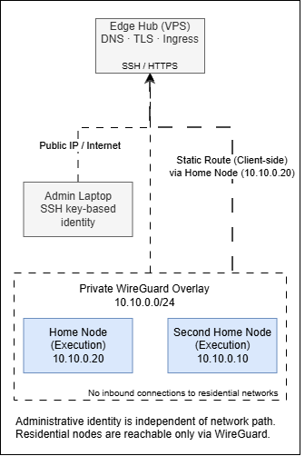

# Building a Sovereign Home Network

## From Edge VPS to Multi-Home Infrastructure

---

## 1. Purpose and Design Principles

This project documents the design and evolution of a personal, multi-home network built with the discipline of a small distributed system. The objective is full ownership of networking, services, and home automation across two physical locations, using a stable public edge and a private overlay network.

The system is designed to be:

* Predictable under normal operation
* Degraded but functional under partial failure
* Understandable by reading configuration alone

No part of the core system depends on third-party cloud services to operate.

### Intent

This is an infrastructure project, not an experiment. Each component has a defined role, a known failure mode, and a clear reason to exist. The network must survive restarts, outages, and time.

### Design Principles

**Local-first execution**
Services run where the devices and data live. Each house operates independently if isolated.

**Explicit architecture**
Topology, trust boundaries, and responsibilities are deliberate and documented. Nothing relies on implicit behavior.

**Minimal, composable tools**
A small set of technologies, used consistently:
WireGuard, Docker, systemd, Nginx, Unbound.

**Reproducibility**
Any node can be rebuilt from scratch using versioned configuration. No hidden state in UIs.

**Separation of concerns**
Networking, ingress, execution, and automation are isolated responsibilities.

**Operational stability**
Failures are expected. Blast radius is controlled. Recovery paths are known.

### Design Constraints

These constraints shape all decisions in later sections:

* Dynamic residential IPs
* NAT and ISP-controlled routers
* Low-power, always-on hardware
* Silent operation
* Human-readable configuration as the source of truth

These are not limitations to work around. They are inputs to the design.

---

## 2. High-Level Architecture Overview

The system is structured as a three-layer architecture: a public control edge, a private network overlay, and multiple execution environments.

Each layer has a single responsibility.

### Architectural Layers


### Logical Topology

* All nodes participate in a single private IP space
* Every node is addressable directly over the overlay
* No inbound connections are required at the homes

<!-- TODO:canonical-architecture-diagram
TYPE: diagram
SECTION: 2. High-Level Architecture Overview
DESCRIPTION:
Insert a comprehensive canonical architecture diagram showing all three layers (edge, overlay, execution), physical locations (VPS + 2 homes), control plane vs execution plane separation, and the logical relationships between components. This should be the definitive visual reference for the entire system.
-->

### Physical Locations

* One public VPS acting as edge hub
* Two private residential networks
* No direct trust between residential LANs

### Control Plane vs Execution Plane

**Control Plane**

* Public DNS
* TLS termination
* Reverse proxy
* Network coordination

**Execution Plane**

* Home automation
* IoT devices
* Cameras and sensors
* Local services

The edge coordinates access. It does not host stateful home services.

### Core Invariant

The edge is a facilitator. Each home is a peer. If the edge disappears, homes keep working. If a home disappears, the rest of the system remains intact. This separation is the backbone of the entire design.

## 3. The Edge Hub

The edge hub is a small public VPS with a static IP. Its role is coordination, not execution.

### Why an External Edge Is Required

Residential networks are unstable by nature: dynamic IPs, NAT, ISP firewalls. A public edge removes these constraints by providing a fixed, reachable anchor point for the entire system. The edge hub solves three problems:

* Stable ingress from the public internet
* A single authoritative point for DNS and TLS
* A network anchor for private networks behind NAT

Without it, every service would need ad-hoc exposure rules or external dependencies.

### Core Responsibilities

The edge hub is responsible for:

* Public DNS authority
* TLS certificate management
* Reverse proxy and ingress routing
* WireGuard endpoint and peer coordination

It holds no business logic, no home automation state, and no device control. This is why it can be small (and cheap).

<!-- TODO:edge-wireguard-interface
TYPE: code
SECTION: 3. The Edge Hub
DESCRIPTION:
Insert a minimal WireGuard interface configuration for the edge hub showing: interface name, private key reference, listening port, and IP address assignment. Sanitize any sensitive values.
-->

<!-- TODO:edge-nginx-server-block
TYPE: code
SECTION: 3. The Edge Hub
DESCRIPTION:
Provide a sanitized Nginx server block example demonstrating TLS termination and proxy_pass to a home node over the WireGuard overlay. Include server_name, ssl_certificate paths, and upstream proxy configuration.
-->

<!-- TODO:edge-control-plane-note
TYPE: text
SECTION: 3. The Edge Hub
DESCRIPTION:
Add an explicit note clarifying that the edge hub is control-plane-only: it routes traffic and terminates TLS but does NOT host stateful home services, device controllers, or automation logic. Emphasize this separation.
-->

---

## 4. Network Overlay: WireGuard as the Backbone

All nodes are connected through a private Layer-3 overlay built with WireGuard. This overlay is the network. Everything else assumes it exists.

### Addressing Scheme

A single private subnet is used:

```
10.10.0.0/24
```

Each node receives:

* One stable IP
* One cryptographic identity

IP addresses are assigned manually and documented. No dynamic allocation.

### Trust Model

Trust is explicit and peer-based.

* Each node has a unique key pair
* Peers are whitelisted by public key and IP
* No implicit trust through network location

If a key is not present, the node does not exist.

### Topology Decision

The overlay uses a hub-and-spoke model:

* Edge hub as the network anchor
* Homes initiate outbound connections only
* No inbound ports opened on residential routers

This simplifies NAT traversal and failure isolation.

Direct peer-to-peer links between homes are intentionally avoided.

### Key Management and Rotation

Keys are:

* Generated per node
* Stored outside the machines (password manager)
* Versioned alongside configuration

Rotation is manual and infrequent. Simplicity and auditability take priority over automation.

WireGuard is treated as infrastructure, not a dynamic service mesh.

<!-- TODO:wireguard-peer-config
TYPE: code
SECTION: 4. Network Overlay
DESCRIPTION:
Insert a WireGuard peer configuration example showing the connection between edge and one home node. Include: [Peer] block with PublicKey, AllowedIPs, Endpoint (for home→edge direction), and PersistentKeepalive settings.
-->

<!-- TODO:node-ip-mapping-table
TYPE: table
SECTION: 4. Network Overlay
DESCRIPTION:
Create a table mapping each node to its WireGuard IP and role. Columns: Node Name | WireGuard IP | Role (e.g., edge-hub | 10.10.0.1 | Edge/Proxy, home-primary | 10.10.0.10 | Execution Node, etc.). Sanitize actual hostnames if needed.
-->

<!-- TODO:hub-spoke-overlay-diagram
TYPE: diagram
SECTION: 4. Network Overlay
DESCRIPTION:
Insert a simplified hub-and-spoke network overlay diagram showing the edge hub in the center with bidirectional WireGuard tunnels to each home node. Label each link with the 10.10.0.0/24 subnet and show NAT boundaries at the homes.
-->

---

## 5. DNS Architecture

DNS is split into two clearly separated concerns: public resolution and private resolution.

### Public DNS

Public DNS is hosted in Cloudflare and is authoritative for the main domain.

It handles:

* Public records
* TLS validation
* External entry points

Only the edge hub is directly addressable via public DNS.

### Private DNS

Each home runs its own Unbound instance.

Private DNS handles:

* Internal hostnames
* Service discovery
* Overlay IP resolution

All private names resolve only inside the WireGuard network.

### Split-Horizon Strategy

The same domain is used publicly and privately, with different resolution paths.

* Public DNS resolves to the edge
* Private DNS resolves to overlay IPs

Clients always use the same hostname. Routing is decided by location, not configuration.


### Internal Domains

Each location has its own internal namespace, mapped to the same private network.

Examples:

* `home.lan`
* `second.lan`

> Examples shown here are illustrative; actual names follow the same pattern.

Names encode location and role. IPs remain stable.

DNS is part of the infrastructure, not an afterthought.

<!-- TODO:unbound-local-zone-config
TYPE: code
SECTION: 5. DNS Architecture
DESCRIPTION:
Insert an Unbound local-zone configuration snippet showing how private internal domains (e.g., home.lan, second.lan) are configured with local-data entries mapping hostnames to WireGuard overlay IPs.
-->

<!-- TODO:internal-hostname-resolution
TYPE: code
SECTION: 5. DNS Architecture
DESCRIPTION:
Provide an example of internal hostname resolution showing a hostname (e.g., homeassistant.home.lan) resolving to its overlay IP address (e.g., 10.10.0.10).
-->

<!-- TODO:split-horizon-dig-output
TYPE: example
SECTION: 5. DNS Architecture
DESCRIPTION:
Optional: Insert sanitized dig command output demonstrating split-horizon DNS in action—same hostname queried from outside the overlay (resolving to edge public IP) vs from inside the overlay (resolving to private overlay IP).
-->

---

## 6. Reverse Proxy and Ingress

The edge hub acts as the single public entry point to the system. All external web access terminates there.

Nginx runs on the edge hub and provides TLS termination, virtual host routing, and access control. No home node exposes services directly to the internet.

TLS is handled centrally. Certificates live only on the edge. Traffic between the edge and the homes is forwarded privately over the WireGuard overlay.

Routing is explicit:

* External clients reach services through the edge proxy
* Requests are forwarded to the appropriate home over the overlay
* Internal clients access services locally without traversing the edge

A service is publicly reachable only if it is explicitly routed at the edge and reachable over WireGuard. The default state is non-exposure.

The diagram below illustrates how Home Assistant instances remain local to each home while being accessible from anywhere through the edge reverse proxy.


<!-- TODO:nginx-virtual-host-example
TYPE: code
SECTION: 6. Reverse Proxy and Ingress
DESCRIPTION:
Insert a representative Nginx virtual host configuration showing: server block with TLS settings, location block with proxy_pass to an internal service over WireGuard overlay, and relevant proxy headers (Host, X-Real-IP, X-Forwarded-For, X-Forwarded-Proto).
-->

<!-- TODO:exposed-vs-private-services
TYPE: list
SECTION: 6. Reverse Proxy and Ingress
DESCRIPTION:
Create a small explicit list distinguishing intentionally exposed services (e.g., Home Assistant web UI, specific cameras) from private-only services (e.g., Zigbee2MQTT, internal databases, admin interfaces). Emphasize the default-deny posture.
-->

---

## 7. Home Node: Primary Residence

The primary home node is the main execution environment for daily automation and local services. It is designed to be silent, reliable, and permanently online.

### Hardware Profile

**Intel NUC 13 Pro (Arena Canyon, Slim)**

* CPU: Intel Core i5-1340P (12 cores: 4P + 8E)
* RAM: 32 GB DDR4
* Storage: 1 TB NVMe SSD
* Network: Wi-Fi 6E, 2.5 GbE
* I/O: Thunderbolt 4, multi-display (up to 8K)
* Form factor: fan-cooled, silent under normal load

This node runs **Debian** with no vendor tooling or preinstalled OS layers.

The hardware is intentionally overprovisioned for current needs to ensure long-term stability and headroom.

### Role in the Network

This node acts as:

* A full WireGuard peer
* A local execution node
* The primary Home Assistant host for the residence

It does not act as a router, gateway, or shared dependency for other locations.

### Always-On Services

Typical workloads include:

* Home Assistant (core automation)
* Zigbee2MQTT
* Local DNS resolver
* Supporting Docker services

All services are bound to the local LAN and the private overlay only.

### Constraints

Design decisions are shaped by the environment:

* Silent operation is mandatory
* Power consumption must stay low
* Physical proximity to Zigbee coordinators is required

The hardware fits the house. The house does not adapt to the hardware.

<!-- TODO:hardware-comparison-table
TYPE: table
SECTION: 7 & 8. Home Nodes
DESCRIPTION:
Insert a side-by-side hardware comparison table for primary and secondary home nodes. Columns: Spec | Primary Node (NUC 13 Pro) | Secondary Node (NUC 8). Rows: CPU, RAM, Storage, Network, Form Factor, Power Profile, OS.
-->

<!-- TODO:node-system-info-screenshot
TYPE: screenshot
SECTION: 7 & 8. Home Nodes
DESCRIPTION:
Optional: Insert a neofetch or htop screenshot from one of the home nodes showing system information, uptime, resource usage, and running processes. Sanitize any sensitive hostnames or IPs.
-->

---

## 8. Secondary Home Node

The secondary home node follows the same architectural rules as the primary one. It is not a backup or a remote extension. It is an independent site.

### Hardware Profile

**Intel NUC Pro Chassis with NUC 8 Compute Element**

* CPU: Intel Core i5-8365U
* RAM: 8 GB
* Storage: 256 GB SSD
* Network: Dual Gigabit Ethernet
* Video: 2× HDMI
* Wireless: Wi-Fi 5, Bluetooth 5.1
* Platform features: Intel vPro

This node also runs **Debian**, aligned with the rest of the system.

The hardware is older but stable, enterprise-oriented, and sufficient for its workload.

### Why the Second Home Is First-Class

Each home is modeled as:

* A separate failure domain
* A separate automation context
* A full peer in the private network

There is no primary–secondary hierarchy at the architectural level.

### Symmetry vs Specialization

Both home nodes share:

* The same OS
* The same network model
* The same operational practices

Differences exist only where the physical environment requires them: devices, automations, and resource limits.

### Latency, Availability, and Autonomy

Each home:

* Operates locally with minimal latency
* Continues functioning when isolated
* Exposes services independently through the edge

Cross-home communication is optional. Autonomy is mandatory.

---

## 9. Service Orchestration Model

Services run in Docker. The host stays boring and stable, containers carry the variability. Each node uses systemd to start and stop Compose stacks as first-class services, so boot, shutdown, restarts, and failures are visible and deterministic.

Kubernetes is out because it would become the project. This network needs predictable lifecycle management, not scheduling, autoscaling, or an orchestration control plane.

Layouts are consistent: one directory per stack, configuration committed, state stored explicitly, names encode role and location. That consistency is what makes rebuilds and audits possible. Implementation details deserve their own article; comments and PRs are welcome.

<!-- TODO:systemd-docker-compose-unit
TYPE: code
SECTION: 9. Service Orchestration
DESCRIPTION:
Insert a systemd service unit file example that manages a Docker Compose stack. Include: Unit description, dependencies (After=docker.service), ExecStart with docker compose up, ExecStop with docker compose down, and Restart policy.
-->

<!-- TODO:srv-services-directory-tree
TYPE: example
SECTION: 9. Service Orchestration
DESCRIPTION:
Provide a directory tree example for /srv/services showing the consistent layout: each service as a subdirectory containing docker-compose.yml, .env or config files, and optional data/ or logs/ directories. Example: /srv/services/homeassistant/, /srv/services/zigbee2mqtt/, etc.
-->

<!-- TODO:future-orchestration-article-link
TYPE: link
SECTION: 9. Service Orchestration
DESCRIPTION:
Add a placeholder link to a future detailed article on service orchestration patterns, systemd integration, and rebuild procedures. Use format: "[Detailed service orchestration guide →](TODO-future-article-url)"
-->

---

## 10. Home Assistant as a Distributed System

Home Assistant runs as one instance per house. Each instance owns its devices, automations, and state. Isolation is intentional: a house continues operating if the edge is down, if the other house is down, or if the overlay is down.

What is shared is the mental model: naming, dashboards, modes, and conventions. What is not shared is execution. That keeps failure domains clean and troubleshooting local.

<!-- TODO:ha-instances-diagram
TYPE: diagram
SECTION: 10. Home Assistant
DESCRIPTION:
Insert a diagram showing two independent Home Assistant instances, one per house, each connected to its local Zigbee network and local devices. Show the overlay network connecting both but emphasize no state synchronization between instances.
-->

<!-- TODO:ha-non-synchronized-items
TYPE: list
SECTION: 10. Home Assistant
DESCRIPTION:
Create an explicit list of items that are intentionally NOT synchronized between Home Assistant instances: device state, automation triggers, history database, sensor data, Zigbee bindings. Explain why isolation is a feature, not a limitation.
-->

---

## 11. Zigbee and Local Device Control

Zigbee stays local. Each house has its own Zigbee network and its own coordinator connected to its local node. Zigbee2MQTT is the bridge: it exposes devices to Home Assistant and defines a hard boundary for troubleshooting and recovery.

Coordinator placement is physical engineering: close to devices, away from interference, treated as a per-house dependency. Centralizing Zigbee across locations is rejected on latency, reliability, and RF constraints.

<!-- TODO:zigbee2mqtt-minimal-config
TYPE: code
SECTION: 11. Zigbee
DESCRIPTION:
Insert a minimal Zigbee2MQTT configuration.yaml snippet showing: MQTT connection settings, serial port for Zigbee coordinator, network channel and pan_id, and basic permit_join settings. Sanitize sensitive values.
-->

<!-- TODO:zigbee-rf-domain-diagram
TYPE: diagram
SECTION: 11. Zigbee
DESCRIPTION:
Insert a diagram showing two separate Zigbee RF domains (one per house), each with its own coordinator connected to the local node. Illustrate that Zigbee devices in House A cannot communicate with devices in House B at the RF level.
-->

<!-- TODO:zigbee2mqtt-device-list-screenshot
TYPE: screenshot
SECTION: 11. Zigbee
DESCRIPTION:
Optional: Insert a Zigbee2MQTT frontend screenshot showing the device list for one house, including device names, types (sensor, bulb, switch), and connection status. Sanitize any identifying information.
-->

---

## 12. Cameras, Sensors, and Local Video

Sensors and video ingest locally. Events and automation signals are lightweight and persistable; streams are heavy and transient. Treating them differently keeps the system responsive and avoids turning storage and bandwidth into the bottleneck.

Remote viewing does not require vendor clouds. Access is provided through the edge and the overlay, and only for services explicitly exposed.

<!-- TODO:camera-event-vs-stream-diagram
TYPE: diagram
SECTION: 12. Cameras and Video
DESCRIPTION:
Insert a diagram showing the two distinct data paths: (1) Event path: motion detection → local processing → Home Assistant automation trigger; (2) Stream path: video feed → local storage or real-time view. Emphasize local processing and differentiate persistent vs transient data.
-->

<!-- TODO:video-data-retention-list
TYPE: list
SECTION: 12. Cameras and Video
DESCRIPTION:
Create an explicit list distinguishing retained data (e.g., motion event timestamps, snapshots, 7-day clips) from discarded data (e.g., continuous 24/7 streams, pre-event buffers, streams not triggering events). Explain storage and bandwidth trade-offs.
-->

---
## 13. Security Model

Security is based on explicit trust boundaries and minimal exposure. Every zone is assumed hostile by default.

Network access is granted only through the WireGuard overlay. Residential LANs do not trust each other. The edge does not trust homes beyond what is required for routing.

Firewall rules are simple and restrictive: deny by default, allow by exception. There are no wide rules, no implicit forwarding, no “temporary” openings that become permanent.

SSH access is key-based only. Keys are unique per node and stored outside the machines. Secrets and credentials live in a password manager and in configuration files only when strictly required. There is no secret material embedded in images or baked into containers.

Security is boring on purpose.

<!-- TODO:security-zone-trust-table
TYPE: table
SECTION: 13. Security Model
DESCRIPTION:
Create a table mapping security zones to trust levels and allowed access. Columns: Zone | Trust Level | Allowed Access | Default Policy. Rows: Public Internet, Edge Hub, WireGuard Overlay, Home LAN, IoT VLAN (if applicable).
-->

<!-- TODO:firewall-default-policy-example
TYPE: code
SECTION: 13. Security Model
DESCRIPTION:
Insert a firewall configuration snippet (iptables, nftables, or ufw) demonstrating the default-deny policy with explicit allow rules for WireGuard, local services, and edge-to-home forwarding. Comment each rule with its purpose.
-->

<!-- TODO:key-compromise-checklist
TYPE: checklist
SECTION: 13. Security Model
DESCRIPTION:
Provide a checklist of steps to take in a key compromise scenario: 1) Identify compromised node, 2) Revoke WireGuard public key, 3) Update peer configurations, 4) Regenerate key pair, 5) Redistribute new public key, 6) Verify connectivity, 7) Audit logs for suspicious activity.
-->

---

## 14. Remote Access Patterns

Remote access is designed around intent, not convenience.

Administrative access uses stable identities and controlled network paths. The edge hub is reachable both via its public IP and through the private overlay. The SSH identity is the same regardless of the path used.

Residential nodes are never exposed publicly. They are reachable only through WireGuard. There are no jump hosts inside the homes.

User access is mediated exclusively through the edge. Only explicitly exposed services are reachable, always via TLS and the reverse proxy.

Emergency access assumes degraded conditions. If the edge is unavailable, homes remain fully operable locally. If a home is unreachable, no action taken from another location can make it worse.

Administrative identity is independent of network path; WireGuard expands reachability, not permissions.

<!-- TODO:admin-ssh-command-example
TYPE: example
SECTION: 14. Remote Access Patterns
DESCRIPTION:
Insert a concrete admin SSH command example showing connection from outside to a home node via the edge using SSH ProxyJump or direct WireGuard access. Example: "ssh -J user@edge.example.com user@10.10.0.10" or "ssh user@10.10.0.10" (when already on overlay). Include explanation of authentication method.
-->

<!-- TODO:never-remotely-accessible-list
TYPE: list
SECTION: 14. Remote Access Patterns
DESCRIPTION:
Create an explicit list of what is NEVER remotely accessible: residential router admin interfaces, IoT device management pages, raw MQTT brokers, internal databases without authentication, Zigbee coordinator direct access, local-only debugging endpoints.
-->


---

## 15. Observability and Operations

Observability is pragmatic, not exhaustive.

Logs are local, readable, and retained long enough to diagnose issues. Containers log to standard output. systemd handles service state and restart visibility.

Health checks are coarse-grained. Services are either up or not. There is no alert fatigue, no metrics pipeline, no dashboards that require maintenance.

Recovery favors manual intervention. Automation is used only where failure modes are well understood. When something breaks, the system should fail clearly and recover predictably.

<!-- TODO:journalctl-systemctl-example
TYPE: example
SECTION: 15. Observability
DESCRIPTION:
Insert example commands for observability: "journalctl -u homeassistant.service -f" for tailing service logs, "systemctl status docker-compose@zigbee2mqtt" for checking service state. Show typical output format.
-->

<!-- TODO:real-failure-log-example
TYPE: example
SECTION: 15. Observability
DESCRIPTION:
Provide placeholder for one real failure log example: service restart due to dependency failure, container crash with exit code, or network connectivity loss. Show how logs reveal the failure mode and recovery path. Sanitize sensitive information.
-->

---

## 16. Backup and Recovery Strategy

Backups focus on intent, not volume.

Configuration is the primary asset. All configuration is versioned and backed up off the nodes.

State is backed up selectively. Only data that cannot be reconstructed is preserved. Media and ephemeral data are excluded by default.

Cross-house replication exists for critical configuration, not for live state. Houses do not depend on each other for recovery.

Restoring a node is expected to be faster than debugging an inconsistent one.

<!-- TODO:backed-up-paths-tree
TYPE: example
SECTION: 16. Backup and Recovery
DESCRIPTION:
Insert a directory tree showing the specific paths that are backed up, e.g., /srv/services/*/config/, /home/user/.ssh/, /etc/wireguard/, /etc/systemd/system/*.service. Distinguish config (always backed up) from data (selective) from cache (never backed up).
-->

<!-- TODO:backup-script-example
TYPE: code
SECTION: 16. Backup and Recovery
DESCRIPTION:
Provide a backup script or cron job example using rsync, tar, or similar tool. Show: source paths, destination (remote or local), retention policy, and scheduled execution (e.g., daily at 2 AM). Include error handling or notification on failure.
-->

<!-- TODO:backup-flow-diagram
TYPE: diagram
SECTION: 16. Backup and Recovery
DESCRIPTION:
Insert a backup flow diagram showing: local node → configuration extraction → versioned storage (Git repo or off-site backup) → periodic sync. Show backup frequency and what triggers manual vs automatic backups.
-->

---

## 17. Failure Scenarios and Degradation Modes

Failures are expected and classified.

If the internet is down, homes continue operating locally. Automation, devices, and dashboards remain functional.

If the edge hub is down, remote access is lost. No local functionality is affected.

If a house is isolated, it operates independently. No cascading failures occur.

If a service fails, the impact is contained to its node and function. There is no global blast radius.

The system degrades by losing convenience, not capability.

<!-- TODO:failure-impact-table
TYPE: table
SECTION: 17. Failure Scenarios
DESCRIPTION:
Create a table mapping failure scenarios to their impacts and user-visible effects. Columns: Failure | Scope | Impact | User-Visible Effect. Rows: Edge hub down, Home internet down, WireGuard tunnel failure, Docker service crash, Zigbee coordinator offline, Home Assistant restart.
-->

<!-- TODO:real-incident-description
TYPE: example
SECTION: 17. Failure Scenarios
DESCRIPTION:
Provide placeholder for one real incident description: what failed, how it was detected, what stopped working, how it was diagnosed, and how it was resolved. Include timeline and lessons learned. This should be a concrete, lived example.
-->

---

## 18. Evolution Over Time

The system evolved by subtraction as much as by addition.

Early complexity was removed when it stopped paying for itself. Components that required constant attention were eliminated.

What scaled cleanly were simple abstractions: the overlay network, the edge as an anchor, and per-house autonomy.

Nothing was kept for being clever. Everything that remains earns its place.

<!-- TODO:evolution-timeline
TYPE: example
SECTION: 18. Evolution Over Time
DESCRIPTION:
Insert a timeline block showing key milestones in the system's evolution: initial setup date, major component additions (WireGuard overlay, second home integration, specific services), and significant removals or simplifications. Format as chronological list with dates and brief descriptions.
-->

<!-- TODO:removed-components-list
TYPE: list
SECTION: 18. Evolution Over Time
DESCRIPTION:
Create an explicit list of components that were removed over time and why: complex monitoring stacks (too much maintenance), dynamic DNS services (replaced by static edge), cloud integrations (eliminated dependency), experimental tools (added complexity without benefit). Each item should briefly explain the reason for removal.
-->

---

## 19. Non-Goals and Explicit Trade-offs

This setup does not aim to be:

* Highly available in the enterprise sense
* Automatically self-healing
* Cloud-agnostic at any cost
* Optimized for zero maintenance

Costs are accepted knowingly:

* A VPS with a static IP
* Duplicate services per house
* Manual operations when things break

These trade-offs buy clarity and control.

---

## 20. Final Architecture Snapshot

This network is a small distributed system with clear boundaries.

A public edge anchors access.
A private overlay provides reachability.
Homes execute locally and autonomously.

The invariants are simple:

* Local-first execution
* Explicit trust
* Predictable failure
* Rebuildable from configuration

As long as these invariants hold, the system can evolve without losing its shape.
