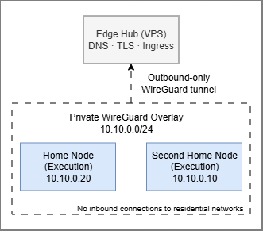
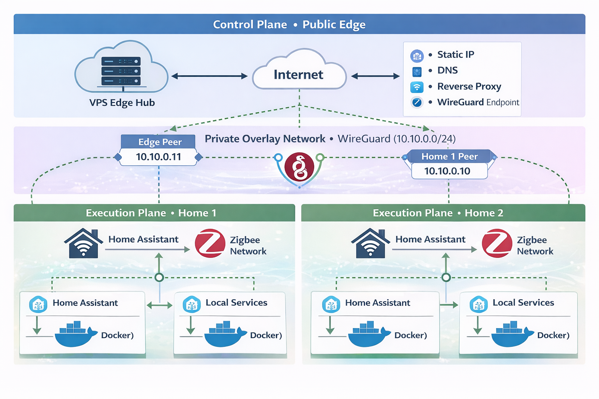
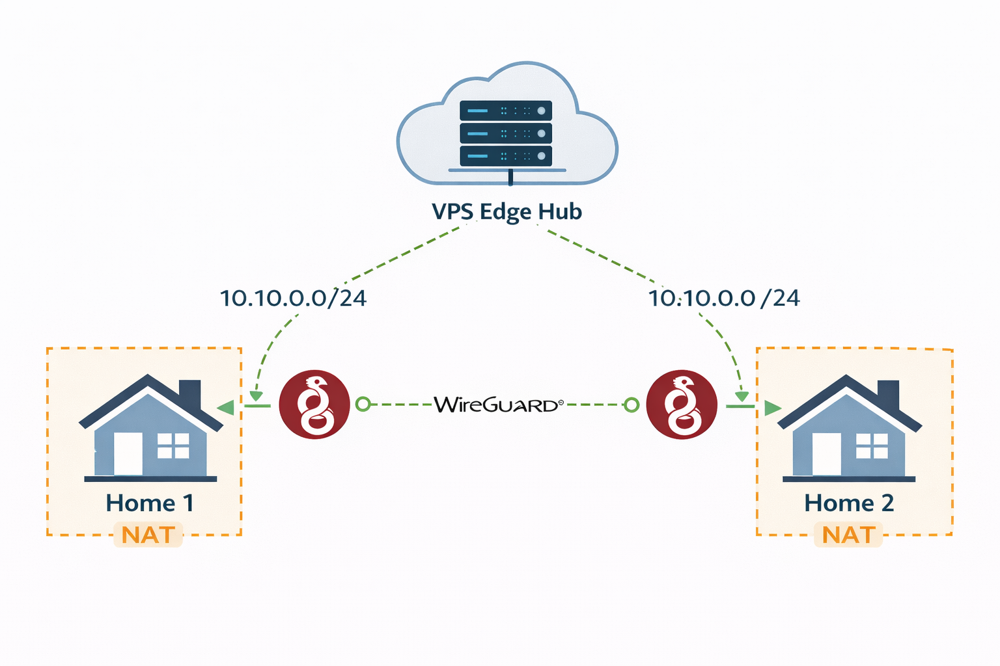
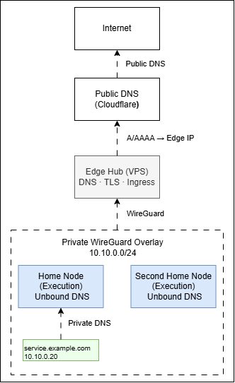
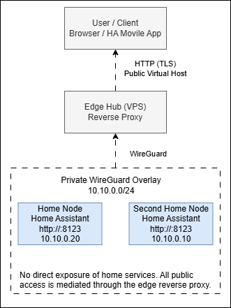

## 1. Purpose and Design Principles

This project documents the design and evolution of a personal, multi-home network built with the discipline of a small distributed system. The objective is full ownership of networking, services, and home automation across two physical locations, using a stable public edge and a private overlay network.

The system is designed to be:

- Predictable under normal operation
- Degraded but functional under partial failure
- Understandable by reading configuration alone

No part of the core system depends on third-party cloud services to operate.

### Intent

This is an infrastructure project, not an experiment. Each component has a defined role, a known failure mode, and a clear reason to exist. The network must survive restarts, outages, and time.

### Design Principles

**Local-first execution**

Services run where the devices and data live. Each house operates independently if isolated.

**Explicit architecture**

Topology, trust boundaries, and responsibilities are deliberate and documented. Nothing relies on implicit behavior.

**Minimal, composable tools**

A small set of technologies, used consistently:
WireGuard, Docker, systemd, Nginx, Unbound.

**Reproducibility**

Any node can be rebuilt from scratch using versioned configuration. No hidden state in UIs.

**Separation of concerns**

Networking, ingress, execution, and automation are isolated responsibilities.

**Operational stability**

Failures are expected. Blast radius is controlled. Recovery paths are known.

### Design Constraints

These constraints shape all decisions in later sections:

* Dynamic residential IPs
* NAT and ISP-controlled routers
* Low-power, always-on hardware
* Silent operation
* Human-readable configuration as the source of truth

These are not limitations to work around. They are inputs to the design.

## 2. High-Level Architecture Overview

The system is structured as a three-layer architecture: a public control edge, a private network overlay, and multiple execution environments.

Each layer has a single responsibility.

### Architectural Layers




### Logical Topology

* All nodes participate in a single private IP space
* Every node is addressable directly over the overlay
* No inbound connections are required at the homes



### Physical Locations

* One public VPS acting as edge hub
* Two private residential networks
* No direct trust between residential LANs

### Control Plane vs Execution Plane

**Control Plane**

* Public DNS
* TLS termination
* Reverse proxy
* Network coordination

**Execution Plane**

* Home automation
* IoT devices
* Cameras and sensors
* Local services

The edge coordinates access. It does not host stateful home services.

### Core Invariant

The edge is a facilitator. Each home is a peer. If the edge disappears, homes keep working. If a home disappears, the rest of the system remains intact. This separation is the backbone of the entire design.

## 3. The Edge Hub

The edge hub is a small public VPS with a static IP. Its role is coordination, not execution.

### Why an External Edge Is Required

Residential networks are unstable by nature: dynamic IPs, NAT, ISP firewalls. A public edge removes these constraints by providing a fixed, reachable anchor point for the entire system. The edge hub solves three problems:

* Stable ingress from the public internet
* A single authoritative point for DNS and TLS
* A network anchor for private networks behind NAT

Without it, every service would need ad-hoc exposure rules or external dependencies.

### Core Responsibilities

The edge hub is responsible for:

* Public DNS authority
* TLS certificate management
* Reverse proxy and ingress routing
* WireGuard endpoint and peer coordination

It holds no business logic, no home automation state, and no device control. This is why it can be small (and cheap).

### Control-Plane-Only Clarification 

The edge hub is **control plane only**.

It provides:

* Public DNS anchoring
* TLS termination
* Reverse proxy and ingress routing
* WireGuard coordination point

It explicitly does **not** provide:

* Home Assistant instances
* Automation logic
* Device control
* Zigbee, MQTT, or IoT services
* Persistent application state

All stateful execution lives inside the homes.
The edge can be destroyed and rebuilt without data loss.

## 4. Network Overlay: WireGuard as the Backbone

All nodes are connected through a private Layer-3 overlay built with WireGuard. This overlay is the network. Everything else assumes it exists.

### Addressing Scheme

A single private subnet is used:

```
10.10.0.0/24
```

Each node receives:

* One stable IP
* One cryptographic identity

IP addresses are assigned manually and documented. No dynamic allocation.

### Trust Model

Trust is explicit and peer-based.

* Each node has a unique key pair
* Peers are whitelisted by public key and IP
* No implicit trust through network location

If a key is not present, the node does not exist.

### Topology Decision

The overlay uses a hub-and-spoke model:

* Edge hub as the network anchor
* Homes initiate outbound connections only
* No inbound ports opened on residential routers

This simplifies NAT traversal and failure isolation.

Direct peer-to-peer links between homes are intentionally avoided.

### Key Management and Rotation

Keys are:

* Generated per node
* Stored outside the machines (password manager)
* Versioned alongside configuration

Rotation is manual and infrequent. Simplicity and auditability take priority over automation.



## 5. DNS Architecture

DNS is split into two clearly separated concerns: public resolution and private resolution.

### Public DNS

Public DNS is authoritative for the main domain. It handles Public records, TLS validation and external entry points. Only the edge hub is directly addressable via public DNS.

### Private DNS

Each home runs its own Unbound instance.

Private DNS handles:

* Internal hostnames
* Service discovery
* Overlay IP resolution

All private names resolve only inside the WireGuard network.

### Split-Horizon Strategy

The same domain is used publicly and privately, with different resolution paths.

* Public DNS resolves to the edge
* Private DNS resolves to overlay IPs

Clients always use the same hostname. Routing is decided by location, not configuration.




### Internal Domains

Each location has its own internal namespace, mapped to the same private network.

Examples:

* `home.lan`
* `second.lan`

> Examples shown here are illustrative; actual names follow the same pattern.

Names encode location and role. IPs remain stable.

DNS is part of the infrastructure, not an afterthought.

## 6. Reverse Proxy and Ingress

The edge hub acts as the single public entry point to the system. All external web access terminates there.

Nginx runs on the edge hub and provides TLS termination, virtual host routing, and access control. No home node exposes services directly to the internet.

TLS is handled centrally. Certificates live only on the edge. Traffic between the edge and the homes is forwarded privately over the WireGuard overlay.

Routing is explicit:

* External clients reach services through the edge proxy
* Requests are forwarded to the appropriate home over the overlay
* Internal clients access services locally without traversing the edge

A service is publicly reachable only if it is explicitly routed at the edge and reachable over WireGuard. The default state is non-exposure.

The diagram below illustrates how Home Assistant instances remain local to each home while being accessible from anywhere through the edge reverse proxy.



## 7. Execution Nodes: Symmetry, Not Hierarchy

Each home has an execution node: a quiet, always-on machine that hosts local services and participates as a full peer in the private overlay. It exists to keep the home operational without depending on the edge or the other site.

The architecture treats homes as separate failure domains with the same responsibilities and the same rules. There is no primary/secondary relationship to “fail over” into. Consistency comes from conventions—naming, boundaries, and where state is allowed to live—not from centralization.

Differences between nodes are allowed, but only as a consequence of the physical environment. Devices and local constraints diverge; the trust model and the shape of the system do not.

Autonomy is the point: each location remains understandable and operable on its own.

## 8. Home Assistant as a Distributed System

Home automation runs as one independent instance per house, each owning its local devices, automations, and state. The system intentionally rejects synchronization, clustering, or cross-site “single brain” designs: sharing execution would blur failure domains and make outages harder to reason about. What carries across homes is only the mental model—how things are named and organized—not a shared runtime.

### Local Device Domains

Device control is kept local to the house that contains the devices. Sensors, actuators, and the automation state they depend on are treated as local concerns, with boundaries that make troubleshooting physical and obvious.

This keeps latency predictable, reduces cross-site coupling, and preserves the principle that each home can keep operating without external dependencies.

## 9. Evolution Over Time

This network improved most when I stopped trying to outsmart it. The early versions accumulated mechanisms “just in case,” and those mechanisms quietly became obligations: more things to notice, more things to babysit, more ways to be surprised.

The shape that survived was the one that stayed legible under stress: clear boundaries, few core abstractions, and an intolerance for hidden coupling. Anything that couldn’t be explained from configuration alone, or that demanded constant attention to remain safe, eventually felt like it didn’t belong.

What I keep now is what earns its place: pieces that fail loudly, remain understandable under failure, and preserve the autonomy of each home.

## 10. Final Architecture Snapshot

I think of this system as a small distributed network with a simple moral: ownership comes from reducing dependencies. A public edge can exist as an access facilitator, but it should never become the place where the homes depend on their identity or state.

The private overlay is the connective tissue, not the point. The point is that each home remains a complete, local system with boundaries and predictable behavior—something you can understand by reading it, and rebuild without negotiating with a vendor or a UI.

If the architecture holds to those invariants—local-first execution, explicit trust, and disciplined separation of concerns—then change stays affordable, and failure stays survivable.
