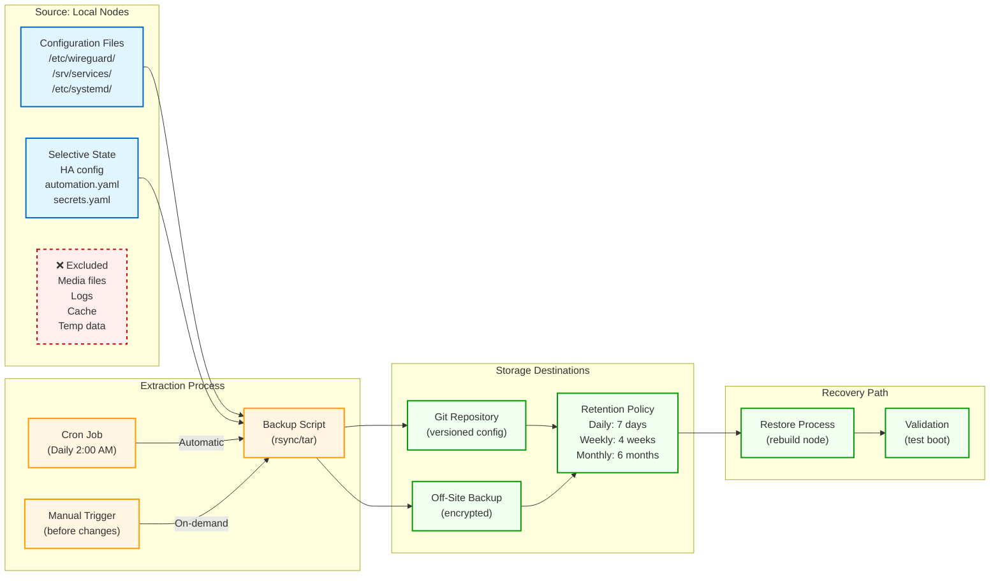

# Backup Flow

Shows the backup workflow: configuration and selective state are extracted from local nodes, versioned, and stored off-node. Distinguishes between scheduled automatic backups and manual backups.

