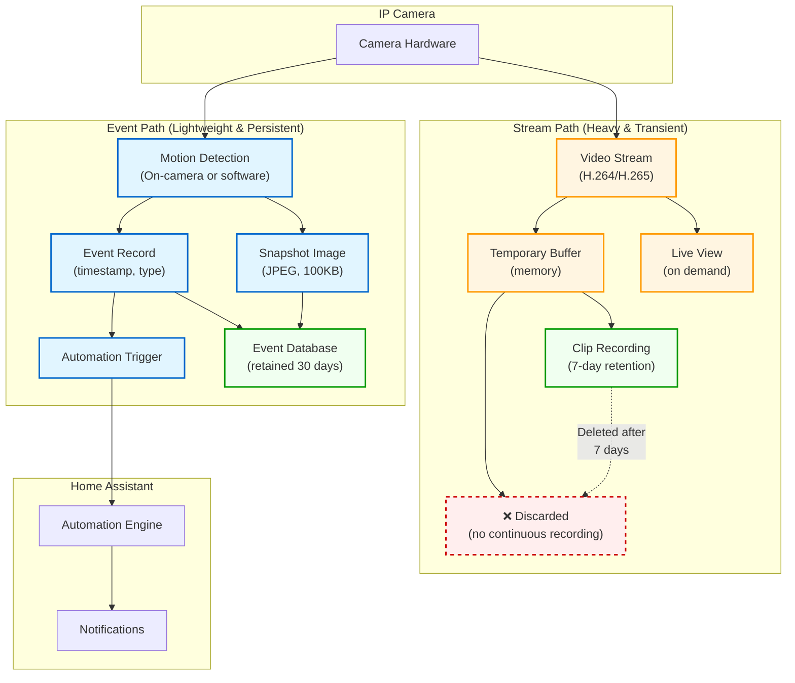

# Camera Event vs Stream Flow

Illustrates two distinct data paths for camera systems: event path (motion detection to automation) is lightweight and persistent, while stream path (video feed) is heavy and transient.

