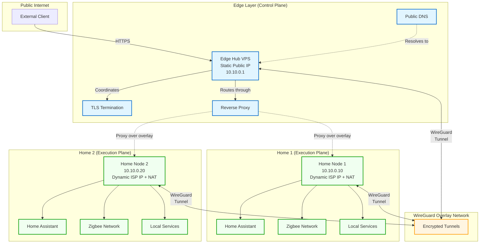

# Canonical Architecture Diagram

Shows the complete three-layer system: edge hub (control plane), WireGuard overlay network, and two home execution nodes with clear trust boundaries.

```mermaid
graph TB
    subgraph Internet["Public Internet"]
        Client["External Client"]
    end
    
    subgraph EdgeLayer["Edge Layer (Control Plane)"]
        Edge["Edge Hub VPS<br/>Static Public IP<br/>10.10.0.1"]
        EdgeDNS["Public DNS"]
        EdgeTLS["TLS Termination"]
        EdgeProxy["Reverse Proxy"]
    end
    
    subgraph Overlay["WireGuard Overlay Network<br/>10.10.0.0/24"]
        WG["Encrypted Tunnels"]
    end
    
    subgraph Home1["Home 1 (Execution Plane)"]
        Node1["Home Node 1<br/>10.10.0.10<br/>Dynamic ISP IP + NAT"]
        HA1["Home Assistant"]
        Zigbee1["Zigbee Network"]
        Services1["Local Services"]
    end
    
    subgraph Home2["Home 2 (Execution Plane)"]
        Node2["Home Node 2<br/>10.10.0.20<br/>Dynamic ISP IP + NAT"]
        HA2["Home Assistant"]
        Zigbee2["Zigbee Network"]
        Services2["Local Services"]
    end
    
    Client -->|HTTPS| Edge
    EdgeDNS -.->|Resolves to| Edge
    Edge -->|Coordinates| EdgeTLS
    Edge -->|Routes through| EdgeProxy
    
    Edge <-->|WireGuard<br/>Tunnel| WG
    Node1 <-->|WireGuard<br/>Tunnel| WG
    Node2 <-->|WireGuard<br/>Tunnel| WG
    
    Node1 --> HA1
    Node1 --> Zigbee1
    Node1 --> Services1
    
    Node2 --> HA2
    Node2 --> Zigbee2
    Node2 --> Services2
    
    EdgeProxy -.->|Proxy over overlay| Node1
    EdgeProxy -.->|Proxy over overlay| Node2
    
    classDef controlPlane fill:#e1f5ff,stroke:#0066cc,stroke-width:2px
    classDef executionPlane fill:#f0fff0,stroke:#009900,stroke-width:2px
    classDef overlay fill:#fff5e1,stroke:#ff9900,stroke-width:2px
    
    class Edge,EdgeDNS,EdgeTLS,EdgeProxy controlPlane
    class Node1,Node2,HA1,HA2,Zigbee1,Zigbee2,Services1,Services2 executionPlane
    class WG overlay
```
