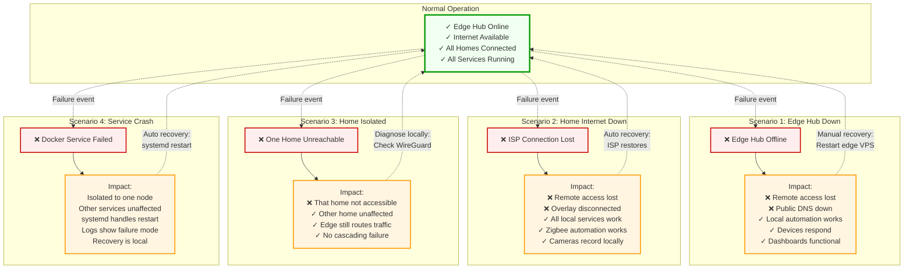

# Failure and Degradation Modes

Maps different failure scenarios and their impacts, showing how the system degrades gracefully by losing convenience rather than capability. Local operation is preserved during failures.

