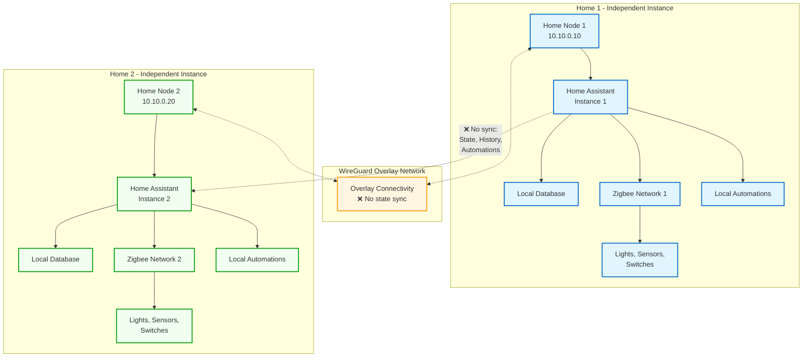

# Home Assistant Distributed Model

Shows two independent Home Assistant instances, each connected to its local Zigbee network and devices. The overlay network connects both homes, but state is NOT synchronized.

