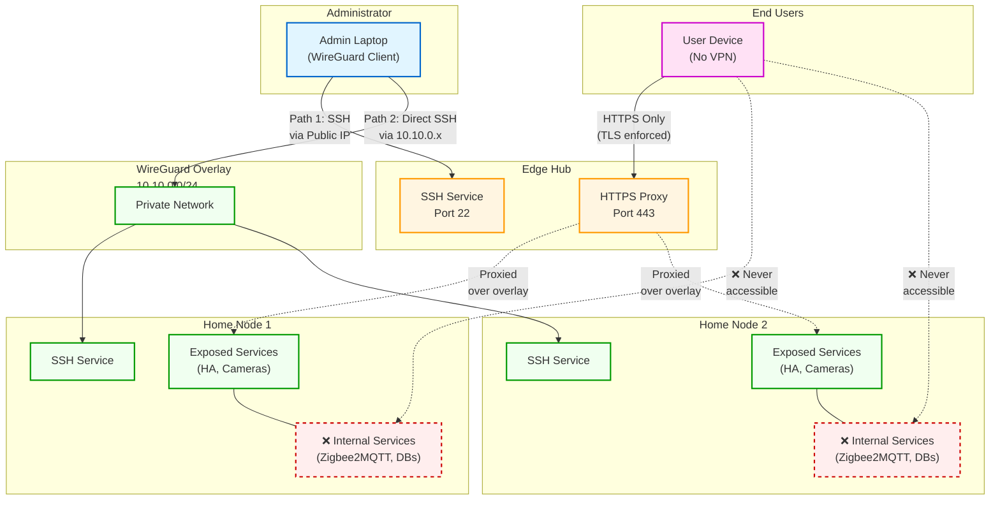

# Remote Access Patterns

Illustrates administrative and user access patterns: admins can reach nodes via public edge or overlay, while user access is always mediated through the edge reverse proxy.

