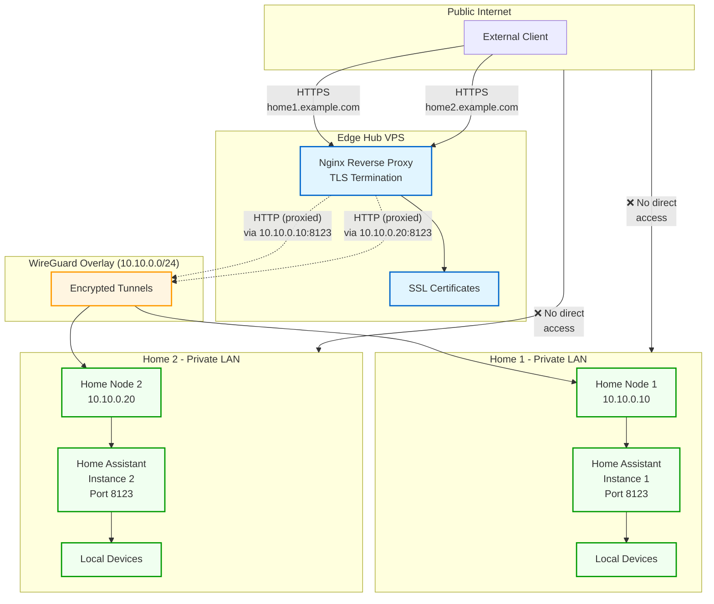

# Reverse Proxy and Home Assistant Exposure

Shows how Home Assistant instances remain local to each home while being accessible externally through the edge reverse proxy with TLS termination.

```mermaid
graph TB
    subgraph Internet["Public Internet"]
        Client["External Client"]
    end
    
    subgraph EdgeHub["Edge Hub VPS"]
        Nginx["Nginx Reverse Proxy<br/>TLS Termination"]
        Certs["SSL Certificates"]
    end
    
    subgraph Overlay["WireGuard Overlay (10.10.0.0/24)"]
        Tunnel["Encrypted Tunnels"]
    end
    
    subgraph Home1LAN["Home 1 - Private LAN"]
        Node1["Home Node 1<br/>10.10.0.10"]
        HA1["Home Assistant<br/>Instance 1<br/>Port 8123"]
        Local1["Local Devices"]
    end
    
    subgraph Home2LAN["Home 2 - Private LAN"]
        Node2["Home Node 2<br/>10.10.0.20"]
        HA2["Home Assistant<br/>Instance 2<br/>Port 8123"]
        Local2["Local Devices"]
    end
    
    Client -->|"HTTPS<br/>home1.example.com"| Nginx
    Client -->|"HTTPS<br/>home2.example.com"| Nginx
    
    Nginx --> Certs
    
    Nginx -.->|"HTTP (proxied)<br/>via 10.10.0.10:8123"| Tunnel
    Nginx -.->|"HTTP (proxied)<br/>via 10.10.0.20:8123"| Tunnel
    
    Tunnel --> Node1
    Tunnel --> Node2
    
    Node1 --> HA1
    Node2 --> HA2
    
    HA1 --> Local1
    HA2 --> Local2
    
    Internet -->|"❌ No direct<br/>access"| Home1LAN
    Internet -->|"❌ No direct<br/>access"| Home2LAN
    
    classDef edge fill:#e1f5ff,stroke:#0066cc,stroke-width:2px
    classDef home fill:#f0fff0,stroke:#009900,stroke-width:2px
    classDef overlay fill:#fff5e1,stroke:#ff9900,stroke-width:2px
    
    class Nginx,Certs edge
    class Node1,Node2,HA1,HA2,Local1,Local2 home
    class Tunnel overlay
```
