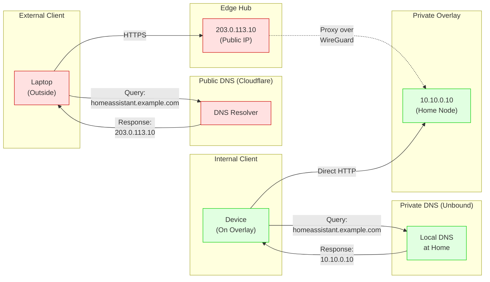

# Split-Horizon DNS Resolution

Demonstrates how the same hostname resolves differently depending on client location: external clients reach the edge via public DNS, while internal clients resolve to overlay IPs via private DNS.

