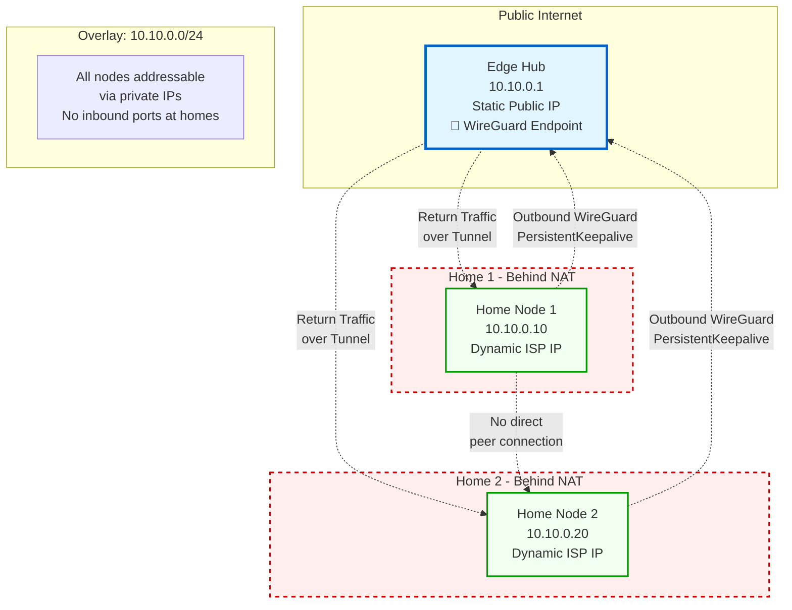

# Hub-and-Spoke WireGuard Overlay

Simplified network overlay diagram showing the edge hub as the central anchor with bidirectional WireGuard tunnels to each home node. NAT boundaries are shown at residential locations.

