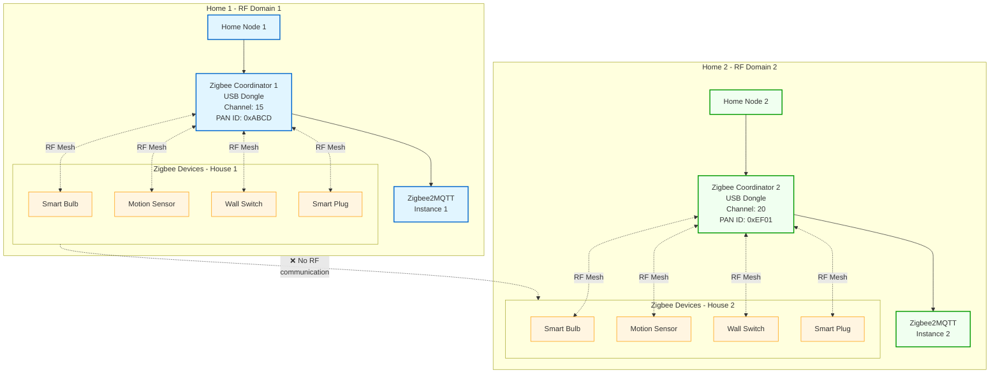

# Zigbee RF Domains

Demonstrates two separate Zigbee radio frequency domains, one per house. Each has its own coordinator and devices cannot communicate across houses at the RF level.

```mermaid
graph TB
    subgraph House1["Home 1 - RF Domain 1"]
        Node1["Home Node 1"]
        Coord1["Zigbee Coordinator 1<br/>USB Dongle<br/>Channel: 15<br/>PAN ID: 0xABCD"]
        Z2M1["Zigbee2MQTT<br/>Instance 1"]
        
        subgraph Devices1["Zigbee Devices - House 1"]
            Light1["Smart Bulb"]
            Sensor1["Motion Sensor"]
            Switch1["Wall Switch"]
            Plug1["Smart Plug"]
        end
    end
    
    subgraph House2["Home 2 - RF Domain 2"]
        Node2["Home Node 2"]
        Coord2["Zigbee Coordinator 2<br/>USB Dongle<br/>Channel: 20<br/>PAN ID: 0xEF01"]
        Z2M2["Zigbee2MQTT<br/>Instance 2"]
        
        subgraph Devices2["Zigbee Devices - House 2"]
            Light2["Smart Bulb"]
            Sensor2["Motion Sensor"]
            Switch2["Wall Switch"]
            Plug2["Smart Plug"]
        end
    end
    
    Node1 --> Coord1
    Coord1 --> Z2M1
    
    Coord1 <-.->|"RF Mesh"| Light1
    Coord1 <-.->|"RF Mesh"| Sensor1
    Coord1 <-.->|"RF Mesh"| Switch1
    Coord1 <-.->|"RF Mesh"| Plug1
    
    Node2 --> Coord2
    Coord2 --> Z2M2
    
    Coord2 <-.->|"RF Mesh"| Light2
    Coord2 <-.->|"RF Mesh"| Sensor2
    Coord2 <-.->|"RF Mesh"| Switch2
    Coord2 <-.->|"RF Mesh"| Plug2
    
    Devices1 -.->|"❌ No RF<br/>communication"| Devices2
    
    classDef house1 fill:#e1f5ff,stroke:#0066cc,stroke-width:2px
    classDef house2 fill:#f0fff0,stroke:#009900,stroke-width:2px
    classDef devices fill:#fff5e1,stroke:#ff9900,stroke-width:1px
    
    class Node1,Coord1,Z2M1 house1
    class Node2,Coord2,Z2M2 house2
    class Light1,Sensor1,Switch1,Plug1,Light2,Sensor2,Switch2,Plug2 devices
```
