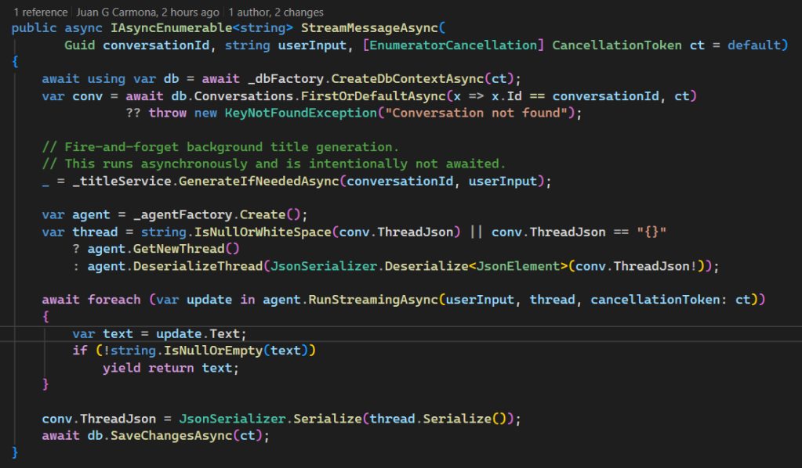

In the previous article [**— _The Awakening_ —**](https://jgcarmona.com/run-agent-framework-locally/) we got a single-turn agent running entirely offline with **Microsoft Agent Framework (MAF)** and **[Docker Model Runner](https://jgcarmona.com/enable-gpu-docker-model-runner-windows/)**. It could reason and respond or stream results but it didn’t remember anything. Each message lived and died in memory.

In this second step, we’ll change that.

## From Echoes to Conversations

If we want to create a useful assistant, it must remember. It needs to recall what we said before, link follow-ups, and adapt its tone and context as the dialogue evolves. That’s where **Microsoft Agent Framework's `ChatMessageStore`** comes in: a simple but powerful abstraction that lets you persist message history between turns.

By default, MAF keeps memory in memory... 🙂 Turns are volatile, ephemeral... The concept of a conversation, in the LLM world, is something that we must build around each interaction with the LLM engine and the model underneath. In this article (Lab DN02 in this series), we’ll make it **persistent**, using Entity Framework Core and a local PostgreSQL database. All using Containers, so, everything keeps local.

### `EfChatMessageStore`: Memory Meets the Database

Here’s the core piece:

```csharp
internal sealed class EfChatMessageStore : ChatMessageStore
{
    private readonly IDbContextFactory<ConversationDb> _dbFactory;
    public string? ThreadDbKey { get; private set; }

    public EfChatMessageStore(
        IDbContextFactory<ConversationDb> dbFactory,
        JsonElement serializedStoreState,
        JsonSerializerOptions? _ = null)
    {
        _dbFactory = dbFactory ?? throw new ArgumentNullException(nameof(dbFactory));

        if (serializedStoreState.ValueKind is JsonValueKind.String)
            ThreadDbKey = serializedStoreState.GetString();
    }

    public override async Task AddMessagesAsync(IEnumerable<ChatMessage> messages, CancellationToken ct)
    {
        ThreadDbKey ??= Guid.NewGuid().ToString("N");
        await using var db = await _dbFactory.CreateDbContextAsync(ct);

        var now = DateTimeOffset.UtcNow;

        foreach (var m in messages)
        {
            m.AuthorName ??= m.Role == ChatRole.User ? "User" : "Assistant";
            m.CreatedAt ??= now;
            m.MessageId ??= Guid.NewGuid().ToString("N");

            db.ChatHistory.Add(new ChatHistoryItem
            {
                ThreadId = ThreadDbKey,
                Key = $"{ThreadDbKey}-{m.MessageId}",
                Timestamp = m.CreatedAt.Value,
                SerializedMessage = JsonSerializer.Serialize(m),
                MessageText = m.Text
            });
        }

        await db.SaveChangesAsync(ct);
    }

    public override async Task<IEnumerable<ChatMessage>> GetMessagesAsync(CancellationToken ct)
    {
        if (string.IsNullOrEmpty(ThreadDbKey))
            return Enumerable.Empty<ChatMessage>();

        await using var db = await _dbFactory.CreateDbContextAsync(ct);

        var records = await db.ChatHistory
            .Where(x => x.ThreadId == ThreadDbKey)
            .OrderByDescending(x => x.Timestamp)
            .Take(10)
            .ToListAsync(ct);

        records.Reverse();

        return records
            .Select(x => JsonSerializer.Deserialize<ChatMessage>(x.SerializedMessage!)!)
            .ToList();
    }

    public override JsonElement Serialize(JsonSerializerOptions? jsonSerializerOptions = null) =>
        JsonSerializer.SerializeToElement(ThreadDbKey);
}
```

This class inherits from **`[ChatMessageStore](https://github.com/microsoft/agent-framework/blob/main/dotnet/src/Microsoft.Agents.AI.Abstractions/ChatMessageStore.cs)`**, the same interface MAF uses to manage agent memory. But instead of keeping messages in memory, it **serializes them into a database entity**, `ChatHistoryItem`, containing the `ThreadId`, `Timestamp`, and full JSON of each message.

Microsoft’s official example on _“[**How to Store Chat History in 3rd Party Storage**](https://learn.microsoft.com/en-us/agent-framework/tutorials/agents/third-party-chat-history-storage)”_ inspired this approach. Although, to be honest, I found that name quite misleading: using your own database isn’t really “third-party” storage. I mean, calling OpenAI or Azure OpenAI _third-party_ makes sense, but our own database? Not so much. And while we’re at it, why use a **vector database** for chat messages? That never quite convinced me; it feels like the wrong tool for the job.

Anyway, leaving those thoughts aside, when the agent runs again, this store simply **restores previous turns**, creating _the illusion_ of a continuous, ongoing conversation.

## The Conversation Service

`[**ConversationService**](https://github.com/juangcarmona/ms-agent-framework-playground/blob/main/labs/dotnet/02_persistence/Msaf02Persistence/Application/Services/ConversationService.cs)` acts as a thin layer between our API and the agent. It handles conversation CRUD operations as well as sync or streamed agent interactions

Each request results in a persisted conversation that can be resumed later. No external state, no cloud databases, just our local Entity Framework context. Here is an example:  



The `StreamMessageAsync()` method is where the chat becomes truly dynamic. It first loads the conversation from EF Core, then triggers background title generation with `_ = _titleService.GenerateIfNeededAsync(conversationId, userInput);` This call runs **fire-and-forget**, the user doesn’t wait for it.

Next, the agent is reconstructed from its saved thread (or starts fresh) and streams the reply token by token. When done, the updated state is serialized and saved back to the database.

As you can see, it's fully local. Everything runs offline, no API keys, no Azure, no OpenAI. Just Entity Framework + Microsoft Agent Framework doing the job.

> 💡 _Streaming responses while persisting context — all offline._

## Why It Matters?

Persistence changes everything. It enables summarization, reflection, and multi-turn reasoning, all building blocks of the agentic loop we’ll explore next. In **Lab 03**, I will move from memory to reasoning, introducing the full **[Sense → Plan → Act → Reflect](https://jgcarmona.com/ai-agents-nutshell/)** cycle the real “brain loop” behind autonomous agents.

## **References**

Playground repository: [github.com/juangcarmona/ms-agent-framework-playground](https://github.com/juangcarmona/ms-agent-framework-playground)

- [MAF: Persisted Conversations](https://learn.microsoft.com/en-us/agent-framework/tutorials/agents/persisted-conversation)

- [MAF: Multi-Turn Conversation](https://learn.microsoft.com/en-us/agent-framework/user-guide/agents/multi-turn-conversation)

- [Docker Model Runner](https://docs.docker.com/ai/model-runner/)

- [Sentra Brain](https://sentrabrain.com): private AI runtime inspired by these experiments

> **Note:** Somewhere in my mental, chaotic TODO-list there’s a line that says:  
> _“Replicate this experiment with Python and FastAPI.”_
> 
> I’ll get there — eventually. 🙂
