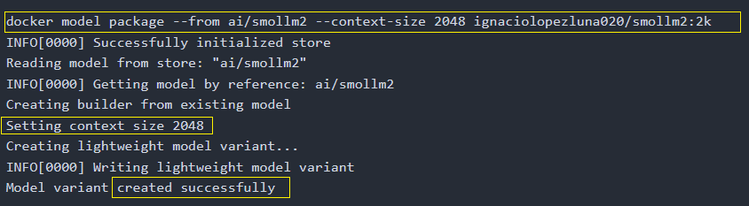
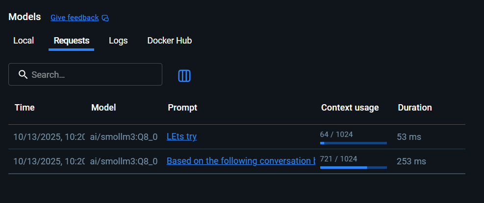
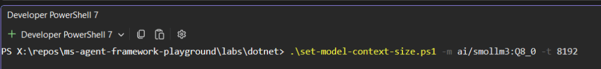
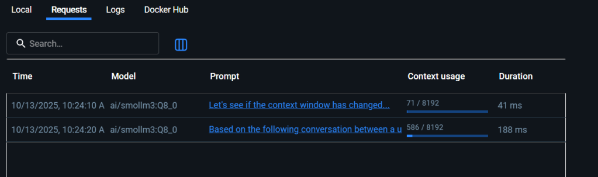
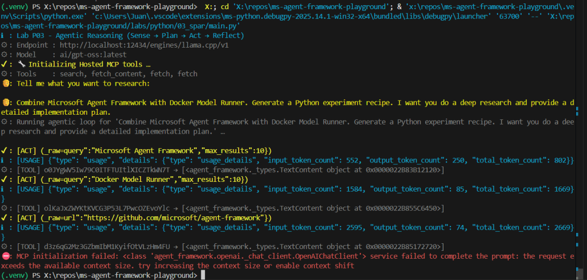
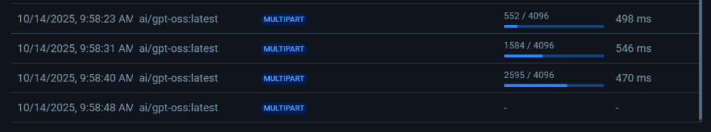
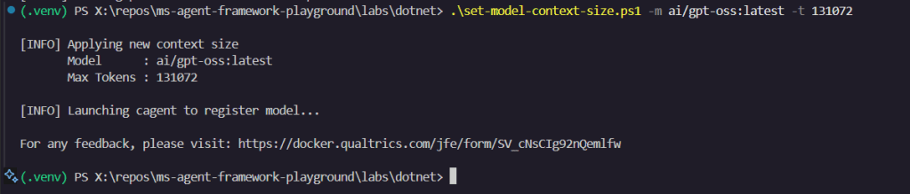

> When I started experimenting with **[Microsoft Agent Framework](https://jgcarmona.com/building-local-chat-agent-microsoft-agent-framework-dotnet/)** using **[Docker Model Runner (DMR)](https://jgcarmona.com/run-agent-framework-locally/)** as the "inteligence engine", I noticed a strange bottleneck: my agents kept freezing mid-conversation. The reason? A context window capped at **4096 tokens**, far too narrow for multi-tool and/or reasoning-intensive agents. **So I did what any engineer would do: searched everywhere for a way to change it.**

**\[20-OCT-2025\] UPDATE:** I started a [GitHub issue](https://github.com/docker/model-runner/issues/223) explaining this 'feature gap' or desired requisite. This was related with some other issues requesting for similar features, and, DMR team [started to work on this almost immediately](https://github.com/docker/model-runner/pull/243). They finally added a package flag so we can package and run a model configuration, so, we gain perfect reproducibility. Big thanks to [Ignasi](https://github.com/ilopezluna) and [Eric Curtin](https://github.com/ericcurtin).

We can do this with `docker model package --from <oiriginal_model> --context-size <size> <final_model_id>`



* * *

Here is the original story, which still seems a beautiful workaround to me:

There’s no `--context` flag, no `docker model set` command, no configuration field exposed in Docker Desktop. Even the official docs mention only a `context_size` value for Compose, but it’s ignored once a model is already loaded. (and you're 'forced' to use compose)

Luckily, I have a hacker’s mindset, which really means I enjoy making technology do things it wasn’t originally designed to do. After a few experiments, I found **one method that actually works**. By launching a temporary agent, with **Docker cangent** pointing to the same model but with a different `max_tokens` value, DMR silently reloads that model with the new context window. From that moment, all subsequent agents share the expanded limit, regardless the origin, cagent or MAF.

## The hack that works for me

- Create a minimal agent YAML that references the desired model name, but includes a higher `max_tokens` value.

- Run `cagent run` on that bootstrap agent. This causes DMR to (re)initialize the model under the new token window.

- After that, even if you kill the agent, DMR retains the model instance with the expanded context window.

- All future agents using that same model name inherit the increased context size.

Here is an example you can reuse to do the trick yourself...

```powershell
<#
.SYNOPSIS
  Set or increase the context window (max_tokens) for a Docker Model Runner model.
.DESCRIPTION
  Creates a temporary bootstrap agent YAML and runs it through cagent to re-register
  the specified model with a new max_tokens value in your local DMR runtime.
.EXAMPLE
  ./set-model-context-size.ps1 -m ai/gpt-oss -t 64000
  ./set-model-context-size.ps1 --model ai/gemma3:12B --tokens 32768
#>

param(
  [Alias("m")]
  [string]$Model,

  [Alias("t")]
  [int]$Tokens,

  [switch]$ShowHelp
)

# -------------------------------
# MANUAL ARG PARSE FOR HELP FLAGS
# -------------------------------
if ($args -contains "-h" -or $args -contains "--help" -or $ShowHelp) {
  Write-Host @"
Usage:
  set-model-context-size.ps1 --model <model_name> --tokens <max_tokens>

Aliases:
  -m   shorthand for --model
  -t   shorthand for --tokens
  -h   show this help

Examples:
  ./set-model-context-size.ps1 -m ai/gpt-oss -t 64000
  ./set-model-context-size.ps1 --model ai/mistral:7B --tokens 32768

Description:
  This script uses cagent to initialize a Docker Model Runner (DMR) model
  with a new context size. Once executed, the model instance in DMR will
  retain the specified max_tokens window.
"@
  exit 0
}

# -------------------------------
# VALIDATION
# -------------------------------
if (-not $Model -or -not $Tokens) {
  Write-Host "[ERROR] Missing parameters. Use -h for help."
  exit 1
}

# -------------------------------
# CORE LOGIC
# -------------------------------
$AgentFile = "set-model-context-size.yml"
$BaseUrl   = "http://localhost:12434/engines/llama.cpp/v1"
$env:OPENAI_API_KEY = "none"

Write-Host "`n[INFO] Applying new context size"
Write-Host "       Model      : $Model"
Write-Host "       Max Tokens : $Tokens`n"

@"
version: "2"
agents:
  root:
    model: local-model
    description: Bootstrap agent to change model context size
    instruction: |
      This agent exists only to initialize the DMR provider with the new context size.
models:
  local-model:
    provider: dmr
    model: $Model
    base_url: $BaseUrl
    max_tokens: $Tokens
"@ | Set-Content $AgentFile -Encoding UTF8

Write-Host "[INFO] Launching cagent to register model..."
& cagent run $AgentFile
```

<figure>



<figcaption>

smoll3 had a context window of 1024, which is useless

</figcaption>

</figure>

<figure>



<figcaption>

Running my script, to launch an agent using that model with a new context window size...

</figcaption>

</figure>

<figure>


<figcaption>

This is the cagent TUI...

</figcaption>

</figure>

<figure>



<figcaption>

The context size has changed

</figcaption>

</figure>

## Is there a better way to do this?

I couldn't find a better way to do this. If there is, please, share it with me. There’s currently no documented way to change context size dynamically in Docker Model Runner. Compose parameters and CLI flags only apply at startup, and Docker Desktop hides any runtime configuration. And, well, I guess it is possible to use Docker compose with a hello-world container referencing a model with a higher context window (another hack I haven't tried) but, isn't that too convoluted?

Until Docker exposes a proper API or flag, this **temporary-agent trick via cagent** remains the only reliable way to expand the context window for local models.  
  
I hope it helps you

### **NOTE:**

If you’re using cagent locally, you can read more about its declarative model setup in [**What is Docker cagent? A First Look at Declarative AI Agents**](https://jgcarmona.com/what-is-docker-cagent-a-first-look-at-declarative-ai-agents/) or its memory integration in [**Memory in Docker cagent**](https://jgcarmona.com/memory-in-docker-cagent/).

UPdescription: ''
pubDate:  
  
Today I started with LAB P03 (the python version of the SPAR Framework implementation) and I found, again, the issue. Obviously the workstation has just started so, Docker Desktop started, again, and, as I mentioned earlier, the default context size is, again, 4096. The impact is clear, in a multi turn or multipart conversation with tool calls, reasoning and so on, the context grows until it exceeds the available context size... And fails!





I had to run my script:  



And that fixed the context size for this concrete model.
