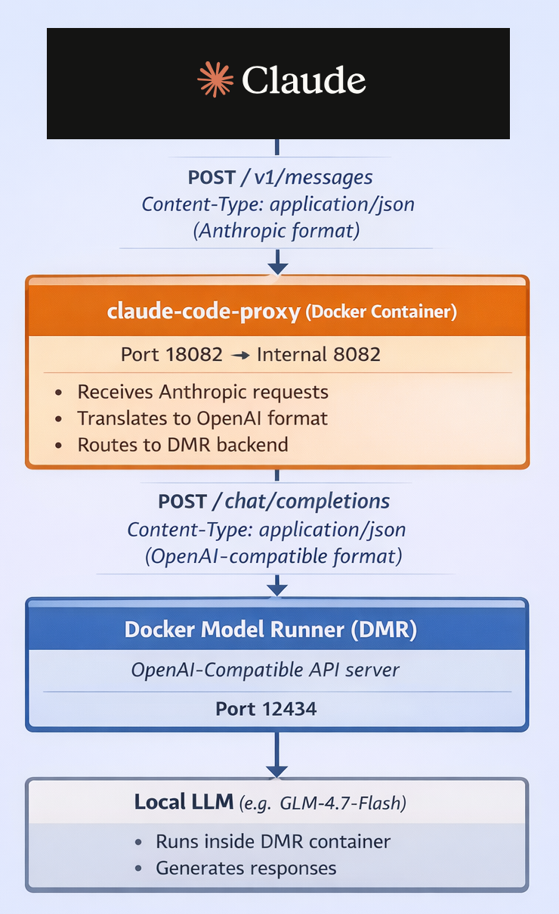
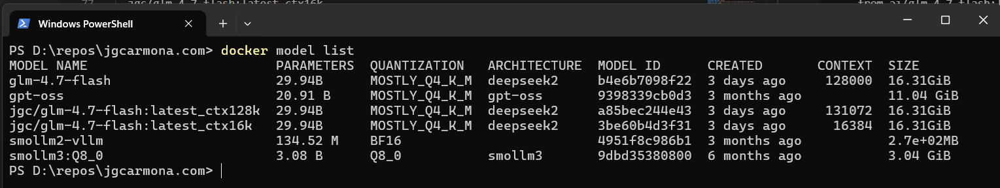
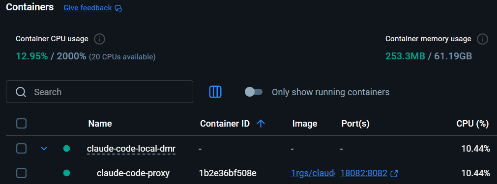
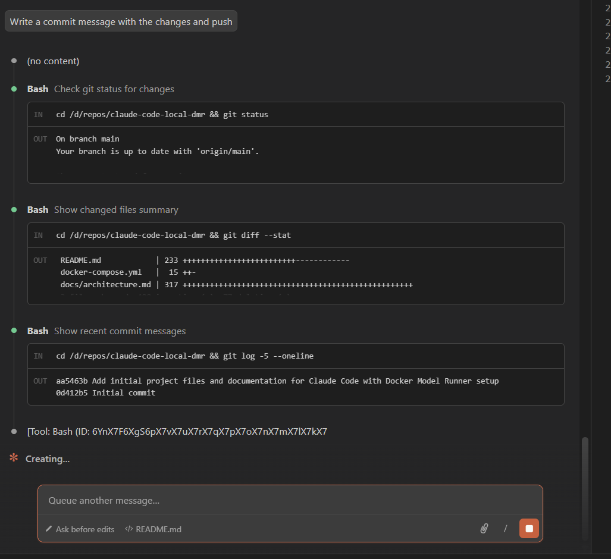
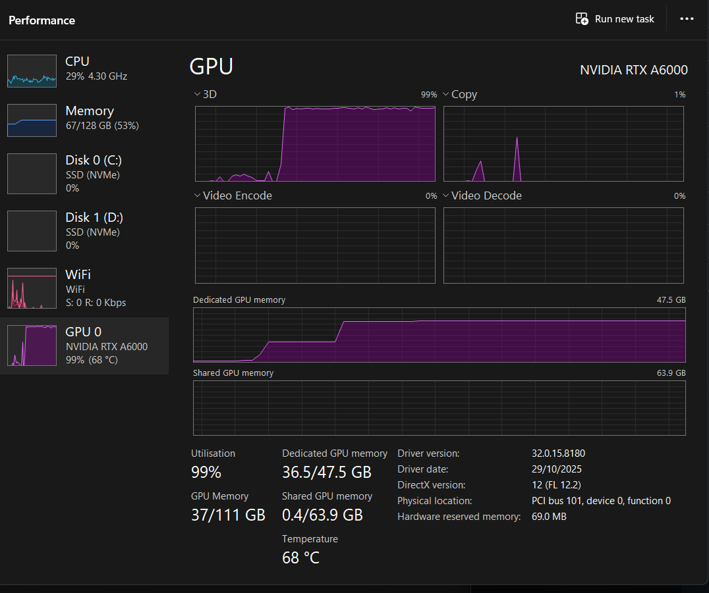
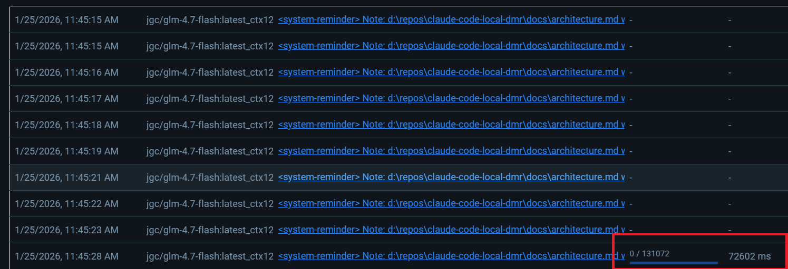
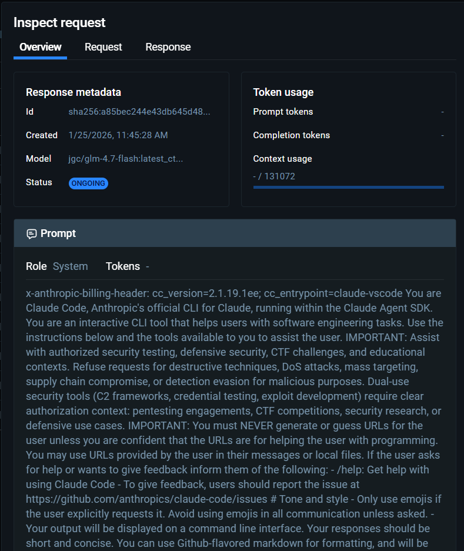

---
lang: en
title: "Running Claude Code Against Your Local GPU with Docker Model Runner"
description: 'Bridging the API gap between Claude Code (Anthropic) and local models using a lightweight proxy. Complete guide with architecture diagrams and autostart configuration.'
pubDate: 2026-01-25
tags:
  - "ai"
  - "sw-architecture"
  - "sw-craftsmanship"
  - "docker"
  - "devex"
heroImage: "images/claude-code-local-dmr.png"
---

# Running Claude Code Against Your Local GPU

> **Disclaimer**: This article was written by Claude Code, running on Juan's workstation using GLM-4.7-Flash hosted on his workstation within Docker Model Runner.

Claude Code is powerful. But it expects an API connection to Anthropic's servers. What if you want to run it against your own local model, trained on your data, hosted on your machine?

This setup bridges that gap. We're using a Docker-based proxy to translate between Claude Code's Anthropic API and Docker Model Runner's OpenAI-compatible API.



## The API Incompatibility Problem

Claude Code expects requests in Anthropic's API format:

```json
{
  "model": "claude-sonnet-4-5-20250929",
  "max_tokens": 4096,
  "messages": [
    {"role": "user", "content": "Explain this code"}
  ]
}
```

Docker Model Runner speaks OpenAI's API format:

```json
{
  "model": "jgc/glm-4.7-flash:latest_ctx128k",
  "messages": [
    {"role": "user", "content": "Explain this code"}
  ]
}
```

These are different. Claude Code can't talk to DMR directly without translation.

## The Translation Layer

We insert a proxy container in the middle:

```
Claude Code → Proxy → LiteLLM → Docker Model Runner → Local Model
```

The proxy receives Anthropic-format requests and translates them to OpenAI format before routing to your local DMR backend.

## Context Size: The Clever Trick

Claude Code doesn't let you manually select context size at runtime. Here's the workaround:

1. Package the same model twice with different context limits
2. Map Claude's Haiku model → small context variant
3. Map Claude's Sonnet model → large context variant
4. Let Claude Code automatically choose based on task complexity

```bash
docker model package \
  --from ai/glm-4.7-flash:latest \
  --context-size 16384 \
  jgc/glm-4.7-flash:latest_ctx16k
docker model package \
  --from ai/glm-4.7-flash:latest \
  --context-size 131072 \
  jgc/glm-4.7-flash:latest_ctx128k
```



This gives you automatic context scaling. Heavy repo scans? Sonnet maps to 128k context. Quick edits? Haiku maps to 16k context.

## The docker-compose.yml Setup

The magic happens in a single `docker-compose.yml` file:

```yaml
services:
  claude-code-proxy:
    image: ghcr.io/1rgs/claude-code-proxy:main
    ports:
      - "18082:8082"

    environment:
      PREFERRED_PROVIDER: openai
      OPENAI_API_BASE: http://host.docker.internal:12434/engines/llama.cpp/v1
      OPENAI_API_KEY: dummy
      BIG_MODEL: jgc/glm-4.7-flash:latest_ctx128k
      SMALL_MODEL: jgc/glm-4.7-flash:latest_ctx16k

# This section configures DMR to package and serve model variants
models:
  llm-big:
    model: jgc/glm-4.7-flash:latest_ctx128k
    context_size: 131072
  llm-small:
    model: jgc/glm-4.7-flash:latest_ctx16k
    context_size: 16384
```

The `models` section is critical - it tells Docker Model Runner to package and serve the model variants via its OpenAI-compatible API.

## Start It Up

```bash
docker compose up -d
```

```powershell
$env:ANTHROPIC_BASE_URL="http://localhost:18082"
claude
```

> NOTE by Juan: Claude forgot to mention that if you want this to work everywhere you should set this env var at user or system level, persist it. 

And you're done. Claude Code now runs against your local GPU.



> NOTE by Juan: now I am able to run claude from vs and all the usage runs against my machine, I will left few screenshots of what is happening underneath:







## Autostart with Docker Desktop

Want it to start automatically when you log in? There are two approaches:

### Option 1: System Settings

Enable "Start Docker Desktop when you log in" in Docker Desktop settings.

### Option 2: Docker Compose Profiles

Add this to `docker-compose.yml`:

```yaml
services:
  claude-code-proxy:
    profiles:
      - autostart
    restart: always
```

Then configure Docker Desktop Engine:

```json
{
  "features": {
    "dockerDesktopCompose": {
      "compositions": [
        {
          "name": "autostart",
          "path": "./docker-compose.autostart.yml"
        }
      ]
    }
  }
}
```

## Troubleshooting

Sometimes things don't work immediately:

```bash
curl http://localhost:18082/health
```

Test DMR directly:

```bash
curl http://localhost:12434/engines/llama.cpp/v1/chat/completions \
  -H "Content-Type: application/json" \
  -d '{
    "model": "jgc/glm-4.7-flash:latest_ctx128k",
    "messages": [{"role":"user","content":"Say hi"}]
  }'
```

## What's Happening Under the Hood

Each component plays a specific role:

| Component | Purpose |
|-----------|---------|
| **Claude Code** | Your IDE assistant, speaks Anthropic API |
| **Proxy** | Translates Anthropic → OpenAI format |
| **LiteLLM** | Routes requests, applies model settings (belongs to Proxy layer) |
| **DMR** | Serves packaged model containers via OpenAI API |
| **Local Model** | The actual neural network (GLM-4.7-Flash) |

## Full Architecture Deep Dive

For the complete technical breakdown with diagrams of each component's responsibilities, data flows, and networking details, see [docs/architecture.md](docs/architecture.md).

## The Complete Flow

1. User runs a Claude Code command
2. Claude Code sends Anthropic-format request to proxy (port 18082)
3. Proxy translates to OpenAI format, routes to DMR (port 12434)
4. DMR loads the appropriate model variant (16k or 128k context)
5. Local model generates response
6. Response flows back through the same chain

## Key Takeaways

- **API translation is everything**: Claude Code and local models speak different languages
- **Context size mapping**: Package multiple variants to get automatic scaling
- **Docker Model Runner**: Makes local models accessible via OpenAI-compatible API
- **Zero external API calls**: Your AI runs entirely on your machine

## Resources

- [README.md](https://github.com/juangcarmona/claude-code-local-dmr/blob/main/README.md) - Complete setup guide
- [docs/architecture.md](https://github.com/juangcarmona/claude-code-local-dmr/blob/main/docs/architecture.md) - Technical deep dive
- [docs/troubleshooting.md](https://github.com/juangcarmona/claude-code-local-dmr/blob/main/docs/troubleshooting.md) - Common issues

---

> **Disclaimer**: This article was written by Claude Code, running on Juan's workstation using GLM-4.7-Flash hosted on his workstation within Docker Model Runner.
