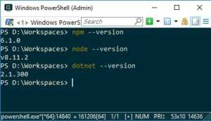
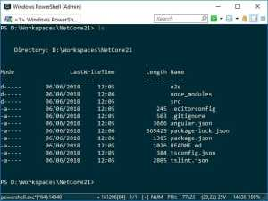
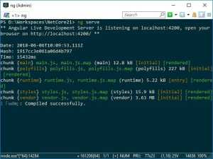
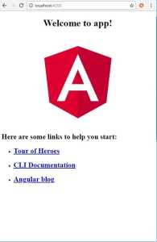
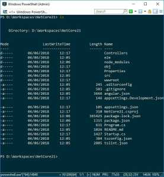
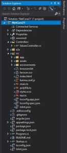
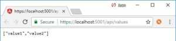
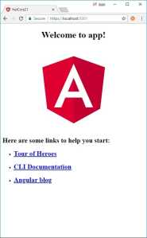

En éste artículo os voy a enseñar como se crea una aplicación de ASP NET Core 2.1 con Angular 6. En mi entorno de trabajo tengo instalado npm 6.1.0, NodeJS v8.11.2 y dotnet 2.1.300, la primera versión estable de .Net Core 2.1. 

[](https://jgcarmona.com/wp-content/uploads/2018/06/038c3-001.jpg)

  
1.- Necesitamos tener instalado Angular CLI, para lo que ejecutaremos  
  

```
npm install -g @angular/cli
```

[](https://jgcarmona.com/wp-content/uploads/2018/06/14d42-002.jpg)

  
2.- El siguiente paso es generar un projecto de Angular 6 con el comando ng new, podéis encontrar toda la documentación sobre ng new aquí: [https://github.com/angular/angular-cli/wiki/new](https://github.com/angular/angular-cli/wiki/new%C2%A0)  En este caso you usaré routing y scss así que mi comando será:  
  

```
ng new NetCore21 --routing --style=scss
```

En alrededor de un minuto Angular CLI nos genera, dentro de esa carpeta, NetCore21, la estructura de un proyecto Angular 6. 
  

[](https://jgcarmona.com/wp-content/uploads/2018/06/112b7-003.jpg)

  

Si en este momento ejecutamos ng serve podemos acceder a la página web que acabamos de crear accediendo a la dirección [http://localhost:4200](http://localhost:4200/)

  

[](https://jgcarmona.com/wp-content/uploads/2018/06/bfebb-004.jpg)

  

[](https://jgcarmona.com/wp-content/uploads/2018/06/8b0d7-005.jpg)

El siguiente paso es generar un proyecto ASP.NET Core Web API con el comando desde la misma carpeta del proyecto donde estábamos:

  

```
dotnet new WebAPI
```

Con lo que obtenemos ésta estructura:

  

[](https://jgcarmona.com/wp-content/uploads/2018/06/fdfb4-006.jpg)

  

Y ahora podemos ir a nuiestro Visual Studio y abrir ese proyecto.

  

[](https://jgcarmona.com/wp-content/uploads/2018/06/3cf33-007.jpg)

  

[](https://jgcarmona.com/wp-content/uploads/2018/06/f925f-008.jpg)

`   `

Editamos angular.json para que la salida sea wwwroot, para ello **cambiamos "outputPath": "dist/NetCore21", por "outputPath": "wwwroot"**, con esto conseguimos que al compilar con ng build el resultado se copie en wwwroot, la carpeta que la applicación web sirve por defecto.  
  

El otro cambio que tenemos que hacer está en **Startup.cs**, al configurar los servicios (ConfigureServices) hay que decirle que añada los ficheros estáticos de una SPA y que están en wwwroot, que añada MVC. Al configurar la aplicación, el método Configure, decirle que la aplicación usará ficheros por defecto, ficheros estáticos, indicarle la ruta por defecto de MVC para que se pueda acceder a los Controladores e indicarle que se trata de una SPA cuyo origen es wwwroot. Y eso es todo.  
  

  

Tras seguir estos pasos si ejecutamos el proyecto veremos que funcionan tanto la web como el API, ambas con http y con https:  
  

[](https://jgcarmona.com/wp-content/uploads/2018/06/b5ade-009.jpg)

  

[](https://jgcarmona.com/wp-content/uploads/2018/06/9cde0-010.jpg)

  

Una vez llegados hasta aquí lo que voy a hacer es subir éste pequeño proyecto a GitHub para que cualquiera que lea este artículo lo pueda usar como proyecto base de futuras páginas web con ASP NET Core 2.1 y Angular 6. 

  

[https://github.com/JuanGarciaCarmona/NetCore21](https://github.com/JuanGarciaCarmona/NetCore21)

  

Comparto esta receta porque he probado muchas, muchísimas, y tras muchas pruebas y errores ésta es mi propia receta, fácil, sencilla y funcional. Espero que le sea de utilidad a más desarrolladores. No hace falta que diga que cualquier comentario, aclaración, pregunta, es bienvenido.

  

Un saludo,

  

Juan

  
PD: Parece que éste va a ser el primer artículo de una serie enfocada a ASP NET Core, hay varios temas en el tientero, autenticación y autorización, Covertura de código y TDD en el backend. DAL's (SQL y NoSQL).... Si tienes alguna temática que te gustaría que tratara estoy abierto a nuevos retos.
