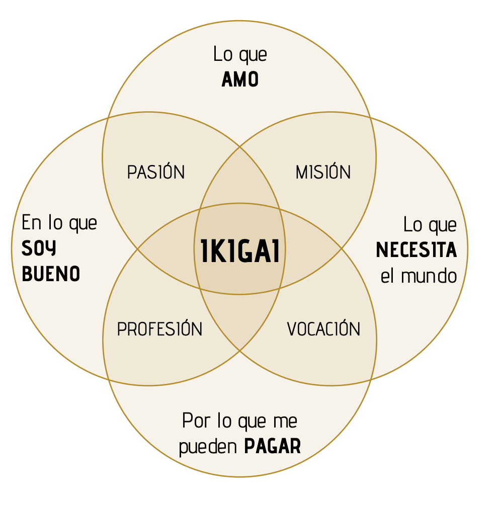

---
lang: es
title: "Descubre tu propósito en 9 pasos"
description: 'Guía práctica en 9 pasos, inspirada en Ikigai, para descubrir tu propósito personal y profesional y tomar decisiones alineadas.'
pubDate: 2025-06-24
tags:
  - "leadership"
  - "sw-craftsmanship"
heroImage: "images/proposito_sq.png"
---

## Guía para encontrar equilibrio personal y profesional

Hay momentos en la vida en los que sientes que algo no encaja. Haces muchas cosas pero ninguna te llena. Avanzas, sí, pero avanzas sin un rumbo claro.  
  
A veces esto es consecuencia de lo que se conoce como burnout. En otras palabras: estás quemado.

Pero otras muchas veces **lo que falta no es motivación, sino propósito.**

No traigo una receta mágica. Solo una guía sencilla para ayudarte a ordenar ideas y reconectar contigo.  
Está inspirada en el enfoque _ikigai_, concepto que ya exploré en profundidad, en este otro artículo:

[**Ikigai para desarrolladores de software**](https://jgcarmona.com/ikigai-para-desarrolladores-de-software/)

Si no conoces el concepto, te recomiendo leerlo. Pero tranquilo, no necesitas memorizar ningún diagrama para aplicar esta guía. El equilibrio no se encuentra fuera. Se construye dentro. Paso a paso.

## 9 pasos hacia tu propósito

Tu vida no se define solo por lo que haces.  
Se construye desde cuatro dimensiones fundamentales:

- 🔥**Energía**: lo que amas, lo que te da vida.

- 🌍**Impacto**: lo que el mundo necesita y tú puedes aportar.

- 💼**Valor**: aquello por lo que te pueden pagar.

- 🛠 **Talento**: lo que haces bien, incluso sin darte cuenta.

Cada una tiene fuerza por sí sola.  
Pero cuando empiezan a **interconectarse**, sucede algo poderoso:  
empiezas a ver con claridad. A tomar decisiones más alineadas.  
A caminar hacia tu **propósito**.

Este recorrido tiene **9 pasos**:  
Los primeros 4 pasos consisten en explorar cada dimensión.  
Los siguientes consisten en entender las intersecciones entre esas dimensiones, que nos revelan nuestra misión, vocación, profesión y pasión.  
Y al final, llegas al centro: **tu ikigai**.  
Tu propósito real, vivido. No teórico. No prestado.

Vamos paso a paso.

## Paso 1: Siente tu Energía

### Lo que amas

> _¿Qué te mueve de verdad? ¿Qué actividad te conecta contigo mismo, te recarga y te llena sin esfuerzo?_

Esto va más allá de lo que "te gusta". Tiene que ver con aquello que te enciende por dentro. Donde el tiempo vuela. Donde aparece la alegría sin necesidad de recompensa externa. No se trata solo de pensar qué es lo que te gusta, sino de **sentirlo** en el cuerpo, reconocer dónde está la alegría.

**Ejercicio**:  
Haz una lista de momentos donde sentiste plenitud, entusiasmo, flow.  
Pueden ser cosas grandes o pequeñas: dar clase, resolver un problema complejo, tocar música, conversar con alguien.  
No filtres. Solo escucha lo que enciende tu energía.

## Paso 2: **Detecta tu Impacto**

### Lo que el mundo necesita

> _¿Dónde puedes aportar algo que mejore la vida de otros? ¿Qué necesita tu entorno, tu equipo, tu sociedad… que tú puedes ofrecer?_

Aquí hablamos de sentido. De tu capacidad para contribuir. No te hablo de las consecuencias de tus actos, te hablo de las potenciales consecuencias de tus posibles actos. No tienes que "salvar el mundo", pero sí mirar más allá de ti mismo. Mira hacia afuera y detecta qué es lo que el mundo necesita de tí. ¿Dónde crees que puede ser útil y por qué?

**Ejercicio práctico**:  
Piensa en los problemas o necesidades que más te duelen al verlos y hazte preguntas como:

- ¿Qué injusticias me indignan?

- ¿Qué necesita mi comunidad? ¿Mi pueblo? ¿Mi país? ¿El mundo?

- ¿A qué acude la gente a mí? Es decir, ¿qué tipo de ayuda me pide la gente sin yo buscarlo?

¿Qué sucedería si actuaras? Ese podría ser tu impacto, tu manera de dejar huella.

## Paso 3: **Reconoce tu Valor**

### Por lo que te pueden pagar

> _¿Qué sabes hacer que tenga un valor económico real? ¿Qué podrías ofrecer como servicio o conocimiento por el que alguien pagaría honestamente?_

Este paso va de reconocer tu valor en el mercado. No es emocional, es estratégico. ¿Qué haces que otros necesitan y están dispuestos a pagar? Porque el valor a veces está delante de tus ojos, pero no lo estás viendo como tal. Tu propósito también debe permitirte vivir. Y eso exige ser consciente del valor que puedes generar para otros y para ti.

**Ponte a prueba**, haz un inventario contestando a estas preguntas:

- ¿Por qué te han pagado hasta ahora?

- ¿Qué habilidades tienes que resuelven problemas concretos?

- ¿Qué servicios podrías ofrecer tú, con tu experiencia actual?

Ese es tu valor, dale el reconocimiento que se merece.

## Paso 4: Desarrolla tu Talento

### En lo que eres bueno

> _¿Qué haces bien, de verdad, aunque no siempre lo reconozcas?_

Esta dimensión tiene que ver con tu maestría. Con todo eso que te sale de forma natural, o que dominas porque has invertido tiempo y esfuerzo en aprenderlo y practicarlo. Un maestro no nace, se hace. Por eso, si tienes un don, debes desarrollarlo o lo perderás.

Muchas veces, esos talentos, no coinciden exactamente con lo que amamos o por lo que nos pagan. Pero tu talento es tuyo. Sólo tuyo. Y vale la pena reconocerlo y desarrollarlo.

**Pero ¿Qué talentos tengo y cómo los desarrollo?**

- Piensa en elogios que has recibido. En cosas que otros te piden.

- En tareas que resuelves con solvencia, aunque no te parezcan especiales.

- Pregúntale a alguien de confianza:

> _“¿Qué crees que hago bien y que quizá yo no valoro suficiente?”_

## En busca de la claridad

Explorar las dimensiones es solo el principio.  
Ahora vamos a **conectar los puntos**. Vamos a combinar estas 4 dimensiones. **Energia**, **Impacto**, **Valor** y **Talento**, para intentar comprender los 4 pilares de nuestra vida. Los 4 pilares sobre los que se sustenta nuestro equilibrio. Lo que hemos venido a buscar. **Misión**, **Vocación**, **Profesión** y **Pasión**.

## Paso 5: Define tu Misión

### Energía + Impacto

**(Lo que amas + Lo que el mundo necesita)**

> _Cuando lo que te apasiona se convierte en algo útil para los demás, nace tu misión._

Cuando conectas lo que te apasiona con una necesidad real, **tu energía se transforma en acción con sentido**. Ahí empieza tu misión Es parte esencial de nosotros mismos porque le da forma externa (impacto) a una motivación interna (energía). No tiene que ser algo heroico. A veces nuestra misión puede consistir en mejorar la vida de un equipo, formar a alguien, resolver un problema que afecta a muchos.

**Ejercicio para descubrir tu misión**

Contéstame a esto:

- ¿Hay algo que te encanta hacer y que al mismo tiempo mejora o podría mejorar la vida de otros?

- ¿Podrías usar tu energía en proyectos o causas que aporten valor más allá de ti mismo?

- ¿Cómo sería tu semana si incluyera más acciones de este tipo?

## Paso 6: Descubre tu Vocación

### Impacto + Valor

**(Lo que el mundo necesita + Por lo que te pueden pagar)**

> _¿Y si pudieras servir al mundo y vivir de ello?_

Tu vocación no es solo lo que te gusta ni lo que haces bien. Es el punto donde tu impacto se vuelve sostenible. Donde aportar a otros deja de ser un esfuerzo extra… y se convierte en parte de tu modelo de vida.

No hace falta tenerlo todo claro. Pero si quieres avanzar hacia tu vocación, empieza por hacerte preguntas como estas:

- ¿Hay algo que haces que ya ayuda a otros?

- ¿Podrías profesionalizarlo sin perder tu esencia?

- ¿Qué necesitarías para convertir ese aporte en un camino estable?

Ahí empieza tu vocación: cuando lo que entregas también te sostiene.

## Paso 7: Construye tu Profesión

### Valor + Talento

**(Por lo que te pueden pagar + En lo que eres bueno)**

> _Tu profesión es donde tu habilidad genera ingresos. Es tu zona de solvencia._

Tu profesión empieza donde tu habilidad se convierte en servicio, en solución, en algo necesario para otros… y por lo que puedes cobrar. No todo lo que sabes tiene que monetizarse, pero si algo te sale bien y aporta valor real, ¿por qué no intentarlo? No siempre se puede, no siempre es fácil, pero te aseguro que habrá merecido la pena intentarlo.

**Y yo te pregunto:**

- ¿Qué sabes hacer con solvencia?

- ¿Está eso alineado con tu trabajo actual?

- ¿Estás cobrando lo justo por lo que aportas?

- ¿Hay una oportunidad que aún no estás viendo?

Construir una profesión es elegir tu terreno de juego.

## Paso 8: Cultiva tu Pasión

### Talento + Energía

**(En lo que eres bueno + Lo que amas)**

> _La pasión ocurre cuando disfrutas haciendo aquello que dominas._

Aquí nace el flow. El disfrute profundo. Y también la mejora constante. Porque cuando algo te entusiasma y te sale bien, te vuelves imparable. Si esa actividad ya forma parte de tu vida, cuídala. Si no, es momento de darle el espacio que merece.

¿Cómo lo hago?

- ¿Hay alguna actividad en la que pierdes la noción del tiempo, y además sabes que la haces bien?

- ¿La estás cultivando o la estás dejando para “cuando haya tiempo”?

- ¿Cómo podrías reservarle más espacio en tu semana?

## Paso 9: Encuentra tu Propósito

**(El centro de todo: tu ikigai)**

Llegados a este punto, probablemente te habrás dado cuenta de algo:  
estos cuatro pilares —energía, impacto, valor y talento— no son compartimentos estancos.

Se cruzan. Se mezclan. Se confunden.  
Lo que amas puede ser lo que haces bien.  
Lo que haces bien puede ser justo lo que el mundo necesita.  
Y aquello que el mundo necesita… puede ser lo que te permita vivir.

**No pasa nada si no puedes separar cada cosa con precisión quirúrgica.**  
No se trata de encajar piezas perfectas.  
Se trata de ver cómo, al cruzarse, te muestran algo mucho más valioso:  
una visión de ti mismo con sentido, con dirección y con coherencia.

Ese punto de encuentro es lo que en Japón llaman _**[ikigai](https://jgcarmona.com/ikigai-para-desarrolladores-de-software/)**_. Ya escribí sobre este concepto japonés en 2023, como parte de mi serie sobre **[filosofías japonesas para desarrolladores de software](https://jgcarmona.com/mejorar-en-programacion-con-filosofias-japonesas/).**

Pero no necesitas llamarlo así.

Puedes encontrarlo en una palabra, en una frase, en una sensación.  
Algo tan simple como:

> _“Acompaño a otros a crecer mientras crezco con ellos.”_  
> _“Construyo con las manos lo que imagino con el corazón.”_  
> _“Me levanto cada día sabiendo que mi trabajo importa.”_

Da igual el formato. Lo que importa es que **te haga sentir vivo y como en casa**. Que te recuerde para qué estás aquí, incluso cuando todo alrededor parezca caótico y sin sentido.

No es algo que aparece de golpe. Es algo que **construyes paso a paso**.

También es algo que evoluciona, igual que evolucionamos nosotros. Este ejercicio de autodescubrimiento, este viaje que acabas de hacer conmigo, de exploración, conexión y búsqueda de sentido, no termina aquí. No es un mapa fijo. Es una brújula interna que puedes consultar siempre que lo necesites. Es un lugar que debes buscar y al que puedes volver cada vez que lo necesites. Si te sientes perdido, el camino para encontrarte ya te lo he mostrado.

## ¿Y ahora qué?

Si has llegado hasta aquí, probablemente hay algo que no termina de encajar.  
Quizá sientes que podrías dar más… pero no sabes muy bien hacia dónde.  
O que has llegado lejos, pero te falta dirección.

No necesitas otra herramienta. Necesitas claridad.

Trabajo con líderes técnicos, arquitectos y profesionales del software que quieren reenfocar su carrera, reconectar con su motivación y avanzar con sentido.

Si estás en un momento de cambio o simplemente quieres parar y replantear tu rumbo, aquí tienes un punto de partida.

[Así trabajo con profesionales como tú](https://jgcarmona.com/coaching-lideres-tecnicos/)
