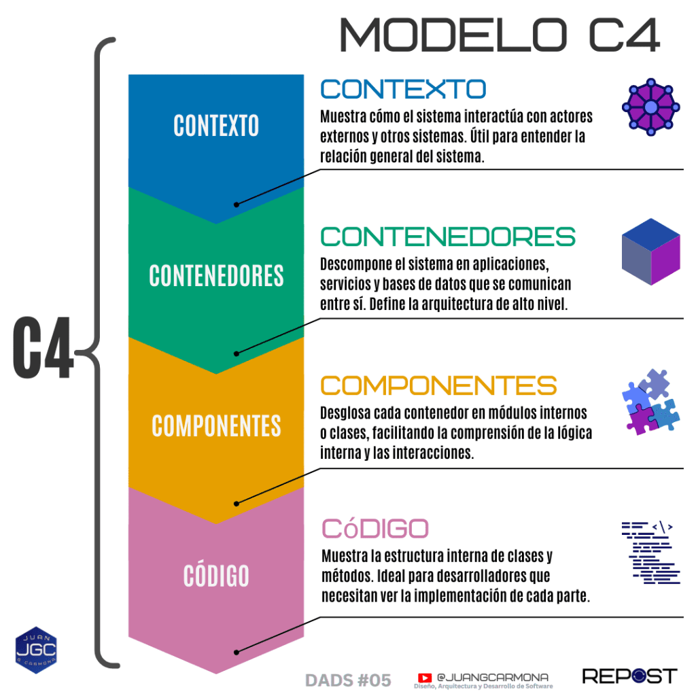
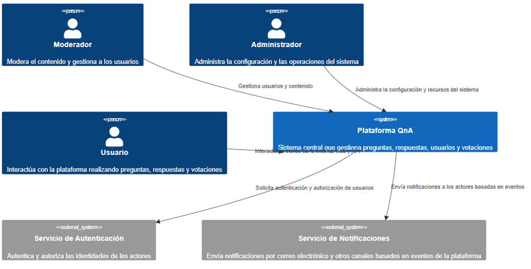
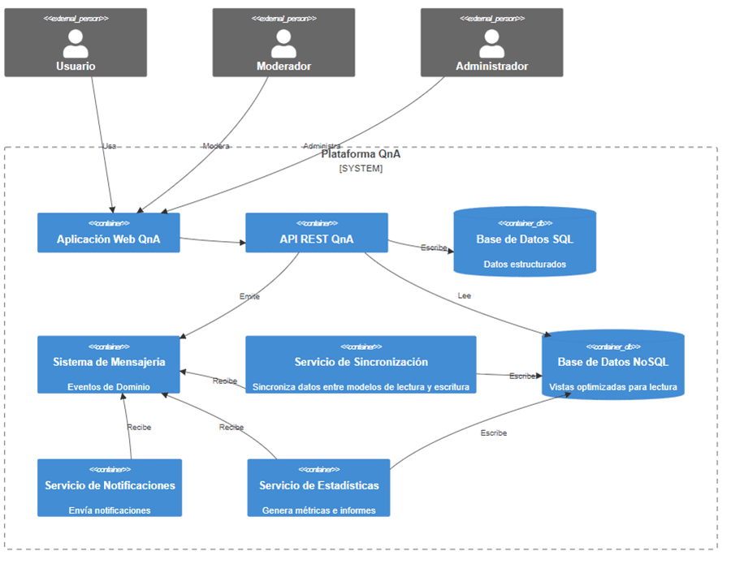
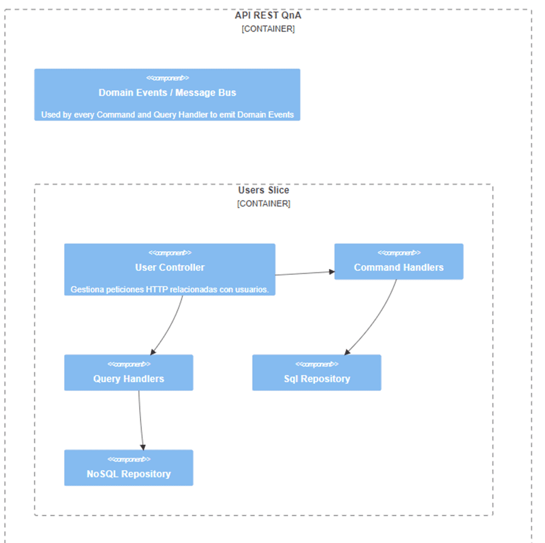
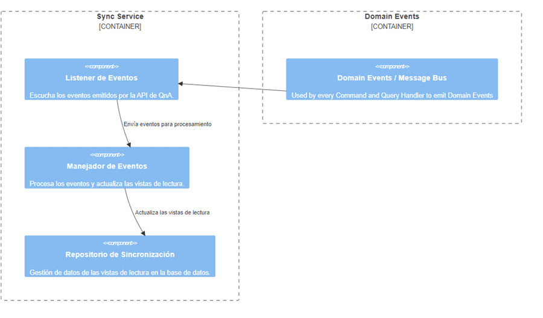
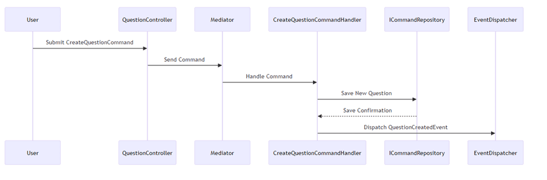
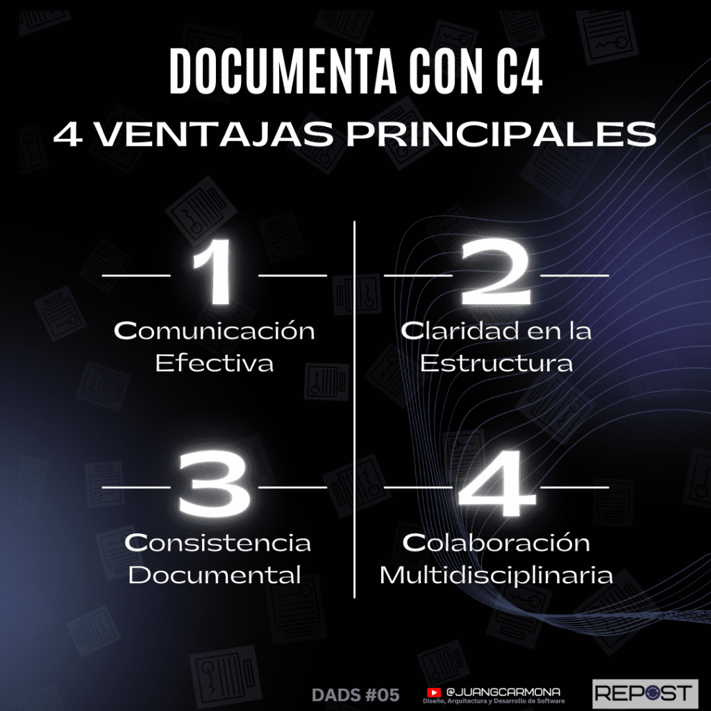

## Comunica mejor tu arquitectura de software con C4

En el mundo del desarrollo de software, la clave para el éxito no solo radica en escribir código eficiente, sino en **comunicar de manera clara la arquitectura del sistema**. Aquí es donde entra en juego el **Modelo C4**. Con esta poderosa herramienta, los **arquitectos de software** pueden representar visualmente la estructura de sus sistemas, facilitando la comprensión de todos los involucrados, desde desarrolladores hasta clientes. Si alguna vez has sentido que la documentación técnica te explota en las manos, el **modelo C4** es la solución que te ayudará a **comunicar mejor tu arquitectura de software** de forma sencilla, sin perder detalle.

## Haciendo que los sistemas no exploten en nuestras manos

Como arquitectos de software, nuestra misión es asegurarnos de que los sistemas que diseñamos no solo funcionen bien, sino que sean comprensibles y escalables. Un diseño de software que no se puede comunicar claramente puede volverse frágil, confuso y, eventualmente, explotar en nuestras manos cuando más lo necesitamos.

El **Modelo C4** nos da una herramienta visual poderosa para representar nuestras arquitecturas de una manera estructurada y, lo más importante, fácil de entender para cualquier tipo de audiencia.

## ¿Por Qué el Modelo C4 es Tan Poderoso?

El **Modelo C4** es una técnica de documentación que nos permite visualizar y comunicar los sistemas de software a diferentes niveles de abstracción. ¿Tienes que explicar la arquitectura a un desarrollador? ¿O quizá necesitas que los clientes no técnicos comprendan cómo interactúan los componentes del sistema? Con el C4, puedes mostrar desde una vista general hasta el detalle del código, todo de manera coherente y organizada.

## Desglosando el Modelo C4

El modelo C4 es una técnica visual poderosa que desglosa la arquitectura de un sistema en cuatro niveles diferentes de abstracción, cada uno con un propósito específico. Vamos a explorar cada uno de estos niveles para que puedas entender cuándo y cómo utilizar cada diagrama en tus proyectos.

### Nivel 1: Diagrama de Contexto

#### ¿Qué es el diagrama de contexto?

El diagrama de contexto es el nivel más alto del modelo C4. Representa el sistema de software dentro de su entorno, mostrando cómo interactúa con usuarios y otros sistemas externos. Este diagrama es útil para proporcionar una visión general del sistema sin entrar en demasiados detalles técnicos.

#### ¿Cuándo usarlo y qué comunicar?

El diagrama de contexto es ideal cuando necesitas explicar el alcance y las interacciones básicas del sistema a una audiencia no técnica o a personas que no están familiarizadas con los detalles del software. Ayuda a comunicar los límites del sistema y las relaciones clave con los actores externos, como usuarios y otros sistemas.

#### Ejemplo práctico de un sistema común.

Piensa en una plataforma de **Q&A** (preguntas y respuestas), donde los usuarios hacen preguntas y los moderadores supervisan las respuestas. El diagrama de contexto mostrará a los **usuarios** interactuando con la **plataforma de Q&A**, y la **plataforma** conectándose con servicios externos como **sistemas de autenticación** y **servidores de notificaciones**.

Diagrama de Contexto realizado com Mermaid ([original actualizado aquí](https://github.com/jgcarmona-com/ddd-cqrs-vsa-example/blob/main/docs/QnA_Arquitectura.md))

### Nivel 2: Diagrama de Contenedores

#### Descripción de los contenedores.

En este nivel, se descompone el sistema en varios contenedores lógicos o físicos, que pueden ser aplicaciones, bases de datos o servicios. Un "contenedor" en este contexto no se refiere solo a un contenedor de Docker, sino a cualquier componente mayor que realiza una función específica, como una **API**, un **frontend** o una **base de datos**.

#### Diferencia entre contenedores físicos y lógicos.

Los contenedores físicos son aquellos que realmente existen en servidores o infraestructura (como una **base de datos SQL**), mientras que los lógicos representan conceptos que pueden implementarse de distintas maneras (como una **API**). El diagrama de contenedores permite mostrar ambas versiones según sea necesario.

#### ¿Cómo conectar componentes clave en este nivel?

Este diagrama es ideal para mostrar cómo los contenedores clave del sistema interactúan entre sí. Por ejemplo, en una plataforma de **e-commerce**, se podría mostrar la interacción entre el **front-end de usuario**, la **API**, la **base de datos de productos**, y los **servicios de pago**.

Diagrama de Contenedores realizado com Mermaid ([original actualizado aquí](https://github.com/jgcarmona-com/ddd-cqrs-vsa-example/blob/main/docs/QnA_Arquitectura.md))

### Nivel 3: Diagrama de Componentes

#### Profundizando en los servicios y módulos.

En el diagrama de componentes, profundizamos en cada contenedor para ver qué **módulos internos** o **servicios** lo componen. Este nivel es muy útil para los desarrolladores, ya que describe las responsabilidades de cada parte del sistema y cómo interactúan entre ellas.

### ¿Qué muestra este diagrama y cómo ayuda a los desarrolladores?

El diagrama de componentes muestra la estructura interna de los contenedores y los módulos que realizan tareas específicas dentro del sistema. Para un desarrollador, este diagrama ayuda a comprender qué piezas de código manejan qué partes del sistema, permitiendo trabajar de manera más eficiente.

#### Ejemplo de un sistema de e-commerce o una plataforma Q&A.

En una plataforma **Q&A**, este diagrama podría descomponer la **API** en módulos específicos, como el **módulo de autenticación**, el **módulo de gestión de preguntas** y el **módulo de notificaciones**. Cada uno de estos módulos tendrá una función definida, facilitando la colaboración entre equipos de desarrollo.

Parte del diagrama de componentes del API REST. Detalle de Users Vertical Slice ([original actualizado aquí](https://github.com/jgcarmona-com/ddd-cqrs-vsa-example/blob/main/docs/QnA_Arquitectura.md))

Diagrama de Componentes del Servicio de Sincronización

### Nivel 4: Diagrama de Código

#### Bajando a lo más profundo: Clases, métodos y dependencias.

Este es el nivel más detallado del modelo C4, donde exploramos la estructura interna de las **clases**, **métodos**, y **dependencias** del código. Aunque no siempre es necesario, este diagrama es muy útil cuando el equipo de desarrollo necesita ver cómo funciona cada clase o componente del sistema en detalle.

#### ¿Cuándo es útil y cuándo evitar este nivel de detalle?

Estos diagramas son útiles en situaciones en las que se necesita depurar el código o analizar cómo interactúan los objetos y clases en un sistema. Sin embargo, no es necesario en la documentación diaria, ya que este nivel de detalle puede ser abrumador para quienes no están familiarizados con el código. Úsalo cuando haya una necesidad real de profundizar en la implementación.

#### Ejemplo de un Diagrama de secuencia

## Beneficios del Modelo C4

El modelo C4 no es solo una herramienta visual para arquitectos de software; es una metodología diseñada para hacer la vida más fácil a los equipos de desarrollo y stakeholders. Aquí vamos a desglosar dos de los principales beneficios que hacen del modelo C4 una elección poderosa en la documentación de sistemas complejos.

### Simplificación sin Pérdida de Información

#### Cómo C4 logra un balance entre simplicidad y detalle.

Uno de los mayores desafíos en la arquitectura de software es encontrar el equilibrio adecuado entre ofrecer suficiente información sin abrumar a la audiencia. El modelo C4 resuelve este problema al desglosar la arquitectura en cuatro niveles de abstracción. Esto permite que cualquier miembro del equipo acceda al nivel de detalle que le interese sin perder de vista la imagen general. Así, un CEO o un product manager puede ver un diagrama de contexto sin verse atrapado en detalles técnicos, mientras que un desarrollador puede profundizar en los componentes y el código cuando sea necesario.

#### Evitar la sobrecarga de información.

En la documentación tradicional de arquitectura, es fácil caer en el error de proporcionar demasiada información técnica desde el inicio. Esto puede generar confusión, especialmente para quienes no están familiarizados con el sistema o no tienen un perfil técnico. El modelo C4 ofrece una solución práctica: muestra la información relevante para cada audiencia, sin sobrecargarla con detalles innecesarios. Esto también permite que la documentación sea más accesible, lo que mejora su utilidad y reduce la resistencia a su uso por parte del equipo.

### Comunicación con Equipos Multidisciplinarios

#### C4 como un puente entre técnicos y no técnicos.

Uno de los mayores beneficios del modelo C4 es su capacidad para actuar como un lenguaje común entre equipos técnicos y no técnicos. Un arquitecto de software puede usar los diagramas de contenedores y componentes para discutir detalles técnicos con los desarrolladores, mientras que los diagramas de contexto son perfectos para comunicar las ideas clave a gerentes de producto o stakeholders. Este enfoque permite que todos los involucrados en un proyecto tengan una comprensión clara de cómo funciona el sistema, independientemente de su nivel de conocimiento técnico.

#### Ejemplo de un flujo de trabajo utilizando C4 en reuniones.

Imagina que estás en una reunión con el equipo de desarrollo, el equipo de ventas y el product manager. Usando el modelo C4, puedes comenzar mostrando un **diagrama de contexto** para que todos comprendan cómo el sistema interactúa con actores externos y otros sistemas. A medida que la conversación se vuelve más técnica, puedes profundizar en un **diagrama de contenedores**, donde el equipo de desarrollo puede entender mejor cómo los componentes clave del sistema se comunican entre sí. Así, logras que todos estén alineados y comprendan el sistema desde sus diferentes perspectivas, sin perder a nadie por el camino.

### Herramientas para Crear Diagramas C4

Una de las grandes ventajas del modelo C4 es su flexibilidad a la hora de elegir herramientas para crear los diagramas. Ya sea que prefieras herramientas de código o interfaces gráficas, hay opciones para cada estilo de trabajo. Vamos a comparar dos de las herramientas más populares para crear diagramas C4: **Mermaid** y **Draw.io**. ([Ya te hablé sobre estas herramientas la semana pasada](https://jgcarmona.com/uml-ddd-cqrs/))

### Mermaid y Draw.io

#### Comparación rápida de estas dos herramientas.

- **Mermaid** es una herramienta basada en código que permite generar diagramas directamente desde texto. Es especialmente útil cuando trabajas en repositorios de código como GitHub o GitLab, ya que puedes escribir tus diagramas directamente en Markdown y mantenerlos versionados junto con el código. Mermaid se integra fácilmente con plataformas que soportan Markdown y es ideal para desarrolladores que prefieren trabajar en un entorno de texto.

- **Draw.io** (ahora parte de diagrams.net) es una herramienta gráfica de arrastrar y soltar, perfecta para aquellos que prefieren una interfaz visual y que no requieren escribir código. Draw.io permite crear diagramas detallados y personalizables de forma rápida, con una curva de aprendizaje mínima. También ofrece integración con plataformas en la nube como Google Drive y GitHub para almacenar y versionar diagramas.

#### ¿Cuál elegir según el tipo de proyecto y equipo?

Si tu equipo ya está acostumbrado a trabajar con Markdown o si estás versionando tu documentación junto al código, **Mermaid** puede ser la mejor opción. Es ligera, sencilla y permite automatizar la creación de diagramas, manteniendo el formato de texto limpio. El único inconveniente es que a veces, al automatizar la distribución de los elementos visuales, no es 100% legible y puede ser tedioso llegar a tener un diagrama útil, si necesitas mucho detalle o tiene muchos elementos.

Por otro lado, si trabajas en un equipo más visual o con stakeholders que no son técnicos, **Draw.io** ofrece una interfaz más accesible para crear diagramas rápidamente sin necesidad de escribir código. Esta opción es ideal para presentaciones o documentación que será compartida con personas menos técnicas. Aquí el trabajo es mucho más manual, más artístico, y el resultado, mucho más atractivo, sin duda.

### Integración con Repositorios

#### Mantener la documentación viva usando diagramas junto al código.

Uno de los mayores retos de la documentación es mantenerla actualizada. Es muy fácil que los diagramas queden obsoletos si no se actualizan junto con el código. Herramientas como **Mermaid** permiten crear diagramas que se almacenan directamente en los archivos de texto del repositorio, lo que facilita que los cambios en el código se reflejen rápidamente en la documentación. Cada vez que se actualiza el código, puedes actualizar los diagramas para que siempre reflejen el estado actual del sistema.

#### Mejores prácticas para versionar diagramas y código juntos.

- **Versiona los diagramas en el mismo repositorio que el código**: Esto asegura que la documentación refleje la misma versión del código que los diagramas describen. Si trabajas en equipos ágiles, puedes hacer que los diagramas C4 sean parte del ciclo de entrega continua.

- **Automatiza la generación de diagramas**: Si estás utilizando herramientas como **Mermaid**, puedes automatizar la generación de los diagramas para que se actualicen cada vez que se realiza un commit o se ejecuta un pipeline CI/CD. Esto garantiza que los diagramas siempre estén sincronizados con el código.

- **Usa ramas para documentar cambios arquitectónicos**: Cuando se planifican cambios importantes en la arquitectura del sistema, puedes versionar los diagramas en ramas específicas junto al código que está en desarrollo. De esta manera, cuando los cambios se fusionen, la documentación estará lista y actualizada.

## C4 en Acción: Caso Práctico

### Implementación Real en Proyectos Complejos

El **modelo C4** no solo es una herramienta teórica. Su verdadero poder se ve reflejado cuando lo aplicamos en proyectos reales, especialmente en arquitecturas complejas como las que encontramos en plataformas de preguntas y respuestas (Q&A), sistemas de comercio electrónico o soluciones de gestión empresarial. Un gran ejemplo de esto es la plataforma **QnA**, diseñada bajo principios de **Domain-Driven Design (DDD)** y patrones avanzados como **CQRS** y **Event Sourcing**.

#### Arquitectura de una Plataforma Q&A con C4

En el caso de la plataforma **QnA**, hemos utilizado el modelo C4 para documentar y comunicar la arquitectura en sus distintos niveles. Cada uno de los diagramas permite visualizar diferentes aspectos del sistema, desde cómo interactúa con los usuarios, hasta cómo se gestionan los eventos y se sincronizan los modelos de lectura y escritura.

Por ejemplo, en el **Diagrama de Contexto**, identificamos los actores principales (usuarios, moderadores, administradores) y sus interacciones con el sistema central.

En el **Diagrama de Contenedores**, mostramos cómo los servicios como la API de QnA, el Servicio de Notificaciones, y el Servicio de Sincronización se comunican entre sí, manteniendo el sistema cohesionado y eficiente.

#### Documentar Sistemas Basados en DDD y CQRS con C4

**DDD** y **CQRS** son patrones que, si bien aportan gran claridad y separación de responsabilidades, también introducen complejidad en la arquitectura. Aquí es donde el modelo C4 realmente brilla: cada diagrama nos permite visualizar los diferentes niveles de la arquitectura sin perdernos en los detalles, manteniendo la simplicidad necesaria para que cualquiera pueda entender el sistema, pero con suficiente profundidad para desarrolladores y arquitectos.

1. **Diagrama de Componentes**: En sistemas basados en DDD, cada agregación del dominio puede representarse como un "slice vertical", separando las capas de comandos y consultas. El modelo C4 nos permite visualizar claramente cómo estos "slices" están organizados en la arquitectura, y cómo interactúan entre sí a través del bus de eventos.

3. **Diagrama de Código**: Al profundizar en los patrones de diseño, como el **Patrón Mediator**, podemos representar la estructura interna de cada clase o módulo, facilitando la colaboración entre los desarrolladores. Este nivel de detalle es crucial para los equipos técnicos, ya que pueden ver de manera clara cómo se implementan los comandos y las consultas.

#### **Explora un Caso Real en GitHub**

Si estás interesado en ver cómo aplicar C4 para documentar un sistema real, te invito a que explores el **repositorio de GitHub** donde se detalla la arquitectura de la plataforma **QnA**. Este repositorio no solo muestra los diagramas, sino también la implementación de **DDD**, **CQRS**, y **Event Sourcing** utilizando tecnologías modernas como .NET Core, RabbitMQ, y MongoDB.

**Accede al repositorio aquí**: [DDD-CQRS-VSA Example - GitHub](https://github.com/jgcarmona-com/ddd-cqrs-vsa-example/blob/main/docs)

Al examinar el código y la documentación en el repositorio, podrás ver cómo los diagramas C4 ayudan a simplificar la comunicación de la arquitectura, permitiendo que todo el equipo, desde desarrolladores hasta stakeholders, comprendan fácilmente cómo funciona el sistema.

## **C4: La Arma Secreta de los Arquitectos**

El modelo C4 no solo te proporciona una herramienta para documentar, sino que también transforma la manera en que trabajas en equipo y diseñas tus sistemas. Al implementar C4, puedes disfrutar de **Comunicación**, **Claridad**, **Consistencia**, y **Colaboración** en cada fase de tu proyecto.

- **Comunicación Efectiva**: C4 te permite alinear a todo el equipo, desde desarrolladores hasta stakeholders, utilizando un lenguaje visual comprensible para todos. Es una manera poderosa de compartir una visión clara de tu arquitectura sin caer en detalles innecesarios.

- **Claridad en la Estructura**: Gracias a su enfoque en niveles progresivos, puedes acercarte a los detalles con **Claridad**, manteniendo siempre una visión global. Ya sea que diseñes una API o un sistema completo, C4 te da la flexibilidad de mostrar solo lo que necesitas en cada nivel.

- **Consistencia en la Documentación**: C4 asegura una **Consistencia** que facilita la comprensión de los sistemas, permitiendo que los equipos mantengan una referencia constante, ya sea para discutir arquitecturas o hacer ajustes.

- **Colaboración Multidisciplinaria**: C4 fomenta la **Colaboración** entre distintos roles, desde los diseñadores hasta los desarrolladores y gerentes de producto, asegurando que todos comprendan el mismo mapa de ruta arquitectónico.

¿Ya estás usando C4 en tus proyectos? Si no, ¡es hora de empezar a explotar todo su potencial y mejorar la manera en que construyes y documentas tus sistemas!

Puedes tener otro punto de vista sobre este tema en éste vídeo:

https://youtu.be/Y\_kk7aZ5x28

Como ves he estado entrenido y me lo he pasado bomba 💣 con este capítulo de DADS.
