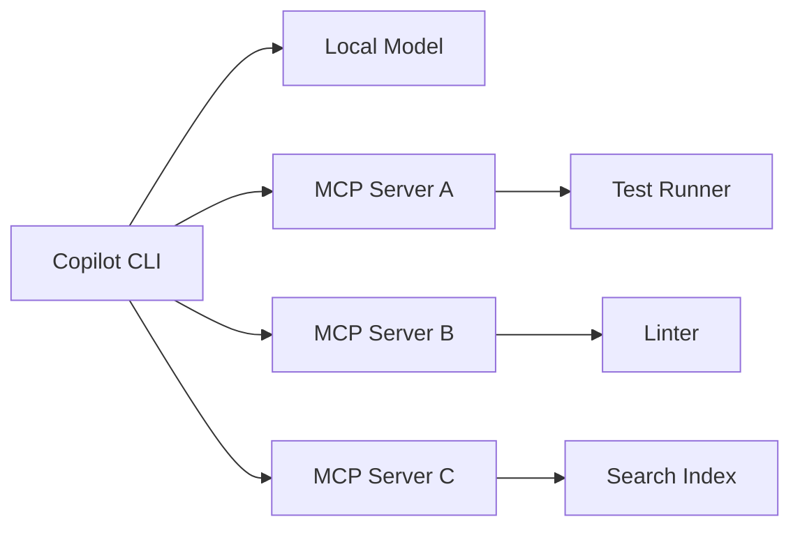

> This is article 3 of a series. Start with [Mayday! We're Running Out of Fuel!](/en/may-day/) for the manifesto, or [How I Set Up GitHub Copilot CLI on Local Hardware](/en/github-copilot-local-setup/) for the setup story.

In the [setup guide](https://jgcarmona.com/en/github-copilot-local-setup/) I showed how to get Copilot CLI talking to a local LLM. Great. You have a terminal agent running on your hardware. Now what?

A local model, by itself, is just a token generator. It predicts the next word. That's all it does. What turns it into a development tool is giving it *actions*. The ability to read files, run commands, execute tests, lint code, search context. That's what MCP does.

## What is MCP?

MCP (Model Context Protocol) is an open protocol that lets AI agents call external tools through a standardized JSON-RPC interface. Think of it as a plugin system for AI models.

Each MCP server exposes a set of tools with typed schemas. The agent discovers these tools, decides when to use them, and invokes them during a conversation. The result flows back into the model's context.



The model does not need to know how to run tests. It needs to know that there is a tool called `run_tests` and what schema it expects. The MCP server handles the execution. The model handles the orchestration.

## Why MCP matters more for local models

Let me tell you something that took me a while to understand: MCP is *even more important* when you run a local model than when you run a cloud frontier model.

Cloud models like GPT-4 or Claude can often brute-force their way through tasks with sheer reasoning power. They can generate code, predict test outcomes, imagine file contents, and sometimes get it right purely from internal knowledge.

A local 7B or 27B model cannot do that as reliably. Its reasoning is more fragile. Its internal knowledge is smaller. Its context window is shorter.

But a local model that can *check* its work is a completely different animal. If it can run the tests after writing code, it can iterate. If it can lint its output, it can fix itself. If it can search the codebase for relevant context, it does not need to hallucinate it.

Tool access compensates for weaker reasoning. I learned this the hard way after watching my local model hallucinate file paths that didn't exist, when all it needed was a search tool to find the real ones.

## Setting up MCP servers

Copilot CLI discovers MCP servers from a configuration file. You can register them globally or per-project.

### Global configuration

```bash
copilot mcp add --name test-runner --command "node" --args "/path/to/test-server.js"
```

Or edit the config directly at `~/.copilot/mcp-config.json`:

```json
{
  "servers": {
    "test-runner": {
      "command": "node",
      "args": ["/path/to/test-server.js"]
    },
    "linter": {
      "command": "python",
      "args": ["-m", "lint_mcp_server"]
    }
  }
}
```

### Per-project configuration

Create `.copilot/mcp.json` in your repository root:

```json
{
  "servers": {
    "project-tools": {
      "command": "npx",
      "args": ["my-project-mcp-server"]
    }
  }
}
```

Per-project servers are only available when Copilot runs inside that repository. That's useful for domain-specific tools.

## Practical MCP examples

### Test runner

An MCP server that wraps your test framework. When the agent writes or modifies code, it can run the tests immediately and see what breaks.

```json
{
  "name": "run_tests",
  "description": "Run the project test suite and return results",
  "parameters": {
    "type": "object",
    "properties": {
      "filter": {
        "type": "string",
        "description": "Optional test name filter"
      }
    }
  }
}
```

The agent writes a function, calls `run_tests`, sees a failure, reads the error, fixes the code, runs tests again. That's a feedback loop. That's actual engineering happening without you babysitting every step.

### Linter / formatter

An MCP that runs ESLint, Pylint, Ruff, or whatever your project uses:

```json
{
  "name": "lint_file",
  "description": "Run linting on a file and return diagnostics",
  "parameters": {
    "type": "object",
    "properties": {
      "filePath": { "type": "string" }
    },
    "required": ["filePath"]
  }
}
```

The agent writes code and immediately checks it against your project's style rules. No more reviewing AI output for formatting issues.

### Semantic search

This is where things get really interesting. An MCP server that indexes your codebase with embeddings and retrieves relevant snippets:

```json
{
  "name": "search_codebase",
  "description": "Search the codebase for code or documentation matching a query",
  "parameters": {
    "type": "object",
    "properties": {
      "query": { "type": "string" }
    },
    "required": ["query"]
  }
}
```

Instead of dumping your entire repository into the context window (which would blow up memory on a local model), you let the agent search for what it needs. It asks for "authentication middleware" and gets back the three files that matter.

This is RAG, but integrated into the agent loop. The model does not need to hold everything in context. It just needs to know how to ask for it.

### Policy checker

An MCP that scans for secrets, license violations, forbidden patterns, or security issues:

```json
{
  "name": "check_policy",
  "description": "Scan files for policy violations (secrets, licenses, security)",
  "parameters": {
    "type": "object",
    "properties": {
      "paths": {
        "type": "array",
        "items": { "type": "string" }
      }
    },
    "required": ["paths"]
  }
}
```

This is validation pressure. The agent cannot push code that violates policy because the tool will catch it. You don't need the model to be smart about security. You need the tool to be strict.

## The agent loop with MCP

When Copilot CLI has MCP tools available and the model supports tool-calling (which is why I run vLLM with `--enable-auto-tool-choice`), the agent can work autonomously. It searches the codebase for relevant files, reads them, writes or modifies code, runs the tests, sees what breaks, fixes it, checks linting, and verifies again.

That's a real feedback loop. The model is not just generating text and hoping for the best; it's operating in a constrained environment where it sees the results of its own actions.

And the constraint is the point. Constraints make agents predictable, and predictability is what makes them actually useful in a real workflow.

## Local model limitations with tool-calling

I won't sugarcoat this. Tool-calling is where smaller local models struggle the most.

Common issues:

- **Generating malformed JSON** instead of valid tool calls
- **Calling tools with wrong parameters** or inventing parameter names
- **Not knowing when to stop** calling tools and over-iterating
- **Ignoring tool results** and hallucinating instead

This is why model choice matters. Not every instruct model handles tool-calling well. For vLLM, you need a model trained for structured output (Qwen 3.x, Mistral with function calling, etc.) and you need the right `--tool-call-parser` flag.

With llama.cpp, tool-calling support is more experimental. Some models work. Some don't. Test before committing.

The good news is that tool-calling quality has improved dramatically in the last year. Models like Qwen 3 are genuinely good at it. The bad news is that you still need to test with your specific model and your specific tools.

## MCP and custom instructions: better together

MCP tools work best when combined with [custom instructions](https://jgcarmona.com/en/copilot-instructions-agents-skills/) that tell the agent *when* and *how* to use them.

For example, your `copilot-instructions.md` might say:

```markdown
## Workflow rules
- Always run `lint_file` after modifying any TypeScript file
- Always run `run_tests` before considering a task complete
- Use `search_codebase` before creating new files to check for existing implementations
```

This turns MCP tools from "available options" into "enforced workflow steps." The model does not need to figure out when to lint. You told it to lint after every edit. That is predictability, and that is the actual goal.

## My take

MCP is the mechanism that turns a local model from "interesting experiment" to "daily tool." Without tools, a local model is just a chatbot that lives on your GPU. With tools, it becomes an agent that can verify its work.

And the less powerful your model is, the more it needs tools. That's counterintuitive but true. A brilliant model can sometimes get away with pure reasoning. A modest model needs guardrails and feedback loops.

Give it tools. Give it rules. Give it constraints. You're not limiting the model, you're building an engineering system around it. And that's the whole point of this series.

## This series

1. [Mayday! Mayday! We're Running Out of Fuel!](/en/may-day/) — the manifesto
2. [How I Set Up GitHub Copilot CLI on Local Hardware](/en/github-copilot-local-setup/) — setup and wiring
3. **You are here** — MCP Is How Local Copilot Becomes Useful
4. [Copilot Instructions, Agents, and Skills](/en/copilot-instructions-agents-skills/) — governance
5. [Running SDD Workflows with Local Copilot](/en/copilot-cli-sdd-workflows/) — specification-driven development
6. [VSCode Agents Window: An AI Harness Inside Visual Studio Code](/en/vscode-agents-window/), the convergence

## References

- [How I Set Up GitHub Copilot CLI on Local Hardware](https://jgcarmona.com/en/github-copilot-local-setup/) -> the setup and wiring guide
- [Model Context Protocol specification](https://modelcontextprotocol.io/) -> the protocol itself
- [Mayday! We're Running Out of Fuel](https://jgcarmona.com/en/may-day/) -> why cost control matters
- [Local LLMs Under the Hood](https://jgcarmona.com/en/local-llms-under-the-hood/) -> the inference pipeline

---

Remember:

> ## Your AI. Your rules.
