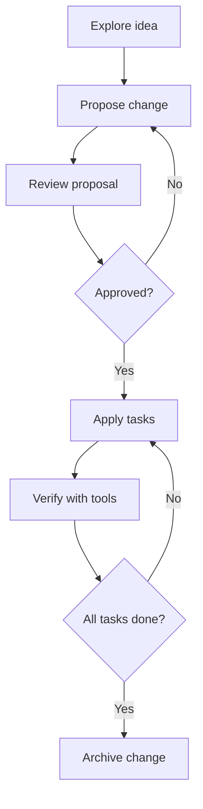

# Running SDD Workflows with Local Copilot

> This is article 5 of a series. Start with [How I Made GitHub Copilot CLI Mine](https://jgcarmona.com/en/github-copilot-cli-with-local-llms-and-sdd/) for the full picture.

I already wrote about Spec-Driven Development extensively:

- [Spec-Driven Development: Controlling AI-Generated Drift](https://jgcarmona.com/en/spec-driven-done-right/) covers the conceptual starting point: what SDD is, why drift is dangerous, and how specifications act as semantic anchors.
- [Moving Toward Spec-Driven Development with OpenSpec or Spec Kit](https://jgcarmona.com/en/moving-toward-spec-driven-development/) covers the practical landing: the two frameworks, how they compare, and how I actually use them.

I am not going to repeat any of that here. Go read those articles if you need the foundations.

What I want to do in this article is show how Copilot CLI, running against a local model, becomes a natural host for SDD workflows. And why the economics of local inference make this approach practical in ways that cloud billing never could.

## The connection

SDD says: separate *what/why* from *how*. Write specifications that define intent. Let agents handle implementation. Use specs as living artifacts that govern the whole lifecycle.

Copilot CLI says: here is a terminal agent with file access, shell commands, MCP tools, custom instructions, and skills.

The connection is obvious. Copilot CLI is the execution engine. SDD is the methodology. They fit together naturally.

But there's a third piece: cost. SDD is inherently iterative. You propose, you refine, you apply, you verify, you archive. Each step involves the model reading context, generating artifacts, checking results. On cloud billing, that iteration has a cost you feel. On local hardware, that cost is amortized.

That changes how much you dare to iterate. And iteration quality is what separates good specifications from rubber-stamp documents.

## The OpenSpec flow on this blog

On this very blog, I have [OpenSpec](https://github.com/Fission-AI/OpenSpec) installed with four skills:

### 1. Propose

I tell the agent what I want to build. The agent reads the skill, follows the protocol, and produces:

- A `proposal.md` with context, motivation, and scope
- A `design.md` with architecture decisions and trade-offs
- A `tasks.md` with ordered implementation steps
- Spec files under `specs/` for each significant component

All of this lands in `openspec/changes/<change-name>/`.

The key difference from just asking a chatbot to "write a plan" is that the output follows a schema. Every proposal has the same structure. Every task list uses the same format. The agent does not freestyle. It follows the protocol defined in the skill.

### 2. Apply

Once I'm happy with the proposal, I tell the agent to apply it. The agent reads `tasks.md`, picks up each task in order, and implements it: creating files, modifying code, running validations.

Between each task, it can check its work using [MCP tools](https://jgcarmona.com/en/copilot-cli-mcp-tools/) (run tests, lint, search) and consult [custom instructions](https://jgcarmona.com/en/copilot-instructions-agents-skills/) to ensure it respects project conventions.

The agent does not need to be brilliant. It needs to follow the plan and use the tools. That is a much easier problem.

### 3. Explore

Sometimes I don't know what I want yet. The explore skill is a thinking partner: I describe a problem or an idea, and the agent helps me investigate, clarify requirements, and prototype approaches before committing to a formal proposal.

This is where local inference really shines. I can have long, exploratory conversations without watching a billing meter. I can iterate freely, discard bad ideas, and refine good ones. The cost is my electricity bill.

### 4. Archive

When implementation is complete and verified, the archive skill moves the change from `openspec/changes/` to `openspec/changes/archive/` with a date prefix. The specs become historical records. The tasks become a completed checklist.

This closes the loop: propose, apply, verify, archive. A complete lifecycle from idea to documentation.

## What the flow actually looks like

Here's a real session from this blog. I wanted to add tag-based navigation:

```
$ copilot-local

> /read openspec/changes/add-tag-graph/proposal.md

> Apply the tasks from add-tag-graph. Start with task 1.
```

The agent reads the proposal, picks up task 1, checks the project structure via instructions, creates the component, runs linting, moves to task 2. Each step is traceable. Each artifact is versioned.



That is a development workflow. Not a chat session.

## Specs as context anchors

One of the most important ideas from SDD is that specifications serve as context anchors for agents. Instead of re-explaining your intent every time you start a new session, you point the agent at the spec.

The spec contains:

- What the feature does
- Why it exists
- What constraints it has
- How it should be tested
- What it should never break

That is structured context. And structured context is exactly what smaller local models need because they cannot infer your intent from a vague prompt the way a frontier model sometimes can.

When I come back to a feature after a week, I don't need to re-explain the whole thing. I point at the spec. The agent reads it. The context is restored. We continue.

## Why local makes SDD practical

Let me be specific about the economics.

A typical propose-apply-archive cycle on this blog involves:

- Reading 5-10 files for context
- Generating 3-4 spec/task documents
- Implementing 5-15 file changes
- Running validations after each change
- Archiving the completed work

On a cloud API, that's maybe 50-100K tokens of input and 20-40K tokens of output per cycle. At current API prices, that's a few dollars per feature. Manageable for one feature, but it adds up fast when you iterate on multiple changes per day.

On my A6000 with vLLM, the same cycle costs me electricity. The GPU was already paid for. The cost per iteration is effectively zero marginal.

That means I can:

- Propose, reject, and re-propose without guilt
- Run exploration sessions that go nowhere and that's fine
- Iterate on specs until they're actually good, not just "good enough for the price"
- Let the agent make mistakes, fix them, and learn the codebase through trial and error

That's the real benefit of local inference for SDD. Not ideology. Not privacy (though that's nice). The freedom to iterate without a meter running.

## Spec Kit as an alternative

I covered Spec Kit in [Moving Toward SDD](https://jgcarmona.com/en/moving-toward-spec-driven-development/). It's a different approach to the same goal: convention-based, lighter weight, using `.spec.md` files co-located with code instead of a centralized `openspec/` directory.

Both work with Copilot CLI. The choice depends on your project:

- **OpenSpec** for projects with formal change management and audit trails
- **Spec Kit** for projects that want lightweight, file-adjacent specs

On this blog I use OpenSpec because I like the centralized proposal/archive flow. On other projects I use Spec Kit's co-located approach. The agent doesn't care. It follows whichever protocol the skill defines.

## My practical take

SDD is not a methodology for people who have time. It's a methodology for people who have agents. The agent does the mechanical work of generating specs, implementing tasks, and verifying results. You do the thinking: deciding what to build, reviewing proposals, approving changes.

And when the agent runs on your own hardware, the cost barrier disappears. You can iterate freely. You can be rigorous without being expensive. You can run the full propose-apply-archive loop on every feature, not just the important ones.

That is what changes when you combine local Copilot with specification-driven development.

Not a new paradigm. Not a revolution. Just a practical workflow that becomes affordable when you own the inference.

## This series

1. [How I Made GitHub Copilot CLI Mine](https://jgcarmona.com/en/github-copilot-cli-with-local-llms-and-sdd/) — the manifesto and real setup story
2. [Running GitHub Copilot CLI Against a Local LLM](https://jgcarmona.com/en/copilot-cli-local-llm-setup/) — the complete wiring guide
3. [MCP Is How Local Copilot Becomes Useful](https://jgcarmona.com/en/copilot-cli-mcp-tools/) — tools, not magic
4. [Copilot Instructions, Agents, and Skills: The Missing Control Layer](https://jgcarmona.com/en/copilot-instructions-agents-skills/) — the control surface
5. **You are here** — Running SDD Workflows with Local Copilot

## References

- [How I Made GitHub Copilot CLI Mine](https://jgcarmona.com/en/github-copilot-cli-with-local-llms-and-sdd/) — the setup story
- [Spec-Driven Development: Controlling AI-Generated Drift](https://jgcarmona.com/en/spec-driven-done-right/) — SDD foundations
- [Moving Toward SDD with OpenSpec or Spec Kit](https://jgcarmona.com/en/moving-toward-spec-driven-development/) — frameworks and practical usage
- [MCP Is How Local Copilot Becomes Useful](https://jgcarmona.com/en/copilot-cli-mcp-tools/) — the tool layer
- [Copilot Instructions, Agents, and Skills](https://jgcarmona.com/en/copilot-instructions-agents-skills/) — the control surface
- [OpenSpec](https://github.com/Fission-AI/OpenSpec) — lightweight SDD framework
- [Local LLMs Under the Hood](https://jgcarmona.com/en/local-llms-under-the-hood/) — why iteration is bounded by hardware

---

Remember:

> ## Your AI. Your rules.
