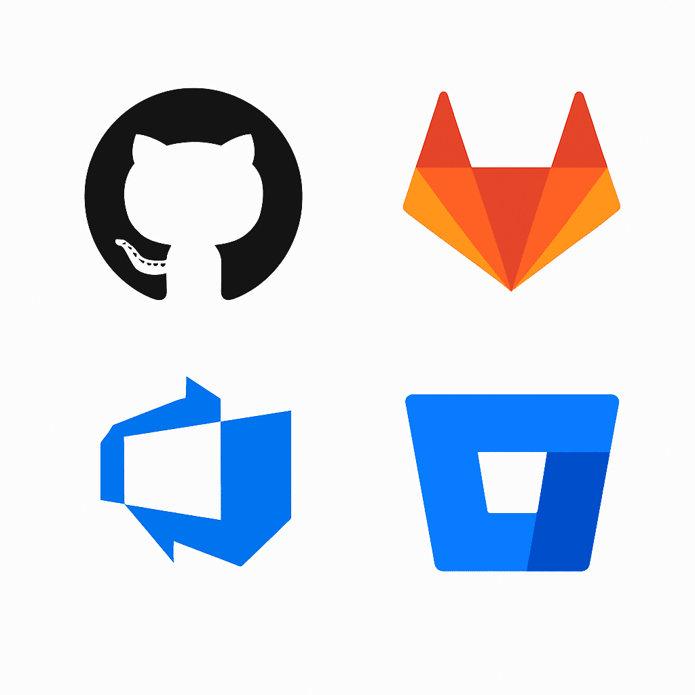

## _Guía práctica para mejorar tu flujo de trabajo en GitHub, GitLab o Azure DevOps_

**Crear pull requests y hacer revisiones de código son dos de las prácticas más potentes que hay para mejorar tanto la calidad del código como el trabajo en equipo de desarrolladores y arquitectos de software.**

A menudo, estas prácticas se convierten en un trámite, en una rutina, y dejan de tener el impacto positivo para lo que fueron diseñadas.

Con esta breve guía quiero ayudarte a crear pull requests claros y a hacer revisiones de código útiles y respetuosas. Todo con ejemplos prácticos y aplicable en GitHub, GitLab, Azure DevOps o donde tú trabajes.

Aprender a **crear pull requests y hacer revisiones de código** de forma efectiva puede marcar la diferencia en la calidad del producto y la velocidad del equipo.

## Cómo crear un buen Pull Request

### 1\. Revísalo tú el primero

Sí, tú.

Llevas horas o días trabajando en lo mismo y quieres cambiar de tarea pero antes de pedir feedback, tienes que ser el primero en revisar tu PR. Navega por los cambios. Relee tu código como si fueras otra persona, con ojo crítico.

  
¿Está claro el por qué de cada cambio? ¿Hay algo que puedas simplificar? ¿Te chirría alguna parte?

Si dudas tú, quien lo revise también lo hará. Seguro que se te ocurre algún otro commit extra.

### 2\. Escribe una buena descripción

No subas un PR sin descripción. Añade contexto:

- Qué has cambiado

- Por qué

- Qué necesita atención especial

- A qué ticket(s), tarea(s) o issue(s) está vinculado

Porque una buena descripción ahorra tiempo y evita malentendidos.

### 3\. Hazlo digerible

No hay un tamaño ideal para un PR, aunque otros te recomendarán hacerlo entre 200 y 400 líneas. Creo que lo que debe hacer un PR es estar bien contextualizado, como te dije antes, y debe ir al grano, no acometer micro PRs ni PRs enormes.

¿400 líneas? Aceptable. ¿1.200 con cambios en 74 ficheros? Es un infierno que pocos mirarán con atención. Divide y vencerás.

Y si no es posible, pide más revisores.

### 4\. Automatiza lo que puedas

Lint, build, tests, análisis estático… Deja que las máquinas revisen todo eso. Para algo existen las pipelines de Integración Contínua. No obligues a nadie a comentarte que te falta documentación de clase o métodos.

### 5\. Pide feedback útil

Un buen feedback comienza con una buena petición. Sé específico, puedes concretar y decir:

- “¿Puedes revisar la lógica de negocio?”

- “¿Qué te parece esta aproximación para desacoplar esta parte?”

- "Por favor, puede que la clase X podamos plantearla de otra forma."

## Cómo hacer revisiones de código que suman, no que desgastan

### 1\. Tómate tu tiempo

Lee todo, con calma. No supongas: entiende. Y pregunta si algo no te cuadra. Con algunas herramientas puedes hacerlo sobre el código.

Sé respetuoso con el trabajo de tus compañeros. Un “LGTM” (Looks Good To Me) a los 5 minutos no es una revisión, significa que te da igual y es una falta de respeto.

### 2\. Busca valor, no errores menores

No se trata de corregir variables mal nombradas, que también (aunque esto se puede automatizar). Se trata de mirar y verificar:

- Arquitectura

- Lógica

- Claridad

- Tests

- Posibles errores o mejoras

Ahí está el valor.

### 3\. Comenta con respeto

Habla del código, no del autor.

Igual que antes, sé respetuoso y evita el “esto está mal”. Di mejor “¿Qué te parece si lo separamos en dos funciones para que sea más claro?” o, también “No entiendo esta parte, ¿podrías explicarla?”

Y cuando hagas una sugerencia del tipo "Esto yo lo haría así", explica el _por qué_ de tu sugerencia.

### 4\. Reconoce lo bien hecho

Una revisión solo con críticas desgasta. A nadie le gusta que critiquen su trabajo, ¿verdad? Por eso mismo, cuando algo está bien pensado, bien diseñado o bien implementado, simplemente dilo. Reforzar lo positivo también es liderar.

### 5\. No bloquees por detalles

Si el código está bien, funcional y entendible, apruébalo.  
No persigas la perfección absoluta. Apruébalo. No mates el flujo por detalles menores.

### 6\. Aprende mientras revisas

Revisar código ajeno es una forma increíblemente valiosa y una oportunidad muy potente de aprender patrones, ideas, nuevas formas de pensar y errores que evitar.

Las revisiones de código no son una carga: son una inversión.

## Herramientas para revisar código en equipo

Si trabajas en equipo, probablemente uses una de estas plataformas para tus PRs. Todas permiten comentar, aprobar y automatizar… pero con matices.

Aquí tienes una comparativa rápida:

| **Funcionalidad** | **[GitHub](http://GitHub.com)** | **[GitLab](http://GitLab.com)** | **[Azure DevOps](https://azure.microsoft.com/en-us/products/devops/)** | **[Bitbucket](https://bitbucket.org/)** |
| --- | --- | --- | --- | --- |
| Pull/Merge Requests | ✅ | ✅ | ✅ | ✅ |
| Comentarios por línea | ✅ | ✅ | ✅ | ✅ |
| Sugerencias de cambio directo | ✅ | ✅ | ❌ | ✅ |
| Resolución de conversaciones | ✅ | ✅ | ✅ | ✅ |
| Aprobaciones por usuario/equipo | ✅ | ✅ | ✅ | ✅ |
| CI/CD integrado | ✅ | ✅ | ✅ | ✅ |
| Checks obligatorios antes de merge | ✅ | ✅ | ✅ | ✅ |
| Varios revisores | ✅ | ✅ | ✅ | ✅ |
| Draft/WIP PRs | ✅ | ✅ | ✅ | ✅ |
| Plantillas de PR | ✅ | ✅ | ❌ | ❌ |
| Protección de ramas | ✅ | ✅ | ✅ | ✅ |
| Analítica de revisiones | ❌ | ✅ | ✅ | ❌ |

**Resumen rápido**:

- **GitHub**: rápido, pulido, con sugerencias inline y buen soporte CI (Actions).

- **GitLab**: ideal para equipos DevOps, con pipelines y control total.

- **Azure DevOps**: potente pero más corporativo; algunas cosas son más limitadas.

- **Bitbucket**: funcional, pero menos maduro en analítica y PR templates.

## Revisión de código = cultura técnica

Las buenas revisiones de código no son solo cuestión de técnica.  
Son cultura. Confianza. Responsabilidad compartida.

Un equipo que revisa bien, crece.  
Un equipo que solo aprueba por rutina, se estanca.

## ¿Te gustaría mejorar este proceso en tu equipo?

Las revisiones de código pueden ser una palanca de crecimiento o un punto de fricción constante. Depende de cómo las gestiones.

Si quieres mejorar la cultura técnica de tu equipo, formar a tus developers o profesionalizar los procesos de revisión, puedo ayudarte.

A tí o a todo tu equipo.

[Coaching y mentoría para líderes técnicos y equipos dev](https://jgcarmona.com/coaching)

**Sesiones prácticas, para mejorar desde el primer sprint.**
