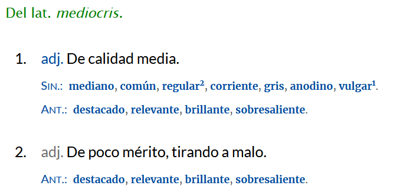
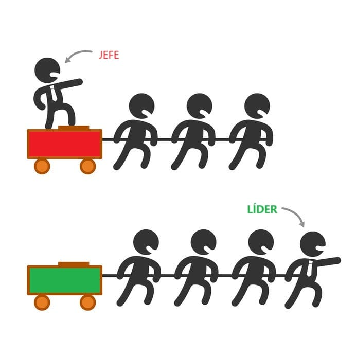

## ¿Qué convierte a un técnico brillante en un líder inolvidable?

Las cualidades de un líder técnico van mucho más allá de su conocimiento técnico o su habilidad para resolver problemas complejos. Liderar un equipo no es solo saber más que los demás. Tampoco es imponer decisiones ni revisar cada línea de código. Liderar es guiar. Y eso, como he aprendido con los años, tiene más que ver con lo humano que con lo técnico.

He conocido profesionales brillantes que nunca lograron inspirar, y también he visto a personas con muchos menos conocimientos técnicos que cambiaron por completo la dinámica de un equipo. ¿Por qué ocurre esto?

## Más allá de las habilidades: lo que no se ve en el CV

Si llegaste hasta aquí, quizá ya leíste [**mi artículo anterior sobre soft skills**](https://jgcarmona.com/autoevaluacion-soft-skills/). Allí te hablé de habilidades que puedes entrenar y te dejé una herramienta de autoevaluación. Hoy damos un paso más allá: hablamos de cualidades. Rasgos más profundos, que forman parte de tu forma de estar y de liderar.

#### **Diferencia entre habilidad y cualidad:**

- _Habilidad:_ es algo que puedes aprender, entrenar y medir. Por ejemplo, hablar en público o programar en un lenguaje concreto.

- _Cualidad:_ es parte de tu forma de ser y actuar. No se enseña, se aprende, y se puede cultivar. Como la empatía o la humildad.

> _Por ejemplo:_ Saber comunicar bien (habilidad) es útil. Pero la escucha activa (cualidad) es lo que hace que los demás te sigan de verdad.

Por lo general, las **cualidades de un líder técnico** no están en nuestro CV, pero sí en la forma en que nuestros compañeros confían en nosotros... O no.

## Las 7 cualidades clave del liderazgo técnico

### Aprendizaje continuo

El mundo cambia. Las tecnologías cambian. Los equipos cambian. Un líder técnico no se queda anclado en lo que funcionaba hace 5 años. Aprende. Todos los días. Se expone a ideas nuevas. Cultiva su intelecto. Lee antes libros de muy diversas temáticas. Y no deja que su ego se interponga entre él y lo que necesita mejorar.

> _"No soy un experto. Soy un novato con experiencia."_

### Influencia sin jerarquía

Un gran líder no da órdenes. Convence. Inspira. Es esa persona a la que todos escuchan cuando habla, aunque no tenga el cargo más alto. Porque su criterio técnico y su forma de comunicar generan confianza. Si quieres mejorar la manera en la que inspiras, te recomiendo leer este libro: "[**El líder que no tenía cargo**](https://www.amazon.es/l%C3%ADder-que-ten%C3%ADa-cargo-liderazgo/dp/8499893945)" de Robin Sharma

### Mentoría y crecimiento de otros

Los líderes no se guardan el conocimiento para ellos mismos. Lo comparten. Enseñan. Empoderan. Hacen que el equipo crezca a su alrededor. Porque entienden que liderar no es destacar, sino multiplicar.

### Rigor y excelencia técnica

No se trata de ser perfecto, pero sí de no conformarse con lo mediocre.

Esta es la **definición de 'mediocre'** según la RAE:

Un líder no puede ser mediocre, debe estar por encima de la media. Los líderes técnicos buscan escribir código claro, diseñar arquitecturas sostenibles y soluciones que duren. Y ayudan al equipo a hacerlo posible, sin arrogancia, pero con firmeza.

### Capacidad de simplificar la complejidad

El buen líder técnico hace fácil lo difícil. No enmascara su falta de claridad con jerga técnica. Al contrario: estructura, explica, conecta. Y hace que otros entiendan lo que parecía imposible. Y no se pierde en los detalles a no ser que sea necesario, es decir, sabe adaptar su discurso a cada audiencia. Por eso me encanta el Modelo C4, te recomiendo leer y ver [**este artículo**](https://jgcarmona.com/comunica-arquitectura-software-c4/) para comunicar mejor nuestras arquitecturas de software. También lo encontrarás en formato vídeo:

https://www.youtube.com/watch?v=Y\_kk7aZ5x28

### Humildad intelectual

Reconoce tus errores. Cambia de opinión cuando hay mejores argumentos. No dejes que tu ego te convierta en un arrogante. No necesita tener siempre razón. Es preferible tener un equipo brillante a ser el más listo de la sala. Rodeate de gente más capaz que tu siempre que puedas, y hazlos brillar.

### Escucha activa y empatía

Aprende a hablar hablar pero también a escuchar. Cada persona del equipo tiene su contexto, su forma de trabajar, sus miedos. Se adapta. Todos nos adaptamos. "Yo soy yo y mi circunstancia", como dijo el célebre [José Ortega y Gaset](https://es.wikipedia.org/wiki/Jos%C3%A9_Ortega_y_Gasset), "Y si no la salvo a ella, no me salvo a mí". Un buen líder escucha, es consciente de las circunstancias de los demás y logra que los demás confíen en él, no por saber más, sino por estar presente. Ponte en su lugar. Escucha, lo que te dicen y lo que no te dicen.

### ¿Jefe o Líder?

A grandes rasgos, un jefe gestiona y un líder los inspira. Pero **¿qué los diferencia en su día a día?** Aquí tienes una tabla comparativa clara:

| **JEFE** | **LÍDER** |
| --- | --- |
| Empuja a los empleados | Acompaña y entrena al equipo |
| Se apoya en la autoridad | Se apoya en la confianza y la buena voluntad |
| Inspira miedo | Inspira entusiasmo |
| Dice “yo” | Dice “nosotros” |
| Echa la culpa | Soluciona los problemas |
| “Sabe” cómo se hace | Muestra cómo se hace |
| Usa a las personas | Desarrolla a las personas |
| Se atribuye los méritos | Da crédito al equipo |
| Da órdenes | Hace preguntas |
| Dice “ve” | Dice “vamos” |

## Líderes técnicos que dejaron huella

Aquí te dejo algunos referentes de liderazgo técnico que encarnan estas cualidades. Cada uno desde su estilo:

### Software Engineering y Arquitectura

- **Martin Fowler** – Arquitecto en [ThoughtWorks](https://www.thoughtworks.com/), autor de "[**Refactoring**](https://www.amazon.es/Refactoring-Improving-Existing-Addison-wesley-Signature/dp/0134757599?crid=1USX5CC3NCM9B&dib=eyJ2IjoiMSJ9.d5ydIv1vhzDGghLAj8wLkpjuh1VfGSmtlHpgyvpqorwwxkESgoWZLX_56Gtdbee5eleZA_RviHbMR7TPW18-k_PQt5F2ZviKP82xGm5bThavYQjdN1PB2FWtx8Z59JuglI-OKKsWuHgawh8WFl9xTklCPMAJ99Ls7ukgFmPvdyxc5ZWJyvv3Ou2SqkEuAvMg.6RF1-Nkh0kTZiQYu76GdPdKhrkCUyjsLksdVgHZs5Cw&dib_tag=se&keywords=refactoring+martin+fowler&qid=1750574425&sprefix=Refactoring%2Caps%2C275&sr=8-1)" y "**[Patterns of Enterprise Application Architecture](https://www.amazon.es/Enterprise-Application-Architecture-Addison-Wesley-Signature/dp/0321127420?crid=1USX5CC3NCM9B&dib=eyJ2IjoiMSJ9.d5ydIv1vhzDGghLAj8wLkpjuh1VfGSmtlHpgyvpqorwwxkESgoWZLX_56Gtdbee5eleZA_RviHbMR7TPW18-k_PQt5F2ZviKP82xGm5bThavYQjdN1PB2FWtx8Z59JuglI-OKKsWuHgawh8WFl9xTklCPMAJ99Ls7ukgFmPvdyxc5ZWJyvv3Ou2SqkEuAvMg.6RF1-Nkh0kTZiQYu76GdPdKhrkCUyjsLksdVgHZs5Cw&dib_tag=se&keywords=refactoring+martin+fowler&qid=1750574425&sprefix=Refactoring%2Caps%2C275&sr=8-4)**". Destaca por su capacidad de simplificar la complejidad y su influencia sin jerarquía. [Sitio web](https://martinfowler.com/)

- **Kent Beck** – Creador de TDD y coautor de Extreme Programming. Ha dedicado su carrera a enseñar y a formar. Es firme defensor del aprendizaje continuo y la mentoría. [**Perfil en LinkedIn**](https://www.linkedin.com/in/kentbeck/)

- **Robert C. Martin (Uncle Bob)** – Autor de "**[Clean Code](https://www.amazon.es/Clean-Code-Handbook-Software-Craftsmanship/dp/0132350882?crid=N545IRYWLTXF&dib=eyJ2IjoiMSJ9.cseooGfp_bDrGwLldXxu0q5N7J8vsLrIWLii8FznLc_-7oDTM728NJjiyqyfERpkkWwLqjF_sylnWBUH3rMyLUhsMg-adO8eWkXzRwcHnuUDWKvNlRlETeZTP5H29IUn7uRD1IrqxCvI22eFn4jy7ebsPpI1jkPz6RZ3xRT1vhBNtKu1M_ZEVStMe_Q8WDhkMSJ1q9GzAc22046gV9rn-nHGIhs4INXfhKj1KyUw0Rb3Jst0cT3CvrmQ5pluDPeVjBO9UmsxlQ_Yi510YG-PY9FLlID4nRwqFXfMnv8EZWg.yhnPPC4P2v8QajWv_bqcv5lRLgJ36Xgdx7IAcJn3EJ0&dib_tag=se&keywords=Clean+Code&qid=1750574576&sprefix=clean+code%2Caps%2C167&sr=8-1)**". Promotor incansable del rigor técnico. Su legado es una llamada constante a la excelencia. [**Sitio oficial**](https://cleancoder.com/)

### Producto y visión técnica

- **Steve Jobs** – No escribía código, pero su capacidad de visión, simplificación extrema y rigor estético fueron claves. Inspiraba sin jerarquía. [**Apple Keynotes**](https://www.youtube.com/user/Apple)

- **Linus Torvalds** – Creador de Linux y Git. Directo, exigente, y con una visión técnica implacable. No exento de controversia, pero transformador. [**Entrevista en TED**](https://www.ted.com/talks/linus_torvalds_the_mind_behind_linux)

- **Guido van Rossum** – Creador de Python. Famoso por su humildad intelectual y su visión de código legible para humanos. [**Blog**](https://gvanrossum.github.io/)

### Inteligencia Artificial y sistemas complejos

- **Geoffrey Hinton** – Uno de los padres de las redes neuronales. Siempre en búsqueda. Referente en aprendizaje continuo. [**Perfil en Google Scholar**](https://scholar.google.com/citations?user=JicYPdAAAAAJ)

- **Fei-Fei Li** – Impulsora de la visión computacional y la ética en IA. Firme defensora del liderazgo inclusivo y empático. [**Sitio personal (Universidad de Stanford)**](https://profiles.stanford.edu/fei-fei-li)

### Comunidad y Open Source

- **Dan Abramov** – Creador de Redux. Ha compartido su aprendizaje de forma abierta. Destaca por su claridad y voluntad de enseñar. [**Twitter/X**](https://x.com/dan_abramov)

- **Matz (Yukihiro Matsumoto)** – Creador de Ruby. Diseñó el lenguaje con énfasis en _la felicidad del programador_. Una filosofía profundamente humana. [**Entrevista**](https://www.rubyist.net/~matz/)

## Liderar es un camino, no una meta

Liderar no es llegar, es estar. Yo sigo aprendiendo cada día, como tú. Y si algo he descubierto con los años, es que **las cualidades de un líder técnico** que más pesan no se ven en su repositorio, sino en su forma de mirar al equipo.

## **Cualidades de un líder técnico**

1. **Aprendizaje continuo**

3. **Influencia sin jerarquía**

5. **Mentoría y crecimiento de otros**

7. **Rigor y excelencia técnica**

9. **Capacidad de simplificar la complejidad**

11. **Humildad intelectual**

13. **Escucha activa y empatía**

## ¿Quieres dar el siguiente paso en tu carrera y no sabes cómo?

¿Te ves reflejado en estas cualidades? ¿Quieres cultivarlas? Si estás liderando un equipo técnico, o preparándote para hacerlo, y quieres crecer con guía, experiencia y visión, escríbeme. Estaré encantado de ayudarte con [**coaching**](/coaching) o [**mentorías**](https://jgcarmona.com/mentorias).

[**Escríbeme**](https://jgcarmona.com/contact/) y vemos qué es lo que más te conviene. La primera sesión es gratuita, sin compromiso.
