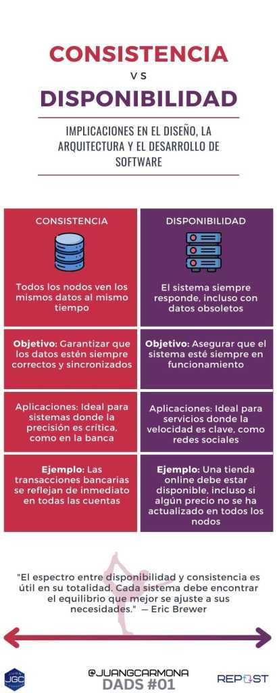

## Consistencia vs. Disponibilidad

Cada vez que accedemos a una plataforma de streaming como [**Netflix**](http://netflix.com) o [**Disney Plus**](https://www.disneyplus.com), compramos en una tienda en línea tipo [**Amazon**](http://amazon.com), o utilizamos una app de mensajería como **[WhatsApp](https://web.whatsapp.com/)** o [**Telegram**](https://web.telegram.org/), estamos interactuando con una compleja red de servidores distribuidos alrededor del mundo. Los sistemas distribuidos están en todas partes, desde los servidores que soportan las aplicaciones que usas a diario hasta las grandes bases de datos que alimentan los gigantes de la tecnología.

Diseñar un sistema distribuido implica tomar decisiones difíciles, especialmente cuando se trata de garantizar que tu aplicación sea rápida (**disponibilidad**) y que los datos sean siempre correctos (**consistencia**). Aquí es donde entra en juego uno de los dilemas más comunes para los arquitectos de sistemas: **¿Priorizar la consistencia o la disponibilidad?**

Este es el primer artículo de la serie DADS, Diseño, Arquitectura y Desarrollo de Software y en él vamos a sumergirnos en dos de los principios que más nos afectan en el diseño y la arquitectura de aplicaciones y sistemas distribuidos, la consistencia y la disponibilidad.

### **¿Qué son los Sistemas Distribuidos?**:

Un **sistema distribuido** es un conjunto de computadoras o nodos que trabajan en conjunto para alcanzar un objetivo común, permitiendo que una aplicación escale horizontalmente. Esto significa repartir la carga de trabajo entre varias máquinas, en lugar de depender de un solo servidor.

#### **Un Ejemplo**:

Imagina una plataforma de streaming como Netflix. Gracias a los servidores distribuidos, millones de usuarios pueden acceder al catálogo simultáneamente. Si un único servidor manejara todo el tráfico, el sistema colapsaría rápidamente. La pregunta clave es: ¿Cómo garantizar que todos los usuarios accedan a los mismos datos (por ejemplo, el catálogo de contenido) cuando estos están distribuidos entre varios servidores?

### **Consistencia vs. Disponibilidad: ¿Cuál elegir?**

Los arquitectos de sistemas deben tomar decisiones estratégicas al optimizar un sistema distribuido, especialmente cuando la red presenta fallos. Aquí entra el dilema entre **consistencia** y **disponibilidad**:

- **Consistencia** garantiza que todos los nodos del sistema vean los mismos **datos** al mismo tiempo. Si modificas datos en un nodo, los cambios deben reflejarse en los demás de manera inmediata. Este enfoque es vital para aplicaciones donde los datos precisos son críticos, como en los sistemas financieros.  
      
    **Ejemplo práctico:**  
    Imagina que transfieres dinero entre dos cuentas en un banco. Es esencial que esta transacción se refleje inmediatamente en todos los sistemas para evitar problemas como gastar dinero que ya no tienes.

- **Disponibilidad**, por otro lado, asegura que el **sistema** responda a las solicitudes, incluso si algunos nodos no tienen los datos más actualizados. Esto es crucial en aplicaciones donde la velocidad y capacidad de respuesta son más importantes que la precisión inmediata de los datos.  
      
    **Ejemplo práctico:**  
    En una red social como Instagram, los usuarios esperan que sus publicaciones se hagan visibles de inmediato, aunque los datos no estén sincronizados al 100%. Lo primordial es que el servicio esté disponible y rápido.  
    

Como ves, el desafío es que en muchos casos no podremos tener **consistencia** **en nuestros datos** y **disponibilidad de nuestro sistema** al mismo tiempo. Cuando una red falla, debemos elegir entre devolver una respuesta rápida pero potencialmente desactualizada (optimizando la **disponibilidad**) o esperar a que los datos se sincronicen (optimizando la **consistencia**). Encontrar el equilibrio adecuado es clave para la arquitectura del sistema.

### **El Coste de Alcanzar el Equilibrio**

Desarrollar una infraestructura IT que logre un equilibrio eficiente entre **consistencia** y **disponibilidad** puede resultar enormemente costoso. hacer algo así no está al alcance de cualquier porque requiere no solo una fuerte inversión en hardware y redes, sino también en replicación de datos y mecanismos eficientes de failover, es decir, conmutación por error. Aquí es donde las **nubes públicas** como **Azure**, **AWS** y **Google Cloud** se vuelven indispensables, al ofrecer infraestructura distribuida sin la necesidad de construirla desde cero. Y si puedo hablar de una nube, esa es **[Azure](https://azure.microsoft.com/es-es)**.

[**Explorar Centros de Datos de Azure**](https://datacenters.microsoft.com/globe/explore)

### **Regiones y Zonas de Disponibilidad en Azure**

En concreto, **Azure** es una de las plataformas en la nube más grandes del mundo, con **más de 60 regiones**, **265k+ Kilómetros de fibra interconectando** **220+ centros de datos en 140 países**, brinda más ubicaciones globales que cualquier otro proveedor. Esta enorme cobertura permite a las empresas desplegar servicios en múltiples ubicaciones, según la necesidad de consistencia y disponibilidad.

Las **Regiones** de Azure son un conjunto de centros de datos interconectados dentro de un perímetro de baja latencia. Cada región está compuesta por varias **Zonas de Disponibilidad**, que son centros de datos independientes entre sí, con su propio suministro de energía, refrigeración y redes.

Estas **Zonas de Disponibilidad** permiten a las aplicaciones distribuirse entre diferentes centros de datos dentro de la misma región, lo que ofrece redundancia local. Si una zona falla, otra puede tomar el control, minimizando el impacto en la **disponibilidad** del sistema.

Además, **Azure** ofrece la posibilidad de utilizar **Pares Regionales**, que son dos regiones dentro de la misma geografía. Esto asegura que, durante las actualizaciones o fallos en una región, la otra siga funcionando, lo que garantiza una alta disponibilidad y resiliencia.

### **Ventajas clave de usar una nube pública como Azure**:

- **Escalabilidad automática**: Azure ajusta el rendimiento de los servicios según la demanda, permitiendo que los sistemas distribuidos manejen aumentos en la carga sin intervención manual.

- **Alta disponibilidad**: Con **SLAs** superiores al 99.99%, Azure garantiza que los servicios permanecerán disponibles, incluso si una Zona de Disponibilidad o una Región falla.

- **Redundancia zonal y regional**: Azure facilita la implementación de redundancia mediante el uso de múltiples zonas de disponibilidad dentro de una región, o pares regionales en geografías cercanas.

Estas características no solo reducen los costos asociados al desarrollo de infraestructura IT, sino que también permiten que los equipos de desarrollo se concentren en crear aplicaciones de alto rendimiento, sin preocuparse por las complejidades de la infraestructura subyacente.

## **Conclusión:**

El diseño de sistemas distribuidos siempre será un ejercicio de equilibrio entre muchos factores, no solamente entre consistencia y disponibilidad. No existe una respuesta única que funcione en todos los casos (no-silver-bullet), ya que las necesidades de cada aplicación y los usuarios son las que determinarán qué priorizar. La **infraestructura IT**, ya sea autogestionada o mediante nubes públicas o privadas, juega un rol crucial en facilitar este equilibrio.

NO HAY UNA BALA DE PLATA

  
Recuerda que esta es solo la base, una pequeña introducción al diseño y la arquitectura de sistemas distribuidos. En próximos artículos, profundizaremos en teoremas como **CAP** y **PACELC**, que formalizan estas decisiones, y en modelos como **ACID** y **BASE**, que definen cómo manejar las transacciones de datos en sistemas distribuidos.
