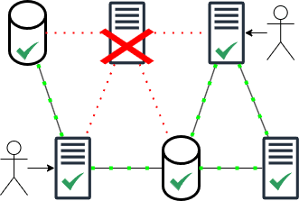
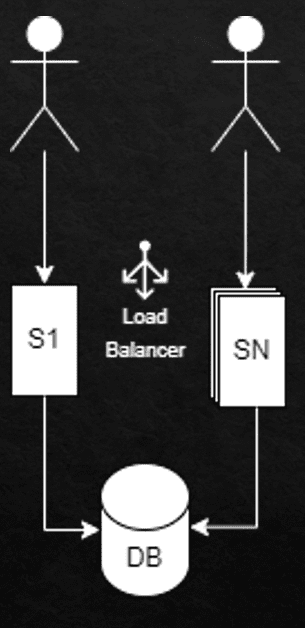
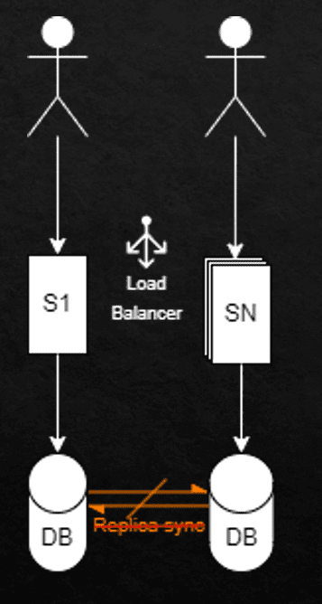
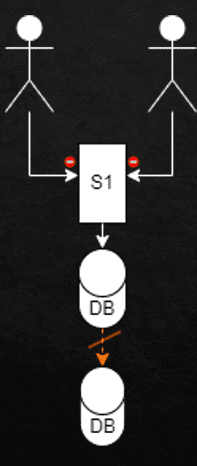
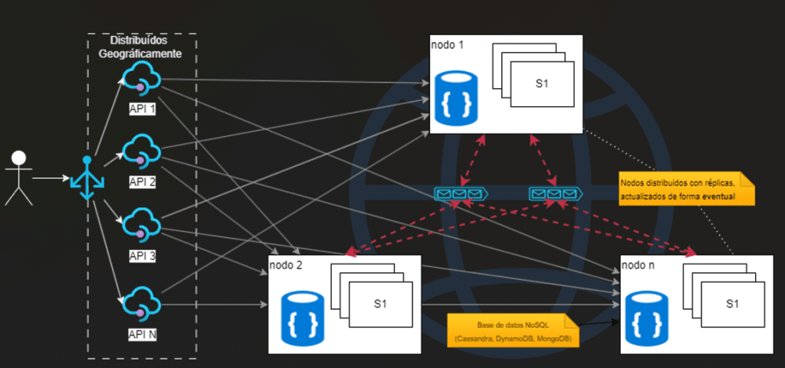
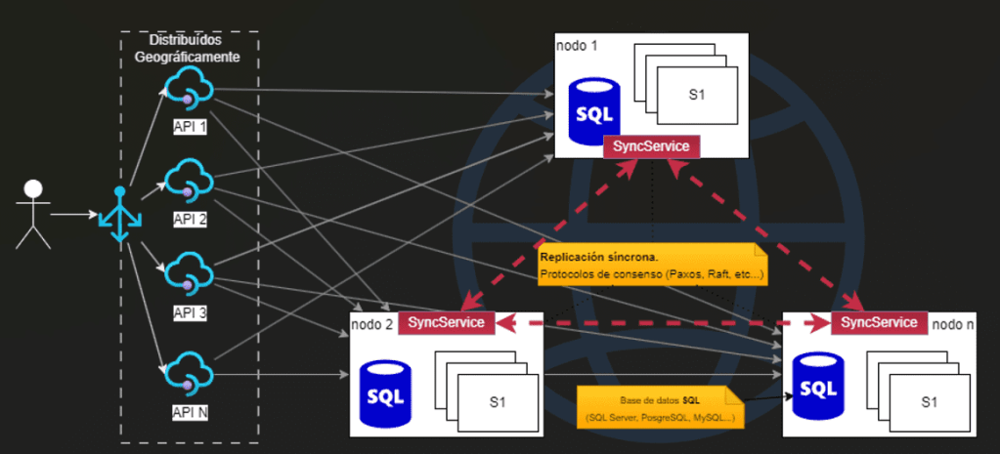
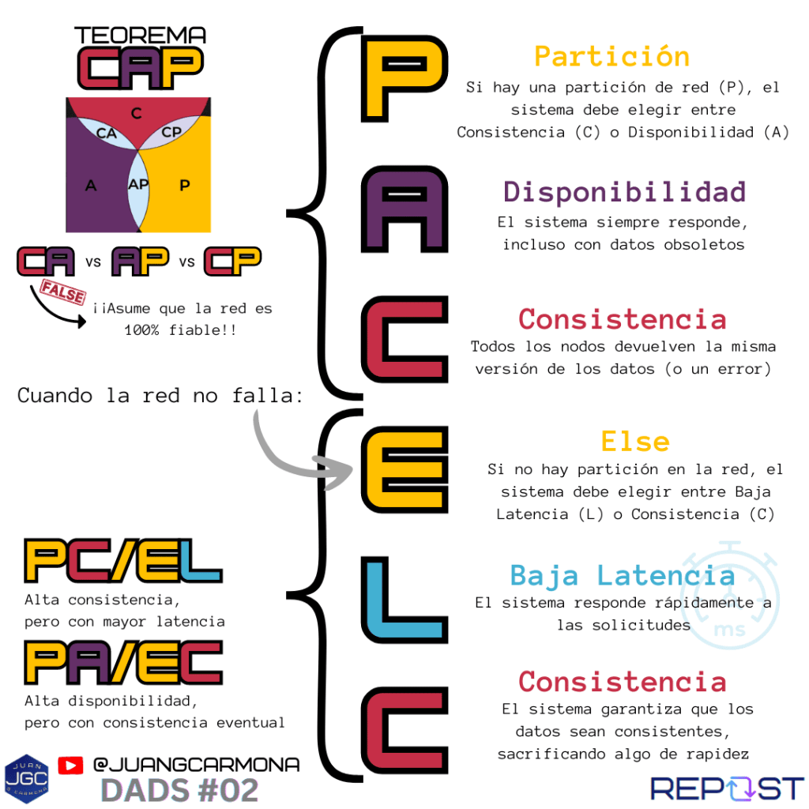

Hoy continuamos con un tema clave en los sistemas distribuidos: la **tolerancia a fallos** y cómo los teoremas CAP y PACELC juegan un rol fundamental en la toma de decisiones de diseño. En el [**artículo anterior**](https://jgcarmona.com/dads-01-introduccion-sistemas-distribuidos/), discutimos sobre [la **consistencia** y la **disponibilidad**](https://jgcarmona.com/dads-01-introduccion-sistemas-distribuidos/) y cómo debemos elegir entre ambos en nuestros sistemas distribuidos. Sin embargo, hoy te voy a hablar de un aspecto aún más crítico todavía: ¿cómo gestionamos fallos en nuestra red interna (**particiones**) y cómo estos fallos impactan en nuestro diseño?

Aquí es donde entran en juego dos teoremas que todo arquitecto de sistemas debe conocer: el famoso **Teorema CAP** y su extensión, **PACELC**. A lo largo de este artículo, exploraremos estos conceptos para entender mejor cómo tomar decisiones clave en el diseño cuando las redes fallan.

**Un brevísimo repaso**

Tengo que insistir en estos dos conceptos clave:

- La **consistencia** garantiza que todos los nodos de un sistema vean los mismos datos en todo momento.

- La **disponibilidad**, asegura que el sistema siempre responda, aunque algunos nodos no tengan los datos más actualizados,.

Ahora bien, ¿cómo manejamos los fallos de red o las particiones?

Aquí es donde entra el Teorema CAP.

### **Entendiendo el Teorema CAP en Sistemas Distribuidos**

El **Teorema CAP** (Consistencia, Disponibilidad, y Tolerancia a Particiones) nos dice que, en presencia de una partición de red, debemos elegir entre **consistencia** y **disponibilidad**. No podemos tener ambos al mismo tiempo.

1. **Consistencia (C):** Todos los nodos deben tener los mismos datos.

3. **Disponibilidad (A):** El sistema debe responder siempre, aunque los datos no estén sincronizados.

5. **Tolerancia a Particiones (P):** El sistema sigue funcionando a pesar de una partición de red.

### **Modelo CA (Consistencia y Disponibilidad)**

En este modelo, se priorizan la **consistencia** y la **disponibilidad**, pero no se toleran fallos en la red o particiones. Esto significa que todos los nodos tienen los mismos datos y el sistema está siempre disponible, pero solo en un entorno donde se asume que la red es completamente fiable, es decir, no hay interrupciones de red que puedan aislar los nodos.

#### Estructura del Sistema:

- Los usuarios se conectan a través de un **balanceador de carga**, que distribuye las solicitudes entre múltiples nodos (S1, SN), lo que ayuda a mantener la disponibilidad.

- Los datos se mantienen consistentes mediante el uso de una base de datos centralizada o mediante **replicación síncrona**. En este último caso, cada escritura se replica inmediatamente en otros nodos antes de confirmar la operación al cliente.

- La **replicación síncrona** asegura que todos los nodos tengan los mismos datos en todo momento.

- En caso de fallo en un nodo o hardware, la alta disponibilidad está garantizada por mecanismos de redundancia (como backups), pero no se contempla una partición de red.

#### Caso de Uso:

Este sistema es ideal para aplicaciones que se despliegan en un entorno controlado, como un solo centro de datos, donde se puede asumir que la red es confiable. Aplicaciones empresariales críticas, que requieren alta consistencia y disponibilidad, son un buen ejemplo de este tipo de sistema.

* * *

### **Modelo AP (Disponibilidad y Tolerancia a Particiones)**

En este modelo, se da prioridad a la **disponibilidad** y a la **tolerancia a fallos de red (particiones)**, pero la consistencia inmediata no está garantizada. Es decir, el sistema sigue disponible durante las particiones de red, pero pueden surgir inconsistencias temporales entre los nodos.

#### Estructura del Sistema:

- Los usuarios acceden a través de un balanceador de carga que distribuye las solicitudes entre los servidores (S1, SN).

- Se utiliza una **replicación asíncrona** entre las bases de datos, lo que permite que el sistema siga funcionando durante una partición de red, aunque con el riesgo de que los datos en los diferentes nodos no estén completamente sincronizados.

- Las **flechas naranjas** en el diagrama indican la posible falta de sincronización entre los nodos, lo que introduce una consistencia eventual. Esto significa que los datos pueden divergir temporalmente, pero eventualmente se sincronizarán una vez que la red se recupere.

#### Caso de Uso:

Los sistemas AP son comunes en aplicaciones donde la disponibilidad es más importante que la consistencia inmediata, como en plataformas de redes sociales o tiendas en línea. Aquí, el sistema sigue funcionando durante las particiones de red y no se bloquea, lo que es esencial para garantizar una experiencia continua para los usuarios.

### **Modelo CP (Consistencia y Tolerancia a Particiones)**

En este modelo, se priorizan la **consistencia** y la **tolerancia a particiones**, pero a costa de la disponibilidad. Es decir, el sistema garantiza que todos los nodos tendrán los mismos datos, incluso si la red se divide, pero durante una partición, puede no estar disponible para los usuarios.

#### Estructura del Sistema:

- Los usuarios se conectan a un único servidor (S1), que gestiona las operaciones sobre una base de datos replicada.

- Durante una partición de red, el sistema **bloquea las operaciones de escritura** hasta que la partición se resuelva y todas las bases de datos puedan estar sincronizadas. Esto asegura que no haya inconsistencias, pero significa que el sistema puede no estar disponible durante la partición.

- La **consistencia fuerte** es la prioridad en este tipo de sistemas, lo que significa que los datos deben ser iguales en todos los nodos antes de que cualquier otra operación pueda continuar.

#### Caso de Uso:

Este tipo de sistema es ideal para aplicaciones donde la consistencia es crítica, como en aplicaciones financieras o bancarias. Aquí, es preferible que el sistema no esté disponible temporalmente a que se produzcan inconsistencias en los datos, lo que podría resultar en problemas graves, como transacciones duplicadas o pérdidas financieras.

### **Limitaciones del teorema CAP**

El problema con CAP es que **no contempla lo que sucede cuando** **no hay fallos en la red**. _¿Qué debemos priorizar cuando la red está funcionando bien?_ Aquí es donde entra el teorema **PACELC**.

## El Teorema PACELC Afecta el Diseño de Sistemas Distribuidos

El teorema **PACELC** extiende el teorema **CAP** y nos ayuda a tomar decisiones cuando no hay fallos de red. Nos plantea dos escenarios clave:

1. **Cuando hay una partición de red (P)**: Debemos elegir entre Consistencia (C) o Disponibilidad (A).

3. **Cuando no hay partición de red (E)**: Debemos elegir entre Baja Latencia (L) o Consistencia (C).

Esto nos lleva a dos modelos de arquitectura comunes:

1. **PA/EC**: Alta disponibilidad y baja latencia, pero con consistencia eventual.

3. **PC/EL**: Alta consistencia, pero con mayor latencia.

### Ejemplo de PA/EC: Redes Sociales

Un buen ejemplo de **PA/EC** es el de las redes sociales como **Facebook** o **Instagram**. En estos sistemas, es más importante que los usuarios puedan acceder rápidamente a la plataforma, incluso si los datos no están perfectamente sincronizados en todos los nodos.

- **Disponibilidad**: Los sistemas deben estar siempre disponibles para los usuarios.

- **Latencia Baja**: El acceso debe ser rápido, aunque los "likes" o comentarios se sincronicen eventualmente.

- **Consistencia Eventual**: Aceptan un pequeño retraso en la sincronización de datos, siempre que el servicio siga funcionando.

### Arquitectura PA/EC

1. **Usuarios**: Interactúan con la aplicación a través de diversas APIs distribuidas globalmente. Esto permite una respuesta rápida, ya que están cercanas geográficamente a los usuarios.

3. **Balanceador de carga**: Distribuye el tráfico entre los nodos, maximizando el rendimiento mediante algoritmos como round-robin o basado en la menor carga.

5. **Nodos distribuidos (Data Centers)**: Garantizan que, incluso ante fallas en algunas zonas, los usuarios puedan seguir interactuando con la aplicación.

7. **Bases de datos NoSQL (Cassandra, DynamoDB, MongoDB)**: Estas bases permiten escribir en cualquier nodo, y la consistencia eventual asegura que los datos se sincronicen entre todos los nodos con un pequeño retraso.

9. **Replicación asíncrona y Colas de Mensajes**: La replicación asíncrona es fundamental para mantener la alta disponibilidad.

11. **Servicios de resolución de conflictos**: Manejan posibles conflictos entre datos durante la replicación asíncrona.

### Quién usa PA/EC (Prioridad en Alta Disponibilidad y Consistencia Eventual)

Los catálogos de productos siempre están accesibles, aunque la información como precios o disponibilidad de stock pueda tardar en sincronizarse.

**Plataformas de Streaming de Video (Netflix, YouTube)**:

Priorizan la disponibilidad del contenido, aunque las estadísticas de visualización o interacciones puedan sincronizarse de forma eventual.

**Sistemas de Mensajería Instantánea (WhatsApp, Telegram)**:

Priorizan la entrega rápida de mensajes, aceptando que la confirmación de entrega o lectura se sincronice eventualmente entre todos los dispositivos.

**Redes de Entrega de Contenidos (CDNs - Akamai, Cloudflare)**:

Priorizan la entrega rápida del contenido almacenado en cachés distribuidas, aceptando que algunas partes del contenido no estén actualizadas.

**Sistemas de Comercio Electrónico (Amazon, eBay)**:

Los catálogos de productos siempre están accesibles, aunque la información como precios o disponibilidad de stock pueda tardar en sincronizarse.

### Ejemplo de PC/EL: Sistemas Financieros

En un sistema financiero, como los usados en los mercados bursátiles o en plataformas de pago, es vital garantizar que todos los datos estén sincronizados en todo momento. Aquí, un sistema **PC/EL** es la opción adecuada:

- **Consistencia**: La consistencia es esencial, ya que cualquier error podría tener consecuencias graves.

- **Latencia**: Se sacrifica algo de latencia, priorizando la precisión de los datos.

Si hay una partición de red, el sistema detiene las operaciones hasta que todos los nodos estén sincronizados.

### Arquitectura PC/EL

1. **Usuarios**: Interactúan con las APIs distribuidas geográficamente a través de un balanceador de carga.

3. **Balanceador de carga**: Filtra las solicitudes y las redirige hacia los nodos con el estado de datos más actualizado.

5. **Nodos**: Cada nodo cuenta con una base de datos SQL y mantiene una replicación síncrona con otros nodos mediante protocolos de consenso como Paxos o Raft.

7. **Replicación Síncrona**: Asegura que las bases de datos en cada nodo estén completamente alineadas. Esto garantiza consistencia fuerte, sacrificando latencia.

9. **Tolerancia a fallos de red**: El sistema bloquea las operaciones de escritura si ocurre una partición de red para evitar inconsistencias.

Quién usa PC/EL (Prioridad en Consistencia y Latencia)

**Plataformas de Comercio Electrónico con Pago y Facturación en Tiempo Real (Amazon, Alibaba)**: Aseguran que las transacciones de pago estén sincronizadas y correctas.

**Sistemas de Salud y Registros Médicos Electrónicos (EMR)**: Aseguran consistencia total en la información médica de los pacientes.

**Sistemas de Reservas Aéreas (Amadeus, Sabre)**: Garantizan que los billetes vendidos o asientos reservados estén sincronizados entre todas las agencias.

**Sistemas de Inventarios y Logística Global (FedEx, UPS)**: Priorizan la consistencia en la información de inventarios y movimientos de mercancías.

## A modo de resumen

El diseño de sistemas distribuidos es un arte que requiere encontrar el equilibrio adecuado entre consistencia, disponibilidad y tolerancia a fallos. El teorema CAP nos ayuda a tomar decisiones cuando hay fallos de red, pero PACELC nos permite optimizar nuestros sistemas incluso cuando la red está estable, equilibrando la latencia y la consistencia.

Durante la elaboración de este segundo capítulo de **DADS, Diseño, Arquitectura y Desarrollo de Software**, y también **[del anterior](https://jgcarmona.com/dads-01-introduccion-sistemas-distribuidos/)**, he creado dos infografías y dos presentaciones de PowerPoint para que este tema quede claro, uno es una comparativa entre consistencia y disponibilidad y el otro es un diagrama que resume los teoremas CAP y PACELC en sistemas distribuidos. Hacer este resumen y elaborar este material me ha llevado mucho, muchísimo tiempo, pero espero que mi esfuerzo haya merecido la pena y que el material te sea útil, ya seas estudiante, desarrollador, arquitecto o ingeniero de software.

Si te ha parecido útil, te invito a compartir este artículo y sus recursos con tus compañeros, amigos o conocidos. Además, si aún no lo has hecho, **[te animo a suscribirte a mi canal de YouTube](https://www.youtube.com/@juangcarmona)** y a seguir mis publicaciones periódicas en mi blog para no perderte más contenido técnico como este. También estaré subiendo las infografías a mi [**Instragram**](https://www.instagram.com/jgcarmona.pro/) y [**LinkedIn**](https://www.linkedin.com/in/jgcarmona/) y los vídeos explicativos que acompañan a estos artículos, así que asegúrate de estar suscrito para recibir las últimas actualizaciones.

https://youtu.be/WWseYALG8oA

¡No olvides comentar y compartir tus impresiones! Me encantaría saber cómo aplicas estos conceptos en tus propios proyectos. Hasta el próximo artículo, donde seguiremos profundizando en los misterios y soluciones del diseño y desarrollo de software distribuido.
