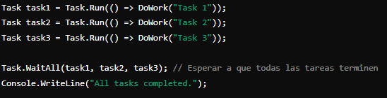
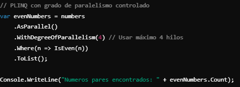
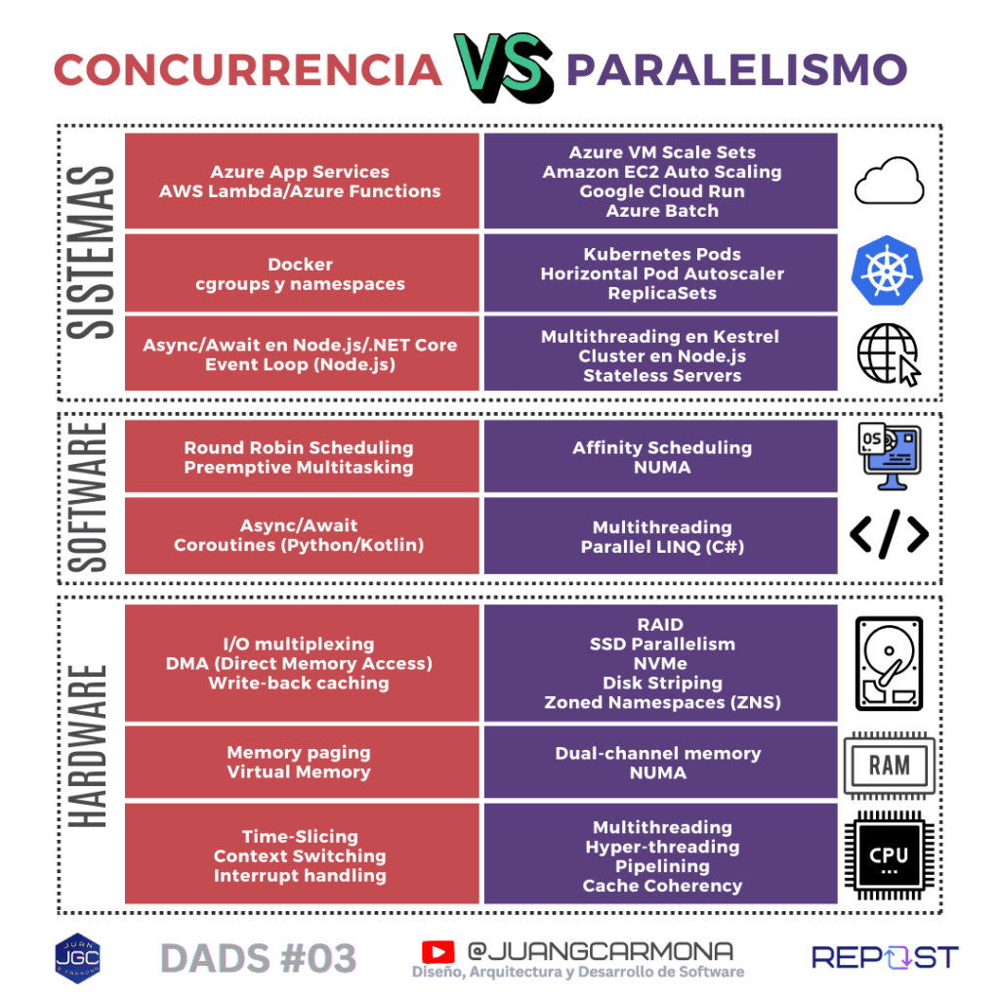

## Aplicaciones prácticas, desde el hardware hasta sistemas distribuidos

En este capítulo de [**DADS**](https://jgcarmona.com/category/dads/), **Diseño, Arquitectura y Desarrollo de Software**, te voy a hablar de la **concurrencia y el paralelismo**. De nuevo he recurrido a dos conceptos fundamentales, básicos y a menudo utilizados erróneamente, para diseñar un viaje trepidante, desde los más recónditos rincones de una CPU cualquiera hasta su aplicación en los sistemas que dan soporte computacional a nuestras aplicaciones y servicios favoritos.

La **concurrencia y el paralelismo** son dos conceptos clave en el desarrollo de software moderno. Entender sus diferencias y aplicaciones es fundamental para diseñar sistemas eficientes y escalables. En este artículo, exploraremos juntos, qué son, cuándo utilizarlos y cómo se implementan a través de ejemplos prácticos en hardware, software y sistemas distribuidos.

### **¿Qué es la concurrencia?**

La **concurrencia** es la capacidad de un sistema para gestionar **múltiples tareas** que se alternan en el tiempo, **sin ejecutarse necesariamente al mismo tiempo**. Es útil, por ejemplo, para optimizar el uso de recursos en sistemas que manejan operaciones de I/O (entrada/salida) o cuando se requieren muchas tareas activas de manera simultánea como por ejemplo en la interfaz de un sistema operativo.

### **¿Qué es el paralelismo?**

El **paralelismo** se refiere a la **ejecución simultánea de varias tareas**, aprovechando múltiples núcleos o procesadores. Es fundamental cuando se necesita procesar grandes volúmenes de datos o ejecutar cálculos complejos en **sistemas** con capacidades **multicore** o **distribuidos**.

## **Diferencias en la ejecución de tareas**:

Vamos a dejar la tecnología durante un momento. Imagina que estás en una cocina preparando varios platos, siguiendo varias recetas, al mismo tiempo. Dependiendo de cómo gestiones tus tareas, estarás trabajando de forma concurrente, paralela o de ninguna de las dos. Te pongo cuatro ejemplos para que lo entiendas.

1. **Ni Concurrente, Ni Paralelo**:
    - Solo tienes un chef en la cocina, y ese chef **prepara un plato y lo termina antes de comenzar el siguiente**. Primero cocina la sopa y, cuando termina, pasa a hacer la ensalada. Cada receta se realiza de principio a fin sin interrupciones ni solapamientos.

3. **Concurrente, No Paralelo**:
    - Aquí, el chef **alterna entre varias tares de varias recetas.** Comienza a preparar la sopa, luego mientras hierve el caldo, corta los ingredientes de la ensalada. El chef sólo puede realizar una tarea cada vez y como hay procesos que llevan tiempo, como hervir el caldo, aprovecha esos "tiempos muertos" para adelantar trabajo realizando otras tareas de otras recetas **y va progresando en ambos platos a la vez**.

5. **No Concurrente, Paralelo**:
    - Tienes **un equipo de cocina, con** **varios chefs** en la cocina. Uno se encarga exclusivamente de la sopa, y otro de la ensalada. **Ambos trabajan en paralelo**, pero cada uno se enfoca únicamente en su tarea, completando un plato completamente antes de pasar a otro.

7. **Concurrente y Paralelo**:
    - En este caso también tienes **varios chefs** en la cocina, y cada uno **alterna entre diferentes platos**. Mientras uno corta los ingredientes de la ensalada, el otro cocina la sopa y también ayuda a preparar el postre al mismo tiempo. **Todos los chefs avanzan en varias tareas simultáneamente**, optimizando el tiempo y los recursos al máximo.

* * *

# **Aplicaciones de Concurrencia y Paralelismo a Todos los Niveles**

Ahora que entendemos qué son la **concurrencia** y el **paralelismo**, podmeos volver a nuestra realidad, la tecnología. Vamos a ver cómo se aplican estas dos técnicas en distintos niveles. Exploraremos cómo estos conceptos se implementan en tareas de bajo nivel, como el manejo de recursos de la **CPU** y la memoria, pasando por la **programación concurrente** en software, hasta llegar a la **gestión de clústeres** en **sistemas distribuidos**. Veremos ejemplos prácticos en cada uno de estos niveles, para comprender cómo se ha aplicado la concurrencia y el paralelismo para optimizar diferentes procesos.

* * *

## **Ejemplos a nivel de Hardware**:

### **CPU**

- **Concurrencia**: En una CPU de un solo núcleo, la concurrencia se gestiona mediante técnicas como **time-slicing** (segmentación de tiempo). Esto permite que varias tareas compartan el núcleo, alternando su ejecución en intervalos cortos de tiempo. Aunque no se ejecutan simultáneamente, parece que las tareas avanzan al mismo tiempo. Otros mecanismos incluyen **context switching**, que permite a la CPU cambiar entre tareas cuando una está en espera.  
      
    **Técnicas clave**:
    - **Time-slicing**: La CPU divide el tiempo de procesamiento entre las tareas en curso, alternando rápidamente entre ellas.
    
    - **Context switching**: Cambia el estado de una tarea en ejecución y almacena su contexto para reanudarla más adelante.
    
    - **Interrupt handling**: La CPU puede detener temporalmente la ejecución de una tarea para atender eventos externos prioritarios (por ejemplo, señales de hardware). No son un mecanismo de concurrencia per se, sino más bien un mecanismo de interrupción para dar paso a una tarea prioritaria.  
          
        

- **Paralelismo**: Con procesadores de múltiples núcleos, la CPU puede ejecutar varias tareas **simultáneamente**. Cada núcleo ejecuta una tarea distinta sin tener que alternar entre ellas. Esto es ideal para procesar múltiples hilos de ejecución o tareas independientes al mismo tiempo, aprovechando la capacidad completa del hardware.  
      
    **Técnicas clave**:
    - **Multithreading**: Los núcleos pueden manejar varios hilos dentro de una misma tarea o aplicación, ejecutándolos en paralelo.
    
    - **Hyper-threading**: Simula la existencia de múltiples núcleos virtuales dentro de un núcleo físico, permitiendo que se procesen varias tareas al mismo tiempo.
    
    - **Pipelining**: Divide una tarea en varias etapas que se procesan en paralelo dentro del mismo núcleo, mejorando la eficiencia.
    
    - **Cache coherency**: Las CPU modernas deben mantener coherente la caché de cada núcleo, lo que puede afectar la velocidad de ejecución paralela. [Merece la pena echarle un vistazo a este artículo](http://frankdenneman.nl/2016/07/11/numa-deep-dive-part-3-cache-coherency/) de Frank Denneman sobre el tema.  
        

* * *

### **Memoria**

- **Concurrencia**: La concurrencia en el manejo de memoria se logra utilizando técnicas como **paging** (paginación) y **virtual memory** (memoria virtual), que permiten que diferentes procesos compartan y utilicen la memoria de manera eficiente. La CPU alterna entre las tareas y utiliza la **memoria virtual** para mapear las direcciones de memoria física, lo que permite manejar más procesos de los que la memoria física permitiría directamente.  
      
    **Técnicas clave:**
    - **Memory paging**: Técnica que permite que diferentes procesos utilicen bloques de memoria (páginas) que se pueden intercambiar entre la memoria física y la memoria virtual para gestionar eficientemente los recursos.
    
    - **Virtual memory**: La memoria virtual permite que un sistema ejecute programas más grandes que la memoria física disponible, al usar espacio en disco como extensión de la RAM.  
          
        

- **Paralelismo**: En arquitecturas de memoria como **NUMA** (Non-Uniform Memory Access), la memoria está dividida en diferentes "zonas", cada una de las cuales tiene acceso más rápido para un conjunto de núcleos específicos. Los procesos en diferentes núcleos pueden acceder a su "memoria local" sin interferencia de otros núcleos, permitiendo un acceso paralelo eficiente. Además, la **memoria de doble canal** mejora el rendimiento al permitir que dos módulos de memoria trabajen simultáneamente.  
      
    **Técnicas clave:**
    - **NUMA (Non-Uniform Memory Access)**: Optimiza el acceso paralelo a la memoria asignando zonas específicas a cada procesador o núcleo, reduciendo la latencia al acceder a los datos. NUMA **también es relevante en sistemas con varios procesadores**, donde cada procesador tiene un bloque de memoria más cercano físicamente (local), lo que reduce la latencia de acceso. [Aquí te dejo el enlace al inicio de una serie buenísima, de Frank Denneman, sobre NUMA.](https://frankdenneman.nl/2016/07/06/introduction-2016-numa-deep-dive-series/) Si no lo conocías, bueno, que sepas que muchos de los avances en Hardware que hacen posible, a su vez, los avances en Inteligencia Artificial, están relacionados con optimizaciones en la utilización de la memoria y NUMA o variantes de NUMA, suelen estár presentes.
    
    - **Dual-channel memory**: Permite que dos módulos de memoria trabajen en paralelo, aumentando el ancho de banda y mejorando la velocidad de acceso a datos.
    
    - **Zoned Namespaces (ZNS)**: En sistemas de almacenamiento avanzados, se divide el espacio en zonas para operaciones de lectura/escritura simultáneas.

* * *

### Disco

- **Concurrencia**: Mientras el disco recupera información para una tarea (por ejemplo, una operación de lectura/escritura), el procesador puede comenzar a trabajar en otra. Se _alterna entre varias tareas_ de entrada/salida (**I/O-bound**), sin que se ejecuten todas al mismo tiempo, _aprovechando los tiempos muertos_ cuando el disco está ocupado.  
      
    **Técnicas clave:**
    - **I/O Multiplexing**: Permite que varias operaciones de entrada/salida se gestionen de manera eficiente, alternando entre ellas según su disponibilidad. Esto es especialmente útil en sistemas que manejan muchas conexiones simultáneas, como bases de datos o servidores web.
    
    - **DMA (Direct Memory Access)**: Esta técnica permite que los dispositivos de hardware, como discos duros o tarjetas de red, accedan directamente a la memoria sin necesidad de que la CPU intervenga en cada operación, lo que libera a la CPU para que gestione otras tareas.
    
    - **Write-back caching**: Es una técnica de almacenamiento en caché en la que las operaciones de escritura se almacenan temporalmente en la caché y se escriben en el disco en un momento posterior. Esto mejora el rendimiento general del sistema al permitir que las operaciones de escritura sean concurrentes.  
          
        

- **Paralelismo**: En sistemas con discos múltiples (por ejemplo, **RAID** o múltiples **SSDs**), es posible realizar varias operaciones de _lectura/escritura de forma simultánea_, aumentando el rendimiento. Aquí el paralelismo aprovecha el acceso concurrente a múltiples dispositivos de almacenamiento para acelerar el procesamiento.  
      
    **Técnicas clave:**
    - **RAID**: Agrupación de discos que permite el acceso paralelo a los datos, mejorando la velocidad de lectura y escritura a la vez que se asegura la redundancia de los datos.
    
    - **SSDs en paralelo**: Los SSDs permiten paralelizar las operaciones de lectura y escritura a través de múltiples canales internos, lo que mejora significativamente la velocidad.
    
    - **NVMe**: La tecnología NVMe permite realizar muchas operaciones de I/O en paralelo, aprovechando la arquitectura multicore para ofrecer tiempos de respuesta más rápidos. NVMe reduce las colas de espera de I/O al permitir que múltiples "líneas de comandos" que ejecutan solicitudes de I/O en paralelo, lo que es esencial para aprovechar al máximo la arquitectura multicore moderna. [**He leído aquí**](https://abdulsadeqkhan.com/2022/12/18/what-is-nvme/) que las unidades NVMe generalmente pueden ofrecer una velocidad de lectura y escritura sostenida de 3,5 GB/s en contraste con los SSD SATA que limitan a 600 MB/s.
    
    - **Disk Striping**: Técnica que distribuye los datos entre varios discos, permitiendo un acceso simultáneo a múltiples bloques de datos.
    
    - **Zoned Namespaces (ZNS)**: Divide el espacio en zonas para realizar operaciones de lectura/escritura simultáneas, optimizando el rendimiento en discos de gran capacidad. Ya hemos hablado de esta técnica cuando hablamos de la gesitón y el acceso a memoria en paralelo, por eso no te extrañará si te digo que esta tecnología está más orientada a **discos SSD de alto rendimiento** y grandes capacidades, como los utilizados en centros de datos por su similitud, a nivel físico, con las memorias.

* * *

## **Ejemplos a nivel de Software**:

### **Programación**

- **Concurrencia**: La programación concurrente permite que diferentes partes de un programa se ejecuten de manera intermitente, compartiendo el tiempo de ejecución de la CPU. Aunque no se ejecuten simultáneamente, todas avanzan progresivamente. Esto es especialmente útil en aplicaciones que requieren responder a múltiples eventos (por ejemplo, peticiones HTTP, operaciones I/O).  
      
    **Técnicas y tecnologías clave**:
    - **Async/Await** (C#, JavaScript): La programación asincrónica en .NET ha evolucionado significativamente desde la introducción de `async` y `await` en C# 5, lo que ha simplificado considerablemente su implementación. Hoy en día, frameworks como ASP.NET Core son completamente asincrónicos, y es difícil evitar el uso de `async` al escribir servicios web. Sin embargo, esto ha generado cierta confusión sobre las mejores prácticas al usar async, y cómo aplicarlo correctamente. Yo mismo suelo cometer errores y por eso quiero compartir aquí contigo la mejor guía que conozco para entender y aplicar correctamente async/await en .Net: **[async/await en ASP.NET Core](https://github.com/davidfowl/AspNetCoreDiagnosticScenarios/blob/master/AsyncGuidance.md)**, de **[David Fowler](https://github.com/davidfowl)**.
    
    - **Event Loop** (JavaScript/Node.js): Se trata de un bucle que gestiona las tareas de forma concurrente, ejecutando eventos uno por uno sin bloquear a otros.
    
    - **Coroutines** (Python, Kotlin): Es un mecanismo eficiente para manejar múltiples tareas cooperativas que ceden el control de manera explícita. Son más ligeras que los hilos en términos de consumo de recursos, dado que no necesitan un contexto completo del sistema operativo. En lenguajes como Kotlin o Python, se usan para manejar operaciones I/O-bound de forma eficiente.
    
    - **Patrón Producer-Consumer:** Es un patrón de diseño que facilita la concurrencia al permitir que un grupo de procesos (productores) cree datos o tareas y otro grupo de procesos (consumidores) los procese. Este patrón se utiliza a menudo en sistemas de mensajería, donde los mensajes son generados por un productor y procesados por un consumidor en paralelo. Se implementa típicamente usando colas en memoria (buffering), y herramientas como **concurrent queues** en Java o **[System.Collections.Concurrent](https://learn.microsoft.com/en-us/dotnet/api/system.collections.concurrent?view=net-8.0)** en C#, que proporciona varias clases de colecciones seguras para hilos.  
          
        

- **Paralelismo**: En programación paralela, diferentes partes de un programa pueden ejecutarse simultáneamente en diferentes núcleos o máquinas. Esto es útil para tareas que requieren un procesamiento intensivo, como cálculos matemáticos o simulaciones.  
      
    **Técnicas y tecnologías clave**:
    - **Multithreading**: Crear y gestionar múltiples hilos en un programa, ejecutándolos en paralelo en diferentes núcleos. por ejemplo:
    
    - **Parallel LINQ (PLINQ)** (C#): Un conjunto de funciones que permite la ejecución de consultas y operaciones en paralelo de manera sencilla.
    
    - **MPI** (Message Passing Interface): Un estándar para realizar computación paralela en clústeres de máquinas, ideal para procesar tareas en múltiples nodos.

* * *

### **Sistemas Operativos**

- **Concurrencia**: Un sistema operativo puede alternar entre varias aplicaciones en ejecución, compartiendo el tiempo de CPU entre procesos. Esto se logra mediante técnicas como el **scheduling**, que decide qué tarea recibe tiempo de CPU en cada momento. Aunque no todas las aplicaciones se ejecutan simultáneamente, parece que lo hacen debido al cambio rápido entre ellas.  
      
    **Técnicas y tecnologías clave**:
    - **Preemptive Multitasking**: El sistema operativo interrumpe la ejecución de un proceso para permitir que otro, por lo general más prioritario, se ejecute, maximizando la eficiencia de uso de la CPU.
    
    - **Round Robin Scheduling**: El sistema alterna entre tareas asignándoles un "quantum" o intervalo de tiempo para ejecutar cada tarea.
    
    - **Load Balancing**: Redistribuye dinámicamente las tareas en diferentes recursos (como CPU y memoria) para optimizar el rendimiento.  
          
        

- **Paralelismo**: En un sistema operativo que gestiona múltiples núcleos, diferentes procesos o hilos pueden ejecutarse en paralelo, aprovechando al máximo la capacidad de procesamiento.  
      
    **Técnicas y tecnologías clave**:
    - **Affinity Scheduling**: Asocia hilos o procesos a núcleos específicos para mejorar el rendimiento en sistemas multicore, es decir, este tipo de planificación busca mantener los hilos en un mismo núcleo para aprovechar la caché usada previamente, minimizando el tiempo de conmutación de caché entre núcleos.
    
    - **NUMA (Non-Uniform Memory Access)**: Ya hemos hablado de esto más arriba, es un sistema de gestión de memoria que optimiza la ejecución paralela en máquinas con múltiples procesadores, donde cada procesador tiene su propio acceso a la memoria.
    
    - **SMT (Simultaneous Multithreading)**: Permite que un núcleo físico ejecute varios hilos simultáneamente, mejorando el rendimiento de procesos paralelos.

* * *

## **Ejemplos a nivel de Sistemas**

### **Servidores Web**

- **Concurrencia**: Los servidores web, como **Kestrel** en **.NET Core** o **Node.js**, permiten manejar múltiples solicitudes de manera concurrente, alternando entre tareas o utilizando un modelo asíncrono. Los servidores web se aprovechan de las técnicas de programación utilizadas en los despliegues.  
      
    **Técnicas y tecnologías clave**:
    - **Async/Await** en **.NET Core** y **Node.js**: Maneja múltiples solicitudes sin bloquear el flujo principal, ideal para tareas de entrada/salida. (Lo he mencionado antes 😊)
    
    - **Event Loop** en **Node.js**: Administra las conexiones de manera concurrente, manteniendo el servidor receptivo sin necesidad de múltiples hilos. (Y también lo he mencionado antes 😊)  
          
        

- **Paralelismo**: Para manejar muchas conexiones en paralelo, se aprovechan los núcleos del CPU. Esto se puede hacer a través de procesos y workers que distribuyen las cargas de trabajo. De igual forma, los servidores web se aprovechan del Hardware en el que residen para conseguir el, tan deseado, paralelismo.  
      
    **Técnicas y tecnologías clave**:
    - **Multithreading** en **Kestrel**: Permite que varias solicitudes se ejecuten simultáneamente en múltiples núcleos.
    
    - **Node.js Cluster**: Crea múltiples procesos worker que aprovechan todos los núcleos del procesador para procesar múltiples solicitudes en paralelo.
    
    - **Servidores Sin Stado (Stateless):** Son esenciales en arquitecturas distribuidas que manejan paralelismo a gran escala. Estos servidores son ideales para **autoescalado** en la nube, ya que cada instancia puede manejar cualquier solicitud sin depender del estado almacenado en memoria local.

* * *

### **Contenedores**

- **Concurrencia**: **Docker** permite ejecutar varios contenedores en un mismo nodo, compartiendo recursos del host y alternando entre tareas dependiendo de la disponibilidad. En este caso, la concurrencia se maneja a nivel de contenedores en el mismo nodo.  
      
    **Técnicas y tecnologías clave**:
    - **Docker**: Varios contenedores pueden ejecutar tareas alternas en el mismo entorno, compartiendo la CPU y la memoria.
    
    - **Namespace Isolation**: Docker aísla procesos en contenedores, permitiendo que varios contenedores se ejecuten de forma independiente, es decir, podríamos tener varias instancias de la misma imagen trabajando en paralelo (Y lo considero concurrencia por que al final, estas instancias consumen los recursos de Hardware del host, aquí la línea entre concurrencia y paralelismo es, digamos, difusa)  
          
        

- **Paralelismo**: Con **Kubernetes**, los contenedores se distribuyen entre diferentes nodos de uno o varios clústers, lo que permite ejecutar varias tareas o servicios de manera simultánea. Cada nodo maneja múltiples pods (instancias) en paralelo, maximizando el rendimiento del clúster.  
      
    **Técnicas y tecnologías clave**:
    - **Kubernetes Pods**: Los pods permiten ejecutar múltiples contenedores en diferentes nodos en paralelo.
    
    - **Horizontal Pod Autoscaler**: Escala los pods automáticamente según la carga, permitiendo ejecutar más instancias de un servicio en paralelo. En uno de mis últimos proyectos me hice fan de [KEDA | Kubernetes Event-driven Autoscaling](https://keda.sh/), con el que se podía incrementar el numero de instancias de pods, workers, de acuerdo a muchos parámteros, por ejemplo, el número de mensajes en una cola de mensajería. No os podéis imaginar la mejora global de rendimiento y el ahorro de coste que conseguimos con esto. ¡Las dos cosas!
    
    - **ReplicaSets**: Garantizan que un número deseado de pods se ejecute simultáneamente en un clúster. También también permiten el **self-healing** de los pods en caso de fallo, reponiendo automáticamente cualquier pod que se pierda, por el motivo que sea.

* * *

### **Cloud Computing y Sistemas Distribuidos**

- **Concurrencia**: En la nube, plataformas como **Azure App Services** permiten manejar múltiples solicitudes concurrentes mediante la asignación dinámica de recursos. Las aplicaciones pueden alternar entre tareas concurrentes según la carga, sin necesidad de intervención manual.  
      
    **Técnicas y tecnologías clave**:
    - **Azure App Services**: Manejan múltiples peticiones de usuarios concurrentemente, utilizando balanceadores de carga que distribuyen las solicitudes.
    
    - **Task Scheduling** en **Azure Functions**: Permite que las funciones en la nube se ejecuten de forma concurrente y bajo demanda, respondiendo a eventos o solicitudes.  
          
        

- **Paralelismo**: En sistemas distribuidos y clústeres en la nube, el paralelismo se logra ejecutando servicios o instancias en múltiples nodos. Esto permite distribuir el trabajo entre diferentes zonas geográficas o grupos de máquinas, aumentando la capacidad y la disponibilidad.  
      
    **Técnicas y tecnologías clave**:
    - **Azure VM Scale Sets**: Proporcionan escalabilidad paralela para manejar grandes volúmenes de tráfico, ejecutando múltiples instancias de máquinas virtuales simultáneamente.
    
    - **Azure Batch**: Permite la ejecución en paralelo de tareas a gran escala, dividiendo grandes procesos en pequeños trabajos que se distribuyen en múltiples nodos.

* * *

## **De Principio a Fin: Lo que Concurrencia y Paralelismo nos Enseñan**

Espero que este recorrido por las distintas capas de la tecnología te haya resultado tan emocionante como a mí. Desde los detalles del hardware hasta la gestión de sistemas distribuidos, hemos visto cómo la concurrencia y el paralelismo son claves para optimizar el rendimiento y diseñar soluciones escalables. ¿Eras consciente de que la concurrencia y el paralelismo estaban presentes en todos estos niveles? Para ayudarte a visualizar todo lo que hemos cubierto, aquí tienes una infografía que resume las técnicas y tecnologías clave de **concurrencia y paralelismo** en cada capa del que afectan al diseño, la arqutiectura y el desarrollo de software.

Ahora que conoces estos conceptos a fondo, ¿estás listo para aplicarlos y hacer que tus proyectos brillen con todo su potencial? ¡Es hora de poner manos a la obra!

## **Si quieres llevar tus proyectos o tu carrera al siguiente nivel...**

Si este análisis te ha inspirado y te gustaría aplicar estas técnicas en tus proyectos, mejorar la arquitectura de tus sistemas o desarrollar tus habilidades como líder técnico, **[estoy aquí para ayudarte](https://jgcarmona.com/contact/)**. Ya sea a través de **[coaching personalizado](https://jgcarmona.com/coaching/)** para potenciar tu carrera como arquitecto o líder técnico, o mediante **[consultoría especializada](https://jgcarmona.com/consultoria-especializada-en-desarrollo-de-software/)** para optimizar y escalar tus soluciones tecnológicas, juntos podemos transformar tus ideas en realidades de alto impacto.

**[Contacta conmigo](https://jgcarmona.com/contact/) y [trabajemos juntos para llevar](https://jgcarmona.com/coaching/)** [tu carrera](https://jgcarmona.com/coaching/) y [**tus proyectos**](https://jgcarmona.com/consultoria-especializada-en-desarrollo-de-software/) al siguiente nivel.

## **Próximamente también en YouTube**

Este tema será parte del próximo capítulo de mi serie [**DADS** (Diseño, Arquitectura y Desarrollo de Software) en YouTub](https://www.youtube.com/playlist?list=PLquujPA7EWzNBPpN8vcN4XkvuGxIxYyu2)[e](https://www.youtube.com/playlist?list=PLquujPA7EWzNBPpN8vcN4XkvuGxIxYyu2), donde profundizaremos aún más sobre la concurrencia y el paralelismo. Si estás interesado en ver ejemplos prácticos y explicaciones detalladas, suscríbete a **[mi canal](https://www.youtube.com/@juangcarmona)** para mantenerte al tanto. Muy pronto estará disponible.

No te pierdas el estreno.
