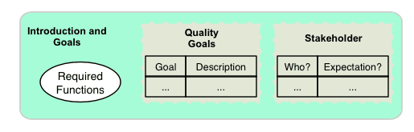
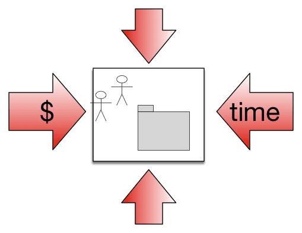
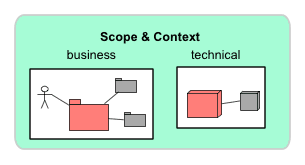
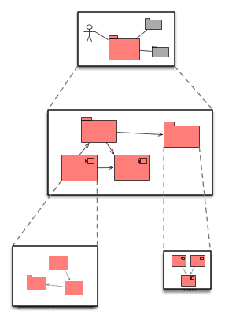
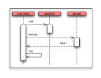
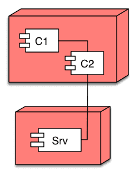
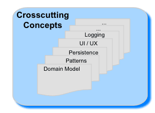
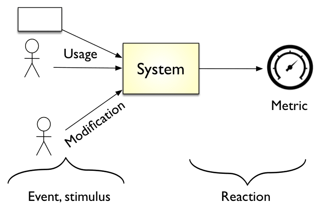
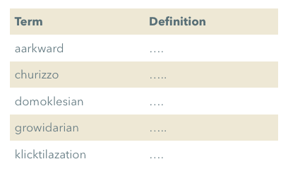
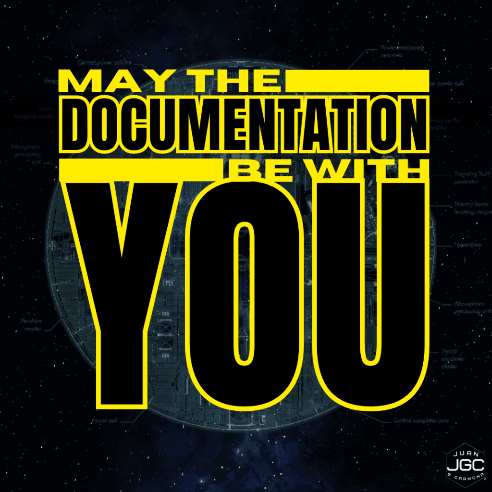

En el desarrollo de software, documentar la arquitectura suele ser un reto que va más allá de escribir código. Como arquitectos o desarrolladores, necesitamos comunicar claramente cómo está construido nuestro sistema, especialmente en proyectos complejos. Aquí es donde entra en juego arc42, una herramienta que ofrece un marco estructurado para documentar arquitecturas de software de forma concisa y efectiva.

En esta entrega de la serie DADS te cuentocomo podemos utilizar arc42 para documetnar nuestros proyectos. Como ejemplo he utilizado el proyecto de ingeniería más grande que me ha venido a la cabeza: la Estrella de la Muerte, la famosa estación espacial del Imperio en _Star Wars_. Este ejemplo es perfecto para mostrar cómo una buena documentación puede ayudar a evitar fallos catastróficos en cualquier proyecto.

🎬 **Para los que prefieren verlo en acción**: He preparado un video completo de 20 minutos sobre arc42 y su aplicación en un proyecto colosal. Veremos cómo una buena documentación puede salvar proyectos... o, incluso, galaxias enteras.

https://youtu.be/-jQLE2rilH4

## ¿Qué es arc42 y por qué deberías usarlo?

**arc42** es una plantilla para documentar la arquitectura de software que organiza la información de manera estructurada y eficiente. Ha sido diseñada especialmente para arquitectos y desarrolladores y nos permite describir cada componente de una arquitectura de forma clara, además no es estricta y lo podemos adaptar a proyectos de cualquier tamaño.

Su enfoque modular y minimalista se centra en lo esencial. No importa si estás diseñando un sistema pequeño o un colosal proyecto como la Estrella de la Muerte; **arc42** se adapta para documentar lo relevante.

## El Origen de arc42

**arc42** fue desarrollado por **[Gernot Starke](https://www.linkedin.com/in/gernotstarke/)** y **[Peter Hruschka](https://www.linkedin.com/in/peterhruschka/)**, arquitectos de software con años de experiencia en la industria. La motivación detrás de **arc42** fue proporcionar una estructura clara y completa para documentar sistemas complejos de software. Esta plantilla se ha vuelto especialmente popular por su licencia abierta, permitiendo que arquitectos y desarrolladores la utilicen y adapten en cualquier proyecto. Puedes aprender más sobre la filosofía y licencias de **arc42** [**aquí**](https://arc42.org/about).

## Beneficios de usar arc42

Usar **arc42** ofrece varios beneficios que hacen que destaque frente a otras plantillas de documentación:

- **Claridad**: Organiza tu documentación en secciones lógicas, fáciles de entender.

- **Eficiencia**: Documenta de forma precisa, sin redundancias ni exceso de detalles.

- **Flexibilidad**: Funciona para cualquier proyecto, desde aplicaciones pequeñas hasta sistemas distribuidos.

- **Comunicación estructurada**: Facilita un lenguaje común entre desarrolladores, stakeholders y usuarios, evitando confusiones.

* * *

## Secciones principales de arc42

En **arc42** se proponen **12 secciones**, ninguna es obligatoria pero como verás, cada sección de **arc42** juega un rol fundamental en la documentación de un sistema de software. Aquí puedes ver el resumen general de las secciones:

A continuación, una visión general de estas secciones, que exploraremos en detalle:

#### 1\. Introducción y Objetivos

Define los requisitos clave y los objetivos de calidad de la arquitectura. En nuestro caso, los requisitos de la Estrella de la Muerte estarían relacionados con su capacidad de destrucción y eficiencia operativa, aunque, como veremos, una arquitectura mal documentada tiene su precio.

#### 2\. Restricciones

Documenta las limitaciones y condiciones externas al proyecto. ¿Restricciones? Piénsalo: ¿qué hubiera pasado si alguien documentara la necesidad de una "ventilación de escape" segura?

#### 3\. Contexto y Alcance

Delimita el sistema y muestra sus interacciones con usuarios y otros sistemas. Aquí veremos la Estrella de la Muerte en su contexto galáctico, cómo interactúa con el Imperio y sus sistemas aliados.

#### 4\. Estrategia de Solución

Describe las decisiones arquitectónicas fundamentales que definen el sistema. La elección de un reactor enorme, en el caso de la Estrella, era un riesgo, pero sin la documentación adecuada, se convierte en una falla crítica.

#### 5\. Vista de Bloques de Construcción

Desglosa la estructura del sistema y su modularización. Es decir, ¿cómo están organizados los "bloques" de nuestra estación espacial? ¿Dónde se ubica el reactor, las armas, la administración?

#### 6\. Vista de Tiempo de Ejecución

Explica cómo interactúan los componentes en escenarios importantes. En la Estrella de la Muerte, la coordinación en tiempo real sería clave para su funcionamiento durante una batalla.

#### 7\. Vista de Despliegue

Muestra la infraestructura técnica donde se ejecuta el sistema, como su ubicación y recursos. La Estrella de la Muerte tiene una infraestructura considerablemente distribuida en el espacio galáctico.

#### 8\. Conceptos Transversales

Aborda temas técnicos que afectan múltiples componentes, desde la seguridad hasta la operatividad. Aquí la gestión de las torres de control, los radares y la vigilancia serían ejemplos.

#### 9\. Decisiones Arquitectónicas

Documenta decisiones críticas y sus razones, íntimamente relacionada con la sección de solución. Estas decisiones podrían haber evitado, si estuvieran bien documentadas, el fallo fatal de diseño.

#### 10\. Requisitos de Calidad

Define los objetivos de calidad esenciales para los stakeholders, desde el rendimiento hasta la seguridad. En el caso de la Estrella de la Muerte, el equilibrio entre potencia y seguridad claramente fue un objetivo perdido.

#### 11\. Riesgos y Deuda Técnica

Describe problemas y riesgos conocidos en el sistema. Este es el espacio para documentar posibles vulnerabilidades y riesgos anticipados, como el escape de ventilación.

#### 12\. Glosario

Recoge términos técnicos y específicos del sistema para alinear a todo el equipo con el mismo lenguaje.

* * *

Ahora que conocemos el contenido general de **arc42**, estamos preparados para examinar cada una de sus secciones en profundidad. A continuación, analizaremos cómo se estructura la documentación en cada área clave de la arquitectura y cómo esta organización contribuye a una mayor claridad y control en proyectos de cualquier tamaño. Desde los objetivos de calidad hasta la gestión de riesgos, pasando por el despliegue y los conceptos transversales, cada sección nos brindará las herramientas para documentar y comunicar una arquitectura sólida que, como veremos, podría haber evitado los fallos de diseño en la Estrella de la Muerte.

## **Secciones Principales de arc42**

### **1\. Introducción y Objetivos**

La primera sección de **arc42** establece las bases del sistema y define los objetivos principales que guían su desarrollo. Aquí presentaremos una visión general de los requisitos fundamentales, objetivos comerciales, y metas de calidad que determinarán la dirección de la arquitectura. Este marco nos permite alinear la documentación técnica con las necesidades y expectativas de los stakeholders, así aseguramos que todos comprendan el propósito del sistema.

Aquí, tanto el modelo [**C4**](https://jgcarmona.com/comunica-arquitectura-software-c4/) como los diagramas **[UML](https://jgcarmona.com/uml-ddd-cqrs/)**, de los cuales ya te her hablado anteriormente, pueden ser útiles para visualizar y comunicar el alcance del sistema, y nos ayudan a involucrar a todos los stakeholders desde el principio del proyecto, algo necesario para el éxito.

#### **Elementos clave:**

- **Descripción de Requisitos:**  
    Se expone un breve resumen de los requisitos funcionales, centrándose en aquellos que son cruciales para el éxito del sistema. Este resumen puede incluir objetivos específicos o casos de uso clave que guiarán la arquitectura.

- **Metas de Calidad:**  
    Aquí se destacan entre tres y cinco metas de calidad esenciales. Estas metas reflejan aspectos no funcionales, como rendimiento, escalabilidad, seguridad, o mantenibilidad, que son prioritarios para los stakeholders. La claridad en estas metas permite ajustar decisiones arquitectónicas para cumplir con las expectativas de calidad.

- **Stakeholders:**  
    Se identifican las personas, roles, o entidades que interactúan con el sistema y tienen intereses específicos en su desarrollo. Comprender quiénes son y cuáles son sus expectativas permite adaptar la arquitectura y su documentación para cumplir los requisitos y anticiparse a posibles problemas.

Para ver un ejemplo completo de esta sección en el contexto de la Estrella de la Muerte, puedes visitar **[este enlace](https://github.com/jgcarmona-com/starwars-deathstar-arc42-documentation/blob/main/docs/ES/01_introduccion_y_objetivos.md)**.

### **2\. Restricciones**

La sección de restricciones define los límites específicos que afectan al diseño y desarrollo del sistema, y establece las condiciones con las que el equipo de desarrollo debe trabajar. Estas restricciones abarcan tanto políticas organizacionales como limitaciones técnicas, y son cruciales para asegurar que el sistema cumpla con todas las normativas y condiciones preexistentes.

#### **Elementos clave**

- **Restricciones Organizacionales:**  
    Estas limitaciones incluyen las políticas internas de la empresa, estándares específicos, regulaciones de la industria o directrices de cumplimiento que el sistema debe seguir. Pueden implicar reglas de privacidad, requisitos de seguridad, o estándares de codificación a nivel organizativo.

- **Restricciones Técnicas:**  
    Las restricciones técnicas abarcan los límites del hardware, restricciones de licencias de software, y dependencias tecnológicas. Estas limitaciones pueden condicionar las herramientas y tecnologías que se pueden utilizar, como la compatibilidad con sistemas operativos específicos o la capacidad de la infraestructura actual.

Para ver un ejemplo completo de esta sección en el contexto de la Estrella de la Muerte, puedes visitar [**este enlace**](https://github.com/jgcarmona-com/starwars-deathstar-arc42-documentation/blob/main/docs/ES/02_restricciones.md).

#### **3\. Contexto y Alcance**

Esta sección delimita el sistema respecto a su entorno y especifica las interfaces que expone, así como los usuarios y otros sistemas que se comunican con él. A través de diagramas y listas, se documentan tanto las interacciones comerciales o de negocio como las técnicas, facilitando la comprensión del sistema en su contexto operativo. Esta sección es clave porque combina una visión de negocio con una visión técnica, es donde ambos "universos" se dan la mano.

#### Elementos clave

**Diagrama de Contexto:**  
Ofrece una representación visual que muestra cómo el sistema interactúa con actores externos y otros sistemas. Este diagrama ilustra el alcance del sistema y los puntos de conexión críticos.

**Interfaces Externas:**  
Listado de conexiones o integraciones con otros sistemas. Estas interfaces pueden incluir protocolos, canales de comunicación y formatos de intercambio de datos que el sistema utilizará para interactuar con su entorno.

Para ver un ejemplo completo de esta sección en el contexto de la Estrella de la Muerte, puedes visitar [**este enlace**](https://github.com/jgcarmona-com/starwars-deathstar-arc42-documentation/blob/main/docs/ES/03_contexto_y_alcance.md).

### **4\. Estrategia de Solución**

Esta sección define las decisiones arquitectónicas clave y los enfoques estratégicos que guían el desarrollo del sistema. Estas decisiones iniciales establecen la base de la arquitectura y dirigen el desarrollo hacia el cumplimiento de los objetivos del sistema. En esta fase se contemplan las tecnologías seleccionadas y el diseño modular del sistema, permitiendo una implementación eficaz y escalable.

#### Elementos clave

**Decisiones de Tecnología:**  
Aquí se incluye una breve explicación de las tecnologías o herramientas escogidas, así como el enfoque general adoptado para el sistema. Estas decisiones están guiadas por factores como la compatibilidad con el entorno, los requisitos de rendimiento, y las preferencias del equipo de desarrollo.

**Descomposición de Alto Nivel:**  
Este elemento describe cómo se organiza el sistema en módulos o componentes principales. En lugar de un desglose detallado, esta sección presenta una visión general de los módulos que soportan las funcionalidades y el flujo de trabajo principales del sistema.

Para ver un ejemplo completo de esta sección en el contexto de la Estrella de la Muerte, puedes visitar [**este enlace**](https://github.com/jgcarmona-com/starwars-deathstar-arc42-documentation/blob/main/docs/ES/04_estrategia_de_solucion.md).

### **5\. Vista de Bloques de Construcción**

Esta sección proporciona una representación detallada y jerárquica del sistema, dividiéndolo en módulos y componentes clave. Esta estructura permite entender cómo se organizan y relacionan los distintos elementos del sistema. Aquí, el uso de **[UML](https://jgcarmona.com/uml-ddd-cqrs/)** resulta útil para representar visualmente la estructura y facilitar la comprensión de los componentes principales y sus interacciones. Si necesitas un repaso sobre **[UML](https://jgcarmona.com/uml-ddd-cqrs/)**, consulta el artículo de **[DADS #04](https://jgcarmona.com/uml-ddd-cqrs/)** , donde profundizamos en su aplicación para comunicar sistemas complejos

#### Elementos clave

**Diagrama Jerárquico:**  
Aquí se presenta una visualización de los bloques principales y su interrelación en forma de un diagrama jerárquico. Este diagrama muestra cómo los módulos y componentes están organizados en distintos niveles, facilitando una visión clara de la estructura del sistema.

**Descripción de Componentes:**  
Cada bloque principal tiene una responsabilidad específica en el sistema. En esta sección, se ofrece una explicación breve de las responsabilidades y funciones de cada uno de estos bloques, proporcionando una guía para entender su papel en la arquitectura general.

Para ver un ejemplo completo de esta sección en el contexto de la Estrella de la Muerte, puedes visitar [este enlace](https://github.com/jgcarmona-com/starwars-deathstar-arc42-documentation/blob/main/docs/ES/05_vista_de_bloques_de_construccion.md).

### **6\. Vista de Ejecución**

La Vista de Ejecución documenta cómo interactúan los distintos componentes del sistema en escenarios clave, garantizando que el sistema cumpla con sus requisitos de funcionalidad y robustez. Aquí, el uso de diagramas de secuencia de **[UML](https://jgcarmona.com/uml-ddd-cqrs/)** es altamente útil, ya que permite representar la cronología y el flujo de interacciones entre componentes. El modelo [**C4**](https://jgcarmona.com/comunica-arquitectura-software-c4/) también puede complementar esta vista, proporcionando un marco visual para entender cómo se relacionan los diferentes niveles de componentes en distintos casos de uso. Esta sección es fundamental para documentar la manera en que el sistema gestiona operaciones, administración y manejo de errores, asegurando su fiabilidad en situaciones reales.

#### Elementos clave

**Escenarios de Uso:**  
Para cada caso de uso importante, se emplea un diagrama de secuencia que ilustra el flujo de procesos y la interacción entre los componentes principales. Estos escenarios permiten visualizar cómo el sistema realiza tareas críticas, facilitando el análisis de rendimiento y comportamiento en entornos reales.

**Manejo de Errores:**  
Se describe el proceso de gestión de excepciones y la forma en que el sistema asegura su robustez. Este apartado detalla los mecanismos implementados para manejar errores, prevenir fallos y mantener la continuidad operativa.

Para ver un ejemplo completo de esta sección en el contexto de la Estrella de la Muerte, puedes visitar [este enlace](https://github.com/jgcarmona-com/starwars-deathstar-arc42-documentation/blob/main/docs/ES/06_vista_de_ejecucion.md).

### 7\. Vista de Despliegue

La Vista de Despliegue define la infraestructura física y lógica donde se ejecuta el sistema, detallando los entornos y la topología necesarios para soportar sus componentes de manera estable. Aquí, el modelo C4 resulta especialmente útil al proporcionar una visión clara de cómo se despliegan los contenedores y servicios en el entorno de producción y otros entornos clave, facilitando la comprensión de la infraestructura. Asimismo, los diagramas de despliegue en UML pueden ser empleados para ilustrar la relación entre los nodos de hardware y las aplicaciones que alojan, destacando la disposición de cada componente en la infraestructura y asegurando que el sistema esté configurado para cumplir con sus requisitos técnicos de rendimiento y estabilidad.

#### Elementos clave

**Diagrama de Despliegue:**  
Se utiliza un mapa visual para representar la relación entre los elementos físicos (como servidores, redes o contenedores) y el software. Este diagrama muestra cómo se distribuyen los bloques de software en la infraestructura física, proporcionando una imagen clara de cómo se ejecutan las distintas partes del sistema.

**Entornos de Producción:**  
Describe los entornos específicos (producción, desarrollo, pruebas, etc.) donde se despliega el sistema y sus configuraciones asociadas. Se detalla cómo cada entorno está configurado para garantizar un rendimiento óptimo y una operación segura, incluyendo cualquier característica especial de infraestructura.

Para ver un ejemplo completo de esta sección en el contexto de la Estrella de la Muerte, puedes visitar [**este enlace**](https://github.com/jgcarmona-com/starwars-deathstar-arc42-documentation/blob/main/docs/ES/07_vista_de_despliegue.md).

### 8\. Conceptos Transversales

La sección de Conceptos Transversales aborda aspectos clave del sistema que afectan a múltiples componentes y vistas de la arquitectura. Esto incluye temas esenciales como seguridad, autenticación, y logging, que deben ser coherentes en toda la arquitectura para garantizar la estabilidad, integridad y confiabilidad del sistema.

#### Elementos clave

**Seguridad y Autenticación:**  
Define los métodos y normas para gestionar la seguridad de los datos y las interacciones en el sistema. Esto incluye autenticación de usuarios, autorización de roles, y medidas de protección contra amenazas externas. Aquí se documenta cómo asegurar que solo usuarios autorizados puedan acceder a áreas sensibles del sistema y que la información esté adecuadamente protegida.

**Logs y Monitorización:**  
Establece estrategias para el seguimiento continuo y la gestión de registros del sistema. Los logs permiten rastrear la actividad del sistema para identificar y solucionar problemas, mientras que el monitoreo asegura que el sistema funcione dentro de parámetros esperados, con alertas configuradas para detectar anomalías.

Para ver un ejemplo completo de esta sección en el contexto de la Estrella de la Muerte, puedes visitar **[este enlace](https://github.com/jgcarmona-com/starwars-deathstar-arc42-documentation/blob/main/docs/ES/08_conceptos_transversales.md)**.

### 9\. Decisiones Arquitectónicas

Esta sección documenta las decisiones clave que han dado forma a la arquitectura del sistema, junto con la justificación de cada una y el impacto esperado. Estas decisiones son fundamentales para el éxito del sistema, ya que afectan directamente su estructura, rendimiento y capacidad de adaptación a futuros cambios.

#### Elementos clave

**Decisiones Críticas:**  
Aquí se enumeran las decisiones de arquitectura que afectan significativamente la estructura o el funcionamiento del sistema, tales como la elección de patrones de diseño, tecnologías fundamentales, o decisiones sobre la modularidad y la escalabilidad.

**Justificación:**  
Para cada decisión crítica, se proporciona una explicación de las razones detrás de ella, incluyendo su valor añadido y cómo contribuye a los objetivos de calidad y rendimiento del sistema. Esto garantiza que las elecciones arquitectónicas estén alineadas con las expectativas de los stakeholders y la viabilidad técnica.

Para ver un ejemplo completo de esta sección en el contexto de la Estrella de la Muerte, puedes visitar [**este enlace**](https://github.com/jgcarmona-com/starwars-deathstar-arc42-documentation/blob/main/docs/ES/09_decisiones_arquitectonicas.md).

### 10\. Requisitos de Calidad

Esta sección especifica los objetivos de calidad que deben alcanzarse para satisfacer las necesidades y expectativas de los stakeholders. Documentar estos requisitos permite priorizar aspectos como la escalabilidad, la eficiencia o la seguridad, que son fundamentales para el éxito a largo plazo del sistema.

#### Elementos clave

**Escenarios de Calidad:**  
Cada objetivo de calidad se presenta a través de casos de prueba o ejemplos que ilustran cómo debe comportarse el sistema en situaciones específicas. Estos escenarios permiten evaluar el cumplimiento de las metas de calidad establecidas y asegurar que el sistema responde adecuadamente en situaciones críticas.

**Matriz de Prioridades:**  
Se elabora una tabla de prioridades que organiza los requisitos de calidad en función de su importancia para los stakeholders, permitiendo al equipo de desarrollo enfocarse en los aspectos más críticos para el sistema.

Para ver un ejemplo completo de esta sección en el contexto de la Estrella de la Muerte, puedes visitar [**este enlace**](https://github.com/jgcarmona-com/starwars-deathstar-arc42-documentation/blob/main/docs/ES/10_requisitos_de_calidad.md).

### 11\. Riesgos y Deuda Técnica

Esta sección documenta los riesgos potenciales que pueden afectar al sistema y

cualquier deuda técnica que el equipo haya asumido para cumplir con plazos o limitaciones. Identificar estos elementos permite planificar su mitigación y gestionar el mantenimiento futuro de la arquitectura.

#### Elementos clave

**Riesgos Conocidos:**  
Incluye un listado de posibles riesgos que podrían impactar negativamente el sistema, como dependencias de terceros, limitaciones de escalabilidad o problemas de seguridad. Además, se describen estrategias para mitigar estos riesgos y reducir su impacto a largo plazo.

**Deuda Técnica:**  
Describe áreas específicas donde se asumió deuda técnica para cumplir con plazos o limitaciones. Se detallan los motivos detrás de estas decisiones y el plan para abordarlas progresivamente y mejorar la calidad del sistema a lo largo del tiempo.

Para ver un ejemplo completo de esta sección en el contexto de la Estrella de la Muerte, puedes visitar [**este enlace**](https://github.com/jgcarmona-com/starwars-deathstar-arc42-documentation/blob/main/docs/ES/11_riesgos_y_deuda_tecnica.md).

### 12\. Glosario

El glosario es una herramienta esencial para asegurar que la terminología específica utilizada en el sistema se mantenga coherente y comprensible para todos los miembros del equipo. Aquí se incluyen definiciones de términos técnicos y de dominio, aclarando cualquier posible ambigüedad y facilitando el trabajo colaborativo.

#### Elementos clave

**Términos Clave:**  
Incluye definiciones claras y concisas de los términos específicos empleados en el sistema y su contexto. Esto ayuda a alinear el entendimiento entre el equipo técnico y los stakeholders, asegurando que todos utilicen la misma terminología.

**Referencias Cruzadas:**  
Cada término incluye enlaces a secciones de la documentación donde se utiliza o aplica el término. Esto permite a los lectores acceder fácilmente a un contexto más amplio y entender cómo se emplean estos términos en distintas partes del sistema.

Para ver un ejemplo completo de esta sección en el contexto de la Estrella de la Muerte, puedes visitar **[este enlace](https://github.com/jgcarmona-com/starwars-deathstar-arc42-documentation/blob/main/docs/ES/12_glosario.md)**.

* * *

## **Documenta Arquitectura de Software con arc42**

Durante los últimos capítulos de [**la serie DADS (Diseño, Arquitectura y Desarrollo de Software)**](https://jgcarmona.com/category/dads/), hemos profundizado en herramientas esenciales que dan estructura y claridad a nuestras arquitecturas de software. Desde el uso de UML en [**DADS #04: UML al Rescate**](https://jgcarmona.com/uml-ddd-cqrs/), donde analizamos su capacidad para comunicar sistemas complejos, hasta el poder del modelo C4 en [**DADS #05: C4 - Nuestra Mejor Arma Como Arquitectos de Software**](https://jgcarmona.com/comunica-arquitectura-software-c4/), cada entrega de la serie refuerza la importancia de una documentación sólida para construir sistemas robustos y sostenibles.

Ahora, con **arc42**, damos un paso adelante en la documentación de arquitecturas complejas. **arc42** no solo organiza la información, sino que establece un lenguaje común entre arquitectos, desarrolladores y stakeholders, permitiendo que todos comprendan el sistema sin caer en detalles abrumadores. Y en este artículo hemos explorado cada sección de **arc42** a través de un proyecto ficticio inspirador: la Estrella de la Muerte. Este proyecto, aunque ficticio, nos ha permitido ilustrar cómo **arc42** puede aplicarse a un sistema de escala galáctica. Puedes explorar el ejemplo completo en mi [**repositorio en GitHub**](https://github.com/jgcarmona-com/starwars-deathstar-arc42-documentation).

En línea con esta exploración de documentación y diseño, he lanzado una serie de shorts en YouTube que explica patrones de diseño en un minuto. Estos videos buscan ser una herramienta ágil y accesible para que desarrolladores y arquitectos puedan refrescar y aprender conceptos de diseño esenciales para sus proyectos, sin requerir mucho tiempo.

**arc42** se convierte así en el "arma definitiva" para documentar arquitecturas de software, brindándonos la capacidad de crear documentación clara, eficiente y adaptable a cualquier tipo de proyecto. Desde aquí, te invito a seguir profundizando en estas herramientas, explorando la serie DADS y, si te apasiona el diseño y la arquitectura, unirte a esta comunidad para seguir aprendiendo juntos.

¡Que la documentación te acompañe!

