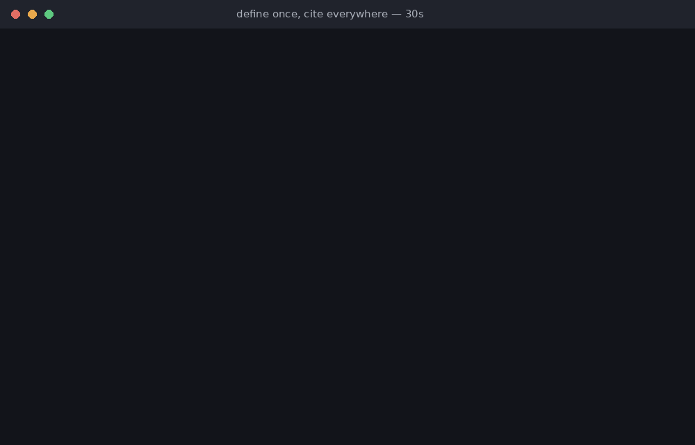

Run this on any repo that has been doing spec-driven development for a few weeks:

```bash
grep -rn -i "refund" openspec/specs
```

Swap "refund" for any business rule you own. Here is what it returned on a repo of mine:

```
billing/spec.md:4:  Refunds are issued for purchases made in the last 30 days.
checkout/spec.md:4: Customers can request a refund within 30 days of delivery.
support/spec.md:4:  If the order is less than a month old, offer a refund.
```

Same rule. Three specs. Three wordings — and two different meanings. Thirty days from **purchase** is not thirty days from **delivery**. Nobody decided that fork. Nobody reviewed it. A coding agent paraphrased it into existence, because every new spec re-explains the product from scratch, and paraphrase **is** drift.

Be honest about who reads these files. Humans don't — they read the code. Specs today are words that only a coding agent reads, on every invocation, as truth. Which means a fork like the one above doesn't get caught in review. It gets **implemented**.

We solved this problem in code decades ago: don't repeat yourself. Extract the function, call it. Specs never got that memo — they still copy-paste the product on every increment, and now LLMs do the copying at machine speed, with small mutations each time.

## The fix is the same fix

Define the rule once, canonically. Then specs *cite* it instead of restating it.

```bash
npm install -g @prodshape/cli@0.12.0
```

The rule becomes one small versioned file:

```markdown
---
id: BR-REFUND-001
type: business-rule
title: Refund window
status: active
---

## Rule

Refunds are accepted within 30 days of delivery.
```

And each spec drops its paraphrase for a reference — one line, generated by the CLI, carrying a content digest of the rule at the moment it was cited:

```markdown
## Returns
Refunds follow BR-REFUND-001. {pdac:cite id="BR-REFUND-001" digest="sha256:9f0c…"}
```

```
$ prodshape citations verify
current  BR-REFUND-001  openspec/specs/billing/spec.md:4
current  BR-REFUND-001  openspec/specs/checkout/spec.md:4
current  BR-REFUND-001  openspec/specs/support/spec.md:4
```

## The payoff

The rule changes — through review, through your normal flow, 30 days becomes 14. You don't grep the repo wondering which documents still say the old thing:

```
$ prodshape citations verify
stale  BR-REFUND-001  openspec/specs/billing/spec.md:4
stale  BR-REFUND-001  openspec/specs/checkout/spec.md:4
stale  BR-REFUND-001  openspec/specs/support/spec.md:4
warning PRODUCT061: Citation of 'BR-REFUND-001' is stale: canonical content
changed since the citation was recorded
```

Every spec that cites the rule, flagged, with file and line. Put that command in CI and stale product knowledge stops being invisible. And an agent reading a spec follows the citation to the *current* rule instead of trusting last month's paraphrase.

Three things happen at once:

- **Specs get shorter.** They reference the product instead of re-explaining it on every increment.
- **Forks become impossible.** There is nothing to fork — the rule has one home.
- **Drift becomes detectable.** A digest either matches or it doesn't. No judgment calls, no repo-wide review.

Here is the full 30-second script — the fork, the fix, the catch. Four files, no init, no git required. Everything below is real output from `@prodshape/cli@0.12.0`:



## Where this sits

This is the core idea of [Product Definition as Code](https://pdac.dev): keep one versioned product model — actors, journeys, use cases, business rules, requirements — that specs and agents **cite instead of re-derive**. It sits upstream of whatever SDD tool you use. The demo above is OpenSpec-shaped, but the citation contract doesn't care what generates or consumes your specs: Spec Kit, Kiro, plain markdown, all the same.

## Try the grep

Run it on your own specs. Pick your most-repeated business rule and count the wordings. If you find a fork, I want to hear about it. And if you want citations running on your repo, I'll help you set it up — it takes about fifteen minutes: [reach out on LinkedIn](https://www.linkedin.com/in/juangcarmona).
