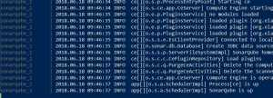
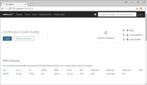
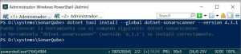
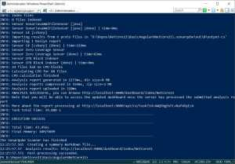
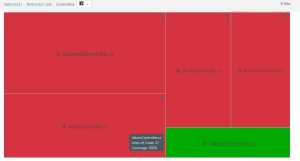

Durante los dos últimos artículos he estado trabajando en una app con Angular 6 y ASP NET Core 2.1 ([1](https://juan-garcia-carmona.blogspot.com/2018/06/asp-net-core-21-angular-6.html)) y ([2](https://juan-garcia-carmona.blogspot.com/2018/06/asp-net-core-21-angular-6-autenticacion.html)). En éste artículos vamos a cambiar un poco de temática y vamos a centrarnos en la calidad del código y voy a mostrar de forma práctica como podemos usar Docker para tener en nuestro sistema un servidor de SonarQube para poder hacer un seguimiento de la calidad de nuestro código.  
  

### PRE-REQUISITOS

  

- Tener Docker instalado en nuestra máquina
- Tener el SDK de .Net Core (2.1 en nuestro caso,  2.1.300 para ser más exactos)

### INVESTIGACIÓN INICIAL

Lo primero que vamos a hacer es localizar la imagen del contenedor que queremos utilizar así que con una simple búsqueda en Google, ' SonarQube Docker' llegamos a [su página](https://hub.docker.com/_/sonarqube/) dentro de D[ocker Hub](https://hub.docker.com/). En esa página hay un pequeño HowTo y además vemos que por defecto la imagen utiliza una base de datos H2 embebida pero que está preparada para funcionar también contra un PostgreSQL, también es sencillo llegar al repositorio de GitHub de SonarSource con varias recetas que usaremos nosotros hoy, [https://github.com/SonarSource/docker-sonarqube/blob/master/recipes.md](https://github.com/SonarSource/docker-sonarqube/blob/master/recipes.md) .

  

### SETUP SONARQUBE

Siguiendo esta receta vamos a crearnos una carpeta para trabajar, yo usaré D:SystemsSonarQube. Podríamos bajar y ejecutar las imagenes por separado, con 'docker run' pero veréis que utilizar ficheros compose es bastante más práctico pues en un fichero compose podemos declarar y configurar todos los servicios, redes y volúmenes que componen o van a componer nuestro sistema. En éste caso necesitamos:

- Una imagen de SonarQube (servicio de SonarQube que correrá en el puerto 9000)
- Una imagen de PostgreSQL (la base de datos de moda durante los últimos años, como ellos mismos dicen 'The world's most advanced open source database')
- Una red internal, sonarnet siguiendo la nomenclatura del ejemplo
- Varios volúmenes para el almacenamiento de los datos, tanto de PostgreSQL como de SonarQube

  

  

Una vez tenemos nuestro fichero docker-compose.yml definido podemos irnos a una consola, a dicha carpeta, y ejecutar docker-compose up, con el siguiente resultado:

  

  

Genial, ha sido fácil y ya tenemos un SonarQube listo para trabajar contra él.

  

### SETUP SONAR SCANNER

Para utilizar SonarQube y poder analizar nuestro código en .Net hay que utilizar un componente de software que se llama SonarScanner y para el que hay diferentes "sabores", SonarScanner for MSBuild, SonnarScanner for .Net core etcétera. Las últimas veces que lo usé, en el trabajo principalmente, usé el de MSBuild y ewl de .NEt Core pero viendo su documentación ( [https://docs.sonarqube.org/display/SCAN/Analyzing+with+SonarQube+Scanner+for+MSBuild](https://docs.sonarqube.org/display/SCAN/Analyzing+with+SonarQube+Scanner+for+MSBuild) )  veo que acaban de sacar un "sabor" nuevo y que se puede descargar como herramienta global ([Global Tool](https://docs.microsoft.com/en-us/dotnet/core/tools/global-tools)), sigamos las instrucciones que hay en NuGet [https://www.nuget.org/packages/dotnet-sonarscanner](https://www.nuget.org/packages/dotnet-sonarscanner) para dicho paquete. 

  

Y tras instalar dicha herramienta y ver que el output dice que podemos invocar directamente sonarscanner haciendo dotnet-sonarscanner quedo gratamente sorprendido porque antes no era tan sencillo, la verdad. Lo siguiente será crear nuestro primer script para analizar con SonarScanner y mandar el resultado a SonarQube.

  

  

### SCRIPT CON SONAR SCANNER

Para este ejemplo vamos a usar, como dije antes, el proyecto de ASP NET Core 2.1 con Angular 6, para esto crearemos el script en la raiz de dicho proyecto y estaremos atentos a incluir los artefactos generados durante la ejecución de la herramienta en nuestro .gitignore (o lista de ficheros y carpetas ignorados en el control de código fuente), éste es el script más básico que se puede ejecutar:

  
  

  

Como vemos siempre hay que "envolver" el scanner entre un begin y un end, en éste caso tan sólo estamos haciendo dotnet build sobre la solución pero dentro de este bloque podemos ejecutar tests unitarios y utilizar herramientas de cobertura de código para generar unos reportes y mandárselos también a SonarQube, de momento éste script tan básico funciona:

Pero nos da unos resultados realmente desalentadores debido a que en el análisis se han incluido librerías y código auto-generado, algo que será lo siguiente que quitemos:

  

  

Vamos a quitar todo lo que haya dentro de wwwroot, todos los ficheros JavaScript y Program.cs y Startup.cs de nuestro análisis incluyendo '/**d:sonar.exclusions="\*\*wwwroot\*\*,\*\*\*.js, \*\*Program.cs, \*\*Startup.cs"'** en el begin de nuestro script inicial... Y tras volver a lanzar el script el resultado ya es bastante más acorde a lo que esperábamos:

  

Una vulnerabilidad (potencial) y 10 code smells que suponen una deuda técnica estimada en alrededor de una hora. Genial! ... Quince minutos después ya hemos resuleto todos esos problemas y nuestro proyecta ya "huele" mucho mejor:

  

  

### TEST COVERAGE

Ahora es el momento de empezar a pensar en la cobertura de código, hay muchísimo por cubrir y ni un sólo test unitario en nuestro proyecto, eso por un lado, y por otro debemos adapatar nuestro script de SonarScanner para generar esos reportes... ¿Por donde empezamos? Pues preparemos el script para que genere los reportes y un proyecto vacío de tests pero dejemos los tests unitarios y la consecuente refactorización para el siguiente artículo, ¿de acuerdo?

  

¿Qué necesitamos para generar reportes de cobertura de código? Bueno, nosotros vamos a usar la herramienta cuyo uso está más extendido, OpenCover, para hacerlo, por lo que leo, aún no existe una Global Tool como con SonarScanner, ya que es una característica bastante nueva del framework 2.1... Pero siempre podemos instalar el paquete NuGet y referenciar la ruta de instalación en nuestro script para luego usarlo las veces que queramos.

  

OpenCover --> NuGet: [https://www.nuget.org/packages/OpenCover/](https://www.nuget.org/packages/OpenCover/) 

  

Lo instalamos, yo lo he hecho creando una librería de clases vacía que será la que contenga los tests unitarios e instalando la referencia a este paquete NuGet desde el propio Visual Studio. Además he modificado ligeramente el script para que ejecute los tests sobre el proyecto de test que acabo de crear, quedando así:

  

  

Bueno, venga, vamos a crear tres o cuatro tests "tontos" para ver que empezamos a cubrir código:

  

  

  

Es algo muy simple, vamos a probar los métodos del típico ValuesController, al menos los gets, que son los únicos que tienen una implementación testable, absurda pero testable. 

  

En este punto lo siguiente que veo necesario es reestructurar un poco la organización del código, así lo dejamos preparado para evolucionar, para lo cuál dejaremos la solución en la raíz, junto con el script de SonarQube, y crearemos una carpeta tests donde estarán los proyectos de tests y otra carpeta NetCore21.Site a donde moveremos el proyecto inicial, incluyendo ya de paso, un pequeño renombrado del mismo proyecto a NetCore21.Site, incluyendo namespaces y usings. Tras esta reestructuración he modificado el script de Sonar para incluir todos estos cambios de rutas y tras ejecutarlo vemos que ya estamos teneiendo un mínimo de cobertura de código:

  

  

Ahora es momento de subir todos estos cambios al repositorio y plantear una re-estructuración por proyectos, así como cubrir con tests unitarios todo lo que llevamos hecho hasta ahora, pero todo esto será en el siguiente artículo.

  

Espero que os esté siendo útil. Saludos,

  

Juan
