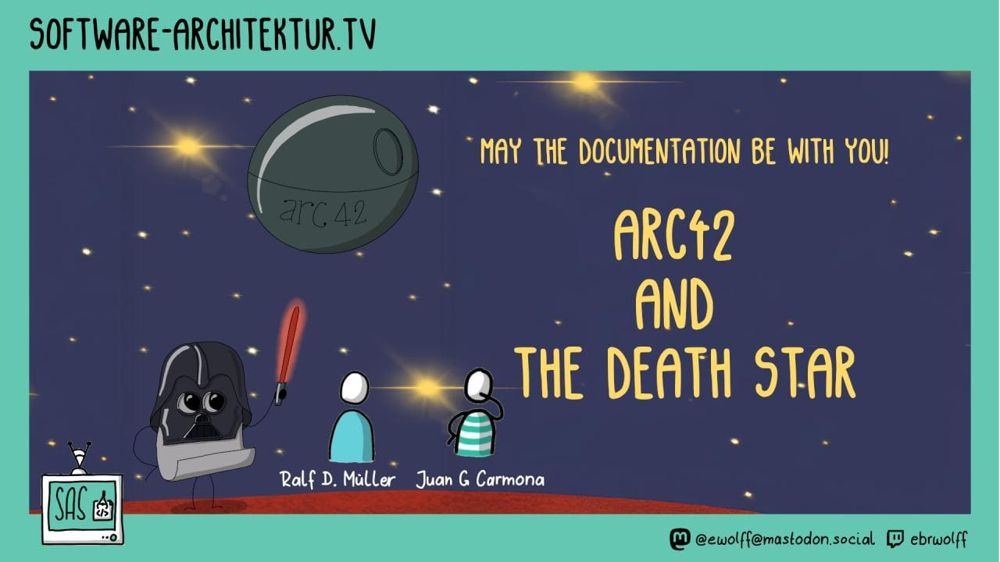
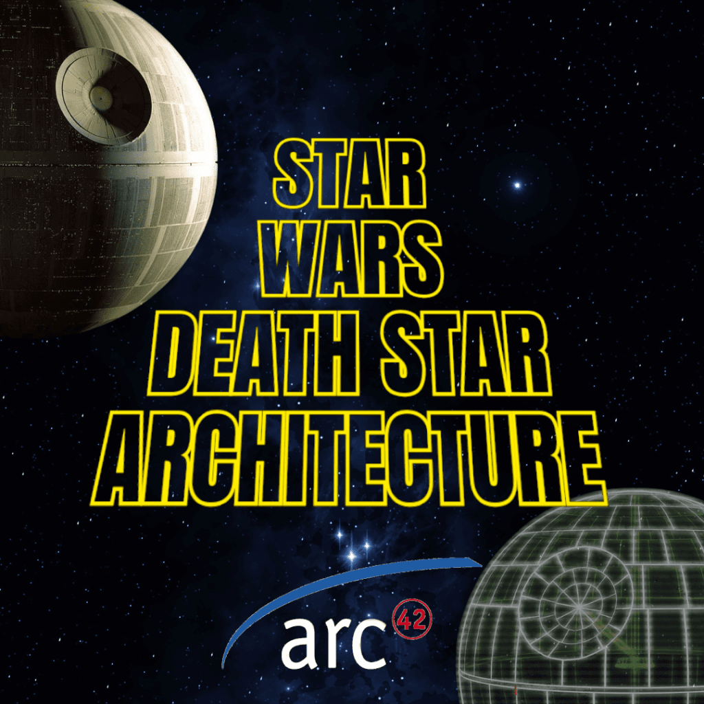

> ¿Qué tienen en común una estación espacial imperial y una aplicación en producción?

Hace un tiempo documenté la arquitectura de la **Estrella de la Muerte** usando arc42, como parte de mi serie [**DADS – Diseño, Arquitectura y Desarrollo de Software**](https://youtube.com/playlist?list=PLquujPA7EWzNBPpN8vcN4XkvuGxIxYyu2). Un ejercicio didáctico que acabó llegando mucho más lejos de lo que imaginaba.

Este viernes tengo el honor de presentar este proyecto en directo en _“[**Softwarearchitektur im Stream**](https://software-architektur.tv/)”_, junto a [**Ralf D. Müller**](https://www.linkedin.com/in/rdmueller/) (iSAQB, DB Systel) y otros referentes europeos en arquitectura de software.

## **¿Cómo surgió la oportunidad?**

Porque aquel repositorio llamó la atención de Ralf, un colaborador destacado en el ecosistema arc42 y creador de herramientas como el `arc42-generator`, que permite generar documentación a partir de archivos `.txrt`, `.yml` o `.adoc`. Ralf lleva años impulsando la documentación técnica como parte viva del desarrollo, con enfoque _Docs-as-Code_, y cuando se cruzó con mi versión arc42 de la Estrella de la Muerte… decidió que merecía ser compartida.

Por motivos evidentes será una charla en inglés, y la doy con mucha humildad pero también con muchas ganas, porque, los que me conocen saben bien que une dos temas que me fascinan, la arqutiectura de software y la documentación de calidad y, sobretodo, útil.

👉 [Aquí puedes ver el repo](https://github.com/juangcarmona/starwars-deathstar-arc42-documentation)  
👉 [Aquí el capítulo de DADS](https://www.youtube.com/watch?v=-jQLE2rilH4)  
👉 [Y el artículo original explicando cada sección de arc42](https://jgcarmona.com/dads-06-documenta-arquitectura-de-software-con-arc42/)

## Steam en vivo

El Stream será el viernes 11 de julio a las 13:00 CET... Y quedará recogido aquí:

https://www.youtube.com/watch?v=w0fj9kLVjEc

Si hay un mensaje que me gustaría que perdure tras mi invervención, es este:

> La documentación suele ser infravalorada. Pero, en las manos adecuadas, puede ser un arma muy poderosa.

Bien estructurada, nos permite a desarrolladores, arquitectos y líderes técnicos **argumentar con criterio y respaldar decisiones con hechos**.

Sirve para anticipar errores, para explicar por qué se eligió un camino y, llegado el caso, para dejar constancia de que los riesgos ya estaban identificados… aunque nadie los corrigiera.

**La arquitectura no va de dibujar diagramas. Va de hacer visibles y comprensibles las decisiones que realmente importan.**

Para todo el equipo. Para hoy… y también para dentro de n años.

🤝 Por cierto, siempre estoy abierto a debatir ideas y a colaborar en nuevos proyectos de consultoría o arquitectura.

**[Si te interesa trabajar conmigo, no dudes en escribirme.](/contact)**
