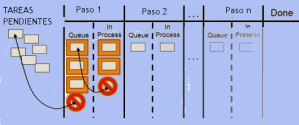

  

Como ya he dicho, un enfoque Kanban, en términos de gestión, es un ejercicio constante de adecuar la oferta a la demanda para entregar un producto o servicio de calidad en el momento adecuado. Uno de los principios básicos de Kanban es hacerlo visible. Hasta ahora hemos hablado de pizarra pero cambiemos el término a tablero, del inglés Kanban Board. El tablero será un control visual y éste podrá ser físico o virtual. 

  

El sistema Kanban es una implementación de un sistema de extracción limitado o que limita el WIP. En software se utiliza un kanban virtual ya que no hay, en realidad, tarjetas de señal. Las tarjetas o pegatinas con insturcciones de trabajo (historias, tareas, características deseadas, etcétera) en la típica pizarra Agile no son tarjetas de señal. La señal se genera cuando existe una diferencia entre el límite WIP establecido y el número de tarjetas en cualquier sección dada del tablero.

  

¿Qué hay que hacer para diseñar un buen tablero Kanban? Karl Scottland lo describé de ésta forma (traducción del inglés):

  

¿Qué aspecto tiene un sistema de Kanban aplicado al desarrollo de software? 

Muy simple, hay una cola de trabajo, que pasa a través de una serie de etapas de desarrollo hasta que se termina.  Cuando el trabajo se acaba en cada etapa, entra en una "cola vertical" para la siguiente etapa. Cuando alguien necesita más trabajo que hacer lo extrae de su correspondiente cola de trabajos.

  

  

Esto se parece mucho a una Task Board (pizarra de tareas) ágil típica, con, tal vez, unos cuantos pasos más y aunque podría ser la pizarra de cualquier departamento de desarrollo sin embargo, hay un elemento más importante que realmente define un sistema Kanban, los límites. Hay dos límites básicos, límites de la cola de trabajo y límites de WIP.

  

  

Los límites de la cola cola de trabajo están diseñados para evitar el trabajo prematuro, antes de tiempo, de ésta forma se logra el tan deseado "Just-In-Time" o JIT.  El límite debe ser lo suficientemente grande como para mantener al equipo ocupado todo el tiempo, es decir, siempre habrá algo que hacer y en lo que comenzar a trabajar, pero lo suficientemente pequeño como para evitar una priorización y planificación prematura, es decir, evitar tener tareas pendientes en la cola de trabajo durante demasiado tiempo antes de empezar a trabajar en ellas. 

Lo ideal es que la cola de trabajo sea exactamente una estructura cola, es decir, FIFO, aunque esto es una pauta y no una regla. A veces hay componentes del equipo más hábiles en algunos campos o hay disponibles otros recursos y por eso no siempre se tiene porque aplicar FIFO.

  

Los límites de WIP están diseñados para reducir la multitarea, maximizar el rendimiento y mejorar el trabajo en equipo.

  

Se ve con la experiencia que mediante el uso de este enfoque organizativo es muy fácil saber a simple vista el estado en que se encuentra cada tarea, donde surgen cuellos de botella y qué fallos o vicios están apareciendo. 

Además, si se utiliza un código de colores, ésto permite a todo el equipo ver qué tipo de trabajo hay en curso, si son nuevos desarrollos, refactorizaciones, si hay bloqueos, si se están resolviendo bugs, etcétera.

  

En cuanto al trabajo urgente, James Shore lo aborda muy bien de esta manera:

  

Si hay una emergencia, esto es, una solicitud de soporte, un cambio o alguna necesidad urgente, hay un espacio vacío en una de las secciones del tablero marcada "urgente". El equipo se puede poner manos a la obra en esa cola de trabajo en cualquier momento sin tener que pasar por el cauce regular. El equipo ha de esforzarse en terminar los temas urgentes con rapidez y tratar de tener , y tratar de mantener la sección "urgente" vacía en todo momento.

  

Si la sección "urgente", por lo que sea, está llena porque se ha llegado al límite WIP y aparece otro elemento urgente, éste tiene que ser añadido a la cola principal. Si un error debe ser corregido de inmediato, el equipo utilizará la sección "urgente" y ésta podría llenarse durante una revisión de fallos, lo cuál sería un elemento a analizar.

  

Como ya he dicho, hay que revisar el flujo de trabajo en las retrospectivas para ver cómo eliminar residuos para mejorar el rendimiento, máxima Lean que también se aplica en Kanban.
