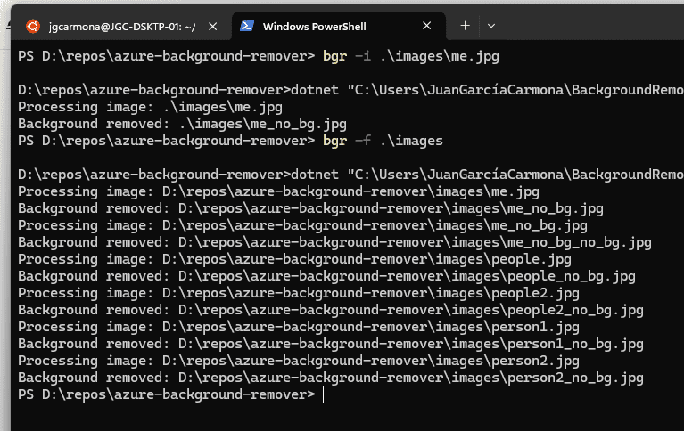
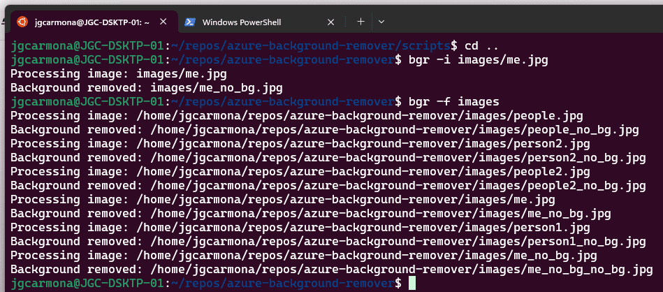

## Creando una Herramienta CLI para con Azure AI en Dos Horas

Hoy quiero compartir contigo una experiencia fascinante: en tan solo dos horas, he creado una herramienta de línea de comandos (CLI) para eliminar el fondo de imágenes utilizando servicios de inteligencia artificial de Azure. Este proyecto no solo demuestra la potencia de Azure AI, sino también cómo podemos desarrollar aplicaciones útiles rápidamente con las herramientas adecuadas. Además, quiero aprovechar para mencionarte el curso que estoy desarrollando, "[**Inteligencia Artificial con Azure: De la Teoría a la Práctica**](https://www.youtube.com/playlist?list=PLquujPA7EWzMce1_428O61sPCx6GJsUm1)", disponible en YouTube.

**REPOSITORIO:**

[https://github.com/jgcarmona-com/azure-background-remover](https://github.com/jgcarmona-com/azure-background-remover)

### ¿Qué Hace esta Herramienta?

La herramienta que he creado, llamada **BackgroundRemover**, permite eliminar el fondo de imágenes individuales o procesar todas las imágenes en una carpeta específica. Utiliza los servicios de análisis de imágenes de Azure para realizar esta tarea de manera eficiente y precisa.

### Características de BackgroundRemover

- **Eliminación de fondo de imágenes individuales**: Procesa una imagen específica y elimina su fondo.

- **Procesamiento por lotes**: Elimina el fondo de todas las imágenes en una carpeta.

- **Soporte multiplataforma**: Funciona tanto en sistemas Windows como en Linux.

### Proceso de Desarrollo

#### Paso 1: Preparativos

Primero, instalé el SDK de .NET 8.0 y configuré mi entorno de desarrollo. Luego, creé un repositorio en GitHub para el proyecto y cloné el repositorio en mi máquina local.

#### Paso 2: Configuración del Proyecto

Configuré el proyecto para que utilizara las credenciales de Azure AI, especificadas en un archivo `appsettings.json`. Este archivo contiene el endpoint y la clave del servicio de análisis de imágenes de Azure.

#### Paso 3: Implementación de la Lógica

Implementé la lógica principal en dos archivos:

- **Program.cs**: Contiene la lógica para leer los argumentos de la línea de comandos y dirigir las solicitudes a las funciones adecuadas.

- **BackgroundRemover.cs**: Contiene las funciones para procesar imágenes individuales y carpetas de imágenes.

#### Paso 4: Creación de Scripts de Instalación

Además, desarrollé scripts de instalación para Windows (`install.ps1`) y Linux (`install.sh`). Estos scripts configuran la herramienta para que puedas ejecutar esta herramienta desde cualquier lugar de tu sistema.





### Resultado Final

El resultado es una herramienta CLI que se puede instalar y utilizar fácilmente para eliminar el fondo de imágenes. Puedes encontrar el código completo y las instrucciones de instalación en el repositorio de GitHub.

### Ejemplo de Uso

Una vez instalada la herramienta, puedes utilizarla de la siguiente manera:

- **Eliminar el fondo de una imagen específica**:

```
bgr -i C:\ruta\a\tu\imagen.jpg
```

- **Eliminar el fondo de todas las imágenes en una carpeta**:

```
bgr -f C:\ruta\a\tu\carpeta
```

### Curso de Inteligencia Artificial con Azure

Este proyecto es solo una muestra de lo que puedes lograr con los servicios de Azure AI. Si te interesa aprender más sobre cómo utilizar Azure para desarrollar aplicaciones de inteligencia artificial, te invito a seguir mi curso en YouTube: [Inteligencia Artificial con Azure: De la Teoría a la Práctica](https://www.youtube.com/playlist?list=PLquujPA7EWzMce1_428O61sPCx6GJsUm1). Este es el primer vídeo de la playlist:

https://www.youtube.com/watch?v=5S7cxyY8iz8&list=PLquujPA7EWzMce1\_428O61sPCx6GJsUm1

En este curso, cubrimos desde los conceptos básicos hasta aplicaciones prácticas, proporcionando una comprensión completa de cómo aprovechar la inteligencia artificial de Azure en tus proyectos.

### Conclusión

Desarrollar herramientas útiles no tiene que ser un proceso largo y complicado. Con las herramientas adecuadas y servicios potentes como Azure AI, puedes crear aplicaciones funcionales en poco tiempo. Espero que encuentres útil esta herramienta y que te unas al curso para aprender más sobre inteligencia artificial con Azure.

¡Gracias por leer y nos vemos en el curso!
