I have a brand new Ubuntu instance that, as you can see, has access to my GPU via NVIDIA drivers:

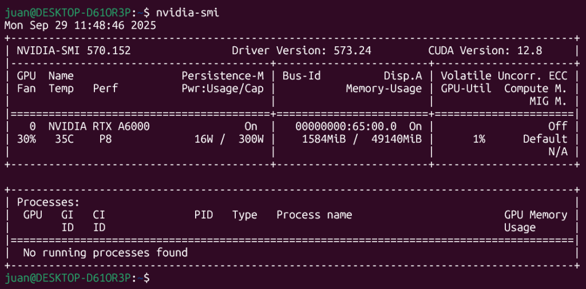

So, if your GPU is ready too... Let’s put it to work with Docker Model Runner. In this demo, we’ll pull and run few models, all using GPU acceleration. This proves the full stack works before we move to agents.

### 1.- Enable Docker Model Runner + GPU

1. Open **Docker Desktop → Settings → AI (or “Model Runner / AI”)**.

3. Toggle **Enable Docker Model Runner**.

5. If your GPU is supported, a new option **Enable GPU‑backed inference** should appear — turn that on.  
    (If you don’t see it, your hardware or driver might not meet DMR’s requirements.)

7. Optionally, enable **host‑side TCP support** (so you can call it from `localhost:12434`). ([Docker Documentation](https://docs.docker.com/ai/model-runner/get-started/?utm_source=chatgpt.com))

9. Apply & restart Docker Desktop.

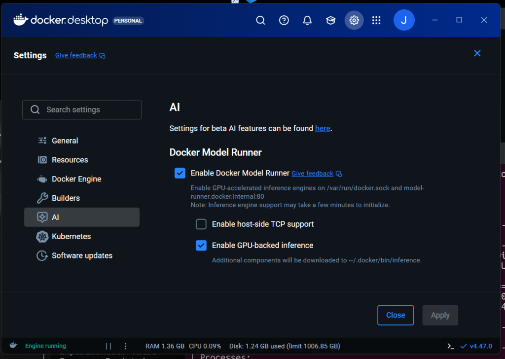

### 2.- Check that DMR is active

In a terminal:

```
docker model status
```

You should see “Docker Model Runner is running” or similar status.  

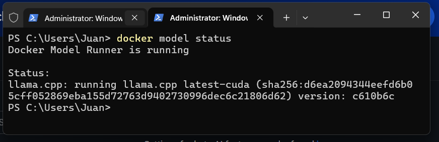

If it gives an error, you may need to enable it via CLI: `docker desktop enable model-runner`

### 3.- Pull Your preferred Model

I've jsut grabbed:

- **A Small Model**: `ai/smollm3:Q8_0`

- **And a “big” (Large)**: `ai/gpt-oss:latest`

To get one you can use Docker Destop and search:

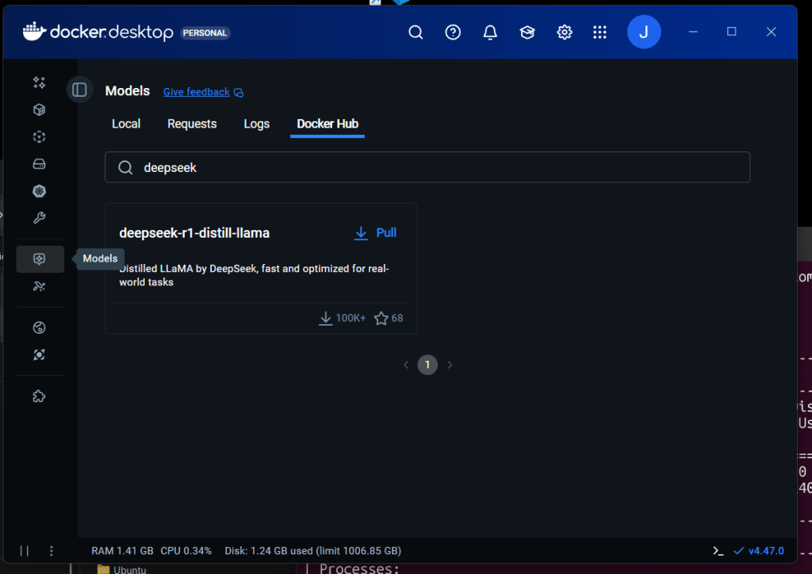

Or directly form a terminal running:

```
docker model pull deepseek-r1-distill-llama:8B-Q4_0
```

You can list all: `docker model ls`

### 4.- Run some models and compare GPU and memory utilisation

Here is the interesting part... Let's run these models interactively or in server mode. i.e. Run: `docker model run ai/smollm3:Q8_0` and ask a silly question to make it think...

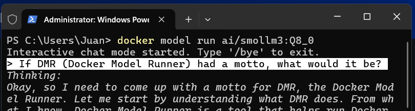

see how it thinks and enjoy the result:  

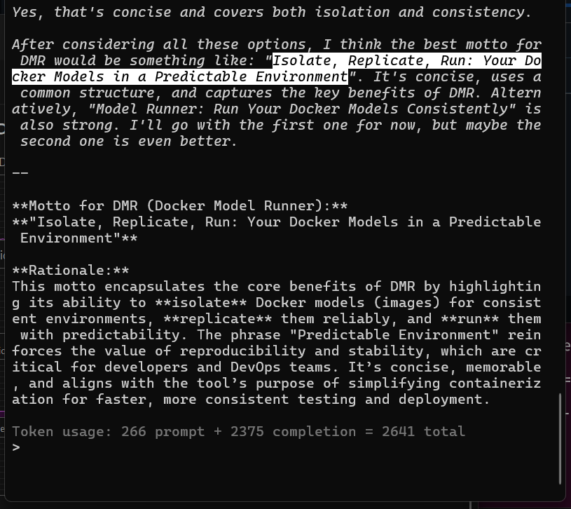

And, wow, as the model is small, it only used a small amount of GPU and GPU memory with fascinating results. I loved that!

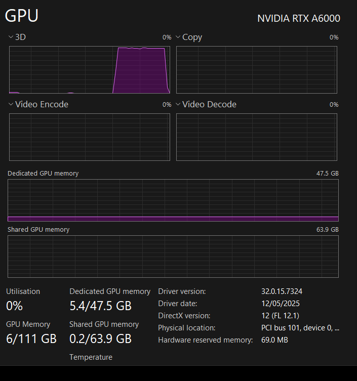

Let's try something much bigger! Let's run `docker model run ai/gpt-oss:latest`

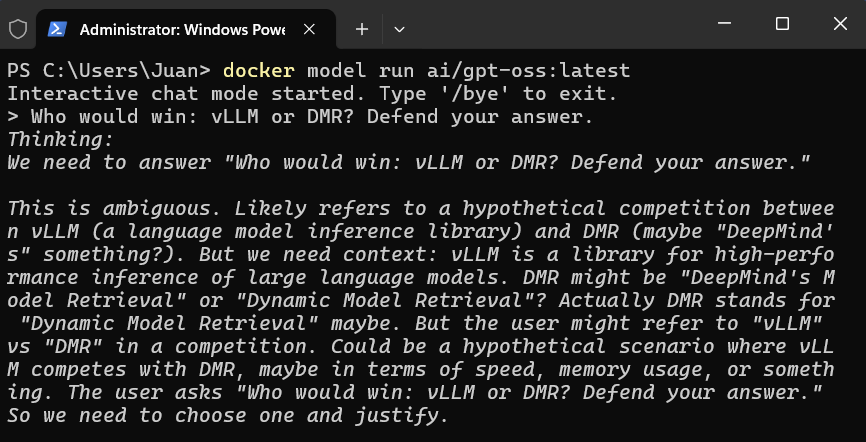

It took longer to start... and it didn't use so much GPU or memory:

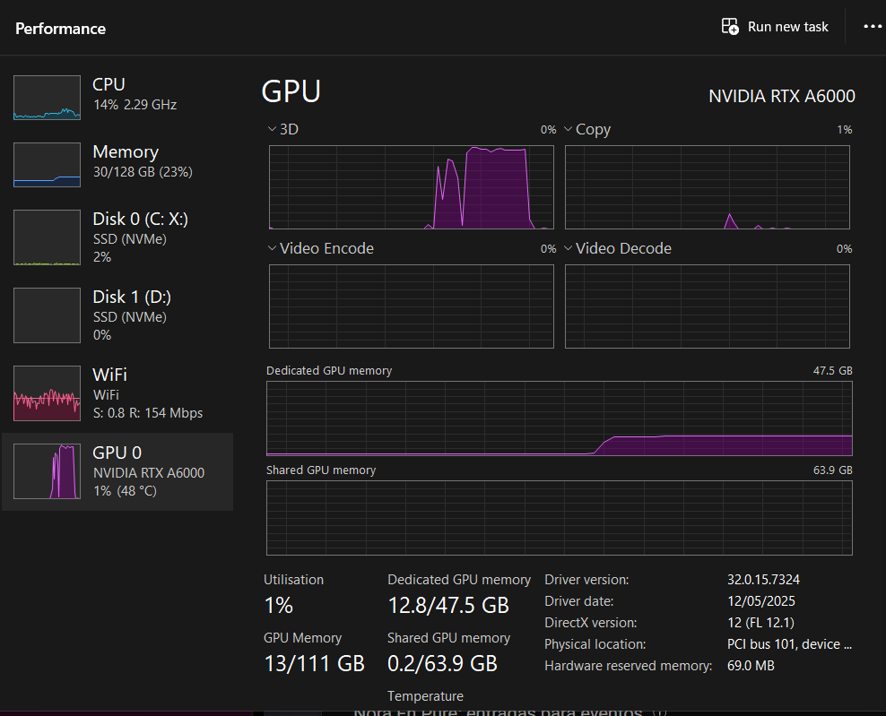

And we can trust its response (or not) but it's quite convincing, isn't it?

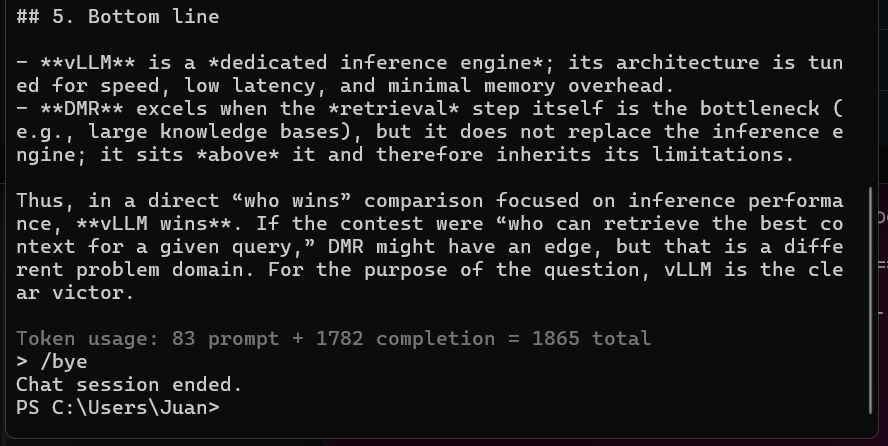

What if we use a "Big" model?

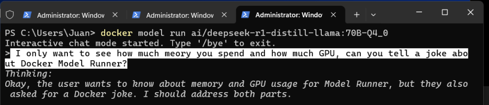


Here is its joke:

> Why did the Docker container go to therapy?  
> Because it had too many "layers" to unpack!

  

### 5.- Can we expose this models via API and consume them?

It is not a joke, I really don't know... I'll try... Ah! we need to Enable host-side TCP support Settings/AI, choose our port and CORS Policy:

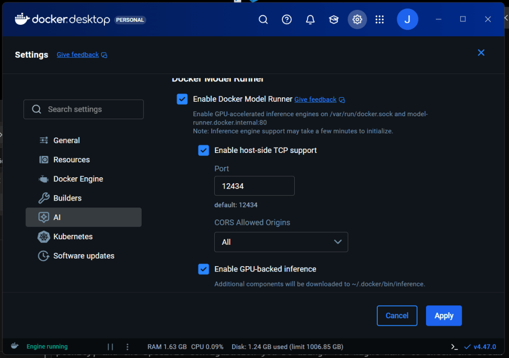

Once done we can consume those models via REST API, a quick example is that you can call them with CURL:

```powershell
curl.exe -X POST "http://localhost:12434/engines/llama.cpp/v1/chat/completions" -H "Content-Type: application/json"
-d '{\"model\": \"ai/smollm3:Q8_0\", \"messages\": [{\"role\": \"user\", \"content\": \"What does Docker Model Runner say to the GPU?\"}]}'

```

You can also use --no-buffer to "see" the streaming or feed your preferred UI:

```
curl.exe -X POST "http://localhost:12434/engines/llama.cpp/v1/chat/completions" -H "Content-Type: application/json"
--no-buffer `
-d '{\"model\": \"ai/smollm3:Q8_0\", \"stream\": true, \"messages\": [{\"role\": \"user\", \"content\": \"What does Docker Model Runner say to the GPU?\"}]}'
```

And if you followed these steps, now you now have a working proof: Docker Model Runner is fully GPU-enabled on your machine, and you can run **small, medium or large** models locally.

In next articles, I'll connect these models to _cagent_ and build useful AI agents with memory and workflows.

## 🔍 Key References from Docker Docs

- DMR requires Docker Desktop 4.41+ and supports NVIDIA GPUs on Windows. ([Docker Documentation](https://docs.docker.com/ai/model-runner/?utm_source=chatgpt.com))

- To enable DMR in Docker Desktop: go to Settings → AI tab → enable “Enable GPU‑backed inference” when hardware permits. ([Docker Documentation](https://docs.docker.com/ai/model-runner/get-started/?utm_source=chatgpt.com))

- DMR exposes REST/OpenAI‑style endpoints (e.g. `localhost:12434`) when host‑side TCP support is enabled. ([Docker Documentation](https://docs.docker.com/ai/model-runner/api-reference/?utm_source=chatgpt.com))

- The `docker model install-runner` command supports a `--gpu` flag (auto or cuda) for Engine mode. ([Docker Documentation](https://docs.docker.com/reference/cli/docker/model/install-runner/?utm_source=chatgpt.com))
