Imagina una colonia de bacterias en una placa Petri. Al principio es genial, la colonia crecen, se multiplican como locas porque tienen todo lo que necesitan. Con el tiempo llegan las complicaciones porque su hábitat es cada ves más hostil. Sus propios deshechos se están convertido en las toxinas que al final acaban aniquilando la colonia.

**La Lección de la Placa Petri**

En el mundo microscópico de una placa de Petri, las bacterias florecen, inicialmente, gracias a un abundante suministro de nutrientes y su crecimiento es exponencial. Esta placa es un espejo del progreso humano marcado por los avances tecnológicos de los últimos siglos, una expansión industrial sin precedentes y un contínuo crecimiento poblacional. Pero a medida que las bacterias se expanden, comienzan a generar desechos, un subproducto inevitable de su existencia y de su crecimiento.

De igual forma, la acumulación de residuos tóxicos en la placa Petri es análoga a la creciente contaminación en nuestro propio entorno. Los ríos llenos de basura, plásticos y microplásticos. Montañas de desperdicios que no paran de crecer, de ropa, de bicicletas, de electrodomésticos o de dispositivos tecnológicos obsoletos, testigos incuestionables del impacto ambiental del progreso de nuestra sociedad de consumo. Estas son las toxinas de nuestra era. La Suciedad del consumo.

Esta situación en la placa Petri alcanza un punto crítico, un momento de verdad donde el crecimiento desenfrenado se enfrenta a las realidades de un entorno limitado. Las bacterias deben adaptarse o enfrentar su declieve y morir envenenadas por ellas mismas. El crecimiento descontrolado no es sostenible.

La lección es inequívoca. Si bien el crecimiento y la expansión han sido los motores del desarrollo humano y tecnológico, no pueden continuar sin reconocer y abordar los residuos tóxicos, tanto literal como metafóricamente, que generamos en el proceso. Este es el desafío que enfrentamos: encontrar maneras de mantener nuestro impulso innovador mientras gestionamos de manera responsable los subproductos de ese mismo impulso.

**3\. John Stuart Mill y la Economía Estacionaria: Enfrentando el Crecimiento Descontrolado**

Me gustaría presentarte a [**John Stuart Mill**](https://en.wikipedia.org/wiki/John_Stuart_Mill), un pensador que, aunque perteneciente al siglo XIX, ofrece perspectivas valiosas para los desafíos modernos. John Stuart Mill, filósofo y economista británico, nos presentó la idea de la "Economía Estacionaria", un concepto que parece ser una respuesta temprana a los problemas que hoy enfrentamos.

> 
> 
> No puedo, por lo tanto, considerar los estados estacionarios de capital y riqueza con la aversión no afectada tan generalmente manifestada por economistas políticos de la vieja escuela.

> Si la tierra debe perder la gran parte de su placidez que le debe a cosas que el aumento ilimitado de riqueza y población extirparía de ella, con el mero propósito de permitirle sostener a una población más grande, pero no una mejor o más feliz, Sinceramente espero, por el bien de la posteridad, que se contenten con estar estacionarios, mucho antes de que la necesidad los obligue a ello.

Mill observó que el crecimiento económico y la expansión tienen sus límites, especialmente en un mundo con recursos finitos. Esta visión es paralela a nuestra situación en la placa Petri: un crecimiento inicialmente exitoso pero finalmente insostenible debido a las limitaciones de su entorno. En su obra "[Principios de Economía Política](https://www.casadellibro.com/libro-principios-de-economia-politica/9788497565431/1223692)", **Mill imaginó una sociedad donde el crecimiento económico alcanza un punto de equilibrio**, no para estancarse, sino para mantener un balance con el entorno natural.

La relevancia de la Economía Estacionaria en nuestro tiempo es innegable. En una era de avances tecnológicos rápidos, también nos enfrentamos a desafíos ambientales críticos como el cambio climático, la superpoblación o el agotamiento de recursos. En su obra Mill nos invita a considerar un **modelo de desarrollo** que sea i**nnovador pero sostenible**, que busque **satisfacer las necesidades** **humanas respetando los límites de nuestro planeta**. Sugiere que debemos redefinir nuestra percepción del éxito y del progreso, no solo en términos de avances tecnológicos o acumulación económica, sino también en nuestra habilidad para preservar y cuidar nuestro entorno. La Economía Estacionaria de Mill es el primer llamamiento a buscar un **desarrollo económico** en armonía con la **sostenibilidad** del planeta.

**El Desarrollo Sostenible en el Siglo XX: Evolucionando Desde Mill Hasta Hoy**

Siguiendo la idea de Mill sobre una economía que no crece sin control, llegamos al concepto de **"Desarrollo Sostenible"** que empezó a tomar forma en los años 80. Esta correinte empezó con el [**informe Brundtland**](https://es.wikipedia.org/wiki/Informe_Brundtland) en 1987. Por aquel entonces yo tenía la edad de mi hijo, todavía el cielo era azul y la arena de las playas aún estaba libre de plásticos. En dicho informe un grupo de expertos de la ONU dijo algo súper importante: tenemos que vivir y desarrollarnos de una manera que no les quite oportunidades a los que vienen después de nosotros.

[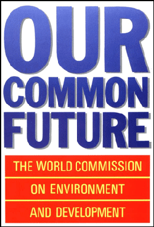](https://en.wikipedia.org/wiki/Our_Common_Future)

El [informe Brundtland](https://es.wikipedia.org/wiki/Informe_Brundtland) fue como una bombilla que se encendió e iluminó millones de mentes alrededor del mundo. Empezamos a entender que no podemos seguir haciendo las cosas sin pensar en el medio ambiente y el futuro de la humanidad.

Hoy en día, este tema es más relevante que nunca. Mira a tu alrededor: compramos y tiramos, todos los días, todo el rato, en todos los ámbitos. Eso es lo que llamamos consumismo. Es como esas bacterias de la placa Petri, consumiendo sin parar hasta que todo se vuelve tóxico.

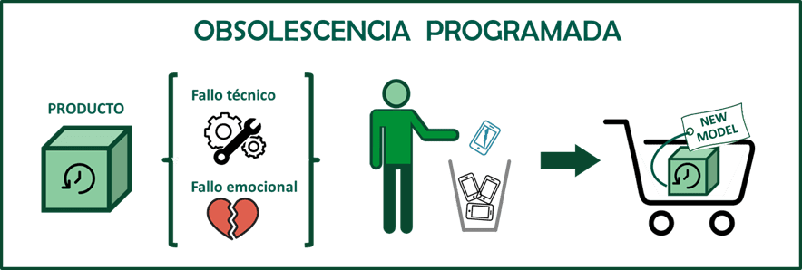

Así que, ¿cómo aplicamos el Desarrollo Sostenible ahora? Se trata de pensar en cómo hacemos y usamos las cosas. Por ejemplo, en lugar de teléfonos móviles que se rompen cada dos años, ¿por qué no hacer unos que duren más y se puedan reparar? Cambiar nuestros hábitos de "comprar y tirar" por otros más de "usar y cuidar" es clave. ¿De verdad es imposible diseñar y comercializar productos que duren para siempre? ¿podría ser que la solución sea... hacer menos?

**5\. Decrecimiento: Una Alternativa al Actual Modelo Productivo**

Ahora, hablemos de algo llamado "Decrecimiento". Suena raro, ¿verdad? Pero es una idea que está ganando fuerza y se ha escrito mucho acerca del decrecimiento sostenible. El Decrecimiento es básicamente decir "vamos a enfriar las cosas". No se trata de que todos vivamos sin nada, sino de replantear nuestra obsesión por el crecimiento constante y el consumo desmedido.

El decrecimiento nos desafía a cuestionar la suposición de que los recursos del planeta son ilimitados. Propone una reducción en la producción y el consumo, pero de una manera que favorezca la sostenibilidad y el bienestar. El objetivo es alejarse de la producción masiva y el consumo desmedido hacia un enfoque que priorice la eficiencia, la durabilidad y la responsabilidad ecológica.

La crítica al modelo de crecimiento continuo radica en sus consecuencias ambientales: el cambio climático, la contaminación y la explotación insostenible de recursos. Como la analogía de las bacterias en una placa Petri, un crecimiento sin control conduce a la autodestrucción. El decrecimiento busca evitar este destino, promoviendo un equilibrio entre las necesidades humanas y la capacidad del planeta.

En el sector tecnológico, el decrecimiento podría implicar un cambio hacia productos más duraderos y fácilmente reparables, en contraposición a la obsolescencia programada y la cultura de "usar y tirar". Esto incluiría dispositivos electrónicos diseñados para una mayor longevidad y facilidad de reparación, así como un enfoque en tecnologías que minimicen el consumo de recursos, como las energías renovables y los métodos de transporte más eficientes.

Este replanteamiento del crecimiento y la producción nos lleva directamente al núcleo de un tema relacionado: la globalización y el transporte de mercancías. El modelo actual de globalización, con su énfasis en la producción y el transporte a gran escala, no solo desafía los principios del decrecimiento, sino que también impone un alto precio ambiental que debe ser considerado críticamente.

**6\. Desafíos de la Globalización y el Transporte de Mercancías: Un Precio Ambiental Elevado**

La globalización y el transporte de mercancías tienen un impacto ambiental extremadamente alto, un aspecto que a menudo se pasa por alto en la discusión sobre el crecimiento económico y la eficiencia del mercado.

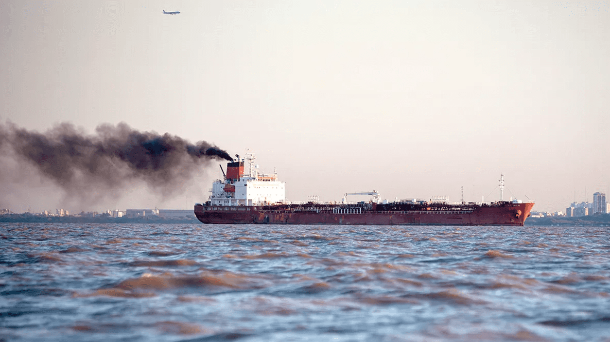

El transporte global es un gran contribuyente a la contaminación. Piensa en los miles de aviones, barcos y camiones necesarios para mover todos esos productos. Estos medios de transporte emiten una cantidad increíble de gases de efecto invernadero. No es fácil encontrar datos pero estos son los que he encontrado en [Enviromental Research](https://www.sciencedirect.com/science/article/pii/S001393512201787X).

> Cada año se mueven 10.000 millones de toneladas de carga por vía marítima y esto provoca cerca del 3% de los gases de efecto invernadero del mundo, así como el 13% de las emisiones de óxido de nitrógeno (NOx) y el 12% de las de óxido de azufre (SOx)

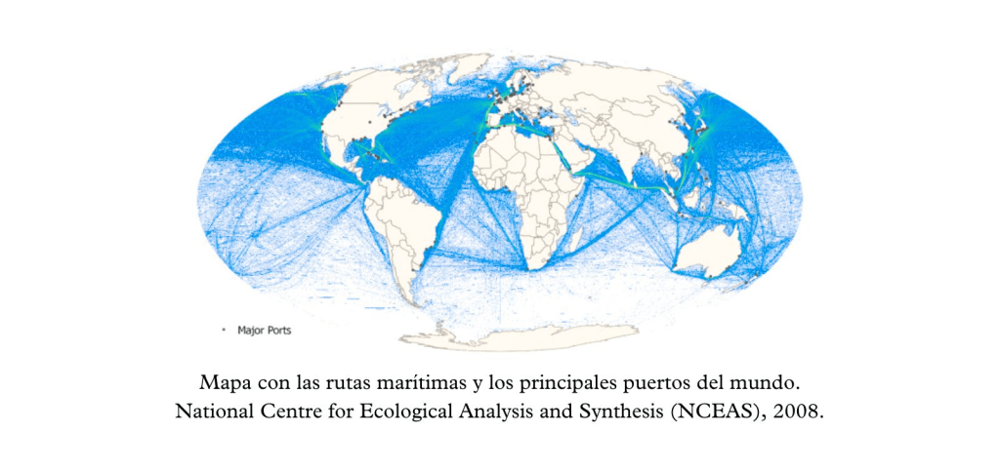

Pero no es solo el aire lo que sufre. Los océanos también están pagando un precio muy alto. Cada año, cientos de contenedores se caen de los barcos y terminan en el fondo del mar, como está pasando ahora en las costas del noroeste de la península ibérica. Estos contenedores a menudo llevan productos de plástico, como los pellets, que se esparcen por el agua y las playas, causando un desastre ambiental.

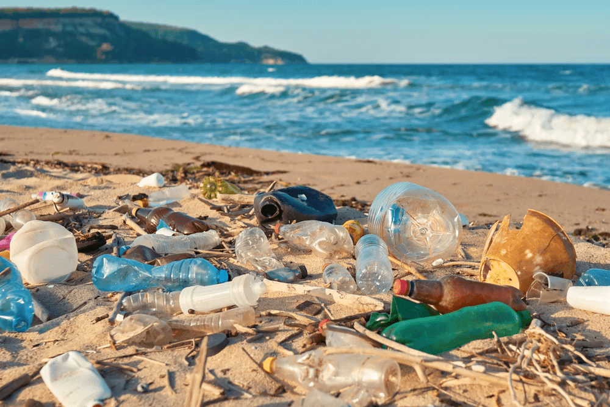

Luego está el problema de los productos de usar y tirar. La globalización ha hecho que sea más fácil y más barato producir en masa, pero eso también significa que estamos creando una cantidad absurda de desechos. Ropa, gadgets electrónicos, envases de plástico... muchas de estas cosas acaban en vertederos o en el océano.

Aquí es donde la tecnología necesita dar un paso al frente. Necesitamos innovaciones que hagan el transporte más limpio y eficiente. Por ejemplo, barcos que usen energías renovables o sistemas de transporte que reduzcan la cantidad de viajes necesarios. También necesitamos mejores formas de rastrear y gestionar los contenedores para prevenir accidentes que terminen con ellos en el mar.

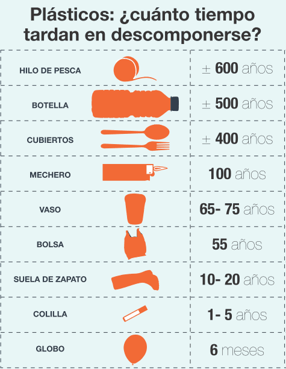

En cuanto a los productos, la tecnología puede ayudarnos a diseñar cosas que duren más y que sean más fáciles de reciclar. Si cambiamos nuestra mentalidad de "usar y tirar" por una de "usar y reusar", podríamos reducir significativamente la cantidad de desechos que generamos.

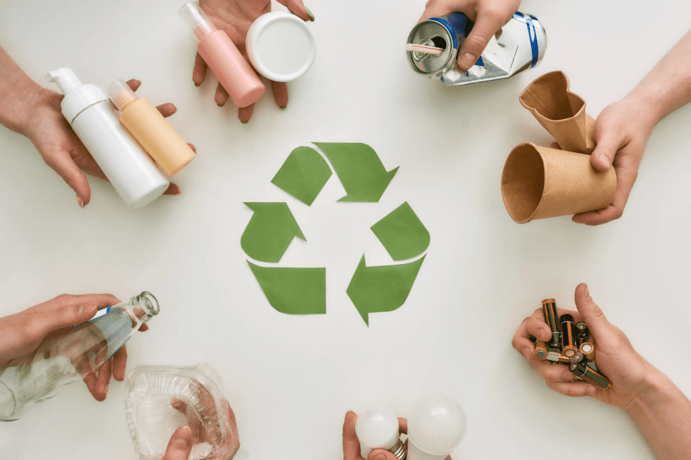

Este enfoque más consciente y sostenible es crucial, especialmente cuando pensamos en el siguiente tema: la explosión demográfica. Con más gente en el planeta, el desafío de manejar nuestros recursos y nuestro impacto ambiental solo se hará más grande. Necesitamos empezar a tomar decisiones más inteligentes ahora para asegurarnos de que no terminemos sobrecargando nuestro propio "entorno de la placa Petri".

**7\. La Explosión Demográfica y sus Implicaciones: Más Allá de la Capacidad de la Placa Petri**

**El Aumento Imparable de la Población** Recientemente alcanzamos los ocho mil millones de personas en nuestro planeta, una cifra que parece sacada de una novela de ciencia ficción. **Ocho Mil Millones. Un ocho y nueve ceros. 8.000.000.000.** Pero no es ficción; es nuestra realidad actual. Y las proyecciones no son alentadoras. Esta explosión demográfica nos lleva a un escenario similar al de las bacterias en una placa Petri: un crecimiento acelerado en un espacio finito.

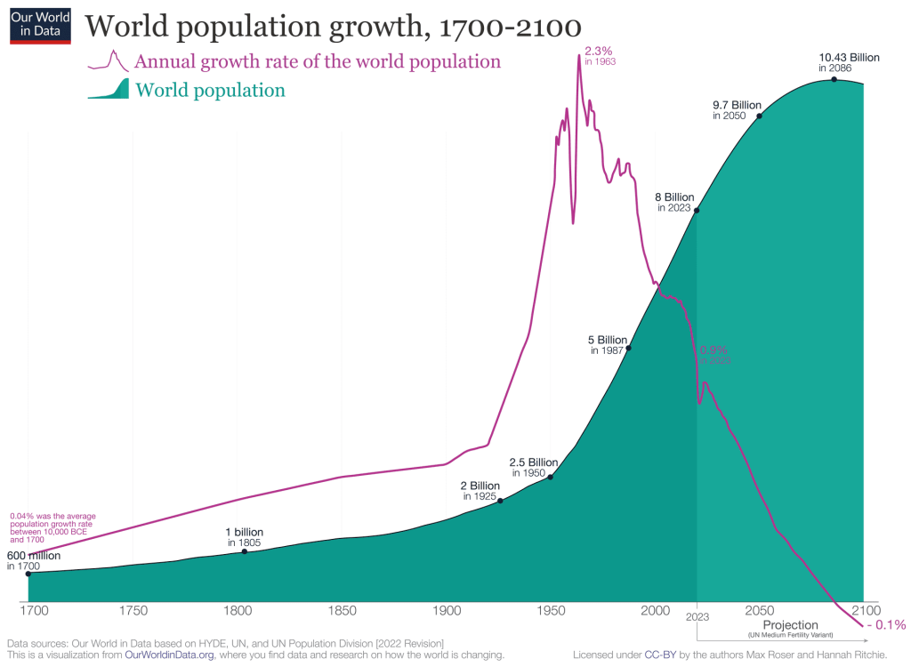

[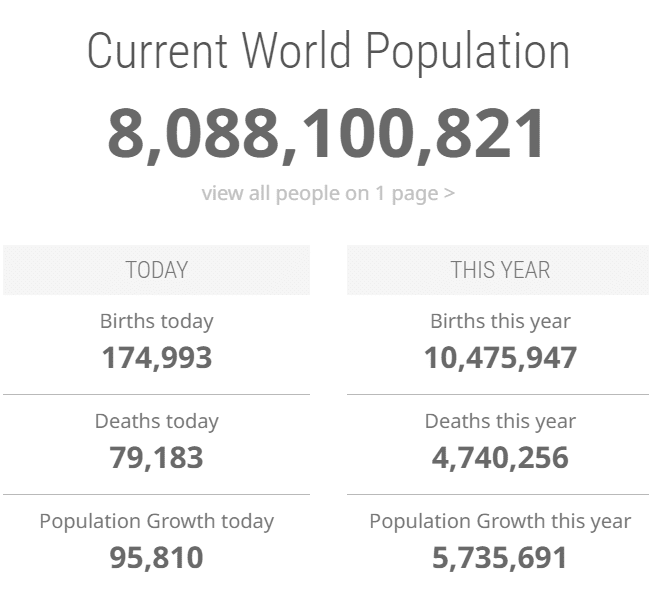](https://www.worldometers.info/world-population/)

**El Desafío de los Recursos Limitados** El problema central es claro: los recursos de nuestro planeta son limitados. Más personas significan más bocas que alimentar, más cuerpos que vestir, y más demanda de energía y vivienda. Todo esto en un mundo donde ya estamos luchando por mantener el equilibrio ecológico. La pregunta crítica que surge es: ¿cuánto más podemos crecer sin agotar completamente los recursos del planeta?

En los países desarrollados, el alto consumo per cápita y la contaminación contrastan marcadamente con los países en desarrollo, donde quienes menos contribuyen al daño ambiental a menudo enfrentan sus peores impactos. La tecnología desempeña un papel ambivalente en este contexto: por un lado, puede alimentar el consumismo y la obsolescencia programada, exacerbando los problemas; por otro, ofrece soluciones cruciales para una vida más sostenible, incluyendo energías renovables, sistemas de reciclaje eficientes, agricultura sostenible y el desarrollo de ciudades inteligentes. A medida que la población mundial crece, también lo hacen los desafíos y las oportunidades para innovar y cambiar. La gestión de este crecimiento y la búsqueda de formas de vida que sean menos perjudiciales para el planeta y más equitativas serán determinantes para el futuro de nuestra sociedad global y la salud del medio ambiente.

**8\. Tecnología y Soluciones Innovadoras: Proyectos y Empresas Líderes en Sostenibilidad**

La tecnología está en el corazón de numerosas iniciativas sostenibles en todo el mundo. Vamos a echar un vistazo a proyectos y empresas específicos que están marcando la diferencia en varios sectores.

**Energía Renovable y Alternativa**

1. **[Orbital Marine Power (Energía Mareomotriz)](https://www.orbitalmarine.com/)**: Esta empresa está a la vanguardia de la energía mareomotriz con su proyecto de turbina mareomotriz flotante, que promete ser una fuente de energía limpia y sostenible.

3. **[Quaise Energy](https://www.quaise.energy/)** es una de las empresas líderes que está trabajando para aprovechar el calor del núcleo terrestre como fuente de energía geotérmica. Utilizando tecnologías avanzadas de perforación, desarrolladas inicialmente para la industria del petróleo y el gas, Quaise Energy busca desbloquear el potencial de la energía geotérmica, que se considera una fuente de energía basada en carga continua y libre de carbono. Este enfoque innovador podría transformar la geotermia de una fuente de energía de nicho a una ampliamente desplegada​​.

5. **[Blue Planet (Captura de CO2)](https://www.blueplanetsystems.com/)**: Blue Planet está desarrollando tecnología para capturar el CO2 del aire y utilizarlo en la creación de materiales de construcción, reduciendo así la huella de carbono.

**Agricultura Sostenible y Alimentación**

1. [**Beyond Meat (Carne de Laboratorio)**:](https://www.beyondmeat.com/) Una de las empresas pioneras en la producción de carne vegetal, que imita la carne real y ofrece una alternativa sostenible a la carne tradicional. Y como esta empresa hay otros proyectos interesantes, por ejemplo [Imposible Foods](https://impossiblefoods.com/),

3. [**AeroFarms (Agricultura Vertical)**:](https://impossiblefoods.com/) Especializados en agricultura vertical, AeroFarms cultiva productos en entornos controlados utilizando menos agua y sin pesticidas, o al menos así lo venden en su sitio web.

**Transporte Verde y Eficiente: Alternativas sin Imposiciones**

En el camino hacia un futuro más sostenible, es crucial que las soluciones de transporte sean no solo ecológicas, sino también respetuosas con la libertad individual. Estoy firmemente en contra de cualquier forma de imposición que obligue a las personas a deshacerse de sus vehículos actuales en favor de alternativas más nuevas, ya que esto puede resultar en un ciclo de consumo y desecho que es, en sí mismo, insostenible. A continuación te expongo opciones de transporte que ofrecen una transición más orgánica y menos impositiva que, por ejemplo, tener que recurrir a prohibiciones de circulación de ciertos vehículos.

**Biocombustibles: Una Transición Suave**: Los biocombustibles ofrecen una manera de reducir las emisiones sin obligar a los propietarios de vehículos a cambiar a modelos eléctricos. Empresas innovadoras como [**Neste**](https://www.neste.com/products) están liderando el camino en el desarrollo de biocombustibles avanzados, que pueden ser utilizados en vehículos existentes y reducen la necesidad de producir y desechar automóviles nuevos constantemente. En su web hablan de reeducciones de entre un 75 y un 90% en la emisión de gases de efecto invernadero gracias a sus biocombustibles, tanto para transporte por carretera como transporte aéreo.

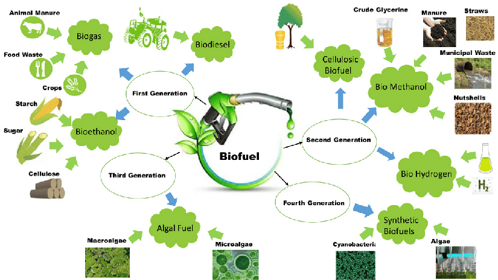

**Fomento del Transporte Público Ecológico**: Mejorar y expandir el transporte público con opciones ecológicas es una manera efectiva de reducir la dependencia de los vehículos personales sin imponer restricciones drásticas. Ciudades como **Copenhague** y **Curitiba** son ejemplos a seguir, con sus sistemas de autobuses y trenes alimentados por energías renovables.

**Hidrógeno: La Frontera Siguiente en Transporte Sostenible**: Más allá de los grandes camiones, el hidrógeno está emergiendo como una solución versátil para diversos modos de transporte, incluyendo vehículos utilizatiors de grandes marcas y también para el transporte marítimo y aéreo. Esta tecnología, que ha visto avances significativos recientemente, ofrece un camino prometedor para un transporte realmente sostenible. Investigaciones recientes han logrado avances en las pilas de combustible de hidrógeno, como la creación de cátodos de hierro por parte de investigadores de la Universidad de Hong Kong. Este avance aumenta notablemente la duración de las pilas y reduce la dependencia de materiales costosos y contaminantes. Además, la eficiencia y la durabilidad mejoradas de estas pilas abren nuevas posibilidades para su uso en [**una gama más amplia de aplicaciones**​​​](https://energy5.com/es/avances-en-pilas-de-combustible-de-hidrogeno-allanando-el-camino-para-el-transporte-ecologico)​.

Las empresas líderes en el desarrollo de vehículos de hidrógeno han estado avanzando significativamente en este campo. Hyundai Motor Company es una de las pioneras, y en CES 2024, presentaron [**su visión de la energía del hidrógeno**](https://www.hyundai.news/es/articles/press-releases/hyundai-revela-en-ces-2024-su-vision-de-la-energia-del-hidrogeno-y-soluciones-de-software-mas-alla-de-la-movilidad.html), que va más allá de la movilidad tradicional. Están trabajando en un concepto llamado "Cloud Transportation", integrando software, dispositivos definidos por IA y movilidad para crear un ecosistema de movilidad accesible y sostenible​​.

Ford, por su parte, **h**[**a** **patentado un nuevo modelo impulsado por hidrógeno**](https://www.bloomberglinea.com/2022/03/23/motores-a-hidrogeno-la-nueva-apuesta-de-la-industria-automotriz/), que incluye un motor de mayor rendimiento con un turbocompresor y un sistema de recirculación de gases de escape. Esta innovación podría aumentar la potencia y la eficiencia de los vehículos de hidrógeno​​.

Otras marcas importantes como Toyota, Honda, BMW, Mercedes-Benz, Mazda y Hyundai están invirtiendo en vehículos que utilizan hidrógeno, ya sea a través de pilas de combustible o motores de combustión. [**T**](https://www.calvera.es/)[**oyota, por ejemplo, ofrece el Mirai**,](https://www.toyota.es/coches/mirai) un vehículo que cuenta **con una autonomía de aproximadamente 650 kilómetros y un tiempo de carga de tres minutos.** [**Hyundai** ha i](https://www.hyundai.com/es/es/modelos/nexo.html)ntroducido el **Nexo**, un SUV que utiliza pila de combustible de hidrógeno​​​​ con el que **con un tiempo de carga de 5 minutos prometen una autonomía de más de 650Km**.

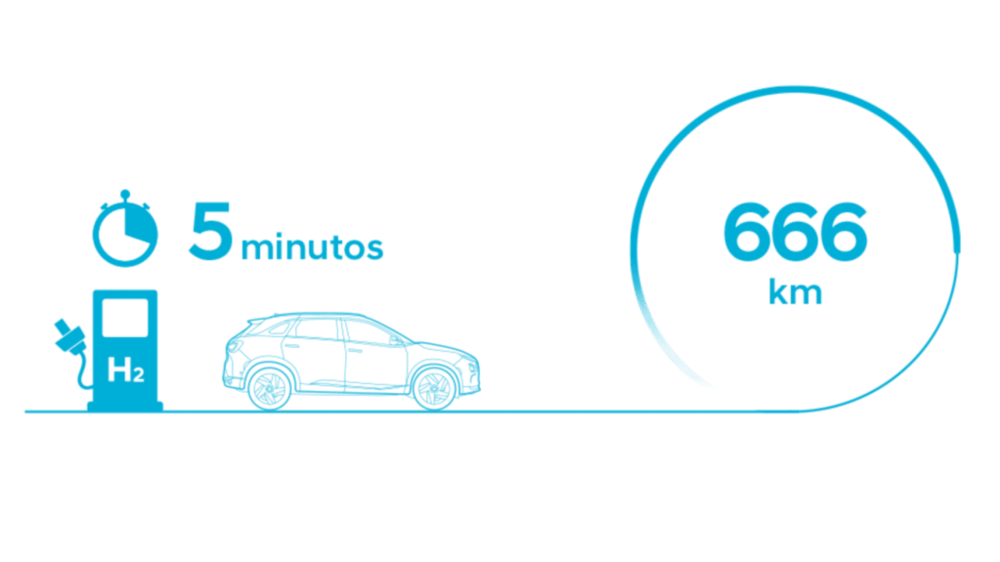

Estos avances indican un creciente interés y compromiso de las principales empresas automotrices hacia el desarrollo de tecnologías de hidrógeno, que representan una alternativa sostenible y eficiente para el futuro del transporte.

Si me tuviera que comprar un coche hoy, optaría por uno de estos, pero claro, **¿Es lo suficientemente amplia la red de estaciones de carga de hidrógeno en España o Europa como para plantearse comprar uno de estos coches?**

La red de estaciones de carga de hidrógeno en España está en proceso de expansión, pero aún no es suficientemente amplia como para considerar la compra de un vehículo de hidrógeno como una opción práctica para la mayoría de los usuarios. A fecha de 2024, hay algunas estaciones operativas y varias en desarrollo, pero **la cobertura aún es limitada** en comparación con las estaciones de combustible tradicionales o las estaciones de carga para vehículos eléctricos.

Según el plan propuesto por la [**Asociación Española de Fabricantes de Automóviles y Camiones**](https://anfac.com/) (ANFAC) y [**Gasnam**](https://gasnam.es/), **se espera alcanzar un mínimo de 150 estaciones de hidrógeno en España para 2025**, en lugar de 2030 como inicialmente se había previsto. Esta expansión estaría dirigida tanto a zonas urbanas para flotas de autobuses y vehículos industriales, como a las principales rutas de transporte para garantizar la cobertura de vehículos pesados y de larga distancia​​​​. Creo que el plan es insuficiente y que frena el desarrollo de esta tecnología a mi entender revolucionaria. Una pena.

Por otro lado, empresas como [**Calvera Hydrogen**](https://www.calvera.es/) están trabajando en la construcción de nuevas hidrogeneras en España, con distintas capacidades de suministro. Estas instalaciones permitirán el llenado de un número significativo de coches y autobuses diariamente, dependiendo de su capacidad​​.

**Promoción de Infraestructuras Ciclistas**: La inversión en infraestructuras ciclistas no solo promueve un transporte saludable y ecológico, sino que también respeta la elección individual. La expansión de redes de ciclovías en ciudades como **Ámsterdam** y **Copenhague** muestra cómo el fomento del ciclismo puede ser una solución efectiva y voluntaria.

**Reciclaje y Gestión de Residuos**

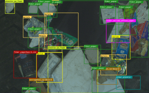

1. [**AMP Robotics (Robots de Reciclaje)**:](https://www.amprobotics.com/) Esta empresa utiliza inteligencia artificial y robótica para mejorar el reciclaje y reducir la cantidad de residuos que terminan en vertederos.

3. [**BioCellection / Novoloop (Innovación en Plásticos)**:](https://www.novoloop.com/) [BioCellection](https://www.biocellection.com/) está trabajando en el desarrollo de procesos químicos para convertir plásticos contaminados en materiales útiles y no tóxicos.

**Limpieza de Océanos y Ríos**

**The Ocean Cleanup (Limpieza de Océanos)**: **The Ocean Cleanup** es una organización sin ánimo de lucro que se dedica al desarrollo y escalado de tecnologías para **eliminar el plástico de los océanos**. Utilizando una estrategia dual, trabajan para interceptar plástico en los ríos, cortando el flujo de contaminación, y limpiando lo que ya se ha acumulado en el océano.

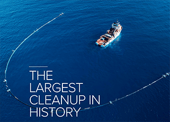

[Hasta ahora](https://theoceancleanup.com/updates/kingston-jamaica-the-first-interceptor-city/), han logrado avances significativos en la limpieza de plásticos flotantes en la Gran Mancha de Basura del Pacífico, un área de acumulación de plásticos con más de 100,000,000 kilogramos de residuos. Además, están abordando 1,000 de los ríos más contaminantes del mundo, lo cual podría detener el 80% de la contaminación fluvial que llega a nuestros océanos​​. ¡Bravo!

[**En Kingston, Jamaica, The Ocean** **Cleanup ha desplegado siete Interceptors**](https://theoceancleanup.com/updates/kingston-jamaica-the-first-interceptor-city/), con planes de instalar cuatro más durante este 2024. Estos dispositivos están diseñados para prevenir que aproximadamente 1,000 toneladas de basura al año fluyan hacia el puerto de Kingston y, finalmente, hacia los océanos. Los Interceptors se han colocado en los canales de drenaje de la ciudad, que son vías de agua utilizadas para drenar el agua de la ciudad hacia Hunt's Bay y el puerto de Kingston​​.

Por otro lado, [**ClearWater Mills**](http://www.clearwatermills.com/) ha desarrollado el "[**Water Wheel**](http://www.clearwatermills.com/services.html)", un dispositivo impulsado por agua que recoge toneladas de residuos de los ríos. Este innovador sistema también contribuye significativamente a la reducción de los desechos que entran en nuestros océanos y cuerpos de agua.

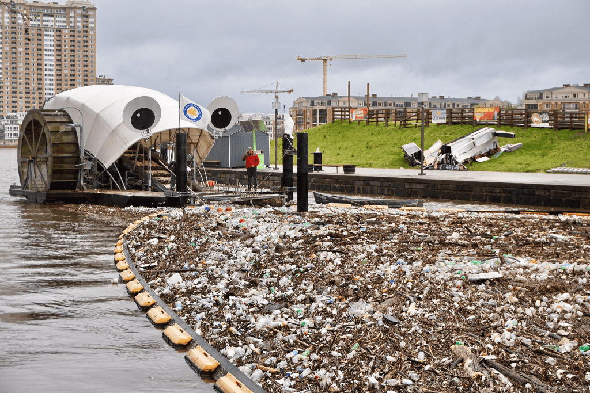

Ambos proyectos, The Ocean Cleanup y ClearWater Mills, demuestran un compromiso significativo con la conservación del medio ambiente y la limpieza de nuestros recursos hídricos, mostrando cómo **la tecnología y la innovación pueden jugar un papel crucial en la lucha contra la contaminación** por plásticos y el mantenimiento de ecosistemas saludables.

Estas empresas y proyectos son solo algunos de los muchos ejemplos de cómo la tecnología está siendo utilizada para abordar problemas ambientales de manera innovadora. Al adoptar enfoques creativos y sostenibles, están marcando el camino hacia un futuro más verde y responsable. Además, se está viendo una tendencia clara al alza en inversiones en empresas con un alto grado de implicación medioambiental hacia la sostenibilidad. Ahí lo dejo.

**9\. Políticas, Educación y Conciencia Social: Una Mirada Crítica para un Futuro Sostenible**

En el camino hacia un futuro sostenible, la tecnología y la innovación juegan un papel crucial, pero no son suficientes por sí solas. La implementación de políticas gubernamentales, la educación y la responsabilidad social corporativa son fundamentales, aunque su eficacia y autenticidad a menudo se vean comprometidas por la falta de conocimiento profundo y la tendencia a seguir modas pasajeras.

**Políticas Gubernamentales y Sostenibilidad: Entre la Teoría y la Práctica**

Aunque las políticas gubernamentales son esenciales para fomentar la sostenibilidad, frecuentemente se ven afectadas por la **burocracia** y la **falta de asesoramiento experto**. Los Acuerdos Climáticos Globales, como el **[Acuerdo de París](https://www.un.org/es/climatechange/paris-agreement)**, establecen metas ambiciosas de reducción de emisiones, pero su éxito depende de la voluntad política y la implementación efectiva a nivel nacional. Además, los incentivos para energías renovables, aunque cruciales, a menudo se ven limitados por intereses económicos y políticos a corto plazo.

Curiosamente, en eventos globales como el **Foro Económico Mundial en** **Davos**, temas como la sostenibilidad han visto reducida su prominencia frente a discusiones sobre inteligencia artificial y desinformación. Este cambio refleja una tendencia preocupante hacia el control social global y aleja la atención de problemas ambientales urgentes. Tal desplazamiento subraya la necesidad de un compromiso más fuerte y acciones concretas en sostenibilidad, tanto a nivel educacional como corporativo.

**Educación y Conciencia Ambiental: Más Allá del Aula**

La educación es clave para inculcar un sentido de responsabilidad ambiental desde una edad temprana. Sin embargo, esta educación debe trascender los currículos escolares y convertirse en una iniciativa comunitaria más amplia. Las iniciativas de concienciación pública, como **Earth Day** y la **Hora del Planeta**, son importantes, pero deben ir acompañadas de acciones concretas y continuas que promuevan un cambio sostenible en el comportamiento cotidiano.

**Responsabilidad Social Corporativa: ¿Compromiso Real o Marketing Verde?**

El concepto de Responsabilidad Social Corporativa (RSC) es crucial, pero su implementación a menudo se ve empañada por tácticas de marketing que no reflejan un compromiso real con la sostenibilidad. Empresas notoriamente contaminantes a menudo se suman a iniciativas como los Objetivos de Desarrollo Sostenible (ODS) sin realizar cambios significativos en sus operaciones. Mientras que empresas como [**Google se comprometen a operar con energía libre de carbono para 2030**,](https://sustainability.google/intl/es-419/commitments/carbon/) y [**Patagonia, que dedica una parte significativa de sus ganancias a la conservación ambiental**](https://www.bbc.com/mundo/noticias-internacional-62916130), es crucial examinar la autenticidad de estos compromisos y asegurar que no sean meramente gestos simbólicos.

**Por un Enfoque Integral y Transparente**

Para lograr un impacto significativo y duradero, **es esencial adoptar un enfoque integral que combine tecnología, educación, concienciación social y políticas gubernamentales** bien informadas y efectivamente implementadas. Además, es vital promover una mayor transparencia y responsabilidad en la RSC, asegurando que las empresas adopten prácticas verdaderamente sostenibles en lugar de simplemente seguir las tendencias. Solo entonces podremos avanzar hacia un futuro verdaderamente sostenible.

**10\. Nuestro Futuro en nuestras Manos**

Bueno, he hablado de muchos temas hoy, desde cómo una simple placa Petri puede enseñarnos sobre los límites del crecimiento, hasta la explosión demográfica y el papel crucial de la tecnología en la sostenibilidad. Hemos visto cómo la innovación puede llevarnos hacia un futuro más verde, pero también cómo necesitamos políticas y educación para respaldar estos cambios.

Tengo claro que la sostenibilidad no es solo una palabra de moda; es algo que sé desde que era niño y que ahora siento como una necesidad urgente. Para los que estamos metidos en este mundo de la tecnología, ya sea programando, diseñando o simplemente siendo aficionados a la última gadget, esto es un llamado a la acción.

Tenemos la responsabilidad, y la habilidad, de dirigir el cambio. No se trata solo de inventar cosas nuevas, sino de hacerlas de una manera que cuide nuestro planeta y a sus habitantes. Podemos diseñar software que ayude a reducir la huella de carbono, crear productos que duren más, incluso para siempre, y podemos educar a otros sobre la importancia de vivir de manera sostenible.

El futuro está literalmente en nuestras manos. Cada línea de código, cada diseño de producto, cada decisión de compra... Todo cuenta. Juntos, podemos hacer que la tecnología sea una fuerza para el bien, asegurándonos de que no terminemos como las bacterias en la placa Petri. Así que vamos a ello, ¿no? Hagamos tecnología de la que podamos estar orgullosos, tecnología que no solo sea chula, sino también amable con el planeta.

En este recorrido por los desafíos y soluciones de nuestro mundo contemporáneo, desde la metáfora de una placa Petri hasta el innovador uso de la tecnología, hemos visto cómo nuestra acción colectiva puede moldear el futuro. La sostenibilidad no es un destino lejano, sino un camino que recorremos cada día con nuestras elecciones y acciones. Cada esfuerzo por la eficiencia, cada innovación en energía renovable, y cada acto consciente de consumo marca un paso hacia un mundo más equilibrado y saludable. Recordemos que, al igual que en una placa Petri, los límites de nuestro planeta nos exigen ser sabios y cuidadosos. Hagamos de la tecnología no solo una herramienta de progreso, sino un faro de esperanza y sostenibilidad. Juntos, podemos crear un futuro donde la tecnología, en armonía con el medio ambiente, asegure un legado próspero y sostenible para las generaciones venideras.
