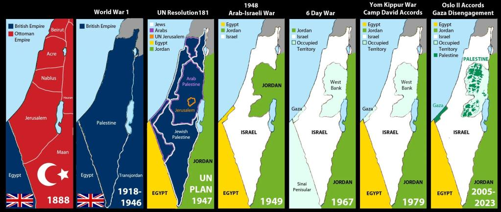
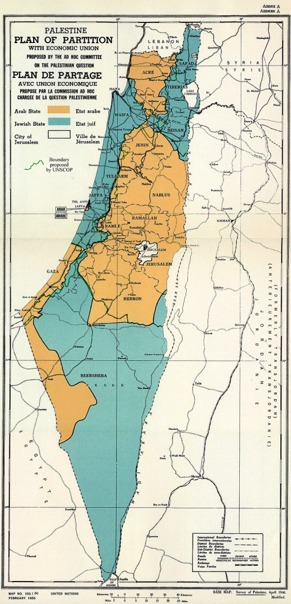

> **Quiero dejarlo claro: no soy antisemita.** Este texto no es una crítica al judaísmo ni al pueblo judío: es una revisión documentada de las políticas del Estado de Israel y de quienes lo han apoyado durante más de un siglo. Ser antisionista no es ser antisemita: significa oponerse a un proyecto político que, desde 1882, ha avanzado mediante colonización, ocupación y violencia sistemática contra la población palestina.

El **terrorismo nunca es justificable**. Atacar deliberadamente a civiles, ya sea por parte de un grupo armado como Hamás o por parte de un Estado con todo su aparato militar, constituye una violación grave del derecho internacional. **La diferencia de escala no borra la naturaleza del crimen**: un cohete descontrolado o un bombardeo sobre un barrio densamente poblado son ambas formas de terrorismo.

Desde el final de la Segunda Guerra Mundial, Israel se ha consolidado como un Estado altamente militarizado. Ha usado la memoria del Holocausto como argumento moral y político para legitimar tanto su existencia como sus acciones bélicas. Con apoyos internacionales estratégicos, ha seguido una política de expansión territorial y colonización sistemática, recurriendo a guerras preventivas, ocupaciones prolongadas y ataques masivos contra población civil. Esta trayectoria refleja un patrón de belicismo y ausencia de escrúpulos, donde la seguridad nacional y la memoria del exterminio nazi se invocan una y otra vez para justificar violaciones del derecho internacional.

**Lo que sigue es una cronología de hechos contrastados**, con fuentes y enlaces directos para quien quiera comprobarlos. Aquí no hay interpretaciones, sólo historia.

- **1882–1903 – Primera Aliyá (primera ola migratoria judía a Palestina)**  
    Tras multiples persecuciones y masacres llegan unos 25.000–30.000 judíos, principalmente desde Rusia y Europa del Este. Compran tierras a terratenientes ausentes otomanos y fundan las primeras colonias agrícolas judías en Palestina (Petaj Tikva, Rishon LeZion, Zikhron Yaakov).  
    [Jewish Virtual Library – First Aliyah](https://www.jewishvirtuallibrary.org/the-first-aliyah-1882-1903) | [Encyclopaedia Britannica – Aliyah](https://www.britannica.com/topic/Aliyah)

- **1897 **–** Primer Congreso Sionista (Basilea, Suiza)**  
    Theodor Herzl y otros líderes formalizan el sionismo político moderno y defienden la creación de una patria judía en Palestina.  
    [Jewish Virtual Library](https://www.jewishvirtuallibrary.org/first-zionist-congress-and-basel-program-1897) | [Basel Program 1897](https://www.posenlibrary.com/entry/basel-program)

- **1917 – Declaración Balfour**  
    Reino Unido promete un “hogar nacional judío” en Palestina bajo su mandato colonial.  
    [Balfour Declaration 1917 (Yale Law School)](https://avalon.law.yale.edu/20th_century/balfour.asp?utm_source=chatgpt.com) | [UK Parliament](https://commonslibrary.parliament.uk/research-briefings/cbp-7766/)

- **1920–1948** **– Mandato Británico de Palestina**  
    La Liga de las Naciones otorga a Gran Bretaña la administración de Palestina, con el compromiso de aplicar la Declaración Balfour y facilitar la inmigración judía. El mandato se prolonga hasta 1948. Durante este mandato se facilita la inmigración judía (con picos en los 20s y 30s, sobre todo tras el ascenso del nazismo).  
    [UN Digital Library – Mandate for Palestine (1922)](https://digitallibrary.un.org/record/829707?ln=en&utm_source=chatgpt.com) | [Wikipedia – Mandate for Palestine](https://en.wikipedia.org/wiki/Mandate_for_Palestine)

- **1920 – Fundación de la Haganá**  
    Organización paramilitar judía creada para proteger asentamientos durante el Mandato Británico. Evoluciona hasta convertirse en la base de las Fuerzas de Defensa de Israel (IDF) en 1948. 
    [Jewish Virtual Library – The Haganah](https://www.jewishvirtuallibrary.org/the-haganah?utm_source=chatgpt.com)

- **1929 – Masacre de Hebrón**  
    En agosto de 1929, residentes árabes atacan a la comunidad judía de Hebrón: mueren 67 judíos y decenas resultan heridos. La violencia acaba con siglos de presencia judía en la ciudad, que solo se reanuda tras 1967. 
    [Jewish Virtual Library – Hebron Massacre 1929](https://www.jewishvirtuallibrary.org/the-hebron-massacre-of-1929) | [Wikipedia – 1929 Hebron massacre](https://en.wikipedia.org/wiki/1929_Hebron_massacre)

- **1936-1939 – Gran Revuelta Árabe en Palestina**  
    Rebelión general contra el dominio británico y la inmigración judía: huelgas, protestas y violencia armada. Los británicos responden con toques de queda, represión militar y arrestos masivos.  
    [Wikipedia – 1936–1939 Arab Revolt in Palestine](https://en.wikipedia.org/wiki/1936%E2%80%931939_Arab_revolt_in_Palestine) | [Britannica – The Arab Revolt](https://www.britannica.com/place/Palestine/The-Arab-Revolt)

- **1937 – Comisión Peel**  
    Comisión británica creada para investigar la Revuelta Árabe. Propone por primera vez dividir Palestina en dos Estados, uno judío y otro árabe, anticipando la idea de una “solución de dos Estados”.  
    [Wikipedia – Peel Commission](https://en.wikipedia.org/wiki/Peel_Commission)

- **1945 – Fin de la II Guerra Mundial / Holocausto**  
    Se intensifica presión internacional para un Estado judío tras el Holocausto.  
    [Holocaust Encyclopedia](https://encyclopedia.ushmm.org/content/en/article/introduction-to-the-holocaust) | [The National WWII Museum](https://www.nationalww2museum.org/war/articles/holocaust)

- **1947 – Resolución 181 de la ONU (Plan de Partición)**  
    La ONU recomienda dividir Palestina en un Estado judío y otro árabe, con Jerusalén bajo administración internacional. Los líderes judíos aceptan, los árabes y palestinos rechazan.[  
    Resolution 181 (Yale Law School)](https://avalon.law.yale.edu/20th_century/res181.asp) | [UN Resolution 181 (en español)](https://www.un.org/unispal/document/auto-insert-179482/)

- **1948 – Creación del Estado de Israel / La Nakba (La Catástrofe)**  
    Israel declara su independencia y una guerra contra los países árabes vecinos. **700.000 palestinos son expulsados violéntamente de sus tierras**.  
    [UNRWA – Nakba](https://unrwa.es/nakba/) | [Palestinian expulsion and flight](https://en.wikipedia.org/wiki/1948_Palestinian_expulsion_and_flight) | [UN - About The Nakba](https://www.un.org/unispal/about-the-nakba) | [UN - The Ongoing Palestinian Nakba](https://www.un.org/unispal/panel-discussion-1948-2024-the-ongoing-palestinian-nakba-new-york-17-may-2024/) | [Nakba (Wikipedia)](https://en.wikipedia.org/wiki/Nakba)

- **1956 – Guerra del Sinaí o Crisis de Suez**  
    Israel, Francia y Reino Unido atacan Egipto tras nacionalización del canal.  
    [BBC – Suez Crisis 1956](https://www.bbc.co.uk/historyofthebbc/research/editorial-independence/suez-crisis)

- **1967 – Guerra de los Seis Días**  
    Israel ocupa Gaza, Cisjordania, Jerusalén Este, Sinaí y Golán.  
    [UNSC Resolution 242](https://www.un.org/securitycouncil/content/resolutions-adopted-security-council-1967)

- **1973 – Guerra de Yom Kippur**  
    Egipto y Siria atacan; termina sin cambios territoriales. Posterior paz Egipto-Israel (Camp David, 1979).  
    [US Dept. of State – Camp David Accords](https://history.state.gov/milestones/1977-1980/camp-david)

- **1982 – Invasión de Líbano**  
    Israel expulsa a la OLP de Beirut; masacres en Sabra y Chatila.  
    [HRW – Sabra and Shatila](https://www.hrw.org/reports/2001/lebanon/)

- **1987 – Fundación de Hamás / Primera Intifada**  
    Surge Hamás como rama islamista de los Hermanos Musulmanes en Gaza.  
    [CFR – Hamas Backgrounder](https://www.cfr.org/backgrounder/hamas)

- **1993 – Acuerdos de Oslo**  
    OLP reconoce a Israel; nace la Autoridad Palestina.  
    [UN Peacemaker – Oslo Accords](https://peacemaker.un.org/israelopt-osloaccord93)

- **2000-2005 – Segunda Intifada**  
    Ola de violencia; Israel construye el muro en Cisjordania.  
    [B’Tselem – The Separation Barrier](https://www.btselem.org/separation_barrier)

- **2005 – Retirada israelí de Gaza**  
    Israel evacua colonias, pero mantiene bloqueo junto a Egipto.  
    [BBC – Israel Pullout from Gaza](http://news.bbc.co.uk/2/hi/middle_east/4187802.stm)

- **2006 – Victoria electoral de Hamás**  
    Hamás gana elecciones; en 2007 toma control de Gaza.  
    [International Crisis Group](https://www.crisisgroup.org/middle-east-north-africa/eastern-mediterranean/israelpalestine/after-mecca-hamas-and-fatah)

- **2008-2014 – Guerras en Gaza**  
    Varias ofensivas israelíes dejan miles de muertos palestinos. Amnistía Internacional ya habla abiertamente de genocidio.  
    [Amnistía Internacional – Gaza Conflicts](https://www.amnestyusa.org/reports/you-feel-like-you-are-subhuman-israels-genocide-against-palestinians-in-gaza/?utm_source=chatgpt.com)

- **31 mayo 2010 – Interceptación de la Flotilla de la Libertad (Mavi Marmara)**  
    Seis barcos con ayuda humanitaria y activistas son asaltados en aguas internacionales por fuerzas israelíes. Mueren 9 activistas en el operativo (un décimo fallece años después por las heridas) y más de 600 son detenidos.  
    [Wikipedia – 2010 Gaza flotilla raid](https://en.wikipedia.org/wiki/2010_Gaza_flotilla_raid) | [UN HRC Report](https://www.un.org/unispal/document/auto-insert-187595/)

- **2021 – Escalada en Gaza**  
    Bombardeos masivos tras disturbios en Jerusalén Este.  
    [HRW – Gaza 2021](https://www.hrw.org/news/2021/05/27/israel-palestine-gaza-war)

- **7 oct 2023 – Ataque de Hamás**  
    ~1.200 israelíes muertos y 240 rehenes; Israel responde con “sitio completo” a Gaza (_“sin electricidad, sin comida, sin combustible”_).  
    [Reuters – October 7 Attack](https://www.reuters.com/world/middle-east/timeline-what-happened-israel-hamas-oct-7-attack-2023-10-11/)

- **Oct–dic 2023 – Retórica de venganza y deshumanización**  
    Ministros usan lenguaje bíblico (_“Amalek”_) y califican a los gazatíes de _“animales humanos”_. Juristas lo señalan como prueba de intención.  
    [TRT World – Israeli officials’ language](https://www.trtworld.com/middle-east/israeli-officials-call-palestinians-animals-human-shields-15211490)

- **Oct–nov 2023 – Planes para vaciar Gaza**  
    Documento del Ministerio de Inteligencia propone transferir a toda la población al Sinaí egipcio.  
    [+972 Magazine – Transfer Plan](https://www.972mag.com/israel-intelligence-ministry-gaza-transfer/)

- **2024 – Destrucción sistemática y hambruna inducida**  
    La ONU y la OMS documentan hambre catastrófica (IPC Fase 5) y muertes por desnutrición infantil.  
    [OHCHR – Report on Gaza hunger](https://www.ohchr.org/en/press-releases/2024/03/un-experts-warn-famine-gaza)

- **Mayo 2025 – Emigración forzada como “desenlace”**  
    Netanyahu admite que los gazatíes “no tendrán adónde volver”, insinuando emigración masiva.  
    [The Jewish Chronicle – Netanyahu comments](https://www.thejc.com/)

- **Sept 2025 – Apagón informativo y ofensiva ampliada**  
    Cortes de telecomunicaciones dejan Gaza aislada durante ofensivas en Gaza City.  
    [TVE](https://www.rtve.es/noticias/20250918/franja-pierde-conexion-internet-miles-gazaties-huyen-avance-israeli/16734202.shtml)

- **Balance humano – Más de 65.000 palestinos muertos**  
    Estimaciones superan 65.000 víctimas, con miles aún bajo escombros; ONU confirma hambruna y mortandad infantil.  
    [Deutsche Welle](https://www.dw.com/es/ya-son-m%C3%A1s-de-65000-los-palestinos-muertos-en-gaza/a-74030694)

- **Sept 2025 – La ONU declara genocidio**  
    Comisión de Investigación concluye que _**Israel ha cometido genocidio**_ (4 de 5 actos tipificados).  
    [UN Commission of Inquiry (A/HRC/59/26)](https://www.un.org/unispal/document/report-of-the-independent-international-commission-of-inquiry-on-the-occupied-palestinian-territory-including-east-jerusalem-and-israel-a-hrc-59-26) | [UN Commission of Inquiry (A/HRC/60/CRP.3)](https://www.un.org/unispal/document/commission-of-inquiry-report-genocide-in-gaza-a-hrc-60-crp-3/)

- **Sept 2025 – Proyecto de “reparto” y resorts**  
    Bezalel Smotrich propone vender tierras de Gaza y transformarlas en resorts, en coordinación con EE. UU.  
    [RNZ – Smotrich Gaza resorts](https://www.rnz.co.nz/news/world/520497/israeli-minister-smotrich-talks-of-gaza-land-for-resorts)

- **1 oct 2025 – Interceptación de la flotilla Global Sumud**  
    Más de 40 barcos con unos 400 activistas internacionales son interceptados en aguas internacionales y llevados a Ashdod. Israel los acusa de terrorismo y piratería; los organizadores denuncian secuestro ilegal.  
    [Reuters](https://www.reuters.com/world/europe/israel-stops-13-gaza-aid-boats-organisers-say-sparking-international-criticism-2025-10-02/) | [The Guardian](https://www.theguardian.com/world/2025/oct/01/israeli-military-vessels-pro-palestinian-flotilla-gaza) | [Le Monde](https://www.lemonde.fr/en/international/article/2025/10/02/israeli-forces-intercept-several-gaza-flotilla-boats_6746009_4.html)

<figure>

<figcaption>

Mapas similares a este hay muchos y mejores...

</figcaption>

</figure>

## INSISTO

Lo que ocurre en Gaza **no es una guerra** entre ejércitos: **es un proceso de colonización y expulsión planificado** desde hace décadas. La ONU lo ha nombrado claramente: **genocidio**. Ni la memoria del Holocausto ni el ataque de Hamás pueden servir como coartada para borrar pueblos enteros, matar decenas de miles de civiles y desplazar a millones. Como sucedió con **Pinochet**, **Milosevic**, **Charles Taylor** o **Hissène Habré**, los responsables deben ser juzgados y condenados. Y los gobiernos, corporaciones y ciudadanos que lo consienten también son responsables: la historia ya no permitirá decir “no lo sabíamos”.

<figure>

<figcaption>

Plan de Partición de 1947

</figcaption>

</figure>
