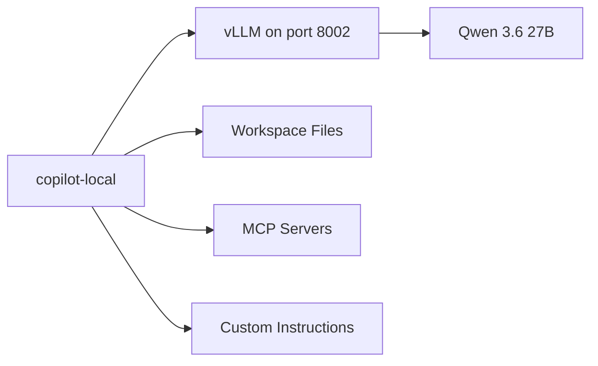

# How I Made GitHub Copilot CLI Mine

> Human words again. No polished corporate hallucination. Just my workstation, my setup, and what I learned wiring it together.

I already showed you [how to run Claude Code against a local GPU](https://jgcarmona.com/en/claude-code-local-glm-4-7-flash/) with Docker Model Runner and a translation proxy. I also demoed Copilot's offline mode live at GitHub Copilot Dev Days Madrid. But in both cases I showed *that* it works, not *how I made it mine*. Today I want to close that gap, because "it works" means it is a demo, but "it's mine" means it is part of my toolkit/development infrastructure.

## My actual setup

This is what I run, today, on my workstation.

**Hardware:** A beast NVIDIA A6000 (48 GB VRAM) that I found and bought before its price doubled. Best investment of the year.

**Runtime:** vLLM, serving Qwen 3.6 27B with tool-calling enabled.

This is an example, I have a code.sh that gets the env vars, pipes the logs and does some more "infra" stuff. This, obviously, belongs to a Linux machine under/behind WSL:

```bash
  vllm serve "${CODE_MODEL}" \
    --host "${HOST}" \
    --port "${CODE_PORT}" \
    --served-model-name "${CODE_MODEL_NAME}" \
    --dtype auto \
    --max-model-len "${CODE_CTX}" \
    --gpu-memory-utilization "${CODE_GPU_UTIL}" \
    --max-num-seqs "${CODE_MAX_NUM_SEQS}" \
    --enable-auto-tool-choice \
    --tool-call-parser "${CODE_TOOL_CALL_PARSER}" \
    --language-model-only \
    --skip-mm-profiling \
    -O0
```

**The trick:** That runs on a workstation that's not always my coding machine, on those I have a PowerShell function in my profile that lets me launch Copilot CLI in 'local' mode without touching the normal cloud-connected Copilot:

```powershell
function copilot-local {
    $env:COPILOT_PROVIDER_TYPE = "openai"
    $env:COPILOT_PROVIDER_BASE_URL = "http://localhost:8002/v1"
    $env:COPILOT_PROVIDER_API_KEY = "dummy"
    $env:COPILOT_MODEL = "CODE_MODEL_NAME_GOES_HERE"
    $env:COPILOT_OFFLINE = "true"
    copilot @args
}
```

And I said 'local', because that script can point to localhost, being on the same workstation, but point to the workstation's local IP, while being on any other machine within my network or my VPN. And that's it:

- I type `copilot-local` and I'm running against my workstation.
- I type `copilot` and I'm on the cloud.

Both coexist. No conflicts. No ceremony.

And that, my friend, is where this stops being a demo and starts being a daily tool.

## Why this matters (again)

I insisted on this in [Mayday! We're Running Out of Fuel](https://jgcarmona.com/en/may-day/) and I'll keep insisting: AI stopped being cheap the moment usage stopped being at human scale. Agents, loops, autonomous workflows... token consumption grew out of control and investors are demanding ROI.

But owning the runtime changes the equation. You move from per-token billing to amortized compute. From unpredictable cost to bounded systems. From external dependency to internal control.

And Copilot CLI, once wired to your own endpoint, becomes something much more interesting than a fancy assistant. It becomes the shell-facing control plane for a set of workflows: prompting, file access, code edits, shell commands, MCP tools, custom instructions, context management and agent delegation.



That is infrastructure. Not autocomplete.

## The architecture (no magic at all)

If you read [Local LLMs Under the Hood](https://jgcarmona.com/en/local-llms-under-the-hood/) you already know what happens inside: text becomes tokens, tokens become vectors, vectors consume memory, and memory pressure adds latency. There is no magic. Just math and hardware constraints.

The wiring for Copilot CLI is equally simple. Copilot CLI handles the interaction and orchestration layer. vLLM handles inference. The model handles token prediction. Your workspace, MCP tools, custom instructions and skills provide the actual engineering surface.

No magic at all.

## What changes once Copilot goes local

Running Copilot CLI against a local model does not mean every cloud capability behaves the same way.

What you gain:

- control over model choice
- local privacy (your code never leaves your machine)
- predictable cost profile
- freedom to run long agentic workflows without worrying about limits

What you may lose, or partially lose:

- raw reasoning power compared with frontier cloud models
- some hosted GitHub integrations if you are fully offline
- convenience when your local model struggles with tool calling or very long contexts

So the goal is not ideological purity. The goal is to move the right workloads local. That is the mature position.

## The control surface: what makes it real

A local model alone is just a token generator. What turns it into a development tool is the control surface around it. Copilot CLI gives you four layers:

**Custom instructions** tell the model what your project is, how it's organized, and what it should never touch. On this very blog, my `.github/copilot-instructions.md` describes the Astro architecture, the content schema, the bilingual routing, the build commands... everything an agent needs to avoid stupid mistakes. I go deeper on this in [Copilot Instructions, Agents, and Skills: The Missing Control Layer](https://jgcarmona.com/en/copilot-instructions-agents-skills/).

**Skills** are structured workflows you give the agent. On this blog I have OpenSpec skills (propose, apply, explore, archive) that drive spec-driven development directly from the terminal. Instead of asking the model to figure out your workflow, you give it a protocol. That is orchestration.

**MCP servers** extend the agent's reach with external tools: test runners, linters, semantic search, policy checkers. The model does not need to be brilliant at everything. It needs to be good enough to use the tools correctly. That is a much easier problem. I cover this in detail in [MCP Is How Local Copilot Becomes Useful](https://jgcarmona.com/en/copilot-cli-mcp-tools/).

**SDD discipline** gives the whole thing structure. I already wrote about this extensively in [Spec-Driven Development: Controlling AI-Generated Drift](https://jgcarmona.com/en/spec-driven-done-right/) and [Moving Toward SDD with OpenSpec or Spec Kit](https://jgcarmona.com/en/moving-toward-spec-driven-development/). The short version: SDD separates *what/why* from *how*, turns specifications into living artifacts, and gives agents structured context instead of improvised prompts. Copilot CLI running locally is a perfect host for this because the cost of iteration becomes bounded. I connect these pieces in [Running SDD Workflows with Local Copilot](https://jgcarmona.com/en/copilot-cli-sdd-workflows/).

## My practical take

I do not think local models replace the cloud today. Not even close. Frontier reasoning still lives in the cloud and you can tattoo that on your chest, it will never go out of style.

But I do think local models can absorb a meaningful portion of the software lifecycle already:

- drafting specs and generating structured artifacts
- creating scaffolding and test skeletons
- reviewing internal code
- running repetitive refactoring tasks
- powering private RAG workflows
- supporting agentic loops that would be way too expensive in the cloud

That is already a big deal.

And if you combine that with Copilot CLI, MCP tools, custom instructions, skills, and proper SDD discipline, you get something much more important than a cheap chatbot.

You get a controllable engineering workflow. On your hardware. Under your rules.

That is the real point.

Not hype. Not ideology. Not cosplay rebellion.

Control.

## This series

This article is the starting point. The depth lives in the follow-ups:

1. **You are here** -> How I Made GitHub Copilot CLI Mine
2. [Running GitHub Copilot CLI Against a Local LLM](https://jgcarmona.com/en/copilot-cli-local-llm-setup/) -> the complete wiring guide
3. [MCP Is How Local Copilot Becomes Useful](https://jgcarmona.com/en/copilot-cli-mcp-tools/) -> tools, not magic
4. [Copilot Instructions, Agents, and Skills: The Missing Control Layer](https://jgcarmona.com/en/copilot-instructions-agents-skills/) -> the control surface
5. [Running SDD Workflows with Local Copilot](https://jgcarmona.com/en/copilot-cli-sdd-workflows/) -> specification-driven development end-to-end

## References

- [Running Claude Code Against Your Local GPU with Docker Model Runner](https://jgcarmona.com/en/claude-code-local-glm-4-7-flash/) -> my previous local AI experiment
- [Mayday! We're Running Out of Fuel](https://jgcarmona.com/en/may-day/) -> why owning the runtime matters now
- [Local LLMs Under the Hood](https://jgcarmona.com/en/local-llms-under-the-hood/) -> the inference pipeline explained
- [Spec-Driven Development: Controlling AI-Generated Drift](https://jgcarmona.com/en/spec-driven-done-right/) -> SDD foundations
- [Moving Toward Spec-Driven Development](https://jgcarmona.com/en/moving-toward-spec-driven-development/) -> OpenSpec, Spec Kit and orchestration
- [GitHub Copilot CLI documentation](https://docs.github.com/en/copilot/copilot-cli) -> official reference
- [vLLM documentation](https://docs.vllm.ai/) -> the inference platform
- [OpenSpec](https://github.com/Fission-AI/OpenSpec) -> lightweight SDD framework
- [llama.cpp](https://github.com/ggml-org/llama.cpp) -> the portable inference engine

---

Remember:

> ## Your AI. Your rules.
