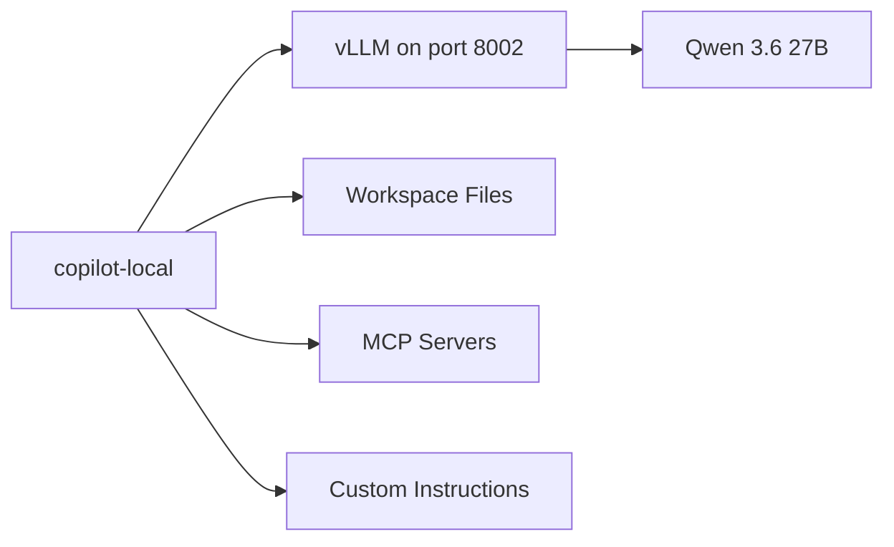

> Human words again. No polished corporate hallucination. Just my workstation, my setup, and what I learned wiring it together.

I already showed you [how to run Claude Code against a local GPU](https://jgcarmona.com/en/claude-code-local-glm-4-7-flash/) with Docker Model Runner and a translation proxy. I also demoed Copilot's offline mode live at GitHub Copilot Dev Days Madrid. But in both cases I showed *that* it works, not *how I made it mine*. Today I want to close that gap — the full story from hardware to daily workflow.

## My actual setup

This is what I run, today, on my workstation.

**Hardware:** A beast NVIDIA A6000 (48 GB VRAM) that I found and bought before its price doubled. Best investment of the year.

**Runtime:** vLLM, serving Qwen 3.6 27B with tool-calling enabled.

This is an example, I have a code.sh that gets the env vars, pipes the logs and does some more "infra" stuff. This, obviously, belongs to a Linux machine under/behind WSL:

```bash
  vllm serve "${CODE_MODEL}" \
    --host "${HOST}" \
    --port "${CODE_PORT}" \
    --served-model-name "${CODE_MODEL_NAME}" \
    --dtype auto \
    --max-model-len "${CODE_CTX}" \
    --gpu-memory-utilization "${CODE_GPU_UTIL}" \
    --max-num-seqs "${CODE_MAX_NUM_SEQS}" \
    --enable-auto-tool-choice \
    --tool-call-parser "${CODE_TOOL_CALL_PARSER}" \
    --language-model-only \
    --skip-mm-profiling \
    -O0
```

## The environment variables

Copilot CLI supports what GitHub calls BYOK (Bring Your Own Key) mode. You set a handful of environment variables and Copilot redirects all model traffic to your endpoint instead of GitHub's cloud.

The critical ones:

| Variable | Purpose | Example |
| --- | --- | --- |
| `COPILOT_PROVIDER_TYPE` | Protocol family | `openai` |
| `COPILOT_PROVIDER_BASE_URL` | Your server's API root | `http://localhost:8002/v1` |
| `COPILOT_PROVIDER_API_KEY` | API key (any dummy value works for local) | `dummy` |
| `COPILOT_MODEL` | Model name as reported by `/v1/models` | `qwen-agent` |
| `COPILOT_OFFLINE` | Disable all GitHub network calls | `true` |

That's it. Five variables. No ceremony.

### On Bash / Zsh

```bash
export COPILOT_PROVIDER_TYPE="openai"
export COPILOT_PROVIDER_BASE_URL="http://localhost:8002/v1"
export COPILOT_PROVIDER_API_KEY="dummy"
export COPILOT_MODEL="qwen-agent"
export COPILOT_OFFLINE="true"
```

### On PowerShell

```powershell
$env:COPILOT_PROVIDER_TYPE = "openai"
$env:COPILOT_PROVIDER_BASE_URL = "http://localhost:8002/v1"
$env:COPILOT_PROVIDER_API_KEY = "dummy"
$env:COPILOT_MODEL = "qwen-agent"
$env:COPILOT_OFFLINE = "true"
```

## The dual-mode trick

What I actually use is a PowerShell function in my profile so I can run both cloud and local Copilot from the same terminal:

```powershell
function copilot-local {
    $env:COPILOT_PROVIDER_TYPE = "openai"
    $env:COPILOT_PROVIDER_BASE_URL = "http://localhost:8002/v1"
    $env:COPILOT_PROVIDER_API_KEY = "dummy"
    $env:COPILOT_MODEL = "qwen-agent"
    $env:COPILOT_OFFLINE = "true"
    copilot @args
}
```

- I type `copilot-local` and I'm running against my workstation.
- I type `copilot` and I'm on the cloud.

Both coexist. No conflicts. No ceremony.

And that, my friend, is where this stops being a demo and starts being a daily tool.

## Local, LAN, or VPN: where the server lives

The base URL does not have to be `localhost`. It can be any reachable IP.

My vLLM server runs on a dedicated Linux workstation behind WSL. When I'm on the same machine, the URL is `http://localhost:8002/v1`. When I'm on my laptop elsewhere in the house, it becomes `http://192.168.1.X:8002/v1`. When I'm outside, I reach it through my VPN with the same internal IP.

Same function. Different URL. Same result.

This means your inference server can be a shared resource across your machines. One GPU, many clients.

## Setting up vLLM

vLLM is my runtime of choice because I have the VRAM for it. Install in a Python environment:

```bash
pip install vllm
```

A minimal serve command:

```bash
vllm serve Qwen/Qwen3-27B --host 0.0.0.0 --port 8002
```

But for Copilot CLI to use tool-calling properly, you want more flags:

```bash
vllm serve Qwen/Qwen3-27B \
  --host 0.0.0.0 \
  --port 8002 \
  --served-model-name qwen-agent \
  --dtype auto \
  --max-model-len 32768 \
  --enable-auto-tool-choice \
  --tool-call-parser hermes
```

The critical ones for Copilot:

- `--served-model-name`: this is what appears in `/v1/models` and must match `COPILOT_MODEL` exactly
- `--enable-auto-tool-choice`: lets the model emit structured tool calls instead of plain text
- `--tool-call-parser hermes`: tells vLLM how to parse tool-call JSON from the model's output (Qwen models use the Hermes format)

Without these, Copilot might connect but the agent layer won't work. The model will just print JSON text instead of invoking tools. That's one of the most common "it connects but it's useless" failures.

## Setting up llama.cpp (the alternative)

If you don't have a fat GPU, `llama.cpp` is the pragmatic workhorse. It runs on CPUs, works with quantized GGUF models, and can use GPU offload when available.

Build it:

```bash
git clone https://github.com/ggml-org/llama.cpp.git
cd llama.cpp
make
```

Run a model server:

```bash
llama-server -m ./models/qwen2.5-coder-7b-instruct-q4.gguf --port 11434
```

With GPU offload:

```bash
llama-server -m ./models/qwen2.5-coder-7b-instruct-q4.gguf \
  --port 11434 \
  --n-gpu-layers 999 \
  --threads 8
```

Then point Copilot to it:

```bash
export COPILOT_PROVIDER_BASE_URL="http://localhost:11434/v1"
```

The beauty of `llama.cpp` is that quantization makes local inference viable on hardware that would otherwise be excluded from the game. A coding-tuned 7B or 8B model in Q4 is usually the honest starting point for most hardware.

## Choosing a model without lying to yourself

This is where many people become romantic. Do not do that. Pick a model that your machine can actually run well.

- **1.5B to 3B**: fast, cheap, useful for lightweight tasks, but limited
- **7B to 8B**: current sweet spot for many local developer workflows
- **14B and above**: can be very good, but hardware pressure starts getting real
- **27B+ (my case)**: requires serious VRAM, but the quality jump is noticeable for agentic tool-calling

If you are on `llama.cpp`, a coding-tuned instruct model in Q4 or Q5 is usually the most practical answer. If you have a fat GPU and run vLLM, you can afford FP16 or BF16 and skip the quant dance entirely.

Not the sexiest answer, I know. But it's the honest one. Better to have a fast 7B that actually helps you than a struggling 27B that makes you wait 30 seconds per response.

## Why this matters

I insisted on this in [Mayday! We're Running Out of Fuel](/en/may-day/) and I'll keep insisting: AI stopped being cheap the moment usage stopped being at human scale. Agents, loops, autonomous workflows... token consumption grew out of control and investors are demanding ROI.

But owning the runtime changes the equation. You move from per-token billing to amortized compute. From unpredictable cost to bounded systems. From external dependency to internal control.



That is infrastructure. Not autocomplete.

## What changes once Copilot goes local

Running Copilot CLI against a local model does not mean every cloud capability behaves the same way.

What you gain:

- control over model choice
- local privacy (your code never leaves your machine)
- predictable cost profile
- freedom to run long agentic workflows without worrying about limits

What you may lose, or partially lose:

- raw reasoning power compared with frontier cloud models
- some hosted GitHub integrations if you are fully offline
- convenience when your local model struggles with tool calling or very long contexts

So the goal is not ideological purity. The goal is to move the right workloads local. Use cloud when you need frontier reasoning, use local when you need control and iteration freedom.

## Debugging: the `/v1/models` test

Before you even touch Copilot, verify your server is alive and reporting the right model name. Trust me on this one, it will save you hours:

```bash
curl http://localhost:8002/v1/models
```

You should see your model name in the response. That name must match `COPILOT_MODEL` exactly. Character for character. Case-sensitive.

If `curl` fails, your server isn't running or isn't listening on that port. If it returns a different model name, update your env var.

This simple test prevents 90% of the "why doesn't it connect" questions.

## Common failure modes

I've hit every single one of these. Learn from my suffering:

### Connection refused

The server isn't running or isn't bound to the right interface. If your server binds to `127.0.0.1` and you're connecting from another machine, it will refuse. Use `--host 0.0.0.0` to bind to all interfaces.

### Model name mismatch

`COPILOT_MODEL` must match exactly what `/v1/models` returns. If vLLM reports `Qwen/Qwen3-27B` but you used `--served-model-name qwen-agent`, then `COPILOT_MODEL` must be `qwen-agent`.

### Tool calls don't work

The model connects, Copilot responds, but it never actually invokes tools. It just prints JSON as text. This means you're missing `--enable-auto-tool-choice` and/or the right `--tool-call-parser` on your vLLM server. With `llama.cpp`, tool-calling support depends on the build and the model.

### The model is connected but useless

This usually means the model is too small, too general, or just bad at coding tasks. Try a coding-tuned instruct model. Not every 7B model is equal.

### Copilot still uses the cloud

Make sure `COPILOT_OFFLINE=true` is exported in the same shell session where you run Copilot. If you set it in one terminal and run Copilot in another, it won't see the variable.

### Base URL trailing slash issues

Some servers want `http://localhost:8002/v1`, others want `http://localhost:8002/v1/`. If things fail, try with and without the trailing slash.

### Performance is miserable

That's usually memory pressure, not a lack of theoretical intelligence. If you read [Local LLMs Under the Hood](https://jgcarmona.com/en/local-llms-under-the-hood/) you already know why: the KV cache grows with every token, and memory pressure adds latency. Try a smaller model, lower quantization, or shorter context.

## Offline mode: what it actually means

Setting `COPILOT_OFFLINE=true` disables all GitHub network calls. No telemetry. No authentication. No cloud features.

That means:

- your code and prompts never leave your machine
- GitHub login is not required
- features like `/delegate` and Code Search are unavailable
- MCP servers that depend on GitHub APIs won't work

If you want privacy and cost control, offline mode is the answer. If you also want some cloud features, skip it and just set the provider variables to redirect model traffic while keeping GitHub auth active.

## The control surface: what makes it real

A local model alone is just a token generator. What turns it into a development tool is the control surface around it. Copilot CLI gives you four layers:

**Custom instructions** tell the model what your project is, how it's organized, and what it should never touch. I go deeper on this in [Copilot Instructions, Agents, and Skills](/en/copilot-instructions-agents-skills/).

**Skills** are structured workflows you give the agent. Instead of asking the model to figure out your workflow, you give it a protocol. I cover this in [Running SDD Workflows with Local Copilot](/en/copilot-cli-sdd-workflows/).

**MCP servers** extend the agent's reach with external tools: test runners, linters, semantic search. The model does not need to be brilliant at everything. It needs to be good enough to use the tools correctly. I cover this in [MCP Is How Local Copilot Becomes Useful](/en/copilot-cli-mcp-tools/).

**SDD discipline** gives the whole thing structure. Separates *what/why* from *how*, turns specifications into living artifacts, and gives agents structured context instead of improvised prompts. Copilot CLI running locally is a perfect host for this because the cost of iteration becomes bounded.

## My practical take

I do not think local models replace the cloud today. Not even close. Frontier reasoning still lives in the cloud and you can tattoo that on your chest, it will never go out of style.

But local models can absorb a meaningful portion of the software lifecycle already:

- drafting specs and generating structured artifacts
- creating scaffolding and test skeletons
- reviewing internal code
- running repetitive refactoring tasks
- powering private RAG workflows
- supporting agentic loops that would be way too expensive in the cloud

And if you combine that with Copilot CLI, MCP tools, custom instructions, skills, and proper SDD discipline, you get something much more important than a cheap chatbot.

You get a controllable engineering workflow. On your hardware. Under your rules.

## This series

1. [Mayday! Mayday! We're Running Out of Fuel!](/en/may-day/) — the manifesto
2. **You are here** — How I Set Up GitHub Copilot CLI on Local Hardware
3. [MCP Is How Local Copilot Becomes Useful](/en/copilot-cli-mcp-tools/) — tools, not magic
4. [Copilot Instructions, Agents, and Skills](/en/copilot-instructions-agents-skills/) — governance
5. [Running SDD Workflows with Local Copilot](/en/copilot-cli-sdd-workflows/) — specification-driven development
6. [VSCode Agents Window: An AI Harness Inside Visual Studio Code](/en/vscode-agents-window/), the convergence

## References

- [Running Claude Code Against Your Local GPU with Docker Model Runner](https://jgcarmona.com/en/claude-code-local-glm-4-7-flash/) — my previous local AI experiment
- [Mayday! We're Running Out of Fuel](https://jgcarmona.com/en/may-day/) — why owning the runtime matters now
- [Local LLMs Under the Hood](https://jgcarmona.com/en/local-llms-under-the-hood/) — the inference pipeline explained
- [GitHub Copilot CLI documentation](https://docs.github.com/en/copilot/copilot-cli) — official reference
- [vLLM documentation](https://docs.vllm.ai/) — the inference platform
- [llama.cpp](https://github.com/ggml-org/llama.cpp) — the portable inference engine

---

Remember:

> ## Your AI. Your rules.
