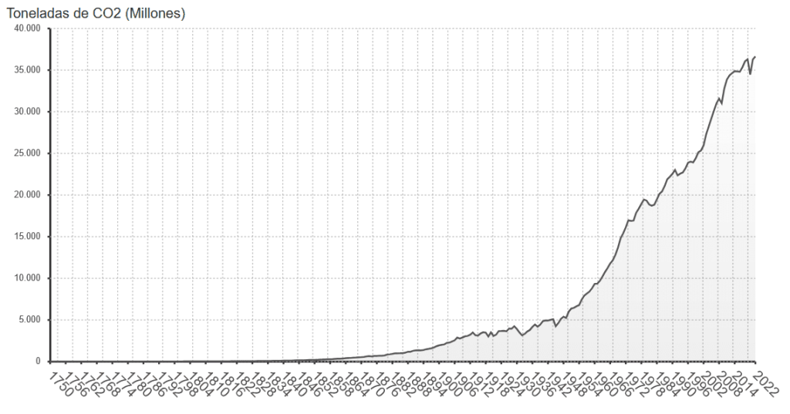

## "Esto de los cambios climáticos son ciclos naturales", dijo "S.P." con una seguridad que casi me hace dudar... casi. Y no es el único; parece que hay un coro de voces insistiendo en que lo que estamos viviendo es solo otro capítulo en el libro antiguo de la Tierra, que ya ha pasado por calentamientos y enfriamientos antes. Pero esta vez, la historia es diferente, y los datos están aquí para demostrarlo.

La Tierra tiene, de hecho, una historia de cambios climáticos, pero lo que los registros nos muestran ahora es un patrón acelerado sin precedentes, coincidiendo sospechosamente con la expansión industrial humana. Este artículo es una inmersión en los datos que sostienen la narrativa del cambio climático antropogénico: su origen, su fiabilidad y lo que realmente nos están diciendo.

Nos adentraremos en las entrañas de las investigaciones, examinaremos los núcleos de hielo que cuentan la historia de miles de años, satélites que no mienten y modelos que, aunque no son perfectos, son cada vez más precisos. Y en el camino, desmontaremos algunos de los mitos más persistentes que rondan en las mesas de debate. Mitos como:

- "El clima siempre está cambiando, es natural."

- "No podemos confiar en los modelos climáticos; siempre se equivocan."

- "No hay consenso científico sobre el cambio climático."

- "Los humanos no podemos tener un impacto tan grande en el planeta."

Es hora de separar el grano de la paja, la ciencia de la ficción. Porque si queremos encarar el futuro con alguna esperanza, primero necesitamos entender nuestro presente con claridad y honestidad. Así que, sin más preámbulos, sumérgete conmigo en este análisis sobre una de las cuestiones más urgentes y debatidas de nuestra época.

**Breve descripción del cambio climático y su relevancia**

El cambio climático no es un fantasma del futuro; es una presencia tangible que ya está remodelando nuestras costas, alterando nuestros patrones climáticos y desplazando comunidades. No se trata de un simple aumento en las cifras de temperatura, sino de un cambio sistémico que afecta la biodiversidad del planeta, la productividad de nuestros campos y la estabilidad de nuestra economía. La relevancia de este tema no puede ser subestimada; es una cuestión de supervivencia, adaptación y justicia para las generaciones actuales y futuras.

**Importancia de basarse en datos y ciencia**

En la era de la información, donde las opiniones se difunden con la rapidez de un clic, basar nuestras políticas y acciones en datos sólidos y ciencia probada es más crucial que nunca. Los datos nos ofrecen una base objetiva para la toma de decisiones, nos permiten rastrear cambios y tendencias, y nos proporcionan la mejor oportunidad para predecir y mitigar los impactos futuros. La ciencia, como proceso, busca constantemente cuestionar, probar y confirmar hallazgos a través de la revisión por pares y la replicación de estudios. Este rigor nos asegura que no estamos tomando decisiones basadas en conjeturas, sino en pruebas.

## Comprendiendo el Cambio Climático

**Definición y conceptos clave**

El cambio climático se refiere a alteraciones significativas y duraderas en los patrones estadísticos del clima terrestre. Estas modificaciones pueden ser cambios en la temperatura media del planeta, variaciones en las precipitaciones, o transformaciones más extremas en la frecuencia de fenómenos meteorológicos adversos. No es un fenómeno aislado ni un evento singular, sino una serie de procesos interconectados que afectan a todo el sistema climático global.

**Cómo se mide el cambio climático: temperatura, CO2 y otros gases de efecto invernadero**

Para comprender y medir el cambio climático, los científicos recopilan datos sobre varios indicadores clave. La temperatura global es uno de los más significativos, ya que un calentamiento global puede influir en múltiples aspectos del clima. Los niveles de dióxido de carbono (CO2) y otros gases de efecto invernadero en la atmósfera son otro indicador crucial, ya que estos gases atrapan el calor del sol y contribuyen al calentamiento del planeta. Además, se monitorean las concentraciones de hielo y nieve, el nivel del mar y la frecuencia de eventos climáticos extremos para obtener una visión completa.

## Datos Históricos y Evidencia del Cambio Climático

**Registro de temperaturas históricas y el análisis de tendencias**

El registro de temperaturas históricas revela que el planeta se ha calentado aproximadamente 1°C desde finales del siglo XIX, un cambio que coincide con la creciente industrialización y emisión de gases de efecto invernadero por parte de la humanidad. El análisis de las tendencias a largo plazo muestra un claro patrón ascendente, especialmente notorio en las últimas décadas.

**Evidencia geológica y paleoclimática**

La evidencia geológica, como los sedimentos y formaciones rocosas, junto con los núcleos de hielo, nos proporcionan un archivo climático que se extiende millones de años atrás. Estos registros muestran que, aunque la Tierra ha experimentado períodos de calentamiento y enfriamiento, la rapidez del cambio reciente no tiene parangón en la historia geológica conocida.

**Contribuciones humanas: desde la Revolución Industrial hasta la actualidad**

Desde la Revolución Industrial, la quema de combustibles fósiles y la deforestación han aumentado las concentraciones de CO2 en la atmósfera de manera significativa. Este incremento está directamente vinculado a las actividades humanas y se correlaciona estrechamente con el aumento de la temperatura global.

## Modelos Climáticos y Predicciones

**Cómo funcionan los modelos climáticos**

Los modelos climáticos son herramientas computacionales complejas que simulan las interacciones entre la atmósfera, los océanos, la tierra y el hielo. Utilizan ecuaciones matemáticas para describir cómo fluye la energía y la materia a través del sistema climático de la Tierra.

**Diferentes escenarios de emisión (como RCP8.5)**

Los científicos utilizan varios escenarios de emisión para prever futuros climáticos. El RCP8.5, por ejemplo, representa un futuro sin cambios significativos en las políticas climáticas, donde las emisiones continúan aumentando a lo largo del siglo XXI.

**Discusión sobre las predicciones pasadas y su precisión comparada con la realidad actual**

Las predicciones climáticas pasadas han sido notablemente precisas en muchos aspectos, aunque a menudo han subestimado la velocidad de ciertos cambios, como el derretimiento del hielo polar y el aumento del nivel del mar.

## Impactos del Cambio Climático

### Efectos en los ecosistemas y la biodiversidad

Los impactos del cambio climático en los ecosistemas naturales son profundos y multifacéticos. Un clima cambiante altera los patrones de migración, la floración de las plantas y los ciclos reproductivos de numerosas especies. La acidificación de los océanos, causada por el aumento de CO2, está afectando a la vida marina, desde los arrecifes de coral hasta las poblaciones de peces que dependen de ellos. En tierra, la frecuencia de incendios forestales y la expansión de plagas están transformando los paisajes y poniendo en peligro la biodiversidad a una escala sin precedentes.

### Consecuencias para las poblaciones humanas: salud, economía y desastres naturales

El cambio climático no solo afecta a la naturaleza; su huella en la vida humana es igualmente alarmante. Los efectos sobre la salud incluyen olas de calor más frecuentes e intensas, que pueden conducir a un aumento en las tasas de enfermedades y muertes relacionadas con el calor. La seguridad alimentaria se ve comprometida por las sequías y las inundaciones, que afectan a la agricultura y pueden llevar a la escasez de alimentos y al aumento de los precios. Económicamente, los desastres naturales impulsados por el cambio climático, como huracanes y tormentas severas, provocan pérdidas multimillonarias cada año. Además, el aumento del nivel del mar y la erosión costera presentan desafíos sin precedentes para las comunidades costeras.

### Casos de estudio recientes

Los casos de estudio actuales ilustran los impactos tangibles del cambio climático. Por ejemplo, el rápido derretimiento de los glaciares en el Ártico no solo es una señal de aumento de las temperaturas, sino que también tiene implicaciones directas para el aumento global del nivel del mar. Otro caso es la intensificación de los patrones de huracanes en el Atlántico, que se ha relacionado con temperaturas superficiales más cálidas del océano, lo que conduce a tormentas más poderosas y destructivas.

## Desmontando Mitos

### Mitos comunes sobre el cambio climático y sus refutaciones basadas en datos

Es hora de enfrentar los mitos más comunes con hechos concretos:

- **Mito**: "El clima de la Tierra siempre ha cambiado". **Realidad**: Si bien es cierto que el clima terrestre ha pasado por ciclos de cambio, la velocidad y la magnitud del cambio actual son inusuales y claramente ligadas a la actividad humana.

- **Mito**: "Los modelos climáticos son poco fiables y siempre se equivocan". **Realidad**: Aunque ningún modelo es perfecto, los modelos climáticos han mejorado significativamente y son herramientas cruciales que nos han permitido hacer predicciones precisas sobre el cambio climático.

- **Mito**: "No hay consenso científico sobre el cambio climático". **Realidad**: Hay un consenso abrumador entre los científicos de que el cambio climático es real y está impulsado principalmente por las actividades humanas.

- **Mito**: "Los humanos no pueden tener un impacto tan grande en el planeta". **Realidad**: La evidencia muestra que las actividades humanas, especialmente desde la Revolución Industrial, han cambiado la composición de la atmósfera y están afectando el clima global.

### Análisis crítico de las afirmaciones de los negacionistas

Para abordar las afirmaciones de los negacionistas del cambio climático, es vital analizar críticamente y cuestionar la fuente y la veracidad de sus argumentos. Muchas veces, estos argumentos se basan en información desactualizada, malinterpretada o sacada de contexto. El análisis crítico requiere examinar la metodología de los estudios citados, la reputación de las fuentes y la consistencia de las afirmaciones con el cuerpo general de la evidencia científica.

## Acciones y Soluciones

### Medidas de mitigación y adaptación al cambio climático

La mitigación se refiere a las acciones tomadas para reducir y estabilizar los niveles de gases de efecto invernadero en la atmósfera. Esto incluye estrategias como el desarrollo de energías renovables, la mejora de la eficiencia energética y el fomento de la reforestación. La adaptación, por otro lado, implica ajustar nuestras prácticas y planificación para minimizar los daños causados por los efectos del cambio climático. Esto puede abarcar la construcción de infraestructuras más resistentes, la modificación de prácticas agrícolas y la gestión del agua para enfrentar la escasez.

### Tecnologías emergentes y políticas para reducir las emisiones

La innovación tecnológica juega un papel crucial en la lucha contra el cambio climático. Tecnologías emergentes, como la captura y almacenamiento de carbono, la energía solar avanzada y los vehículos eléctricos, están abriendo caminos hacia una economía baja en carbono. Políticamente, es imperativo que los gobiernos implementen políticas que promuevan la reducción de emisiones, como la fijación de precios del carbono, subsidios para energías renovables y regulaciones que limiten la contaminación industrial.

### El papel de los individuos y las comunidades en la lucha contra el cambio climático

Mientras que la acción gubernamental y corporativa es esencial, los individuos y las comunidades también tienen un papel significativo que desempeñar. Cambios en el estilo de vida, como reducir el consumo de carne, aumentar el uso del transporte público y disminuir el uso de plásticos de un solo uso, pueden tener un impacto colectivo notable. Además, el activismo comunitario y la educación pública pueden influir en las políticas y prácticas a nivel local y global, creando una demanda para la acción climática.

## Conclusión

### Resumen de la importancia de la acción climática basada en datos

La ciencia del cambio climático es clara y los datos no mienten. Frente a un problema de esta magnitud, la acción basada en datos no es solo una opción, sino una necesidad. Tenemos las herramientas y el conocimiento necesario para cambiar el curso, pero requerirá una acción concertada y sostenida de todos los sectores de la sociedad.

### Llamado a la acción y a la esperanza en el futuro

No es momento de ceder ante el fatalismo. Aunque los desafíos son grandes, también lo es nuestra capacidad para innovar y adaptarnos. Con cada medida que tomamos, cada política que implementamos y cada cambio en nuestro comportamiento diario, estamos construyendo un futuro más sostenible y resiliente. El cambio climático es una prueba de nuestra era, pero también una oportunidad para redefinir nuestra relación con el planeta y entre nosotros. La esperanza reside en la acción, y el momento de actuar es ahora.

* * *

## Preguntas frecuentes sobre el cambio climático

**¿Por qué es diferente este cambio climático respecto a los anteriores?**  
La diferencia radica en la velocidad y magnitud del calentamiento actual, directamente vinculado a actividades humanas como la quema de combustibles fósiles y la deforestación, algo sin precedentes en la historia geológica reciente.

**¿Es realmente fiable la ciencia climática?**  
Sí. La ciencia climática utiliza métodos rigurosos, modelos matemáticos avanzados y datos empíricos verificables, revisados y confirmados por miles de científicos independientes en todo el mundo.

**¿Podemos aún revertir el cambio climático o ya es demasiado tarde?**  
Aunque algunos efectos del cambio climático son irreversibles a corto plazo, todavía estamos a tiempo de mitigar significativamente sus impactos más severos mediante acciones decididas y coordinadas globalmente.

**¿Qué puedo hacer yo personalmente para combatir el cambio climático?**  
Acciones como reducir tu huella de carbono mediante transporte sostenible, consumir menos carne, apoyar energías renovables, reducir plásticos y exigir a los líderes políticos acciones concretas, contribuyen directamente a combatir el problema.

**¿Por qué hay personas que aún niegan el cambio climático?**  
Las razones van desde intereses económicos, desinformación deliberada, falta de comprensión científica o sesgos ideológicos. Es importante contrarrestar estos argumentos con educación y datos verificables.
