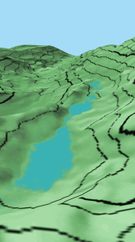
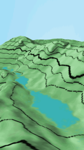
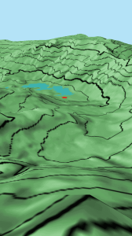
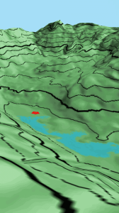
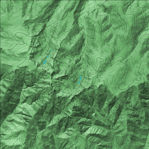

He seguido "jugando" con los mapas buscando optimizar al máximo y mejorar la usabilidad de las aplicaciones Android de las que hablaba en anteriores entradas. 

  

Como decía, [Gredos Virtual 3D](https://play.google.com/store/apps/details?id=com.jgc.gredos_virtual_3d) es un mapa en tres dimensiones muy detallado de 10 kilometros cuadrados en el que estan representados los alrededores del Circo de Gredos, Ávila, España. En éste mapa te puedes mover tan solo haciendo clic en la pantalla y deslizando el dedo por ella. No se me ha ocurrido una forma mejor de hacerlo y es la siguiente:

- Cada clic es un movimiento en la dirección en la que estás mirando.
- Una vez hecho clic, manteniendo la presión en la pantalla, puedes deslizar el dedo con lo que el ángulo de visión del mapa cambia.

Es muy simple aunque los usuarios las primeras veces que lo prueban no llegan a entenderlo del todo y les cuesta un rato cogerle el truco por lo que estoy abierto a cualquier sugerencia.

  

Por lo demás, en ésta versión de Gredos Virtual 3D, se ha mejorado la calidad de la textura del mapa, la cual ahora incluye:

- Tonalidades verdes, curvas de nivel y sombras que le dan al conjunto la sensación de mapa en 3D.
- Las 5 lagunas, coloreadas en azul.
- El parking de la plataforma y la carretera a Navarredonda, en gris.
- El Refugio Elola ( http://www.refugioelola.com/ ), junto a la Laguna Grande de Gredos, en rojo.
- El Refugio Reguero Llano (http://www.reguerollano.com/), también en rojo.

De nuevo quiero dejar aquí alguna captura de pantalla. 

  

  

Las dos primeras imágenes muestran las lagunas pequeñas y en las dos siguientes vemos la laguna grande desde dos puntos de vista diferentes. Para los amantes de ésta zona del Sistema Central dejo el mapa que he utilizado como textura para la aplicación y les invito a marcar en dicho mapa las distintas rutas y las fuentes.

  

  

[Juan García Carmona](http://juan-garcia-carmona.blogspot.com.es/)

[d.jgc.it@gmail.com](mailto:d.jgc.it@gmail.com)
