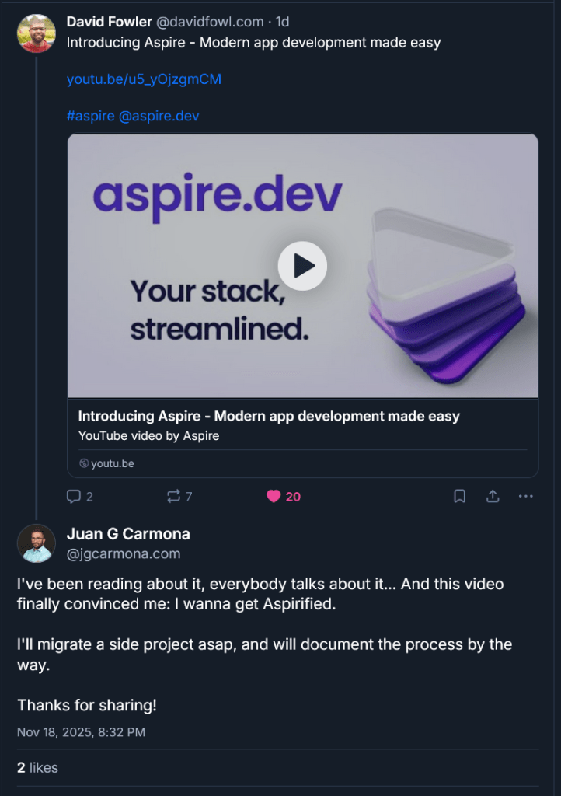
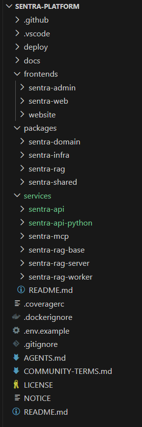
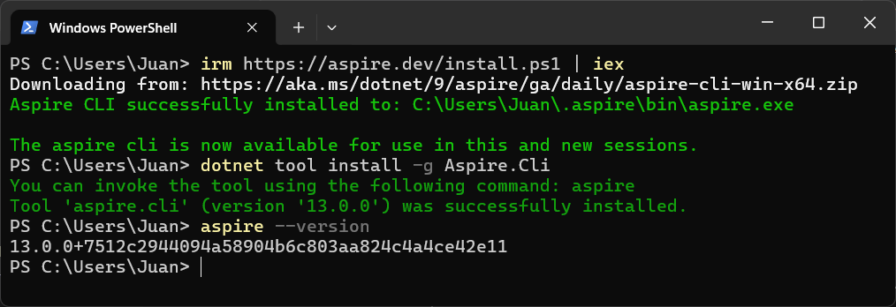
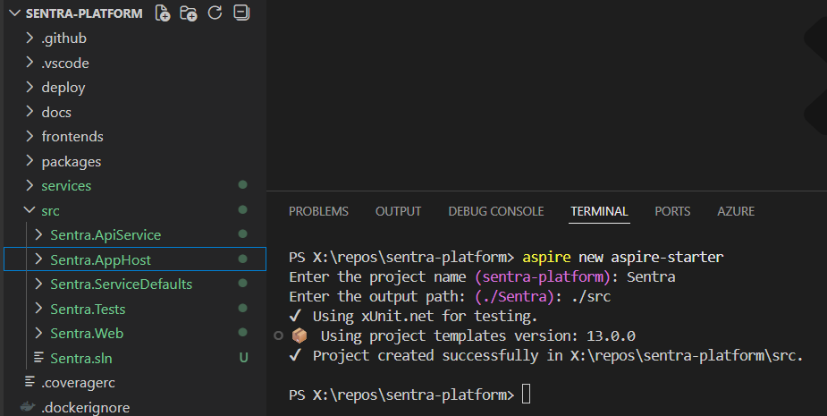
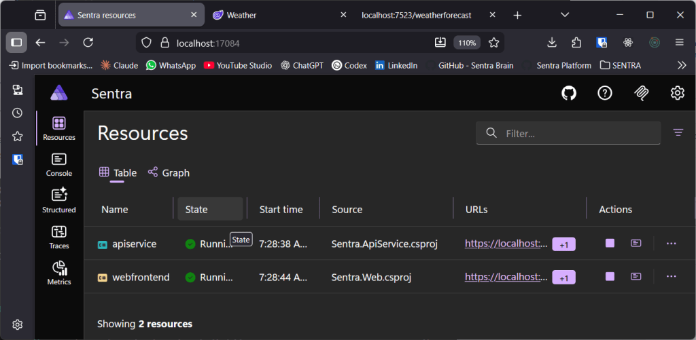
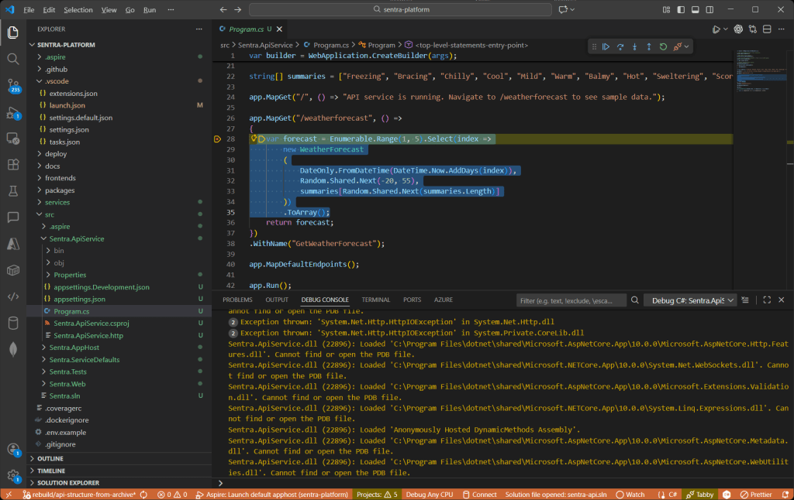
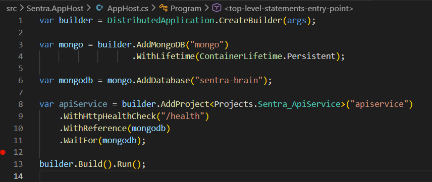
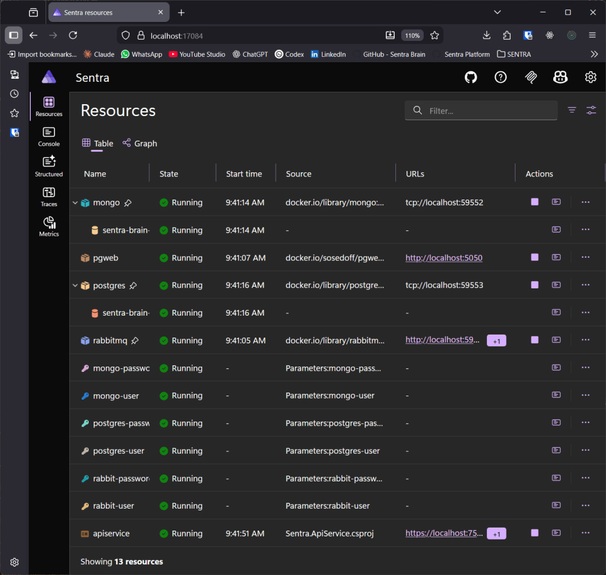
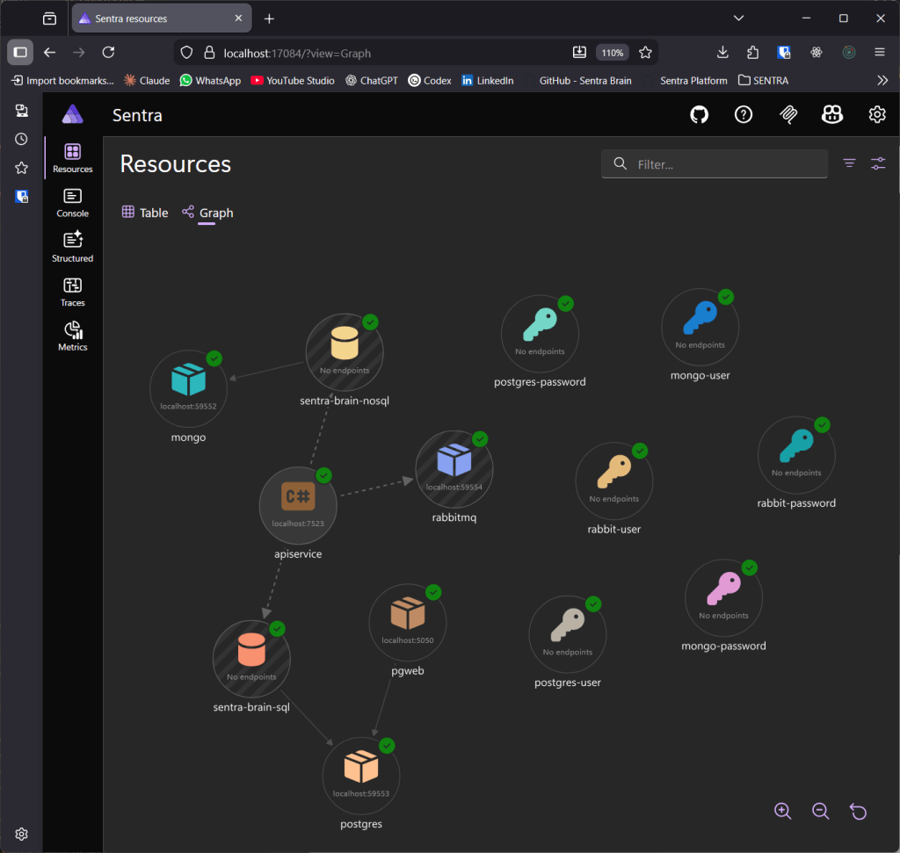

> I've been reading about it, everybody talks about it… And this video finally convinced me: I wanna get Aspirified.

Today I'll show you my first steps towards a migration to Aspire. I'll take all the infra, the valid infra, I was using in Sentra and I will start moving it to Aspire. I will do it, obviously, in a separate branch, because I know (or I guess) that for few days everything will crash and become unstable. I'll tell the story in "real time", starting from the moment I finally took the decision... And the video that pulled the trigger.



> ### **DISCLAIMER: No LLMs were used nor abused in the making of this post**

The idea has been on my mind for many months, from the very beginning, I would say, but I thought that my stack was not mature enough, I was also using python so, when I started with Sentra, it was not for me, or for this project. But since it now can be used with python and my stack, due to [my experiments and research](https://jgcarmona.com/tag/maf/), has moved to Microsoft Agent Framework, and, also considering that during the migration to MAF I detected few bottlenecks and the main service got too polluted, I decided that the moment is now.

I will move everything. Organize the infra. Clean up the code. Remove unused parts. I'll also migrate the API to .NET, building a modular monolith that will integrate Agent Framework and AG-UI. Let's see how it goes. Let's see if I can get "my stack streamlined". Here is the video that finally convinced me.

...

https://youtu.be/u5\_yOjzgmCM

## Where am I?

Well, Sentra, at this moment, consists on a set of containers, orchestrated via Docker Compose. Let me just list them all:

- **Sentra Web (sentra-web):** it is a frontend, made with React.

- **Sentra API (sentra-api):** it exposes most of the functionality to the front end (or frontends)

- **Sentra RAG Base (sentra-rag-base):** it is a container image that contains all the requirements and dependencies for the next two rag-related containers

- **Sentra RAG Server (sentra-rag-server):** it exposes RAG functionality via Fast API, it gets semantic meaning and is able to search for knowledge in a vector database.

- **Sentra RAG Worker (sentra-rag-worker):** it is a queue consumer and it is in charge of indexing knowledge, it gets documents, metadata, chunks, and embedings and make it searchable in our vector database, ChromaDB

Those are "my" services, code that I created and I maintain. And all these services relies on some other containers:

- **MCP Gateway (gateway):** it is a docker/mcp-gateway that allows me to consume some mcp servers hosted on Docker

- **PostgreSQL (sentra-sql-db):** it is our object-relational database

- **MongoDB (sentra-nosql-db):** it is our no-sql database

- **Chroma (sentra-vector-db):** it is our embedding database

- **RabbitMQ (rabbitmq):** it is our multi-protocol messaging broker

In addition to this, Sentra relies on, and happily and fortunately uses, [Docker Model Runner](https://jgcarmona.com/tag/dmr/) and several MCP Servers hosted on Docker.

As you can see the number of pieces moving is quite big, 5 custom containers, 5 infra containers (that require persistent storage) and "the intelligence", The Models, and the "skills", the MCP Servers, running on Docker.  
  
\[_Note for future me, this deserves a diagram_\]



## How does it looks like now?

Please, don't blame on me, currently it is quite ugly, because, as I said, I decided to migrate the python based API to .NET, which mill mean tons of work... The code, as of now, is divided into 5 main folders:

- **Deploy:** contains docker compose files and monitoring configurations (I removed the entire observability stack from previous list, Aspire brings it natively for us. )

- **Docs:** contains documentation in arc42 format and with a set of use cases. It will need to be completely reviewed because it was bit obsolete and will get a lot more obsolete soon, at least on infra aspects

- **Frontends:** it contains code of the front-ends, the main site, admin site (it might been removed, according to YAGNI principle) and the public site (hosted on [https://sentrabrain.com](https://sentrabrain.com), it is not part of the sistem, so, another TODO to my TODO list should be move it to a separate repository)

- **Packages:** it contains python packages I was using in some of the services, domain, infra, rag, and shared... My intuition says that most of the stuff here will be removed once python-based API gets replaced by .NET-based API, because it will serve RAG-related services only

- **Services:** It contains the code of the services

- **.github:** that mainly contains CI/CD workflows (a.k.a. GitHub Actions)

## Oh man, that's huge!

I know. I've been working hard on this for many weeks. That's why I haven't published any video on my YouTube channel and why my researches and articles have been so targeted ultimately...

## How will I shape it?

I think I have an answer, because I already spent a couple of hours reading the documentation and surfing through various examples... And, what makes more sense to me here is to create a `src` folder and then adjust folder structure to Aspire's "official" naming convention. I will create a `src` folder, and then start adding services and libraries inside of it. but first things first.

## Getting Started with Aspire

Means, I need to update my .NET version, I was using 10 pre-release, so, I'll start 10 stable. It is also recommended to have C# and Aspire extensions for VSCode.  
  
Then install the CLI (if you don't know how, just [follow official documentation](https://aspire.dev/get-started/install-cli/)):



And now we can start building our brand new Aspire App... (I'll follow [this guide](https://aspire.dev/get-started/first-app/) and adapt the results on the fly)... Just by running aspire new aspire-starter I have something usable for my purposes.



They say a promise is a debt, and the result couldn't be better: you go into src, run "aspire run" and you have a dashboard and two services, an API and a front end. Fully functional. Easy and clean.




**¡Bravo!** And my question then was, OK, how can I debug this? So, instead of running from console I went to vscode and it directly added a launch configuration that directly attach a debugger.



### **(Bravo!)^2**

## What if we shape Sentra's Infrastructure now?

Makes sense. I'll remove unused stuff (the web that came with the template) and add the different services following the documentation, I think I can start with Mongo Container. And that was easy:



And, you know what? It worked so well that I got deep into the docs and, in about 30-45 minutes I was able to add some secrets and setup half of the infra Sentra needs... Just with this code:

```csharp
var builder = DistributedApplication.CreateBuilder(args);

// -------------------------
// Secrets (secure parameters)
// -------------------------

var mongoUser = builder.AddParameter("mongo-user");
var mongoPass = builder.AddParameter("mongo-password", secret: true);

var pgUser = builder.AddParameter("postgres-user");
var pgPass = builder.AddParameter("postgres-password", secret: true);

var rabbitUser = builder.AddParameter("rabbit-user");
var rabbitPass = builder.AddParameter("rabbit-password", secret: true);

// -------------------------
// Constants
// -------------------------

var dbNameSql = "sentra-brain-sql";
var dbNameNoSql = "sentra-brain-nosql";

// ============================================================
// MongoDB
// ============================================================

var mongo = builder.AddMongoDB("mongo", userName: mongoUser, password: mongoPass)
    .WithLifetime(ContainerLifetime.Persistent)
    .WithDataBindMount(source: "../data/mongo", isReadOnly: false);

var mongoDb = mongo.AddDatabase(dbNameNoSql);

// ============================================================
// PostgreSQL
// ============================================================

var postgres = builder.AddPostgres("postgres", pgUser, pgPass)
    .WithLifetime(ContainerLifetime.Persistent)
    .WithDataBindMount(source: "../data/postgres", isReadOnly: false)
    .WithPgWeb(pgweb => pgweb.WithHostPort(5050));

var sentraDb = postgres.AddDatabase(dbNameSql);

// ============================================================
// RabbitMQ
// ============================================================

var rabbit = builder.AddRabbitMQ("rabbitmq", rabbitUser, rabbitPass)
    .WithLifetime(ContainerLifetime.Persistent)
    .WithManagementPlugin() 
    .WithDataBindMount(source: "../data/rabbitmq", isReadOnly: false);

// ============================================================
// API Service
// ============================================================

var api = builder.AddProject<Projects.Sentra_ApiService>("apiservice")
    .WithHttpHealthCheck("/health")
    .WithReference(mongoDb).WaitFor(mongoDb)
    .WithReference(sentraDb).WaitFor(sentraDb)
    .WithReference(rabbit).WaitFor(rabbit);

builder.Build().Run();
```

Look at this!



Isn't it beautiful? (And that was surprisingly easy...)



Honestly, the dashboard is amazing, extremely powerful... I don't know how many battles I will have to fight but I just got in love with Aspire.

**It is official:**

> ## I got Aspirified!

I'll try, now, to add ChromaDB to my infrastructure. There is no ChormaDB Integration, so, it needs tyo be a container and, well, I'd love to add a config file with enabled OTEL. I need to improve the OTEL config but, at the end, this worked nicely:

```csharp
// ============================================================
// Chroma Vector Database
// ============================================================

var chroma = builder.AddContainer("chroma", "ghcr.io/chroma-core/chroma", "latest")
    .WithHttpEndpoint(targetPort: 8000)
    .WithBindMount(Path.Combine(dataFolder, "chroma"), "/data") 
    .WithContainerFiles(sourcePath: $"../Sentra.Infrastructure.ChromaDb/config.yaml", destinationPath: "/aspire")
    .WithEnvironment("CHROMA_CONFIG", "/aspire/config.yaml")
    .WithLifetime(ContainerLifetime.Persistent);
```

Things seem moving fast! What if we now try to move the web, that it was inside frontends folder, into Aspire? I've just seen a sample and looks quite easy...

And it was. I just had to add the Npm App like this:

```csharp
// ============================================================
// Sentra Web
// ============================================================

builder.AddNpmApp("sentra-web", "../Sentra.Web")
    .WithReference(api).WaitFor(api)
    .WithEnvironment("BROWSER", "none")
    .WithHttpEndpoint(env: "VITE_PORT")
    .WithExternalHttpEndpoints()
    .PublishAsDockerFile();
```

  
And adjust my vite.config.ts to use the given port and there we go.


I thought it was going to take ages and it only took few hours... And you know what? I'll end this story here and will continue in another article in which I'll migrate the two python services, a thing I know, in advance, it will be challenging because the both share packages, dependencies and so on...

And this has been a nice exercise, because _no animals were harmed in the making of this film_, I mean, no LLM's where used, nor abused, in the making of this post... Genuine thoughts feeling this post.

I hope you enjoyed as much as I did.

See you next post
