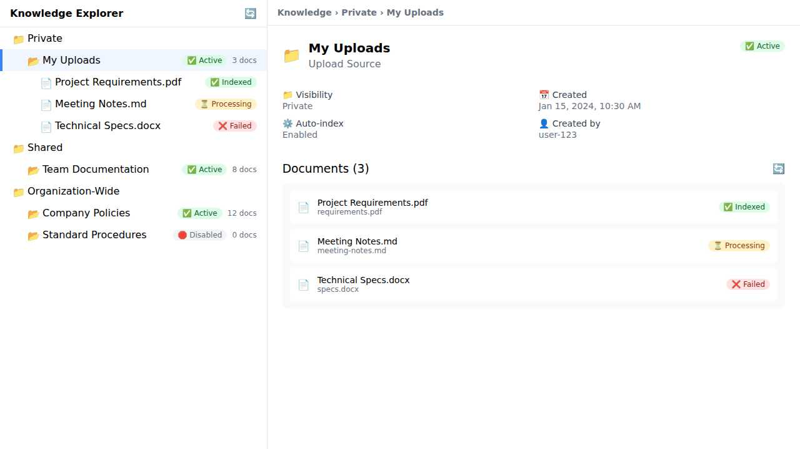

> ## El futuro de la IA no está en la nube. Está en tus datos.

Llevamos varios meses trabajando intensamente en [Sentra Brain](https://sentrabrain.com): una plataforma de inteligencia artificial privada que estamos construyendo con un objetivo claro: poner la IA al servicio de las empresas sin que tengan que ceder el control sobre sus datos.

Gracias a un enfoque riguroso en diseño, arquitectura y desarrollo de software hemos conseguido avanzar a una velocidad notable. Pero lo más importante no es la velocidad: es la dirección. Sentra no es otro wrapper de ChatGPT. No. Sentra es una propuesta modular, segura y escalable, pensada para que cualquier empresa pueda tener **su propio servidor de IA**, dentro de su red, adaptado a sus reglas, sus flujos de trabajo y, sobre todo, su conocimiento.

Hoy te quiero contar algo que nos tiene especialmente entusiasmados: **estamos combinando dos estrategias punteras, RAG y fine-tuning, para lograr una IA que no solo responde a nuestras preguntas y nos ayuda con las labores de nuestro día a día en la oficina, sino que aprende con cada paso**. Una IA que puedes dejar "estudiando":

> El viernes por la tarde lanzas el reentrenamiento. El lunes, la IA te espera con todo aprendido.

Esto no es ciencia ficción. Es ingeniería aplicada. Y puede transformar cómo las PYMES acceden y usan la inteligencia artificial.

## ¿Por qué las PYMES aún no aprovechan bien la IA?

Todas las semanas hablamos con responsables técnicos y de negocio y nos han compartido la misma inquietud: _“Queremos usar IA, pero no sabemos por dónde empezar… y no queremos poner nuestros datos en manos de terceros”_.

Las **soluciones** que dominan el mercado son **muy potentes**, sí, pero también **opacas** y **centralizadas**. La mayoría de PYMES no tienen ni la necesidad ni la capacidad de montar un equipo de expertos en desarrollo IA interno. Tampoco están dispuestas a subir información sensible a servicios en la nube cuyos términos nadie entiende del todo. Por ejemplo, dos noticias inquietantes:

1. [**Microsoft confirma bajo juramento: las autoridades estadounidenses pueden acceder a los datos europeos a pesar de las nubes de la UE**](https://xpert.digital/es/us-beorden-puede-acceder-a-los-datos-europeos/)

3. [**Francia prohíbe a sus ministros usar la nube de Office 365 por temor a que Microsoft deba compartir información sensible con el gobierno de los EE.UU**](https://www.xataka.com/empresas-y-economia/francia-prohibe-a-sus-ministros-usar-nube-office-365-temor-a-que-microsoft-deba-compartir-informacion-sensible-gobierno-ee-uu)

Y sin embargo, **esas mismas empresas tienen algo de enorme valor: sus datos**. ¿Qué datos? Por poner algunos ejemplos:

- Políticas internas

- Documentación técnica

- Manuales

- Procesos

- Historiales de clientes

- Contratos con proveedores

- Know-how acumulado durante años.

Todo ese conocimiento debería alimentar tu IA. Pero no lo hace. No porque no valga, sino porque no está organizado, estructurado ni conectado a ningún modelo del lenguaje, ni agente IA, ni automatismo...

> **El problema es que las empresas no han preparado su conocimiento para trabajar con la IA**.

Aquí es donde entra [Sentra](http://sentrabrain.com).

> **NOTA SOBRE EL NOMBRE:** se llama **Sentra** porque nace para estar en el **centro**: el centro de tus datos, de tus decisiones y de tu infraestructura de IA. Su nombre combina ideas como _central_ (núcleo de operaciones), _centinela_ (vigilancia y protección), _sensorial_ (inteligencia perceptiva) e _infraestructura_ crítica. Todo lo que una IA privada debe ser y tener.


## El valor de tus datos: la clave para una IA útil y segura

**Una verdad incómoda:** la mayoría de modelos de IA generalistas no saben nada de tu empresa.

Pueden completar frases, contar chistes y resumir papers… pero no saben cómo se llama tu producto, qué preguntas hacen tus clientes, ni cómo gestionas una incidencia. Para ellos, tu negocio no existe. **Si no conoce tu realidad, no puede ayudarte.**

Lo que hace útil a una IA no es su tamaño, ni su velocidad, ni que esté de moda. Lo que la hace verdaderamente útil es **cuánto sabe de ti y lo bien que puede usar ese conocimiento**. Ahí es donde los datos de tu empresa, bien organizados y bien protegidos, se pueden convertir en tu ventaja competitiva.

Lo que hoy está disperso en carpetas por la intranet o en correos electrónicos, puede, si se hace bien, convertirse en el cerebro digital de tu organización.

Ese es el enfoque de Sentra Brain: **no queremos sustituir el conocimiento interno, sino amplificarlo. Hacerlo accesible, accionable y útil, sin perder el control sobre él.**

## Qué es Sentra Brain y qué lo hace diferente

**Sentra Brain** no es un producto genérico. Es una plataforma de inteligencia artificial privada y modular, diseñada para empresas que quieren usar IA sin ceder sus datos a terceros.

> **Tus datos. Tu IA. Tus reglas.**

Con Sentra, puedes desplegar tu propio servidor de IA, totalmente local o híbrido. Lo conectas a tus sistemas (CRM, ERP, carpetas, flujos, APIs…), y entrenas modelos con tu conocimiento interno. Todo dentro de tu infraestructura o en un entorno controlado. Sin cuotas ocultas. Sin token limits. Sin depender de OpenAI o terceros.

### Principales componentes de Sentra Brain:

- **LLM local o híbrido**: Ejecutamos modelos como LLaMA, Mistral o GPT privados en tu propio servidor.

- **RAG**: Recuperación semántica sobre tu base de conocimiento. El modelo consulta tus datos antes de responder.

- **Fine-tuning**: Reentrenamos el modelo con tus propios documentos. Gana precisión, tono y especialización.

- **MCP (Middleware de Conectividad Privada)**: Integra tu IA con sistemas internos como Office, CRM, ERP, bases SQL o herramientas no-code.

- **Automatizaciones**: Orquesta acciones, flujos y respuestas usando n8n, scripts o APIs según reglas de negocio.

Y todo esto, **respetando la privacidad, la normativa (GDPR, HIPAA, ISO27001) y las necesidades reales de cada sector**: jurídico, financiero, industrial, sanitario, público…

No es una promesa genérica. Es, como ya dije antes, ingeniería aplicada.

## Cómo funciona RAG: cuando la IA busca en tu conocimiento

Una de las primeras funcionalidades que implementamos en Sentra fue **RAG** —_Retrieval-Augmented Generation_, o en castellano, generación aumentada por recuperación.

La idea es sencilla: antes de que el modelo responda a una pregunta, **busca en tu base de conocimiento documentos relevantes**, y los usa como contexto para generar la respuesta. Así, en lugar de depender solo de lo que “sepa” el modelo base, la respuesta se enriquece con contenido real, actual y específico de tu organización.

Por ejemplo:

> **Pregunta**: “¿Cuál es el protocolo interno para escalar una incidencia crítica?”  
> **Respuesta sin RAG**: Una generalidad.  
> **Respuesta con RAG**: Una explicación basada en tus propios procedimientos, extraída de tus manuales o intranet.

Esto transforma la calidad y utilidad de las respuestas. Ya no se trata de un modelo que "improvisa" de forma genérica, sino de uno que consulta antes de responder. Como haría un buen empleado que primero revisa el manual antes de contestar.

RAG permite inyectar conocimiento de negocio en tiempo real, sin necesidad de modificar el modelo. Pero tiene una limitación: **si el sistema de búsqueda falla o no encuentra nada relevante, el modelo vuelve a estar ciego**. Y ahí es donde entra el siguiente paso.

### Cómo podrías integrarla:

<figure>



<figcaption>

Ejemplo real de Sentra en acción

</figcaption>

</figure>

Así es como gestionamos nuestras fuentes de conocimiento internas. Cada documento que subimos, ya sea un PDF técnico, actas de reunión o un Word con especificaciones, pasa por un proceso de indexación.

En este caso, puedes ver cómo Sentra clasifica el estado de cada documento:

- `✔ Indexed`: ya disponible para que el modelo lo consulte.

- `⌛ Processing`: en cola para ser vectorizado.

- `❌ Failed`: error en el procesamiento (por formato, permisos, etc.).

Este sistema nos permite tener **trazabilidad, control y actualización constante** sobre qué sabe la IA y qué no. Así, el modelo no alucina: responde en base a documentos reales, específicos y auditables.

## Qué aporta el fine-tuning: enseñar al modelo a pensar como tu empresa

**RAG le da contexto. El fine-tuning le da memoria.**

En Sentra estamos dando un paso más: **reentrenar nuestros modelos con los propios documentos de la empresa**. Esto se conoce como _fine-tuning_, una técnica que adapta los pesos del modelo a un dominio específico.

El objetivo es claro: **que el modelo entienda mejor nuestra terminología, nuestras casuísticas y nuestros procesos**, y sea capaz de responder con precisión incluso sin tener que buscar cada vez.

> Piensa en preguntas que se repiten, respuestas frecuentes, formularios estándar, datos internos estáticos… ¿Por qué hacer que el modelo los busque cada vez, si puede “aprenderlos” e incorporarlos?

Con el fine-tuning, logramos:

- **Más velocidad**: no necesita hacer retrieval en cada consulta.

- **Más robustez**: aunque falle el RAG, el modelo sabe bastante.

- **Más personalización**: podemos hacer que adopte el tono que usamos con clientes, que cite fuentes o que evite lenguaje ambiguo.

- **Más especialización**: entrenamos al modelo en tareas propias del negocio: clasificación de documentos, extracción de datos, interpretación de reglas internas...

Y lo mejor es que **esto no reemplaza al RAG: lo complementa**. El modelo afina su comprensión del dominio, y RAG sigue aportando la información más reciente o variable. Es una combinación potente.

En breve, incluso podremos hacer algo que hasta hace poco parecía ciencia ficción: **reentrenar el modelo automáticamente con los nuevos documentos generados cada semana**, y que cada lunes venga mejorado.

## ¿RAG o fine-tuning? La respuesta es ambos

En muchos foros técnicos y artículos se plantea la disyuntiva:  
**¿Debo usar RAG o hacer fine-tuning?**

La respuesta, en nuestro caso, es muy clara: **los dos**.  
No porque queramos complicar el sistema, sino porque cada técnica aporta algo que la otra no puede cubrir por sí sola.

|  | **RAG (Retrieval-Augmented Generation)** | **Fine-tuning (Reentrenamiento)** |
| --- | --- | --- |
| **¿Qué hace?** | Recupera documentos relevantes y los usa como contexto para generar respuestas. | Incorpora conocimiento específico directamente en los parámetros del modelo. |
| **Ventaja clave** | Actualización en tiempo real. Siempre puede consultar información nueva. | Mayor rapidez, personalización y precisión sin depender de búsquedas. |
| **Limitaciones** | Si el sistema de búsqueda falla o no encuentra nada útil, el modelo queda limitado. | Requiere entrenamiento previo y no capta cambios recientes si no se reentrena. |
| **Ideal para…** | Información dinámica, normativa cambiante, documentación extensa. | FAQs, estilo de respuesta, conocimiento interno estable, tareas recurrentes. |
| **Riesgos comunes** | “Hallucinations” si el contexto es pobre o irrelevante. | Sobreajuste o pérdida de versatilidad si se entrena mal. |
| **Combinación ideal** | Usa los documentos como apoyo externo. | Internaliza lo que siempre debe saber. |

## El proceso técnico paso a paso: datos, Unsloth y entrenamiento local

Una cosa es tener la idea. Otra es ejecutarla bien.  
En Sentra, queríamos que el modelo aprendiera con nuestro conocimiento… pero sin exigir hardware de datacenter ni semanas de entrenamiento.  
**La solución: usar técnicas de fine-tuning eficiente y herramientas como Unsloth.**

### Paso 1: Preparamos nuestros datos

El primer paso es convertir nuestros documentos en conocimiento que el modelo pueda aprender.

> ¿Cómo? Generando ejemplos en formato pregunta–respuesta.

Por ejemplo:

- Tomamos una política interna o manual.

- Dividimos el contenido en trozos (chunks).

- Para cada trozo, generamos una pregunta cuya respuesta esté en ese texto.

- Y luego generamos la respuesta ideal.

Esto se puede automatizar en gran parte con un LLM. Luego revisamos y filtramos los pares de Q&A para asegurar calidad. Cuantas más preguntas reales incluyamos (de clientes, usuarios, empleados), mejor.

El resultado es un dataset del tipo:

```json
{
  "instruction": "¿Cómo se escala una incidencia crítica en Sentra?",
  "output": "Debe notificarse al canal #soporte-prioridad y escalar a infraestructura si afecta a producción…"
}
```

> Este es el material con el que el modelo va a aprender. No necesita más que eso: buenas preguntas, buenas respuestas, bien estructuradas.

### Paso 2: Entrenamos el modelo… en local

Aquí entra **Unsloth**, una herramienta de fine-tuning optimizada que nos permite reentrenar modelos LLM (como LLaMA, Mistral, etc.) de forma rápida y con pocos recursos. ([más info técnica aquí](https://docs.unsloth.ai/get-started/fine-tuning-llms-guide))

**¿Por qué [Unsloth](https://unsloth.ai)?**

- Permite usar técnicas como **[LoRA](https://www.cloudflare.com/learning/ai/what-is-lora/)** y **QLoRA**, que solo ajustan un pequeño subconjunto de parámetros.

- Con QLoRA, puedes entrenar un modelo de 7B en un equipo modesto (incluso con 3GB de VRAM).

- Usa kernels GPU optimizados manualmente. Según sus benchmarks, **es hasta 30 veces más rápido** que métodos tradicionales.

> En la práctica: un trabajo que antes tomaba días o requería una A100, ahora se puede hacer en una noche… en tu propio servidor.

### Paso 3: Validamos y probamos

Una vez entrenado el modelo, lo cargamos en nuestro **llama-server**, igual que haríamos con el modelo original. Pero ahora esperamos que responda _mejor_:

- Sin necesidad de búsqueda, contesta preguntas frecuentes con precisión.

- Habla con nuestro tono.

- Evita errores típicos o suposiciones fuera de lugar.

- Y responde tareas especializadas que hemos entrenado (clasificación, extracción, redacción técnica, etc.).

> Lo más interesante: el modelo base sigue intacto. LoRA añade una “capa de aprendizaje” encima.  
> Si algo sale mal, simplemente desactivamos el adaptador. Cero riesgo, máxima flexibilidad.

### Paso 4: Automatizamos la mejora continua

Este es nuestro próximo objetivo:  
**automatizar el reentrenamiento**.

Queremos que Sentra detecte cuándo se han añadido suficientes nuevos documentos o cuándo cambian ciertos procesos… y que el sistema proponga un nuevo fine-tuning.  
Lo lanzamos el viernes. El lunes, el modelo ha aprendido.

- IA que no se queda obsoleta.

- IA que mejora con tu negocio.

- IA que crece contigo.

## IA que mejora sola: autoaprendizaje sin sacrificar control

Una de las promesas más repetidas en el mundo de la IA es que los modelos “aprenden” con el uso. Pero lo cierto es que la mayoría no lo hacen. Al menos, no en entornos empresariales.

Las grandes plataformas no te dan acceso al modelo. No puedes modificarlo. Y si lo usas mucho, lo único que ocurre es que pagas más.

Con **Sentra Brain**, hemos planteado otro enfoque:

> Que tu IA aprenda de ti, con tus reglas, y sin exponer ni un solo byte de tus datos fuera de tu red.

Y lo hemos hecho combinando dos ideas:

- **RAG** para que el modelo consulte documentos actualizados sin necesidad de memoria permanente.

- **Fine-tuning local y periódico** para que el conocimiento estable, las preguntas frecuentes y las tareas repetitivas pasen a formar parte del modelo.

Esto nos permite algo muy potente:  
**tener una IA que mejora sin que tengas que rehacer todo el sistema**.

### ¿Qué implica esto para una empresa?

- Que puedes incorporar cambios de procesos, nuevas políticas o aprendizajes de cliente en el propio cerebro de tu IA.

- Que puedes tener una IA más rápida y precisa, sin sobrecargar tu infraestructura.

- Que puedes asegurar el cumplimiento normativo porque todo el proceso —desde los datos hasta el entrenamiento— ocurre en tu entorno.

Y sobre todo: que puedes dejar de depender de soluciones externas, opacas y genéricas.

> Una IA útil no es la que sabe de todo.  
> Es la que sabe de ti.

## Conclusión: si tus datos valen, haz que trabajen para ti

La mayoría de empresas ya saben que la inteligencia artificial puede transformar su forma de trabajar.  
Lo que aún no tienen claro es **cómo hacerlo sin perder el control, sin exponer su información y sin depender de plataformas que cambian las reglas cada semana**.

En Sentra Brain, no creemos en soluciones mágicas.  
Creemos en **ingeniería bien hecha, datos bien tratados y modelos bien entrenados**.

Creemos que:

- **La IA debe adaptarse a tu empresa, no al revés.**

- **Tus datos son un activo estratégico, no un coste de riesgo.**

- **Y que tu IA debe crecer contigo, no dejarte atrás.**

Por eso hemos construido una plataforma que combina lo mejor de ambos mundos:

- **RAG** para ofrecer respuestas informadas, contextuales y actualizadas.

- **Fine-tuning** para enseñar al modelo a pensar como tu organización, con tu conocimiento y tu estilo.

- **Infraestructura local o híbrida**, sin cuotas por tokens, sin vendor lock-in, sin letra pequeña.

Y todo esto, pensado para entornos reales:  
Despachos jurídicos. Agencias financieras. Fábricas. Hospitales. Ayuntamientos.  
**PYMES que no quieren quedarse atrás, pero tampoco regalar sus datos a nadie.**

### ¿Y ahora qué?

Si te estás planteando usar IA en tu empresa —y quieres hacerlo bien—, **Sentra Brain puede ayudarte**.

> **Tu IA, tus datos, tus reglas.**

👉 [**Escríbeme**](/contact). Solicita una demo. O pregúntame cómo crees que se puede adaptar esta tecnología a tu sector. Me encantará charlar contigo.

**La pregunta ya no es si puedes tener tu propia IA.  
La pregunta es: ¿por qué seguir usando la de otros?**
